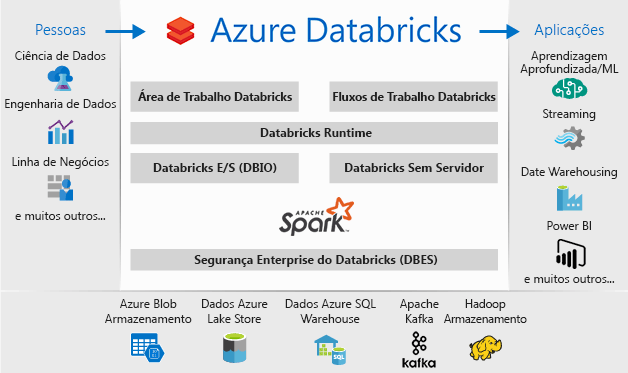

# O que é o Azure Databricks?

O Azure Databricks é uma plataforma de análise baseada no Apache Spark e otimizada para a plataforma de serviços cloud Microsoft Azure. Concebida com os fundadores do Apache Spark, o Databricks está integrado com o Azure para prestar configurações com um clique, fluxos de trabalho fluídos e uma área de trabalho interativa que permite a colaboração entre cientistas de dados, engenheiros de dados e analistas empresariais.

O Azure Databricks é um serviço de análise baseada no Apache Spark rápida, fácil e de colaboração. Para um pipeline de grandes volumes de dados, os dados (não processados ou estruturados) é ingeridos no Azure através do Azure Data Factory em lotes ou transmitidos em tempo quase real com o Kafka, o Hub de eventos ou o IoT Hub. Este francesas de dados num data lake longo prazo persistentes armazenamento, no armazenamento de Blobs do Azure ou de armazenamento do Azure Data Lake. Como parte do seu fluxo de trabalho de análise, utilizar o Azure Databricks para ler os dados de várias origens de dados, tal como [armazenamento de Blobs do Azure](../storage/blobs/storage-blobs-introduction.md), [o armazenamento do Azure Data Lake](../data-lake-store/index.md), [do Azure Cosmos DB](../cosmos-db/index.yml) , ou [do Azure SQL Data Warehouse](../sql-data-warehouse/index.md) e transformá-lo em ideias inovadoras com o Spark.

## Plataforma de análise baseada no Apache Spark

O Azure Databricks inclui as capacidades e tecnologias completas de cluster do Apache Spark open source. O Spark no Azure Databricks inclui os seguintes componentes:

* **O spark SQL e DataFrames**: Spark SQL é o módulo do Spark para trabalhar com dados estruturados. Um DataFrame é uma coleção distribuída de dados organizados em colunas com nome. É conceptualmente equivalente a uma tabela numa base de dados relacional ou a um pacote de dados em R/Python.

* **Transmissão em fluxo**: Processamento de dados em tempo real e análise para aplicações interativas e analíticas. Pode ser integrado com HDFS, Flume e Kafka.

* **MLib**: Biblioteca de Machine Learning constituída por comuns de aprendizado algoritmos e utilitários, incluindo classificação, regressão, clustering, filtragem em colaboração, redução de dimensionalidade, bem como primitivos de otimização subjacentes.

* **GraphX**: Gráficos e computação de gráficos para um âmbito alargado de casos desde a análise cognitiva para exploração de dados de utilização.

* **API do spark Core**: Inclui suporte para R, SQL, Python, Scala e Java.

## Apache Spark no Azure Databricks

O Azure Databricks baseia-se nas capacidades do Spark ao fornecer uma plataforma cloud de gestão zero, que inclui:

- Clusters do Spark totalmente geridos
- Uma área de trabalho interativa para exploração e visualização
- Uma plataforma para alimentar as suas aplicações baseadas no Spark favoritas

### Clusters do Apache Spark totalmente geridos na cloud

O Azure Databricks possui um ambiente de produção seguro e fiável na cloud, gerido e suportado por especialistas em Spark. Pode:

* Criar clusters em segundos.
* Dimensionar automaticamente os clusters de forma dinâmica na vertical e horizontal, incluindo clusters sem servidor, e partilhá-los entre equipas. 
* Utilizar clusters através de programação, utilizando as APIs REST. 
* Utilizar as capacidades de integração de dados segura baseadas no Spark, que lhe permitem uniformizar os dados sem centralização. 
* Obter acesso instantânea às funcionalidades mais recentes do Apache Spark com cada versão.

### Runtime do Databricks
O Runtime do Databricks baseia-se no Apache Spark e foi nativamente concebido para a cloud do Azure. 

Com a opção **Sem servidor**, o Azure Databricks elimina totalmente a complexidade da infraestrutura e a necessidade de conhecimentos especializados para preparar e configurar a sua infraestrutura de dados. A opção Sem servidor ajuda os cientistas de dados a iterar rapidamente como uma equipa.

Para os engenheiros de dados que se preocupam com o desempenho das tarefas de produção, o Azure Databricks fornece um motor Spark que é mais rápido e eficaz através de várias otimizações na camada de E/S e na camada de processamento (E/S do Databricks).

### Área de trabalho para colaboração

Através de um ambiente de colaboração e integrado, o Azure Databricks simplifica o processo de exploração de dados, prototipagem e execução de aplicações condicionadas por dados no Spark.

* Determine como utilizar os dados com exploração de dados fácil.
* Documente o seu progresso em blocos de notas em R, Python, Scala ou SQL.
* Visualize dados em apenas alguns cliques e utilize ferramentas familiares como o Matplotlib, ggplot ou d3.
* Utilize dashboards interativos para criar relatórios dinâmicos.
* Utilize o Spark e interaja com os dados em simultâneo.

## Segurança empresarial

O Azure Databricks fornece a segurança do Azure de nível empresarial, incluindo a integração do Azure Active Directory, controlos baseados em funções e SLAs que protegem os seus dados e a sua empresa.

* A integração com o Azure Active Directory permite-lhe executar soluções completas baseadas no Azure com o Azure Databricks.
* O acesso baseado em funções do Azure Databricks ativa permissões de utilizador detalhadas para blocos de notas, clusters, tarefas e dados.
* SLAs de nível empresarial. 

## Integração com os serviços do Azure

O Azure Databricks integra-se profundamente com arquivos e bancos de dados do Azure: SQL Data Warehouse, o Cosmos DB, o Data Lake Store e o armazenamento de Blobs. 

## Integração com o Power BI
Através da forte integração com o Power BI, o Azure Databricks permite-lhe detetar e partilhar as suas informações importantes de forma rápida e fácil. Também pode utilizar outras ferramentas de BI, com o Tableau Software através de pontos finais de cluster JDBC/ODBC.

## Passos Seguintes

* [Quickstart: Executar uma tarefa do Spark no Azure Databricks](quickstart-create-databricks-workspace-portal.md)
* [Trabalhar com clusters do Spark](https://docs.azuredatabricks.net/user-guide/clusters/index.html)
* [Trabalhar com blocos de notas](https://docs.azuredatabricks.net/user-guide/notebooks/index.html)
* [Criar tarefas do Spark](https://docs.azuredatabricks.net/user-guide/jobs.html)

 

