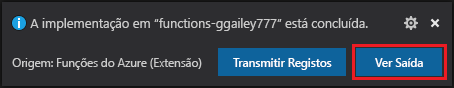

# Quickstart: Criar uma função JavaScript em Azure utilizando o Código do Estúdio Visual

> [!div class="op_single_selector" title1="Selecione o seu idioma de função: "]
> - [JavaScript](create-first-function-vs-code-node.md)
> - [C#](create-first-function-vs-code-csharp.md)
> - [Java](create-first-function-vs-code-java.md)
> - [PowerShell](create-first-function-vs-code-powershell.md)
> - [Python](create-first-function-vs-code-python.md)
> - [TypeScript](create-first-function-vs-code-typescript.md)
> - [Outros (Go/Rust)](create-first-function-vs-code-other.md)

Utilize o Código do Estúdio Visual para criar uma função JavaScript que responda a pedidos HTTP. Teste o código localmente e, em seguida, insiure-o para o ambiente sem servidor das Funções Azure.

Completar este quickstart incorre um pequeno custo de alguns USD centavo ou menos na sua <abbr title="A conta Azure é uma entidade única global que lhe dá acesso aos serviços Azure e às suas subscrições Azure.">Conta do Azure</abbr>.

## 1. Prepare o seu ambiente

Antes de começar, certifique-se de que tem os seguintes requisitos em vigor:

+ Uma conta Azure com um <abbr title="Uma subscrição do Azure é um contentor lógico utilizado para aprovisionar recursos no Azure. Armazena os detalhes de todos os seus recursos, como máquinas virtuais (VMs), bases de dados e muito mais.">subscrição ativa</abbr>. [Crie uma conta gratuita.](https://azure.microsoft.com/free/?ref=microsoft.com&utm_source=microsoft.com&utm_medium=docs&utm_campaign=visualstudio)

+ [Node.js 10.14.1+](https://nodejs.org/)

+ [Visual Studio Code](https://code.visualstudio.com/)

+ [Extensão de funções Azure](https://marketplace.visualstudio.com/items?itemName=ms-azuretools.vscode-azurefunctions) para Código de Estúdio Visual.

+ [Ferramentas principais de funções Azure](functions-run-local.md?tabs=linux%2Ccsharp%2Cbash#install-the-azure-functions-core-tools)

 

## 2.  Crie o seu projeto de Funções Locais

1. Escolha o ícone Azure no <abbr title="">Barra de atividades</abbr>, em seguida, na área **Azure: Funções,** selecione o **novo projeto...** ícone.

    

1. **Escolha uma localização de diretório** para o seu espaço de trabalho do projeto e escolha **Select**. 

1. Forneça as seguintes informações nos pedidos:

    + **Selecione um idioma para o seu projeto de função**: Selecione `JavaScript`.

    + **Selecione um modelo para a primeira função do seu projeto**: Selecione `HTTP trigger`.

    + **Forneça um nome de função**: Escreva `HttpExample`.

    + **Nível de autorização**: `Anonymous` Escolha, que permite a qualquer pessoa ligar para o ponto final da sua função.

    + **Selecione como gostaria de abrir o seu projeto**: Selecione `Add to workspace`.

 

<strong>Não pode criar um projeto de função?</strong>

As questões mais comuns a resolver na criação de um projeto de Funções locais são:
* Não tem a extensão Azure Functions instalada. 

 

## 3. Executar a função localmente

1. Prima <kbd>F5</kbd> para iniciar o projeto da aplicação de funções. 

1. No **Terminal,** consulte o ponto final url da sua função a funcionar localmente.

    

1. Copie o seguinte URL e cole num navegador web e, em seguida, prima Enter.

    `http://localhost:7071/api/HttpExample?name=Functions`

1. Ver resposta devolvida.

    

1. Ver informações no painel **terminal** sobre o pedido.

    

1. Prima <kbd>Ctrl + C</kbd> para parar as Ferramentas Core e desligar o depurar.

 

<strong>Não pode executar a função localmente?</strong>

As questões mais comuns a resolver ao executar um projeto local de funções são:
* Não tem as Ferramentas Centrais instaladas. 
*  Se tiver problemas em funcionamento no Windows, certifique-se de que a camada de terminal padrão do Código do Estúdio Visual não está definida para WSL Bash. 

 

## 4. Inscreva-se em Azure

Para publicar a sua aplicação, inscreva-se no Azure. Se já assinou, vá para a próxima secção.

1. Escolha o ícone Azure na barra de atividade, em seguida, na área **Azure: Funções,** escolha **Iniciar súm em Azure...**.

    

1. Quando solicitado no navegador, escolha a **sua conta Azure** e **inscreva-se usando** as suas credenciais de conta Azure.

1. Depois de ter assinado com sucesso, feche a nova janela do navegador e volte ao Código do Estúdio Visual. 

 

## 5. Publicar o projeto à Azure

A sua primeira implementação do seu código inclui a criação de um recurso função na sua subscrição Azure. 

1. Escolha o ícone Azure na barra de Atividade, em seguida, na área **Azure: Funções,** escolha o **botão Implementar para funcionar...** botão.

    

1. Forneça as seguintes informações nos pedidos:

    + **Selecione pasta**: Escolha a pasta que contém a sua aplicação de função. 

    + **Selecione subscrição**: Escolha a subscrição para usar. Não verá isto se tiver apenas uma assinatura.

    + **Selecione Aplicação de Funções no Azure**: Selecione `+ Create new Function App`.

    + **Introduza um nome globalmente único para a aplicação de função**: Escreva um nome único em Azure num caminho URL. O nome que digita é validado para garantir a singularidade global.

    + **Selecione um tempo de execução**: Escolha a versão de Node.js que tem vindo a executar localmente. Pode utilizar o `node --version` comando para verificar a sua versão.

    + **Selecione uma localização para novos recursos**: Para um melhor desempenho, escolha uma [região](https://azure.microsoft.com/regions/) perto de si. 

1. Depois de criar a aplicação de funções, é apresentada uma notificação e o pacote de implementação é aplicado. Selecione **Ver Saída** para ver os resultados da criação e implementação. 
    
    

 

<strong>Não pode publicar a função?</strong>

Esta secção criou os recursos Azure e implantou o seu código local para a aplicação Função. Se não tivesse sucesso,

* Reveja a Saída para obter informações de erro. O ícone do sino no canto inferior direito é outra forma de ver a saída. 
* Publicou para uma aplicação de função existente? Esta ação substitui o conteúdo da app em Azure.

 

<strong>Que recursos foram criados?</strong>

Quando concluídos, os seguintes recursos Azure são criados na sua subscrição, utilizando nomes baseados no nome da aplicação da sua função: 
* **Grupo de recursos**: Um grupo de recursos é um recipiente lógico para recursos relacionados na mesma região.
* **Conta de Armazenamento Azure**: Um recurso de armazenamento mantém o estado e outras informações sobre o seu projeto.
* **Plano de** consumo : Um plano de consumo define o anfitrião subjacente para a sua aplicação de função sem servidor.
* **Aplicação de função**: Uma aplicação de função fornece o ambiente para executar o seu código de função e funções de grupo como uma unidade lógica.
* **Insights de aplicação**: O Application Insights rastreia o uso da sua função sem servidor.

 

## 6. Executar a função em Azure
1. No **Azure: Funções** barra lateral, expanda a nova aplicação de função. 
1. Expandir **funções,** clique com o botão direito em **HttpExample,** e, em seguida, escolher **Executar Função Agora...**.

    

1. **Prima Entrar** para enviar mensagem de pedido predefinido para a sua função. 

1. Uma notificação é levantada no Código do Estúdio Visual quando a execução termina.

 

<strong>Não poderia executar a aplicação Function baseada na nuvem?</strong>

* Lembrou-se de adicionar o teste de consulta ao fim da URL?

 

## 7. Limpar recursos

Elimine a aplicação de função e os seus recursos para evitar incorrer em custos adicionais.

1. No Código do Estúdio Visual, selecione o ícone Azure na barra de Atividade e, em seguida, selecione a área de Funções na barra lateral. 
1. Selecione a aplicação de função, em seguida, clique com o botão direito e selecione **a aplicação Delete Function...**.

 

## Passos seguintes

Expandir a função adicionando uma <abbr title="A ligação a uma função é uma forma de ligar declarativamente outro recurso à função.">vinculação de saída</abbr>. Esta ligação escreve o string do pedido HTTP para uma mensagem numa fila de armazenamento de fila Azure. 

> [!div class="nextstepaction"]
> [Ligue-se a uma fila de armazenamento Azure](functions-add-output-binding-storage-queue-vs-code.md?pivots=programming-language-javascript)

[Azure Functions Core Tools]: functions-run-local.md
[Azure Functions extension for Visual Studio Code]: https://marketplace.visualstudio.com/items?itemName=ms-azuretools.vscode-azurefunctions
