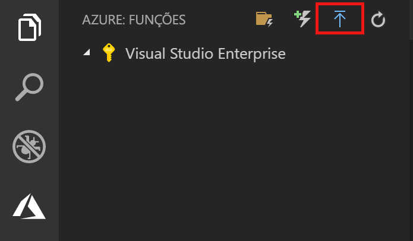

# Quickstart: Criar uma função em Azure com Python usando Código de Estúdio Visual

[!INCLUDE [functions-language-selector-quickstart-vs-code](../../includes/functions-language-selector-quickstart-vs-code.md)]

Neste artigo, utiliza o Código do Estúdio Visual para criar uma função Python que responde aos pedidos HTTP. Depois de testar o código localmente, implemente-o para o ambiente sem servidor das Funções Azure.

Completar este quickstart incorre num pequeno custo de alguns usd ou menos na sua conta Azure.

Há também uma [versão baseada em CLI](create-first-function-cli-python.md) deste artigo.

## Configurar o ambiente

Antes de começar, certifique-se de que tem os seguintes requisitos em vigor:

+ Uma conta Azure com uma subscrição ativa. [Crie uma conta gratuita.](https://azure.microsoft.com/free/?ref=microsoft.com&utm_source=microsoft.com&utm_medium=docs&utm_campaign=visualstudio)

+ [Node.js](https://nodejs.org/), exigido pelo Windows para a npm. Apenas [versões LTS e De Manutenção LTS](https://nodejs.org/about/releases/). Utilize o `node --version` comando para verificar a sua versão.
    Não é necessário para o desenvolvimento local em macOS e Linux.

+ [Python 3.8](https://www.python.org/downloads/release/python-381/), [Python 3.7](https://www.python.org/downloads/release/python-375/), [Python 3.6](https://www.python.org/downloads/release/python-368/) são suportados por Azure Functions (x64).

+ [Código visual do estúdio](https://code.visualstudio.com/) numa das [plataformas suportadas.](https://code.visualstudio.com/docs/supporting/requirements#_platforms)

+ A [extensão Python](https://marketplace.visualstudio.com/items?itemName=ms-python.python) para Código de Estúdio Visual.  

+ A [extensão de Funções Azure](https://marketplace.visualstudio.com/items?itemName=ms-azuretools.vscode-azurefunctions) para Código de Estúdio Visual.

## Crie o seu projeto local

Nesta secção, você usa Visual Studio Code para criar um projeto local de Funções Azure em Python. Mais tarde neste artigo, publicará o seu código de função para Azure.

1. Escolha o ícone Azure na barra de Atividade, em seguida, na área **Azure: Funções,** selecione o **novo projeto...** ícone.

    

1. Escolha um local de diretório para o seu espaço de trabalho do projeto e escolha **Select**.

    > [!NOTE]
    > Estes passos foram concebidos para serem concluídos fora de um espaço de trabalho. Neste caso, não selecione uma pasta de projeto que faz parte de uma área de trabalho.

1. Fornecer as seguintes informações nas instruções:

    + **Selecione um idioma para o seu projeto de função** : Escolha `Python` .

    + **Selecione um pseudónimo Python para criar um ambiente virtual** : Escolha a localização do seu intérprete Python. Se a localização não for mostrada, escreva em todo o caminho para o binário Python.  

    + **Selecione um modelo para a primeira função do seu projeto** : Escolha `HTTP trigger` .

    + **Fornecer um nome de função** : `HttpExample` Digite .

    + **Nível de autorização** : `Anonymous` Escolha, que permite a qualquer pessoa ligar para o ponto final da sua função. Para saber mais sobre o nível de autorização, consulte [as teclas de Autorização](functions-bindings-http-webhook-trigger.md#authorization-keys).

    + **Selecione como pretende abrir o seu projeto** : Escolha `Add to workspace` .

1. Utilizando esta informação, o Visual Studio Code gera um projeto Azure Functions com um gatilho HTTP. Pode ver os ficheiros de projeto locais no Explorer. Para saber mais sobre ficheiros que são criados, consulte [os ficheiros do projeto Gerados.](functions-develop-vs-code.md#generated-project-files)

[!INCLUDE [functions-run-function-test-local-vs-code](../../includes/functions-run-function-test-local-vs-code.md)]

Depois de verificar que a função funciona corretamente no seu computador local, é hora de usar o Código do Estúdio Visual para publicar o projeto diretamente para o Azure.

[!INCLUDE [functions-sign-in-vs-code](../../includes/functions-sign-in-vs-code.md)]

## Publicar o projeto no Azure

Nesta secção, cria uma aplicação de função e recursos relacionados na sua subscrição Azure e, em seguida, implementa o seu código. 

> [!IMPORTANT]
> A publicação de uma aplicação de funções existente substitui o conteúdo dessa aplicação no Azure. 

1. Escolha o ícone Azure na barra de Atividade, em seguida, na área **Azure: Funções,** escolha o **botão Implementar para funcionar...** botão.

    

1. Fornecer as seguintes informações nas instruções:

    + **Selecione pasta** : Escolha uma pasta do seu espaço de trabalho ou navegue para uma que contenha a sua aplicação de função. Não verá isto se já tiver uma aplicação de função válida aberta.

    + **Selecione subscrição** : Escolha a subscrição para usar. Não verá isto se tiver apenas uma assinatura.

    + **Selecione App de função em Azure** : Escolha `+ Create new Function App` . (Não escolha a `Advanced` opção, que não está abrangida por este artigo.)

    + **Introduza um nome globalmente único para a aplicação de função** : Escreva um nome que seja válido num caminho URL. O nome que digita é validado para se certificar de que é único em Funções Azure. 

    + **Selecione um tempo de execução** : Escolha a versão de Python que tem vindo a executar localmente. Pode utilizar o `python --version` comando para verificar a sua versão.

    + **Selecione uma localização para novos recursos** : Para um melhor desempenho, escolha uma [região](https://azure.microsoft.com/regions/) perto de si.

1. Quando concluídos, os seguintes recursos Azure são criados na sua subscrição, utilizando nomes baseados no nome da aplicação da sua função:

    + Um grupo de recursos, que é um recipiente lógico para recursos relacionados.
    + Uma conta padrão de Armazenamento Azure, que mantém informações estatais e outras sobre os seus projetos.
    + Um plano de consumo, que define o anfitrião subjacente para a sua aplicação de função sem servidor. 
    + Uma aplicação de função, que fornece o ambiente para a execução do seu código de função. Uma aplicação de função permite-lhe agrupar funções como uma unidade lógica para facilitar a gestão, implementação e partilha de recursos dentro do mesmo plano de hospedagem.
    + Uma instância de Insights de Aplicação ligada à aplicação de função, que rastreia o uso da sua função sem servidor.

    Depois de criar a aplicação de funções, é apresentada uma notificação e o pacote de implementação é aplicado. 

1. Selecione **Ver Saída** nesta notificação para ver os resultados da criação e implementação, incluindo os recursos Azure que criou. Se perder a notificação, selecione o ícone da campainha no canto inferior direito para vê-lo novamente.

    

[!INCLUDE [functions-vs-code-run-remote](../../includes/functions-vs-code-run-remote.md)]

[!INCLUDE [functions-cleanup-resources-vs-code.md](../../includes/functions-cleanup-resources-vs-code.md)]

## Passos seguintes

Utilizou o Visual Studio Code para criar uma aplicação de funções com uma função simples acionada por HTTP. No artigo seguinte, expande essa função adicionando uma ligação de saída. Esta ligação escreve o string do pedido HTTP para uma mensagem numa fila de armazenamento de fila Azure. 

> [!div class="nextstepaction"]
> [Ligue-se a uma fila de armazenamento Azure](functions-add-output-binding-storage-queue-vs-code.md?pivots=programming-language-python)

[Azure Functions Core Tools]: functions-run-local.md
[Azure Functions extension for Visual Studio Code]: https://marketplace.visualstudio.com/items?itemName=ms-azuretools.vscode-azurefunctions
