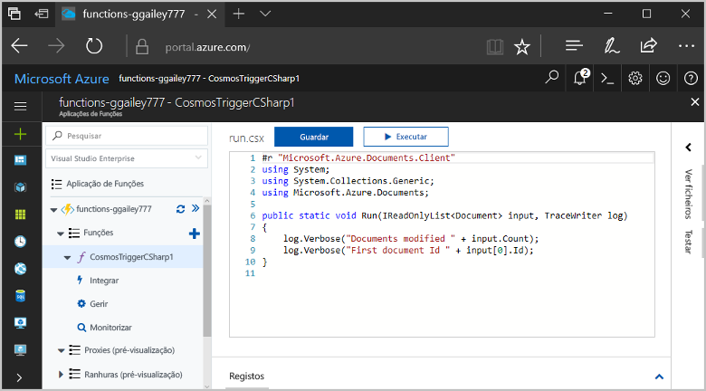
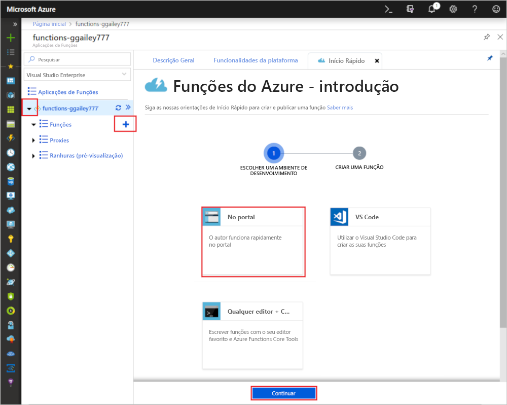
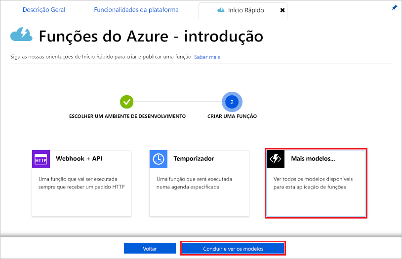
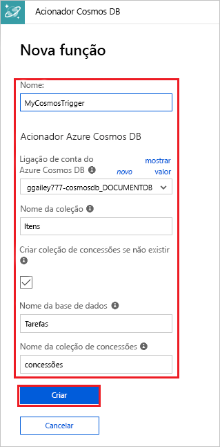

# Criar uma função acionada pelo Azure Cosmos DB

Saiba como criar uma função acionada quando os dados são adicionados ou alterados no Azure Cosmos DB. Para saber mais sobre o Azure Cosmos DB, veja [Azure Cosmos DB: Serverless database computing using Azure Functions (Azure Cosmos DB: computação de base de dados sem servidor com as Funções do Azure)](../cosmos-db/serverless-computing-database.md).

## Pré-requisitos

Para concluir este tutorial:

+ Se não tiver uma subscrição do Azure, crie uma [conta gratuita](https://azure.microsoft.com/free/?WT.mc_id=A261C142F) antes de começar.

> [!NOTE]
> [!INCLUDE [SQL API support only](../../includes/functions-cosmosdb-sqlapi-note.md)]

## Criar uma conta do Azure Cosmos DB

Tem de ter uma conta do Azure Cosmos DB que utilize a API SQL para poder criar o acionador.

[!INCLUDE [cosmos-db-create-dbaccount](../../includes/cosmos-db-create-dbaccount.md)]

## Criar uma aplicação de Funções do Azure

[!INCLUDE [Create function app Azure portal](../../includes/functions-create-function-app-portal.md)]

Em seguida, vai criar uma função na aplicação Function App nova.

## Criar acionador do Azure Cosmos DB

1. Expanda a aplicação de funções e clique no botão **+** , junto a **Funções**. Se esta for a primeira função na sua aplicação de funções, selecione **No portal** e **Continuar**. Caso contrário, avance para o passo três.

   

1. Escolha **Mais modelos** e **Terminar e ver os modelos**.

    

1. No campo de pesquisa, escreva `cosmos` e escolha o modelo **Acionador do Azure Cosmos DB**.

1. Se solicitado, selecione **instalar** para instalar a extensão de Azure Cosmos DB no aplicativo de funções. Depois de instalar com êxito, selecione **Continuar**.

    

1. Configure o novo acionador com as definições, conforme especificado na tabela abaixo da imagem.

    

    | Definição      | Valor sugerido  | Descrição                                |
    | ------------ | ---------------- | ------------------------------------------ |
    | **Nome** | Predefinição | Utilize o nome de função predefinido sugerido pelo modelo.|
    | **Ligação de conta do Azure Cosmos DB** | Nova definição | Selecione **Novo** e, em seguida, escolha a sua **Subscrição**, a **Conta de base de dados** que criou anteriormente e **Selecionar**. Esta ação cria uma definição da aplicação para a ligação da sua conta. Esta definição é utilizada pelo enlace para a ligação à base de dados. |
    | **Nome do contêiner** | Itens | Nome do contêiner a ser monitorado. |
    | **Criar contêiner de concessão se ele não existir** | Assinalado | O contêiner ainda não existe, portanto, crie-o. |
    | **Nome da base de dados** | Tarefas | Nome do banco de dados com o contêiner a ser monitorado. |

1. Clique em **Criar** para criar a função acionada do Azure Cosmos DB. Assim que a função é criada, é apresentado o código de função baseado no modelo.  

    

    Este modelo de função escreve o número de documentos e o primeiro ID de documento nos registos.

Em seguida, conecte-se à sua conta do Azure Cosmos DB e crie o contêiner `Items` no banco de dados `Tasks`.

## Criar o contêiner de itens

1. Abra uma segunda instância do [portal do Azure](https://portal.azure.com) num novo separador no browser.

1. No lado esquerdo do portal, expanda a barra de ícones, escreva `cosmos` no campo de pesquisa e selecione **Azure Cosmos DB**.

    

1. Escolha a sua conta do Azure Cosmos DB e, em seguida, selecione o **Data Explorer**. 

1. Em **API do SQL**, escolha banco de dados **tarefas** e selecione **novo contêiner**.

    

1. Em **Adicionar contêiner**, use as configurações mostradas na tabela abaixo da imagem. 

    

    | Definição|Valor sugerido|Descrição |
    | ---|---|--- |
    | **ID da Base de Dados** | Tarefas |O nome da base de dados nova. Isto deve corresponder ao nome definido no enlace de função. |
    | **ID do Contentor** | Itens | O nome do novo contêiner. Isto deve corresponder ao nome definido no enlace de função.  |
    | **[Chave de partição](../cosmos-db/partition-data.md)** | /categoria|Uma chave de partição que distribui uniformemente os dados para cada partição. A seleção da chave de partição correta é importante na criação de um contêiner de alto desempenho. | 
    | **Débito** |400 RU| Utilize o valor predefinido. Se pretender reduzir a latência, pode aumentar o débito mais tarde. |    

1. Clique em **OK** para criar o contêiner itens. Pode levar um curto tempo para que o contêiner seja criado.

Depois que o contêiner especificado na associação de função existir, você poderá testar a função adicionando itens a esse novo contêiner.

## Testar a função

1. Expanda o novo contêiner **itens** em data Explorer, escolha **itens**e, em seguida, selecione **novo item**.

    

1. Substitua o conteúdo do novo item pelo conteúdo a seguir e escolha **salvar**.

        {
            "id": "task1",
            "category": "general",
            "description": "some task"
        }

1. Mude para o primeiro separador do browser que contém a função no portal. Expanda os registos de função e certifique-se de que o novo documento acionou a função. Veja se o valor do ID do documento `task1` está escrito nos registos. 

    

1. (Opcional) Volte para o seu documento, faça uma alteração e clique em **Atualizar**. Em seguida, volte para os registos de função e certifique-se de que a atualização também acionou a função.

## Limpar recursos

[!INCLUDE [Next steps note](../../includes/functions-quickstart-cleanup.md)]

## Passos seguintes

Foi criada com uma função que é executada quando um documento é adicionado ou modificado no seu Azure Cosmos DB. Para obter mais informações sobre os acionadores do Azure Cosmos DB, veja [Enlaces do Cosmos DB das Funções do Azure](functions-bindings-cosmosdb.md).

[!INCLUDE [Next steps note](../../includes/functions-quickstart-next-steps.md)]
