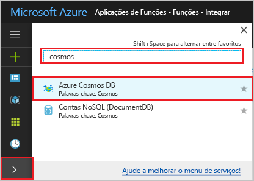

# <a name="create-a-function-triggered-by-azure-cosmos-db"></a>Criar uma função acionada pelo Azure Cosmos DB

Saiba como criar uma função acionada quando os dados são adicionados ou alterados no Azure Cosmos DB. Para saber mais sobre o Azure Cosmos DB, veja [Azure Cosmos DB: Serverless database computing using Azure Functions (Azure Cosmos DB: computação de base de dados sem servidor com as Funções do Azure)](../cosmos-db/serverless-computing-database.md).

:::image type="content" source="./media/functions-create-cosmos-db-triggered-function/quickstart-completed.png" alt-text="Código DB Azure Cosmos":::

## <a name="prerequisites"></a>Pré-requisitos

Para concluir este tutorial:

+ Se não tiver uma subscrição do Azure, crie uma [conta gratuita](https://azure.microsoft.com/free/?WT.mc_id=A261C142F) antes de começar.

> [!NOTE]
> [!INCLUDE [SQL API support only](../../includes/functions-cosmosdb-sqlapi-note.md)]

## <a name="sign-in-to-azure"></a>Iniciar sessão no Azure

Inicie sessão no [portal do Azure](https://portal.azure.com/) com a sua conta do Azure.

## <a name="create-an-azure-cosmos-db-account"></a>Criar uma conta do Azure Cosmos DB

Tem de ter uma conta do Azure Cosmos DB que utilize a API SQL para poder criar o acionador.

[!INCLUDE [cosmos-db-create-dbaccount](../../includes/cosmos-db-create-dbaccount.md)]

## <a name="create-a-function-app-in-azure"></a>Criar uma aplicação de função em Azure

[!INCLUDE [Create function app Azure portal](../../includes/functions-create-function-app-portal.md)]

Em seguida, vai criar uma função na aplicação Function App nova.

<a name="create-function"></a>

## <a name="create-azure-cosmos-db-trigger"></a>Criar acionador do Azure Cosmos DB

1. Na sua aplicação de funções, selecione **Funções** do menu esquerdo e, em seguida, **selecione Adicionar** no menu superior. 

1. Na página **Nova Função,** `cosmos` insira no campo de pesquisa e, em seguida, escolha o modelo **de gatilho DB Azure Cosmos.**

   :::image type="content" source="./media/functions-create-cosmos-db-triggered-function/function-choose-cosmos.png" alt-text="Página de funções no portal Azure":::


1. Configure o novo gatilho com as definições especificadas no quadro seguinte:

    | Definição      | Valor sugerido  | Descrição                                |
    | ------------ | ---------------- | ------------------------------------------ |
    | **Nova Função** | Aceitar a predefinição do nome | O nome da função. |
    | **Ligação à conta do Cosmos DB** | Aceite o novo nome predefinido | Selecione **Novo**, a **Conta de Base de Dados** que criou anteriormente e, em seguida, **OK**. Esta ação cria uma definição de aplicação para a sua ligação à conta. Esta definição é utilizada pelo enlace para a ligação à base de dados. |
    | **Nome da base de dados** | Tarefas | Nome da base de dados que inclui a recolha a ser monitorizada. |
    | **Nome da coleção** | Itens | Nome da coleção a ser monitorizado. |
    | **Nome da coleção para concessões** | leases | Nome da coleção para armazenar os arrendamentos. |
    | **Crie a coleção de arrendamento se não existir** | Sim | Verifica a existência da coleção de arrendamento e cria-a automaticamente. |

    :::image type="content" source="./media/functions-create-cosmos-db-triggered-function/functions-cosmosdb-trigger-settings.png" alt-text="Criar a função acionada do Azure Cosmos DB":::

1. Selecione **Criar Função**. 

    Azure cria a função de gatilho Cosmos DB.

1. Para exibir o código de função baseado no modelo, selecione **Código + Teste**.

    :::image type="content" source="./media/functions-create-cosmos-db-triggered-function/function-cosmosdb-template.png" alt-text="Modelo de função do Cosmos DB em C#":::

    Este modelo de função escreve o número de documentos e o primeiro ID de documento nos registos.

Em seguida, ligue-se à sua conta DB Azure Cosmos e crie o `Items` recipiente na base de `Tasks` dados.

## <a name="create-the-items-container"></a>Criar o recipiente itens

1. Abra uma segunda instância do [portal do Azure](https://portal.azure.com) num novo separador no browser.

1. No lado esquerdo do portal, expanda a barra de ícones, escreva `cosmos` no campo de pesquisa e selecione **Azure Cosmos DB**.

    

1. Escolha a sua conta do Azure Cosmos DB e, em seguida, selecione o **Data Explorer**. 

1. Em **API SQL,** escolha a base de **dados Tarefas** e selecione **Novo Recipiente.**

    

1. No **Add Container**, utilize as definições mostradas na tabela abaixo da imagem. 

    

    | Definição|Valor sugerido|Descrição |
    | ---|---|--- |
    | **ID da Base de Dados** | Tarefas |O nome da base de dados nova. Isto deve corresponder ao nome definido no enlace de função. |
    | **ID do Contentor** | Itens | O nome do novo recipiente. Isto deve corresponder ao nome definido no enlace de função.  |
    | **[Chave de partição](../cosmos-db/partitioning-overview.md)** | /categoria|Uma chave de partição que distribui uniformemente os dados para cada partição. A seleção da tecla de partição correta é importante para a criação de um recipiente performante. | 
    | **Débito** |400 RU| Utilize o valor predefinido. Se pretender reduzir a latência, pode aumentar verticalmente o débito mais tarde. |    

1. Clique **em OK** para criar o recipiente Itens. Pode levar pouco tempo para o recipiente ser criado.

Depois de existir o recipiente especificado na encadernação da função, pode testar a função adicionando itens a este novo recipiente.

## <a name="test-the-function"></a>Testar a função

1. Expandir o novo recipiente **de itens** no Data Explorer, escolher **Itens** e, em seguida, selecionar **Novo Item**.

    :::image type="content" source="./media/functions-create-cosmos-db-triggered-function/create-item-in-container.png" alt-text="Criar um item no recipiente itens":::

1. Substitua o conteúdo do novo item pelo seguinte conteúdo e, em seguida, escolha **Guardar**.

    ```yaml
    {
        "id": "task1",
        "category": "general",
        "description": "some task"
    }
    ```

1. Mude para o primeiro separador do browser que contém a função no portal. Expanda os registos de função e certifique-se de que o novo documento acionou a função. Veja se o valor do ID do documento `task1` está escrito nos registos. 

    

1. (Opcional) Volte para o seu documento, faça uma alteração e clique em **Atualizar**. Em seguida, volte para os registos de função e certifique-se de que a atualização também acionou a função.

## <a name="clean-up-resources"></a>Limpar os recursos

[!INCLUDE [Next steps note](../../includes/functions-quickstart-cleanup.md)]

## <a name="next-steps"></a>Passos seguintes

Foi criada com uma função que é executada quando um documento é adicionado ou modificado no seu Azure Cosmos DB. Para obter mais informações sobre os acionadores do Azure Cosmos DB, veja [Enlaces do Cosmos DB das Funções do Azure](functions-bindings-cosmosdb.md).

[!INCLUDE [Next steps note](../../includes/functions-quickstart-next-steps.md)]
