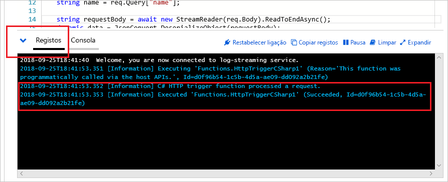

# Criar a sua primeira função no portal do Azure

As Funções Azure permitem executar o seu código num ambiente sem servidor sem ter de criar primeiro uma máquina virtual (VM) ou publicar uma aplicação web. Neste artigo, aprende a usar as Funções Azure para criar uma função de gatilho HTTP "hello world" no portal Azure.

Recomendamos que [desenvolva as suas funções localmente](functions-develop-local.md) e publique numa aplicação de função em Azure.  
Use um dos seguintes links para começar com o seu ambiente de desenvolvimento local escolhido e linguagem:

| Visual Studio Code | Solicitação de terminal/comando | Visual Studio |
| --- | --- | --- |
|  &bull;&nbsp;[Começar com C #](./create-first-function-vs-code-csharp.md) &bull;&nbsp;[Começa com a Java.](./create-first-function-vs-code-java.md) &bull;&nbsp;[Começar com JavaScript](./create-first-function-vs-code-node.md) &bull;&nbsp;[Começa com o PowerShell](./create-first-function-vs-code-powershell.md) &bull;&nbsp;[Começa com a Python](./create-first-function-vs-code-python.md) |&bull;&nbsp;[Começar com C #](./create-first-function-cli-csharp.md) &bull;&nbsp;[Começa com a Java.](./create-first-function-cli-java.md) &bull;&nbsp;[Começar com JavaScript](./create-first-function-cli-node.md) &bull;&nbsp;[Começa com o PowerShell](./create-first-function-cli-powershell.md) &bull;&nbsp;[Começa com a Python](./create-first-function-cli-python.md) | [Começar com C #](functions-create-your-first-function-visual-studio.md) |

[!INCLUDE [quickstarts-free-trial-note](../../includes/quickstarts-free-trial-note.md)]

## Iniciar sessão no Azure

Inicie sessão no [portal do Azure](https://portal.azure.com) com a sua conta do Azure.

## Criar uma aplicação de funções

Precisa de uma aplicação Function App para alojar a execução das suas funções. Uma aplicação de função permite-lhe agrupar funções como uma unidade lógica para facilitar a gestão, implementação, escala e partilha de recursos.

[!INCLUDE [Create function app Azure portal](../../includes/functions-create-function-app-portal.md)]

Em seguida, crie uma função na nova aplicação de função.

## Criar uma função de gatilho HTTP

1. A partir do menu esquerdo da janela **Funções,** selecione **Funções** e selecione **Adicione** no menu superior. 
 
1. A partir da janela **Nova Função,** selecione **'Desír do gatilho'.**

    

1. Na janela **Nova Função,** aceite o nome predefinido para **Nova Função,** ou introduza um novo nome. 

1. Escolha **o Anónimo** na lista de abandono do **nível** de autorização e, em seguida, selecione **Criar Função**.

    Azure cria a função de gatilho HTTP. Agora, pode enviar um pedido HTTP para executar a função nova.

## Testar a função

1. Na sua nova função de gatilho HTTP, selecione **Código + Teste** a partir do menu esquerdo e, em seguida, selecione Obter URL de **função** a partir do menu superior.

    

1. Na caixa de diálogo URL da **função Get,** selecione o **predefinimento** da lista de drop-down e, em seguida, selecione a Cópia para o ícone **da área de transferência.** 

    

1. Cole o URL da função na barra de endereço do navegador. Adicione o valor da cadeia de consulta `?name=<your_name>` ao final deste URL e prima Enter para executar o pedido. 

    O exemplo seguinte mostra a resposta no browser:

    

    O URL do pedido inclui uma chave que é necessária, por predefinição, para aceder à sua função através de HTTP.

1. Quando a sua função é executada, são escritas informações de rastreio nos registos. Para ver a saída de **vestígios,** volte à página **Code + Test** no portal e expanda a seta de Logs na parte inferior da página.

   

## Limpar os recursos

[!INCLUDE [Clean-up resources](../../includes/functions-quickstart-cleanup.md)]

## Passos seguintes

[!INCLUDE [Next steps note](../../includes/functions-quickstart-next-steps.md)]