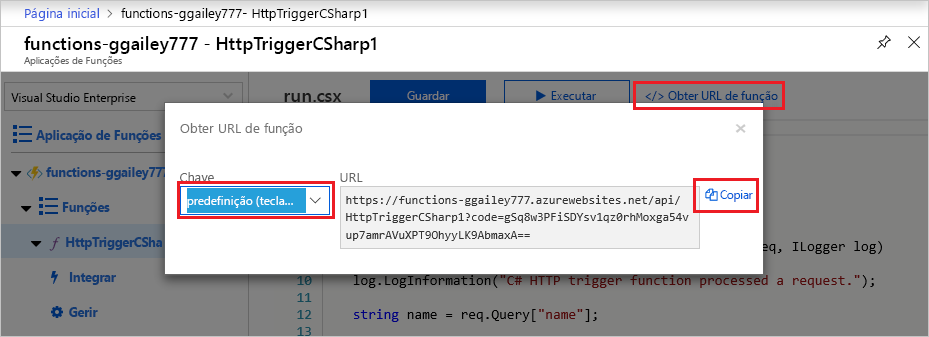

# Criar a sua primeira função no portal do Azure

As Funções Azure permitem executar o seu código num ambiente sem servidores sem ter de criar primeiro uma máquina virtual (VM) ou publicar uma aplicação web. Neste artigo, aprende-se a usar funções Azure para criar uma função "hello world" HTTP desencadeada no portal Azure.

[!INCLUDE [quickstarts-free-trial-note](../../includes/quickstarts-free-trial-note.md)]

Se é um desenvolvedor de C#, considere criar a [sua primeira função no Visual Studio 2019](functions-create-your-first-function-visual-studio.md) em vez de no portal. 

## Iniciar sessão no Azure

Inscreva-se no [portal Azure](https://portal.azure.com) com a sua conta Azure.

## Criar uma aplicação de função

Precisa de uma aplicação Function App para alojar a execução das suas funções. Uma aplicação de função permite-lhe agrupar funções como uma unidade lógica para uma gestão mais fácil, implementação, escalae e partilha de recursos.

[!INCLUDE [Create function app Azure portal](../../includes/functions-create-function-app-portal.md)]

Em seguida, crie uma função na nova aplicação de funções.

## Criar uma função acionada por HTTP

1. A partir do menu esquerdo da janela **Funções,** selecione **Funções**e, em seguida, selecione **Adicionar** a partir do menu superior. 
 
1. A partir da janela **New Function,** selecione **Http trigger**.

    

1. Na janela **New Function,** aceite o nome predefinido para **New Function**, ou introduza um novo nome. 

1. Escolha o **Anonymous** na lista de desistência do **nível** de autorização e, em seguida, selecione **Criar Função**.

    O Azure cria a função de gatilho HTTP. Agora, pode enviar um pedido HTTP para executar a função nova.

## Testar a função

1. Na sua nova função de gatilho HTTP, selecione **Código + Teste** a partir do menu esquerdo e, em seguida, selecione Obter URL de **função** a partir do menu superior.

    

1. Na caixa de diálogo URL da **função Get,** selecione **predefinido** da lista de drop-down e, em seguida, selecione o ícone **copy para clipboard.** 

    

1. Cole o URL da função na barra de endereço do navegador. Adicione o valor `?name=<your_name>` de cadeia de consulta ao final deste URL e prima Introduza para executar o pedido. 

    O exemplo seguinte mostra a resposta no browser:

    

    O URL do pedido inclui uma chave que é necessária, por predefinição, para aceder à sua função através de HTTP.

1. Quando a sua função é executada, são escritas informações de rastreio nos registos. Para ver a saída do rastreio, volte à página **Code + Test** no portal e expanda a seta de **Registos** na parte inferior da página.

   

## Limpar recursos

[!INCLUDE [Clean-up resources](../../includes/functions-quickstart-cleanup.md)]

## Passos seguintes

[!INCLUDE [Next steps note](../../includes/functions-quickstart-next-steps.md)]

