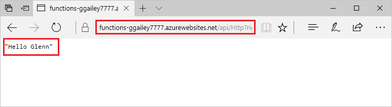

# Criar a sua primeira função no portal do Azure

As Funções do Azure permitem-lhe executar o seu código num ambiente [sem servidor](https://azure.microsoft.com/solutions/serverless/), sem que tenha de criar primeiro uma VM ou publicar uma aplicação Web. Neste artigo, saiba como usar as funções para criar uma função "Olá, mundo" no portal do Azure.

[!INCLUDE [quickstarts-free-trial-note](../../includes/quickstarts-free-trial-note.md)]

> [!NOTE]
> C#os desenvolvedores devem considerar [a criação de sua primeira função no Visual Studio 2019](functions-create-your-first-function-visual-studio.md) em vez de no Portal. 

## Iniciar sessão no Azure

Inicie sessão no portal do Azure em <https://portal.azure.com> com a sua conta do Azure.

## Criar uma aplicação de função

Precisa de uma aplicação Function App para alojar a execução das suas funções. As aplicações App Function permitem-lhe agrupar funções como unidades lógicas para uma gestão, implementação e partilha de recursos mais fácil. 

[!INCLUDE [Create function app Azure portal](../../includes/functions-create-function-app-portal.md)]

Em seguida, vai criar uma função na aplicação Function App nova.

## Criar uma função acionada por HTTP

1. Expanda a sua nova aplicação de funções, selecione o botão **+** junto a **Funções**, escolha **No portal** e selecione **Continuar**.

    

1. Escolha **WebHook + API** e selecione **Criar**.

    

É criada uma função com um modelo específico de linguagem para uma função acionada por HTTP.

Agora, pode enviar um pedido HTTP para executar a função nova.

## Testar a função

1. Na sua nova função, clique em **</> Obter URL da função** no canto superior direito, selecione **predefinição (tecla de Função)** e, em seguida, clique em **Copiar**. 

    

2. Cole o URL da função na barra de endereço do navegador. Adicione o valor da cadeia de consulta `&name=<yourname>` ao final deste URL e prima a tecla `Enter` no teclado para executar o pedido. Deverá ver a resposta devolvida pela função apresentada no browser.  

    O exemplo seguinte mostra a resposta no browser:

    

    O URL do pedido inclui uma chave que é necessária, por predefinição, para aceder à sua função através de HTTP.

3. Quando a sua função é executada, são escritas informações de rastreio nos registos. Para ver a saída de rastreio da execução anterior, regresse à função no portal e clique na seta, na parte inferior do ecrã, para expandir os **Registos**.

   

## Limpar recursos

[!INCLUDE [Clean-up resources](../../includes/functions-quickstart-cleanup.md)]

## Passos seguintes

Você criou um aplicativo de funções com uma função simples disparada por HTTP.  

[!INCLUDE [Next steps note](../../includes/functions-quickstart-next-steps.md)]

Para obter mais informações, veja [Enlaces de HTTP das Funções do Azure](functions-bindings-http-webhook.md).
