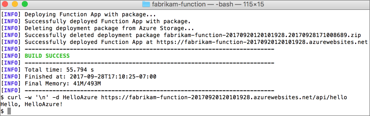

# Crie a sua primeira função Java em Azure usando IntelliJ

Este artigo apresenta o seguinte:
- Como criar uma função Java desencadeada por HTTP num projeto IntelliJ IDEA.
- Passos para testar e depurar o projeto no ambiente de desenvolvimento integrado (IDE) no seu próprio computador.
- Instruções para implantar o projeto de função para funções Azure

<!-- TODO  -->

[!INCLUDE [quickstarts-free-trial-note](../../includes/quickstarts-free-trial-note.md)]

## Configurar o ambiente de desenvolvimento

Para criar e publicar funções Java para a Azure utilizando o IntelliJ, instale o seguinte software:

+ Uma conta Azure com uma subscrição ativa. [Crie uma conta gratuita.](https://azure.microsoft.com/free/?ref=microsoft.com&utm_source=microsoft.com&utm_medium=docs&utm_campaign=visualstudio)
+ [Um Azure apoiou o Kit de Desenvolvimento de Java (JDK)](/azure/developer/java/fundamentals/java-jdk-long-term-support) para Java 8
+ As Edições [IntelliJ IDEA](https://www.jetbrains.com/idea/download/) Ultimate ou Community instaladas
+ [Maven 3.5.0+](https://maven.apache.org/download.cgi)
+ Ferramentas [core de funções mais recentes](https://github.com/Azure/azure-functions-core-tools)

## Instalação e sinscreva

1. Na caixa de diálogo IDEA's Settings/Preferences (Definições/Preferências do IDEA) (Ctrl+Alt+S) do IntelliJ, selecione **Plugins** (Plug-ins). Em seguida, procure o **Azure Toolkit for IntelliJ** no **Marketplace** e clique em **Install** (Instalar). Depois de instalar, clique em **Restart** (Reiniciar) para ativar o plug-in. 

    ![Plug-in do Azure Toolkit for IntelliJ no Marketplace][marketplace]

2. Para iniciar sessão na conta do Azure, abra a barra lateral **Azure Explorer** e clique no ícone **Azure Sign In** (Início de Sessão do Azure) na barra na parte superior (ou no menu do IDEA **Tools/Azure/Azure Sign in**).
    ![O comando de Início de sessão do Azure no IntelliJ][intellij-azure-login]

3. Na janela **Azure Sign In**, selecione **Device Login** (Início de sessão de dispositivo) e clique em **Sign in** (Iniciar sessão) ([other sign in options](/azure/developer/java/toolkit-for-intellij/sign-in-instructions)) (outras opções de início de sessão).

   ![A janela Início de Sessão do Azure com início de sessão de dispositivo selecionado][intellij-azure-popup]

4. Clique em **Copy&Open** (Copiar e Abrir) na caixa de diálogo **Azure Device Login** (Início de Sessão de Dispositivo do Azure).

   ![A janela da caixa de diálogo Início de Sessão do Azure][intellij-azure-copycode]

5. No browser, cole o código do dispositivo (que foi copiado quando clicou em **Copy&Open** no passo anterior) e clique em **Next** (Seguinte).

   ![O browser de início de sessão de dispositivo][intellij-azure-link-ms-account]

6. Na caixa de diálogo **Select Subscriptions,** selecione as subscrições que pretende utilizar e, em seguida, clique em **Selecionar**.

   ![A caixa de diálogo Selecionar Subscrições][intellij-azure-login-select-subs]
   
## Crie o seu projeto local

Nesta secção, utiliza-se o Azure Toolkit para o IntelliJ para criar um projeto local de Funções Azure. Mais adiante neste artigo, irá publicar o seu código de função no Azure. 

1. Abra o diálogo IntelliJ Welcome, *selecione Criar Novo Projeto* para abrir um novo assistente de projeto, selecione *Azure Functions*.

    

1. Selecione *Http Trigger* e, em seguida, clique em *Seguinte* e siga o assistente para analisar todas as configurações nas páginas seguintes; confirmar a localização do seu projeto e, em seguida, clicar *em Terminar;* A Intellj IDEA abrirá então o seu novo projeto.

    

## Executar localmente o projeto

1. Navegue `src/main/java/org/example/functions/HttpTriggerFunction.java` para ver o código gerado. Além da linha *17,* irá notar que existe um botão *de Execução* verde, clique nele e selecione *Executar 'azure-function-exam...'*, verá que a sua aplicação de função está a funcionar localmente com alguns registos.

    

    

1. Pode experimentar a função acedendo ao ponto final impresso do navegador, como `http://localhost:7071/api/HttpTrigger-Java?name=Azure` .

    

1. O registo também é impresso no seu IDEA, agora, pare a aplicação de função clicando no botão *stop.*

    

## Depurar o projeto localmente

1. Para depurar o código de função no seu projeto localmente, selecione o botão *Debug* na barra de ferramentas. Se não vir a barra de ferramentas, ative-a escolhendo a barra de **ferramentas**  >  **'Ver Aparência'**(  >  **Ver- Estar).**

    

1. Clique na linha *20* do ficheiro `src/main/java/org/example/functions/HttpTriggerFunction.java` para adicionar um breakpoint, aceda novamente ao ponto final `http://localhost:7071/api/HttpTrigger-Java?name=Azure` , verá que o breakpoint é atingido, pode tentar mais funcionalidades de depuração como *passo*, *relógio,* *avaliação*. Pare a sessão de depuração clicando no botão stop.

    

## Implemente o seu projeto para Azure

1. Clique em clique direito no seu projeto no intelliJ Project explorer, selecione *Azure -> Implementar para Funções Azure*

    

1. Se ainda não tiver nenhuma App de Função, clique *+* na linha *'Função'.* Digite o nome da aplicação de função e escolha a plataforma adequada, aqui podemos simplesmente aceitar o padrão. Clique *em OK* e a nova aplicação de função que acabou de criar será selecionada automaticamente. Clique *em Executar* para implementar as suas funções.

    

    

## Gerir aplicativos de função da IDEA

1. Pode gerir as suas aplicações de função com *o Azure Explorer* no seu IDEA, clique na *App function*, verá aqui todas as suas aplicações de função.

    

1. Clique para selecionar numa das suas aplicações de função e clique no botão direito, selecione *Show Properties* para abrir a página de detalhes. 

    

1. Clique no seu aplicativo de função *HttpTrigger-Java* e selecione *Função de Gatilho,* verá que o navegador foi aberto com o URL do gatilho.

    

## Adicione mais funções ao projeto

1. Clique no pacote *org.example.funções* e selecione *Nova -> Classe de Função Azure*. 

    

1. Preencha o nome de classe *HttpTest* e selecione *HttpTrigger* no assistente de classe de função criar, clique em *OK* para criar, desta forma, pode criar novas funções como quiser.

    
    
    

## Funções de limpeza

1. Exclusão de funções no Azure Explorer
      
      
      

## Passos seguintes

Criou um projeto Java com uma função httpizada, executou-o na sua máquina local e implantou-o para o Azure. Agora, aumente a sua função por...

> [!div class="nextstepaction"]
> [Adicionar uma ligação de saída de fila de armazenamento Azure](./functions-add-output-binding-storage-queue-java.md)

[marketplace]:./media/functions-create-first-java-intellij/marketplace.png
[intellij-azure-login]: media/functions-create-first-java-intellij/intellij-azure-login.png
[intellij-azure-popup]: media/functions-create-first-java-intellij/intellij-azure-login-popup.png
[intellij-azure-copycode]: media/functions-create-first-java-intellij/intellij-azure-login-copyopen.png
[intellij-azure-link-ms-account]: media/functions-create-first-java-intellij/intellij-azure-login-linkms-account.png
[intellij-azure-login-select-subs]: media/functions-create-first-java-intellij/intellij-azure-login-selectsubs.png
