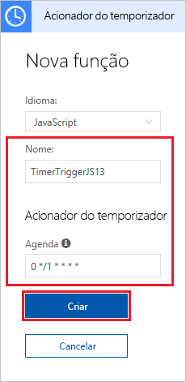
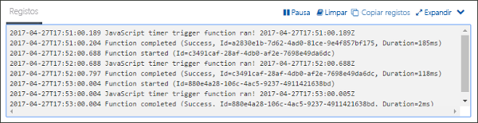
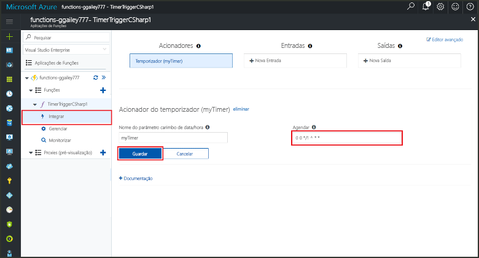

# Criar uma função no Azure que é acionada por um temporizador

Aprenda a usar funções Azure para criar uma função [sem servidorque](https://azure.microsoft.com/solutions/serverless/) funciona com base num horário que define.

## Pré-requisitos

Para concluir este tutorial:

+ Se não tiver uma subscrição Azure, crie uma [conta gratuita](https://azure.microsoft.com/free/?WT.mc_id=A261C142F) antes de começar.

## Criar uma aplicação de Funções do Azure

[!INCLUDE [Create function app Azure portal](../../includes/functions-create-function-app-portal.md)]

Em seguida, vai criar uma função na aplicação Function App nova.

## Criar uma função acionada por temporizador

1. Expanda a sua **+** aplicação de função e clique no botão ao lado das **Funções**. Se esta for a primeira função na sua aplicação de funções, selecione **No portal** e **Continuar**. Caso contrário, vá para o passo 3.

   

2. Escolha **Mais modelos** e **Terminar e ver os modelos**.

    

3. No campo de `timer` pesquisa, digite e configure o novo gatilho com as definições especificadas na tabela abaixo da imagem.

    

    | Definição | Valor sugerido | Descrição |
    |---|---|---|
    | **Nome** | Predefinição | Define o nome da sua função acionada por temporizador. |
    | **Agenda** | 0 \*/1 \* \* \*\* | Uma [expressão CRON](functions-bindings-timer.md#ncrontab-expressions) de seis campos que agenda a função para ser executada todos os minutos. |

4. Clique em **Criar**. Uma função é criada na sua linguagem escolhida que funciona a cada minuto, no minuto.

5. Veja as informações de rastreio escritas nos registos para verificar a execução.

    

Agora, altere a agenda da função, para que seja executada a cada hora, em vez de cada minuto.

## Atualizar a agenda do temporizador

1. Expanda a função e clique em **Integrar**. É aqui que vai definir os enlaces de entrada e saída para a função, bem como a agenda. 

2. Introduza um novo valor por hora para a **Agenda** de `0 0 */1 * * *` e clique em **Guardar**.  

Agora tens uma função que funciona uma vez a cada hora, à hora.

## Limpar recursos

[!INCLUDE [Next steps note](../../includes/functions-quickstart-cleanup.md)]

## Passos seguintes

Criou uma função que é executada com base numa agenda. Para obter mais informações sobre os gatilhos do temporizador, consulte a execução do [código de programação com funções Azure](functions-bindings-timer.md).

[!INCLUDE [Next steps note](../../includes/functions-quickstart-next-steps.md)]
