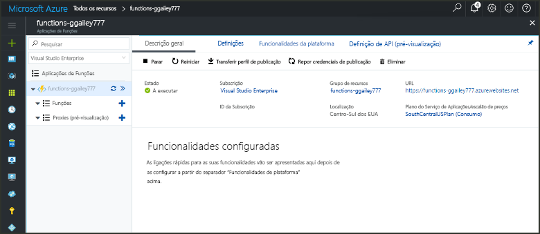

# Criar uma função no Azure que é acionada por um temporizador

Saiba como usar Azure Functions para criar uma função sem [servidor](https://azure.microsoft.com/solutions/serverless/) que é executada com base em um agendamento que você define.

## Pré-requisitos

Para concluir este tutorial:

+ Se não tiver uma subscrição do Azure, crie uma [conta gratuita](https://azure.microsoft.com/free/?WT.mc_id=A261C142F) antes de começar.

## Criar uma aplicação de Funções do Azure

[!INCLUDE [Create function app Azure portal](../../includes/functions-create-function-app-portal.md)]

Em seguida, vai criar uma função na aplicação Function App nova.

## Criar uma função acionada por temporizador

1. Expanda a aplicação de funções e clique no botão **+** , junto a **Funções**. Se esta for a primeira função na sua aplicação de funções, selecione **No portal** e **Continuar**. Caso contrário, avance para o passo três.

   

2. Escolha **Mais modelos** e **Terminar e ver os modelos**.

    

3. No campo de pesquisa, digite `timer` e configure o novo gatilho com as configurações, conforme especificado na tabela abaixo da imagem.

    

    | Definição | Valor sugerido | Descrição |
    |---|---|---|
    | **Nome** | Predefinição | Define o nome da sua função acionada por temporizador. |
    | **Agenda** | 0 \*/1 \* \* \* \* | Uma [expressão CRON](functions-bindings-timer.md#ncrontab-expressions) de seis campos que agenda a função para ser executada todos os minutos. |

4. Clique em **Criar**. É criada uma função na linguagem que escolheu e que é executada todos os minutos.

5. Veja as informações de rastreio escritas nos registos para verificar a execução.

    

Agora, altere a agenda da função, para que seja executada a cada hora, em vez de cada minuto.

## Atualizar a agenda do temporizador

1. Expanda a função e clique em **Integrar**. É aqui que vai definir os enlaces de entrada e saída para a função, bem como a agenda. 

2. Introduza um novo valor por hora para a **Agenda** de `0 0 */1 * * *` e clique em **Guardar**.  

Tem agora uma função que é executada uma vez por hora. 

## Limpar recursos

[!INCLUDE [Next steps note](../../includes/functions-quickstart-cleanup.md)]

## Passos seguintes

Criou uma função que é executada com base numa agenda. Para obter mais informações sobre gatilhos de temporizador, consulte [agendar a execução de código com Azure Functions](functions-bindings-timer.md).

[!INCLUDE [Next steps note](../../includes/functions-quickstart-next-steps.md)]
