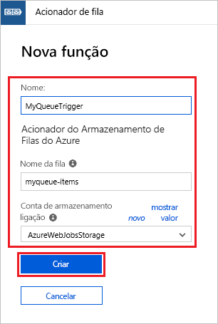
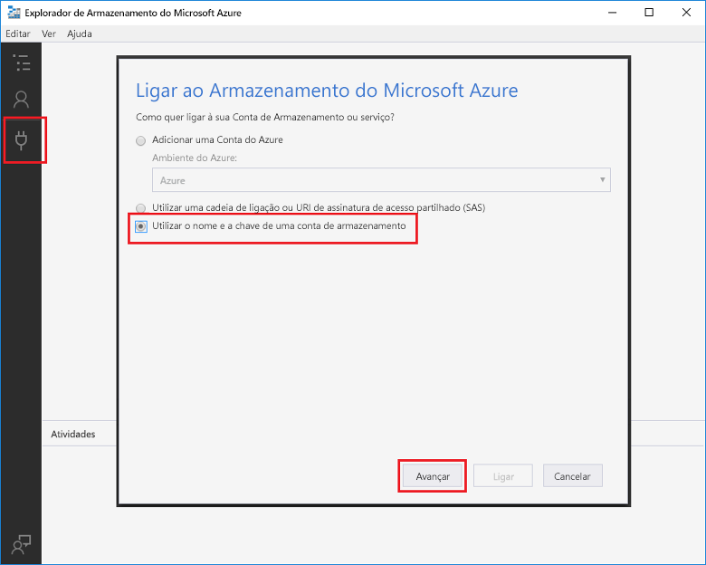

# Criar uma função acionada pelo Armazenamento de filas do Azure

Saiba como criar uma função que é acionada quando são submetidas mensagens para uma fila do Armazenamento do Azure.

## Pré-requisitos

- Transferir e instalar o [Microsoft Azure Storage Explorer](https://storageexplorer.com/).

- Uma subscrição do Azure. Se não tiver uma, crie uma [conta gratuita](https://azure.microsoft.com/free/?WT.mc_id=A261C142F) antes de começar.

## Criar uma aplicação de Funções do Azure

[!INCLUDE [Create function app Azure portal](../../includes/functions-create-function-app-portal.md)]

Em seguida, vai criar uma função na aplicação Function App nova.

## Criar uma função acionada por Fila

1. Expanda a sua **+** aplicação de função e clique no botão ao lado das **Funções**. Se esta for a primeira função na sua aplicação de funções, selecione **No portal** e **Continuar**. Caso contrário, avance para o passo três.

   

1. Escolha **Mais modelos** e **Terminar e ver os modelos**.

    

1. No campo de pesquisa, escreva `queue` e escolha o modelo **Acionador de fila**.

1. Se for solicitado, selecione **Instalar** para instalar a extensão de Armazenamento Azure e quaisquer dependências na aplicação de funções. Depois de instalar com êxito, selecione **Continuar**.

    

1. Utilize as definições especificadas na tabela abaixo da imagem.

    

    | Definição | Valor sugerido | Descrição |
    |---|---|---|
    | **Nome** | Exclusivo na aplicação Function App | O nome desta função acionada por fila. |
    | **Nome da fila**   | myqueue-items    | O nome da fila à qual ligar na sua conta de Armazenamento. |
    | **Ligação da conta de armazenamento** | AzureWebJobsStorage | Pode utilizar a ligação da conta de armazenamento que já está a ser utilizada pela sua aplicação Function App ou criar uma nova.  |    

1. Clique em **Criar** para criar a nova função.

Em seguida, vai ligar à sua conta de Armazenamento do Azure e criar a fila de armazenamento **myqueue-items**.

## Criar a fila

1. Na sua função, clique em **Integrar**, expanda **Documentação** e copie **Nome da conta** e **Chave da conta**. Vai utilizar estas credenciais para ligar à conta de armazenamento no Explorador de Armazenamento do Azure. Se já tiver ligado a sua conta de armazenamento, avance para o passo 4.

    

1. Execute a ferramenta [Microsoft Azure Storage Explorer](https://storageexplorer.com/), clique no ícone de ligação à esquerda, escolha **Utilizar um nome e uma chave de conta de armazenamento** e clique em **Seguinte**.

    

1. Introduza o **Nome da conta** e a **Chave da conta** do passo 1, clique em **Seguinte** e em **Ligar**.

    

1. Expanda a conta de armazenamento anexada, clique `myqueue-items`nas **filas**de cliques à direita, clique em Criar **Fila,** tipo e, em seguida, prima introduzir.

    

Agora que tem uma fila de armazenamento, pode adicionar uma mensagem à mesma para testar a função.

## Testar a função

1. De volta ao portal Azure, navegue para a sua função, expanda os **Registos** na parte inferior da página e certifique-se de que o streaming de registos não é interrompido.

1. No Storage Explorer, expanda a sua conta de armazenamento, **filas,** e **itens myqueue,** em seguida, clique em **Adicionar Mensagem**.

    

1. Escreva a sua mensagem “Hello World” em **Texto da mensagem** e clique em **OK**.

1. Aguarde alguns segundos, regresse aos registos da sua função e certifique-se de que a mensagem nova foi lida a partir da fila.

    

1. Novamente no Storage Explorer, clique em **Atualizar** e verifique se a mensagem foi processada e já não está na fila.

## Limpar recursos

[!INCLUDE [Next steps note](../../includes/functions-quickstart-cleanup.md)]

## Passos seguintes

Criou uma função que é executada quando uma mensagem é adicionada a uma fila de armazenamento. Para obter mais informações sobre os acionadores do Armazenamento de filas, veja [Azure Functions Storage queue bindings](functions-bindings-storage-queue.md) (Enlaces da fila de Armazenamento das Funções do Azure).

Agora que criou a sua primeira função, vamos adicionar uma ligação de saída à função que escreve uma mensagem de volta a outra fila.

> [!div class="nextstepaction"]
> [Add messages to an Azure Storage queue using Functions](functions-integrate-storage-queue-output-binding.md) (Utilizar as Funções para adicionar mensagens a uma fila do Armazenamento do Azure)
