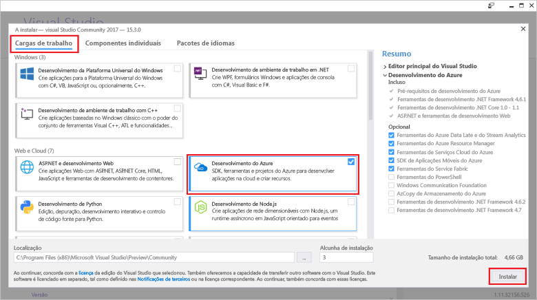

# Quickstart: Crie a sua primeira função em Azure usando o Visual Studio

Neste artigo, utiliza o Visual Studio para criar uma função baseada na biblioteca de classe C# que responda aos pedidos HTTP. Depois de testar o código localmente, você implantá-lo para o <abbr title="Um ambiente de computação em tempo de execução em que todos os detalhes do servidor são transparentes para os desenvolvedores de aplicações, o que simplifica o processo de implementação e gestão do código.">sem servidor</abbr> ambiente de <abbr title="Um serviço Azure que fornece um ambiente de computação sem servidor de baixo custo para aplicações.">Funções do Azure</abbr>.

Completar este quickstart incorre um pequeno custo de alguns USD centavo ou menos na sua <abbr title="O perfil que mantém informações de faturação para o uso do Azure.">Conta do Azure</abbr>.

## 1. Prepare o seu ambiente

+ Criar um Azure <abbr title="O perfil que mantém informações de faturação para o uso do Azure.">conta</abbr> com um ativo <abbr title="A estrutura organizacional básica em que gere recursos em Azure, tipicamente associados a um indivíduo ou departamento dentro de uma organização.">subscrição</abbr>. [Crie uma conta gratuita.](https://azure.microsoft.com/free/?ref=microsoft.com&utm_source=microsoft.com&utm_medium=docs&utm_campaign=visualstudio)

+ Instale [o Visual Studio 2019](https://azure.microsoft.com/downloads/) e selecione a carga de trabalho **de desenvolvimento do Azure** durante a instalação. 

 

<strong>Utilize um projeto Azure Functions em vez</strong>

Se quiser criar um <abbr title="Um recipiente lógico para uma ou mais funções individuais que podem ser implantadas e geridas em conjunto.">Projeto Azure Functions</abbr> utilizando o Visual Studio 2017, deve primeiro instalar as [mais recentes ferramentas Azure Functions](functions-develop-vs.md#check-your-tools-version).

## 2. Criar um projeto de aplicação de função

1. A partir do menu Estúdio Visual, selecione **File**  >  **New**  >  **Project**.

1. Em **Criar um novo projeto,** introduzir *funções* na caixa de pesquisa, escolher o modelo **Azure Functions** e, em seguida, selecionar **Seguinte**.

1. Em **Configurar o seu novo projeto,** insira um **<abbr title=" O nome da aplicação de função deve ser válido como um espaço de nome C#, por isso não utilize sublinhados, hífens ou quaisquer outros caracteres não annalfanuais. "> O </abbr> nome do projeto** para o seu projeto e, em seguida, selecione **Criar**. 

1. Fornecer as seguintes informações para a configuração da **aplicação Criar um novo Azure Functions:**

    + Selecione **<abbr title=" Este valor cria um projeto de função que utiliza a versão 3.x runtime das Funções Azure, que suporta .NET Core 3.x. As funções azure 1.x suporta o Quadro .NET. "> Funções Azure v3 (.NET Core) </abbr>** do dropdown de tempo de funções. (Para obter mais informações, consulte [as versões de tempo de execução do Azure Functions](functions-versions.md).)
    
    + Selecione **<abbr title=" Este valor cria uma função desencadeada por um pedido HTTP. "> HTTP </abbr> gatilho** como o modelo de função.
    
    + Selecione **<abbr title=" Porque uma Função Azure requer uma conta de armazenamento, uma é atribuída ou criada quando publica o seu projeto ao Azure. Um gatilho HTTP não utiliza uma cadeia de ligação de conta Azure Storage; todos os outros tipos de gatilho requerem uma cadeia de ligação válida da conta Azure Storage. "> Emulador </abbr> de armazenamento** da conta de armazenamento.
        
    + Selecione **Anonymous** a partir do <abbr title="A função criada pode ser acionada por qualquer cliente sem fornecer uma chave. Esta definição de autorização torna mais fácil testar a função nova.">Nível de autorização</abbr> dropdown. (Para obter mais informações sobre chaves e autorização, consulte [as chaves de autorização](functions-bindings-http-webhook-trigger.md#authorization-keys) e as [ligações HTTP e webhook](functions-bindings-http-webhook.md).)

    + Selecione **Criar**
        
## 3. Mudar o nome da função

O `FunctionName` atributo método define o nome da função, que por padrão é gerada como `Function1` . Como a ferramenta não permite anular o nome da função predefinida quando criar o seu projeto, despie um minuto para criar um nome melhor para a classe de função, arquivo e metadados.

1. No **File Explorer,** clique com o botão direito no ficheiro .cs Função e rebatize-o para *HttpExample.cs*.

1. No código, rebatize a classe Function1 para 'HttpExample'.

1. No `HttpTrigger` método denominado `Run` , rebatize o `FunctionName` método a `HttpExample` .

## 4. Executar a função localmente

1. Para executar a sua função, prima <kbd>F5</kbd> em Visual Studio.

1. Copie o URL da sua função na saída do tempo de execução das funções do Azure.

    

1. Cole o URL do pedido HTTP na barra de endereço do browser. Anexar a cadeia de consulta **?name=<YOUR_NAME>** a este URL e executar o pedido. 

    

1. Para parar de depurar, prima <kbd>Shift</kbd> + <kbd>F5</kbd> em Estúdio Visual.

 

<strong>Resolução de problemas</strong>

 Pode ser necessário ativar uma exceção de firewall para que as ferramentas possam lidar com pedidos HTTP. Os níveis de autorização nunca são aplicados quando se executa uma função local.

## 5. Publicar o projeto à Azure

1. No **Explorador de Soluções**, clique com o botão direito do rato no projeto e selecione **Publicar**.

1. In **Target**, selecione **Azure**

    :::image type="content" source="../../includes/media/functions-vstools-publish/functions-visual-studio-publish-profile-step-1.png" alt-text="Selecione alvo Azure":::

1. No **alvo específico**, selecione **Azure Function App (Windows)**

    :::image type="content" source="../../includes/media/functions-vstools-publish/functions-visual-studio-publish-profile-step-2.png" alt-text="Selecione app de função Azure":::

1. Em **Instância de Função,** selecione **Criar uma nova Função Azure...** e, em seguida, utilizar os valores especificados nos seguintes:

    + Para **nome** fornecer um <abbr title="Use um nome que identifique exclusivamente a sua nova aplicação de função. Aceite este nome ou insira um novo nome. Os caracteres válidos são: `a-z` `0-9` , e `-` ..">Nome globalmente exclusivo</abbr>
    
    + **Selecione** uma subscrição da lista de drop-down.
    
    + **Selecione** uma existente <abbr title="Um recipiente lógico para recursos Azure relacionados que você pode gerir como uma unidade.">grupo de recursos</abbr> a partir da lista de drop-down ou escolha **Novo** para criar um novo grupo de recursos.
    
    + **Selecionar** <abbr title="Quando publica o seu projeto numa aplicação de função que funciona num plano de Consumo, paga apenas para execuções da sua aplicação de funções. Outros planos de hospedagem incorrem em custos mais elevados.">Consumo</abbr> no drop-down do tipo de reprodução. (Para mais informações, consulte [o plano de consumo](consumption-plan.md).)
    
    + **Selecione** um  <abbr title="Uma referência geográfica a um centro de dados específico do Azure no qual os recursos são atribuídos. Consulte [as regiões](https://azure.microsoft.com/regions/) para obter uma lista das regiões disponíveis.">localização</abbr> da queda.
    
    + **Selecionar** uma conta de <abbr="Uma conta de armazenamento Azure é exigida pelo tempo de execução de Funções. Selecione Novo para configurar uma conta de armazenamento para fins gerais. Também pode escolher uma conta existente que satisfaça os requisitos da conta de armazenamento." Armazenamento >Azure</abbr> conta da queda

    

1. Selecione **Criar** 

1. No **caso funções,** certifique-se de que **o Run a partir do ficheiro de embalagem** é verificado. 

    :::image type="content" source="../../includes/media/functions-vstools-publish/functions-visual-studio-publish-profile-step-4.png" alt-text="Terminar a criação de perfil":::

     
    

    
<strong>O que faz esta configuração?</strong>

    Ao utilizar **Run from package file**, a sua aplicação de função é implementada utilizando o zip [deploy](functions-deployment-technologies.md#zip-deploy) com o modo [Run-From-Package](run-functions-from-deployment-package.md) ativado. Este é o método de implementação recomendado para o seu projeto de funções, uma vez que resulta num melhor desempenho.    
    
   

1. Selecione **Concluir**.

1. Na página Publicar, selecione **Publicar**.

1. Na página Publicar, reveja o URL raiz da aplicação de função.

1. No separador Publicar, escolha **Gerir no Cloud Explorer <abbr title=" permite-lhe utilizar o Visual Studio para visualizar os conteúdos do site, iniciar e parar a aplicação de função, e navegar diretamente para funcionar recursos de aplicações no Azure e no portal Azure. "> Explorador </abbr> de Nuvens**.
    
    :::image type="content" source="../../includes/media/functions-vstools-publish/functions-visual-studio-publish-complete.png" alt-text="Mensagem de publicação bem-sucedida":::
    

## 6. Teste a sua função em Azure

1. No Cloud Explorer, a sua nova aplicação de função deve ser selecionada. Caso contrário, expanda a sua subscrição, expanda **os Serviços de Aplicações** e selecione a sua nova aplicação de função.

1. Clique com o botão direito na aplicação de função e escolha **Abrir no Browser.** Isto abre a raiz da sua aplicação de função no seu navegador web padrão e exibe a página que indica que a sua aplicação de função está em execução. 

    :::image type="content" source="media/functions-create-your-first-function-visual-studio/function-app-running-azure.png" alt-text="Aplicação de função em execução":::

1. Na barra de endereços do navegador, apenule a cadeia **/api/HttpExample?name=Funções** ao URL base e executar o pedido.

    O URL que chama a sua função de gatilho HTTP está no seguinte formato:

    `http://<APP_NAME>.azurewebsites.net/api/HttpExample?name=Functions`

2. Vá a este URL e veja uma resposta no navegador ao pedido remoto GET devolvido pela função, que parece ser o seguinte exemplo:

    :::image type="content" source="media/functions-create-your-first-function-visual-studio/functions-create-your-first-function-visual-studio-browser-azure.png" alt-text="Resposta de função no navegador":::

## 7. Limpar recursos

Elimine a aplicação de função e os seus recursos para evitar incorrer em custos adicionais.

1. No Cloud Explorer, expanda a sua subscrição, expanda os Serviços de **Aplicações,** clique com o botão direito na sua aplicação de função e escolha **Abrir no Portal.** 

1. Na página de aplicações da função, selecione o **separador 'Vista Geral'** e, em seguida, selecione o link no **grupo De recursos**.

   :::image type="content" source="media/functions-create-your-first-function-visual-studio/functions-app-delete-resource-group.png" alt-text="Selecione o grupo de recursos para eliminar a partir da página de aplicação de funções":::

1. Na página do **grupo Recursos,** reveja a lista de recursos incluídos e verifique se são eles que pretende eliminar.
 
1. Selecione **Eliminar grupo de recursos** e siga as instruções.

    A eliminação pode demorar alguns minutos. Quando terminar, é apresentada uma notificação durante alguns segundos. Também pode selecionar o ícone de sino na parte superior da página para ver a notificação.

## Passos seguintes

Avance para o próximo artigo para aprender a adicionar um <abbr title="Um meio de associar uma função a uma fila de armazenamento, para que possa criar mensagens na fila. As ligações são ligações declarativas entre uma função e outros recursos. Uma ligação de entrada fornece dados para a função; uma ligação de saída fornece dados da função para outros recursos.">Encadernação de saída da fila de armazenamento Azure</abbr> para a sua função:

> [!div class="nextstepaction"]
> [Adicione uma fila de armazenamento Azure à sua função](functions-add-output-binding-storage-queue-vs.md)
