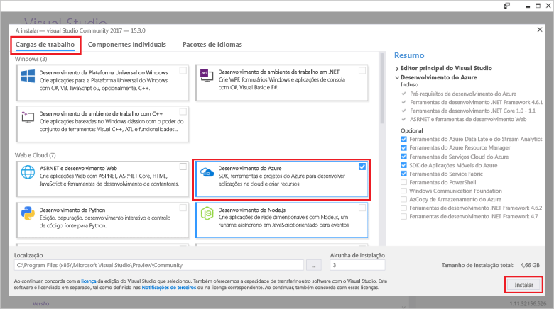

# Quickstart: Crie a sua primeira função em Azure usando o Visual Studio

Neste artigo, utiliza o Visual Studio para criar uma função baseada na biblioteca de classe C# que responda aos pedidos HTTP. Depois de testar o código localmente, implemente-o para o ambiente sem servidor das Funções Azure.  

Completar este quickstart incorre num pequeno custo de alguns usd ou menos na sua conta Azure.

## Pré-requisitos

Para completar este tutorial, instale primeiro [o Visual Studio 2019](https://azure.microsoft.com/downloads/). Certifique-se de que seleciona a carga de trabalho **de desenvolvimento do Azure** durante a instalação. Se pretender criar um projeto Azure Functions utilizando o Visual Studio 2017, tem primeiro de instalar as [mais recentes ferramentas Azure Functions](functions-develop-vs.md#check-your-tools-version).

Se não tiver uma [subscrição do Azure,](../guides/developer/azure-developer-guide.md#understanding-accounts-subscriptions-and-billing)crie uma [conta gratuita](https://azure.microsoft.com/free/dotnet/) antes de começar.

## Criar um projeto de aplicação de função

[!INCLUDE [Create a project using the Azure Functions template](../../includes/functions-vstools-create.md)]

O Visual Studio cria um projeto e classe que contém código de placa de caldeira para o tipo de função do gatilho HTTP. O código automático envia uma resposta HTTP que inclui um valor da cadeia de consulta ou de corpo de pedido. O `HttpTrigger` atributo especifica que a função é desencadeada por um pedido HTTP. 

## Mude o nome da função

O `FunctionName` atributo método define o nome da função, que por padrão é gerada como `Function1` . Uma vez que a ferramenta não permite que se sobreponha ao nome da função predefinida quando criar o seu projeto, desem um minuto para criar um nome melhor para a classe de função, arquivo e metadados.

1. No **File Explorer,** clique com Function1.cs e rebatize-o para `HttpExample.cs` .

1. No código, rebatize a classe Function1 para 'HttpExample'.

1. No `HttpTrigger` método denominado `Run` , rebatize o `FunctionName` método a `HttpExample` .

Agora que renomeou a função, pode testá-la no computador local.

## Executar a função localmente

O Visual Studio integra-se com as Ferramentas Core de Funções Azure para que possa testar as suas funções localmente utilizando o tempo completo de funcionamento das Funções Azure.  

[!INCLUDE [functions-run-function-test-local-vs](../../includes/functions-run-function-test-local-vs.md)]

Depois de verificar que a função é executada corretamente no computador local, deve publicar o projeto no Azure.

## Publicar o projeto no Azure

Antes de poder publicar o seu projeto, tem de ter uma aplicação de função na sua subscrição Azure. A publicação visual Studio cria uma aplicação de função para si na primeira vez que publica o seu projeto.

[!INCLUDE [Publish the project to Azure](../../includes/functions-vstools-publish.md)]

## Testar a sua função no Azure

1. No Cloud Explorer, a sua nova aplicação de função deve ser selecionada. Caso contrário, expanda a sua subscrição > **Serviços de Aplicações** e selecione a sua nova aplicação de função.

1. Clique com o botão direito na aplicação de função e escolha **Abrir no Browser.** Isto abre a raiz da sua aplicação de função no seu navegador web padrão e exibe a página que indica que a sua aplicação de função está em execução. 

    :::image type="content" source="media/functions-create-your-first-function-visual-studio/function-app-running-azure.png" alt-text="Aplicação de função em execução":::

1. Na barra de endereços do navegador, adiciste a cadeia `/api/HttpExample?name=Functions` ao URL base e execute o pedido.

    O URL que chama a sua função de gatilho HTTP está no seguinte formato:

    `http://<APP_NAME>.azurewebsites.net/api/HttpExample?name=Functions`

2. Vá a este URL e veja uma resposta no navegador ao pedido remoto GET devolvido pela função, que parece ser o seguinte exemplo:

    :::image type="content" source="media/functions-create-your-first-function-visual-studio/functions-create-your-first-function-visual-studio-browser-azure.png" alt-text="Resposta de função no navegador":::

## Limpar os recursos

Outros guias de introdução desta coleção têm por base este guia de introdução. Se planeia trabalhar com quickstarts subsequentes, tutoriais ou com qualquer um dos serviços que criou neste arranque rápido, não limpe os recursos.

Os *recursos* no Azure referem-se a aplicações de funções, funções, contas de armazenamento e assim sucessivamente. Estão agrupados em *grupos de recursos,* e podes apagar tudo num grupo, eliminando o grupo. 

Criou recursos para concluir estes guias de introdução. Poderá ser-lhe cobrado estes recursos, dependendo do seu [estado da conta](https://azure.microsoft.com/account/) e dos [preços dos serviços](https://azure.microsoft.com/pricing/). Se já não precisar dos recursos, pode eliminá-los da seguinte forma:

1. No Cloud Explorer, expanda a sua subscrição > **Serviços de Aplicação,** clique com o botão direito na sua aplicação de função e escolha **Abrir no Portal**. 

1. Na página de aplicações da função, selecione o **separador 'Vista Geral'** e, em seguida, selecione o link no **grupo De recursos**.

   :::image type="content" source="media/functions-create-your-first-function-visual-studio/functions-app-delete-resource-group.png" alt-text="Selecione o grupo de recursos para eliminar a partir da página de aplicação de funções":::

2. Na página do **grupo Recursos,** reveja a lista de recursos incluídos e verifique se são eles que pretende eliminar.
 
3. Selecione **Eliminar grupo de recursos** e siga as instruções.

   A eliminação pode demorar alguns minutos. Quando terminar, é apresentada uma notificação durante alguns segundos. Também pode selecionar o ícone de sino na parte superior da página para ver a notificação.

## Passos seguintes

Neste quickstart, utilizou o Visual Studio para criar e publicar uma aplicação de função C# em Azure com uma função de gatilho HTTP simples. 

Avance para o próximo artigo para aprender a adicionar uma fila de armazenamento Azure à sua função:
> [!div class="nextstepaction"]
> [Adicione uma fila de armazenamento Azure à sua função](functions-add-output-binding-storage-queue-vs.md)

