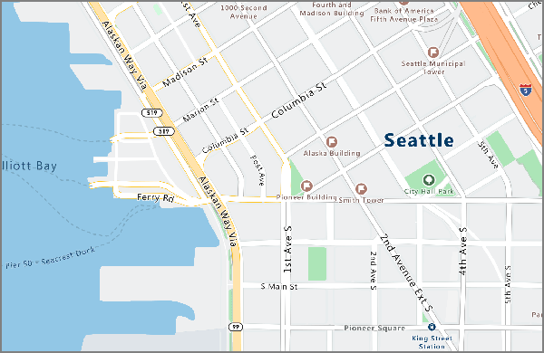
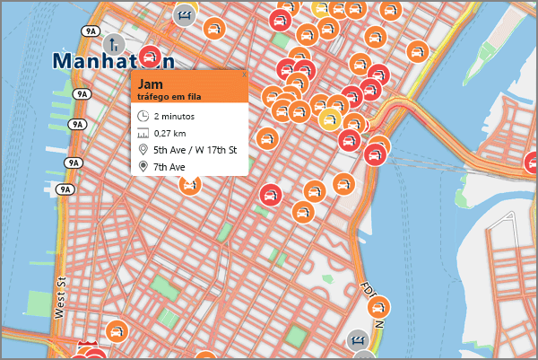

# <a name="what-is-azure-maps"></a>O que é o Azure Maps?

Mapas do Azure é uma coleção de serviços geoespaciais, desagregado pelos dados de mapeamento mais recentes disponíveis dar contexto geográfico preciso para as suas aplicações web e móveis. Mapas do Azure consiste em REST APIs para a composição **Maps** em vários estilos e imagens de satélite, **pesquisa** para endereços, locais e pontos de interesse em todo o mundo; **Encaminhamento** ponto a ponto, multipoint, otimização de multipoint, isochrone, veículos comerciais, tráfego influenciada e matriz de encaminhamento; ver o fluxo de tráfego de líderes do setor e incidentes; estabelecimento de localização do utilizador por meio **Geolocalização**; e a localização para a converter **fusos horários**, bem como a obter a hora num local. Além disso, o Azure Maps oferece serviços para **barreira geográfica**, mapa **dados** armazenamento - informações de localização no Azure; de alojamento e **operações geográficos** fornecendo local inteligência através da análise de dados geoespaciais. Serviços de mapas do Azure estão disponíveis diretamente como REST APIs ou através de um nosso robusto **Web SDK** ou **Android SDK**. Essas ferramentas permitem que os desenvolvedores para desenvolver rapidamente e soluções de escala que integram informações de localização em soluções do Azure a partir da cloud do Azure. Inscreva-se sua livre [conta do Azure Maps](https://azure.microsoft.com/services/azure-maps/) hoje e no desenvolvimento de início!

O vídeo seguinte explica o Azure Maps detalhadamente:

<br/>

<iframe src="https://channel9.msdn.com/Shows/Internet-of-Things-Show/Azure-Maps/player?format=ny" width="960" height="540" allowFullScreen frameBorder="0"></iframe>

## <a name="map-controls"></a>Controlos de Mapas

### <a name="web-sdk"></a>Web SDK

O SDK de Web de mapas do Azure permite-lhe personalizar mapas interativos com o seu conteúdo e imagens para exibição nas suas aplicações móveis ou web. Este controlo utiliza o WebGL, permitindo-lhe compor grandes conjuntos de dados com elevado desempenho. Programe com o SDK com JavaScript ou TypeScript.


### <a name="android-sdk"></a>SDK Android

O Azure Maps Android SDK permite-lhe criar aplicações de mapeamento móveis poderosas. 


## <a name="services-in-azure-maps"></a>Serviços no Azure Maps

O Azure Maps é composto pelos seguintes seis serviços que podem conceder contexto geográfico às aplicações do Azure.

### <a name="render-service"></a>Serviço de composição

O serviço de Composição foi concebido para os programadores criarem aplicações Web e móveis baseadas em mapeamento. O serviço utiliza imagens gráficas em padrão de alta qualidade, disponíveis em 19 níveis de zoom ou imagens de mapa de formato de vetor totalmente personalizáveis.



Agora, o serviço de Composição oferece APIs de pré-visualização para permitir que os programadores trabalhem com imagens de satélite. Para obter mais detalhes, leia as [APIs de Composição do Azure Maps](https://docs.microsoft.com/rest/api/maps/render).

### <a name="route-service"></a>Serviço de encaminhamento

O serviço de Composição contém cálculos de geometria consistentes de infraestruturas do mundo real e múltiplas direções baseadas nos meios de transporte. O serviço permite que os programadores calculem as direções tendo em conta os diversos meios de transporte, como carros ligeiros, pesados, bicicletas ou a pé. O serviço também consegue levar em linha conta dados como condições de tráfego, restrições de peso ou o transporte de substâncias perigosas.


O serviço de Composição oferece agora uma pré-visualização das funcionalidades avançadas, como o processamento em lotes de vários pedidos de encaminhamento, matrizes de tempo de deslocação e distância entre um conjunto de origens e destinos, e encontrar rotas ou distâncias em que pode viajar com base nos requisitos de tempo ou combustível. Para obter detalhes sobre as capacidades de encaminhamento, leia as [APIs de Rota do Azure Maps](https://docs.microsoft.com/rest/api/maps/route).

### <a name="search-service"></a>Serviço de pesquisa

O serviço de Pesquisa foi concebido para os programadores procurarem endereços, locais, listas de empresas por nome ou categoria e outras informações geográficas. O Serviço de Pesquisa também permite aplicar um [geocódigo inverso](https://en.wikipedia.org/wiki/Reverse_geocoding) aos endereços e cruzamentos com base nas latitudes e longitudes.


O serviço de Pesquisa também oferece funcionalidades avançadas, como a pesquisa ao longo de uma rota, a pesquisa numa área mais ampla, colocação de um grupo de pedidos de pesquisa em lote, bem como pesquisa por área maior em vez de um ponto de localização. As APIs de pesquisa de área e batch estão atualmente em pré-visualização. Para obter mais detalhes sobre as capacidades de pesquisa, leia a página [APIs de Pesquisa do Azure Maps](https://docs.microsoft.com/rest/api/maps/search).

### <a name="time-zone-service"></a>Serviço de Fuso Horário

O serviço de Fuso Horário permite-lhe consultar informações de fuso horário atuais, históricas e futuras através de pares de latitude/longitude ou de um [ID IANA](https://www.iana.org/). O serviço Time Zone Service também permite converter IDs de fuso horário do Microsoft Windows para fusos horários IANA, obter um desvio de fuso horário UTC e obter a hora atual num fuso horário específico. Segue-se o exemplo de uma resposta de JSON típica para uma consulta ao Time Zone Service:

```JSON
{
    "Version": "2017c",
    "ReferenceUtcTimestamp": "2017-11-20T23:09:48.686173Z",
    "TimeZones": [{
        "Id": "America/Los_Angeles",
        "ReferenceTime": {
            "Tag": "PST",
            "StandardOffset": "-08:00:00",
            "DaylightSavings": "00:00:00",
            "WallTime": "2017-11-20T15:09:48.686173-08:00",
            "PosixTzValidYear": 2017,
            "PosixTz": "PST+8PDT,M3.2.0,M11.1.0"
        }
    }]
}
```

Para obter detalhes sobre este serviço, visite a página [APIs de Fuso Horário do Azure Maps](https://docs.microsoft.com/rest/api/maps/timezone).

### <a name="traffic-service"></a>Serviço de tráfego

O serviço de Tráfego é um conjunto de serviços Web concebido para os programadores criarem aplicações Web e móveis que precisem de dados de tráfego. O serviço fornece dois tipos de dados:

* Fluxo de tráfego – velocidades observadas em tempo real e durações das viagens para todas as estradas principais da rede.
* Incidentes de tráfego - uma exibição atualizada sobre engarrafamentos e incidentes na rede de trânsito.



Visite a página [APIs de Tráfego do Azure Maps](https://docs.microsoft.com/rest/api/maps/traffic) para obter mais detalhes.

### <a name="ip-to-location"></a>IP para Localização

O serviço IP para Localização permite-lhe pré-visualizar o código de país de duas letras obtido para um determinado endereço IP. Este serviço pode ajudar a personalizar e melhorar a experiência do utilizador ao capacitar conteúdo da aplicação personalizado com base na localização geográfica.

Para obter informações sobre as APIs REST para o IP do serviço de localização, visite a página [APIs de Geolocalização do Azure Maps](https://docs.microsoft.com/rest/api/maps/geolocation).

## <a name="programming-model"></a>Modelo de programação

O Azure Maps foi criado para oferecer mobilidade e pode potenciar aplicações de várias plataformas. Ele utiliza um modelo de programação que é agnóstico quanto ao idioma e oferece suporte à saída JSON através de [APIs REST](https://docs.microsoft.com/rest/api/maps/).

Além disso, o Azure Maps disponibiliza um prático [controlo de mapas em JavaScript](https://docs.microsoft.com/javascript/api/azure-maps-control) com um modelo de programação simples tendo em vista um desenvolvimento fácil e rápido de aplicações Web e móveis.

## <a name="usage"></a>Utilização

Para aceder aos serviços do Maps, navegue para o [portal do Azure](https://portal.azure.com) e crie uma conta do Azure Maps.

O Azure Maps utiliza um esquema de autenticação baseado em chave. A conta inclui duas chaves pré-geradas para si. Comece a integrar estas capacidades de localização na sua aplicação através de qualquer uma das chaves e a fazer um pedido para o serviço do Azure Maps.

## <a name="supported-regions"></a>Regiões suportadas

A API de mapas do Azure está atualmente disponível em todos os países, exceto para as regiões seguintes:

* Argentina
* China
* Índia
* Marrocos
* Paquistão
* Coreia do Sul

Certifique-se de que a localização do seu endereço IP atual não está dos países não suportados acima.

## <a name="next-steps"></a>Passos Seguintes

Para obter mais informações sobre as novas funcionalidades do Azure Maps:

> [!div class="nextstepaction"]
> [Matriz de rota, Isocrones, pesquisa de IP e muito mais](https://azure.microsoft.com/blog/route-matrix-isochrones-ip-lookup-and-more-added-to-azure-maps/)

Experimente uma aplicação de exemplo que mostra os mapas do Azure:

> [!div class="nextstepaction"]
> [Início rápido: Criar uma aplicação Web](quick-demo-map-app.md)
