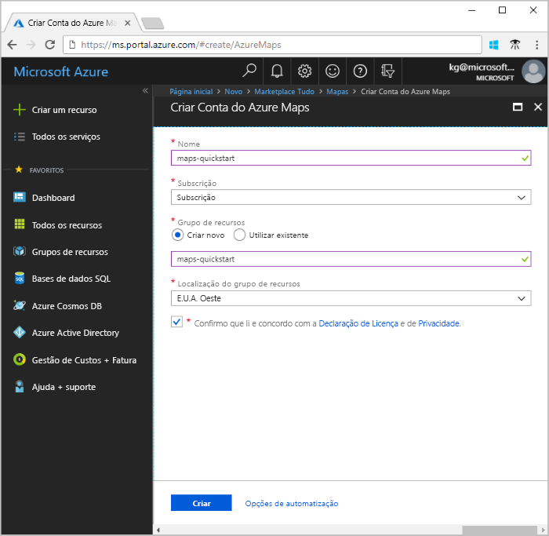
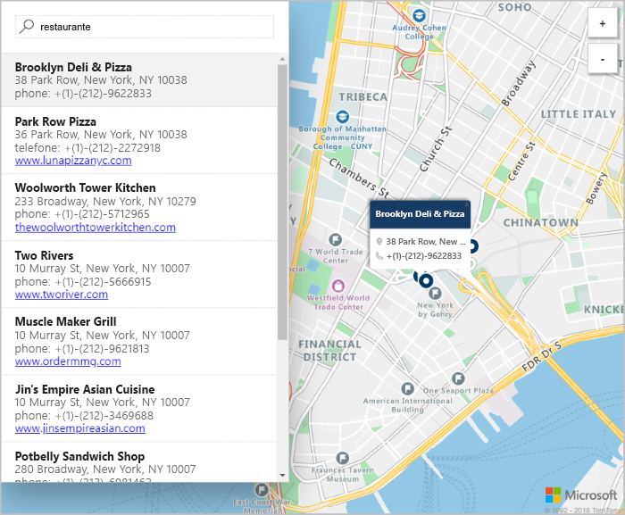

# Quickstart: Criar um mapa de pesquisa interativo usando o Azure Maps

Este artigo demonstra as capacidades do Azure Maps criar um mapa que proporciona aos utilizadores uma experiência de pesquisa interativa. Ele acompanha-te através destes passos básicos:
* Crie a sua própria conta Azure Maps.
* Obtenha a chave da sua conta para usar na aplicação web de demonstração.

Se não tiver uma subscrição do Azure, crie uma [conta gratuita](https://azure.microsoft.com/free/?WT.mc_id=A261C142F) antes de começar.

## Iniciar sessão no portal do Azure

Inicie sessão no [Portal do Azure](https://portal.azure.com).

## Criar uma conta com o Azure Maps

Crie uma nova conta dos Maps com os seguintes passos:

1. No canto superior esquerdo do [portal do Azure](https://portal.azure.com), clique em **Criar um recurso**.
2. Na caixa *Procurar no Marketplace*, escreva **Maps**.
3. Em *Resultados*, selecione **Maps**. Clique no botão **Criar** que aparece abaixo do mapa.
4. Na página **Criar Conta do Maps**, introduza os seguintes valores:
    * A *Subscrição* que quer utilizar para esta conta.
    * O nome do *Grupo de recursos* para esta conta. Pode optar por *Criar um grupo de recursos novo* ou *Utilizar um grupo de recursos existente*.
    * O *Nome* da nova conta.
    * O *nível de preços* desta conta.
    * Leia a *Licença* e a *Declaração de Privacidade*, e selecione a caixa de verificação para aceitar os termos.
    * Clique no botão **Criar**.

## Obter a chave primária para a sua conta

Depois de a sua conta do Maps ser criada com êxito, obtenha a chave que lhe permite consultar as APIs do Maps. Recomendamos que utilize a chave principal da sua conta como chave de subscrição ao ligar para os serviços do Azure Maps.

1. Abra a sua conta do Maps no portal.
2. Na secção definições, **selecione Autenticação**.
3. Copie a **Chave primária** para a área de transferência. Guarde-a localmente para a utilizar mais tarde neste tutorial.

## Transferir a aplicação

1. Vá a [interactiveSearch.html](https://github.com/Azure-Samples/AzureMapsCodeSamples/blob/master/AzureMapsCodeSamples/Tutorials/interactiveSearch.html) e clique nele para ver os conteúdos dentro da Interface de Utilizador GitHub. Clique no botão **Raw** e copie o conteúdo do ficheiro ou 'Guarde como' para descarregar o ficheiro.
2. Guarde o conteúdo deste ficheiro localmente como **AzureMapDemo.html**. Abre-o num editor de texto.
3. Procure o `<Your Azure Maps Key>`de cadeias. Substitua-o pelo valor **da chave primária** da secção anterior.

## Abrir a aplicação

1. Abra o ficheiro **AzureMapDemo.html** num browser da sua preferência.
2. Observe o mapa mostrado pela cidade de Los Angeles. Amplie e reduza para ver como o mapa é composto automaticamente com mais ou menos informações consoante o nível de zoom. 
3. Altere o centro predefinido do mapa. No ficheiro **AzureMapDemo.html**, procure a variável com o nome **center**. Substitua o valor do par longitude/latitude desta variável pelos novos valores **[-74.0060, 40.7128]** . Guarde o ficheiro e atualize o browser.
4. Usufrua da experiência de pesquisa interativa. Na caixa de pesquisa no canto superior esquerdo da aplicação web de demonstração, procure **por restaurantes.**
5. Mova o rato sobre a lista de endereços e locais que aparecem abaixo da caixa de pesquisa. Note como o pino correspondente no mapa mostra informações sobre esse local. Por motivos de privacidade das empresas privadas, são apresentados nomes e endereços fictícios.

    

## Limpar recursos

Os tutoriais detalham como usar e configurar o Azure Maps com a sua conta. Não limpe os recursos criados neste arranque rápido se planeia continuar com os tutoriais. Se não pretende continuar, tome estas medidas para limpar os recursos:

1. Feche o navegador que executa a aplicação web **AzureMapDemo.html.**
2. A partir do menu esquerdo no portal Azure, selecione **Todos os recursos.** Em seguida, selecione a sua conta Azure Maps. Na parte superior da lâmina **de todos os recursos,** selecione **Delete**.

## Passos seguintes

Neste arranque rápido, criou a sua conta Azure Maps e criou uma aplicação de demonstração. Dê uma olhada nos seguintes tutoriais para aprender sobre o Azure Maps:

> [!div class="nextstepaction"]
> [Pesquise pontos de interesse nas proximidades utilizando o Azure Maps](tutorial-search-location.md)

Para mais exemplos de código e uma experiência de codificação interativa, consulte estes guias:

> [!div class="nextstepaction"]
> [Encontre um endereço utilizando o serviço de pesquisa Azure Maps](how-to-search-for-address.md)

> [!div class="nextstepaction"]
> [Utilize o Controlo de Mapas de Mapas Azure](how-to-use-map-control.md)
