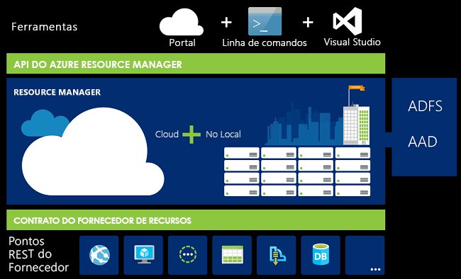

# Descrição geral do Azure Resource Manager

Azure Resource Manager é o serviço de implantação e gerenciamento do Azure. Ele fornece uma camada de gerenciamento que permite criar, atualizar e excluir recursos em sua assinatura do Azure. Você usa recursos de gerenciamento, como controle de acesso, bloqueios e marcas, para proteger e organizar seus recursos após a implantação.

Para saber mais sobre modelos de Azure Resource Manager, confira [implantação de modelo visão geral](template-deployment-overview.md).

## Camada de gestão consistente

Quando um usuário envia uma solicitação de qualquer uma das ferramentas, APIs ou SDKs do Azure, o Resource Manager recebe a solicitação. Ele autentica e autoriza a solicitação. O Gerenciador de recursos envia a solicitação para o serviço do Azure, que executa a ação solicitada. Como todas as solicitações são manipuladas por meio da mesma API, você vê os resultados e os recursos consistentes em todas as diferentes ferramentas.

A imagem a seguir mostra a função Azure Resource Manager é reproduzidas no tratamento de solicitações do Azure. 

Todos os recursos disponíveis no portal também estão disponíveis por meio do PowerShell, CLI do Azure, APIs REST e SDKs de cliente. A funcionalidade inicialmente lançada através de APIs será representada no portal dentro de 180 dias do lançamento inicial.

## Terminologia

Se é a primeira vez que utiliza o Azure Resource Manager, existem alguns termos com os quais poderá não estar familiarizado.

* **recurso** -um item gerível que está disponível através do Azure. Máquinas virtuais, contas de armazenamento, aplicativos Web, bancos de dados e redes virtuais são exemplos de recursos.
* **grupo de recursos** - um contentor que retém recursos relacionados para uma solução do Azure. O grupo de recursos inclui os recursos que você deseja gerenciar como um grupo. Você decide quais recursos pertencem a um grupo de recursos com base no que faz mais sentido para sua organização. Veja [Grupos de recursos](#resource-groups).
* **provedor de recursos** -um serviço que fornece recursos do Azure. Por exemplo, um provedor de recursos comum é Microsoft. Compute, que fornece o recurso de máquina virtual. Microsoft. Storage é outro provedor de recursos comum. Consulte [provedores de recursos e tipos](resource-manager-supported-services.md).
* **Modelo do Resource Manager** – um arquivo JavaScript Object Notation (JSON) que define um ou mais recursos a serem implantados em um grupo de recursos ou assinatura. O modelo pode ser utilizado para implementar os recursos de forma consistente e repetida. Consulte [implantação de modelo visão geral](template-deployment-overview.md).
* **sintaxe declarativa** - sintaxe que permite afirmar "Aqui está o que pretendo criar" sem ter de escrever a sequência de comandos de programação para criá-la. O modelo do Resource Manager é um exemplo de sintaxe declarativa. No ficheiro, é possível definir as propriedades da infraestrutura de implementação para o Azure.  Consulte [implantação de modelo visão geral](template-deployment-overview.md).

## Vantagens da utilização do Resource Manager

Com o Gerenciador de recursos, você pode:

* Gerencie sua infraestrutura por meio de modelos declarativos em vez de scripts.

* Implante, gerencie e monitore todos os recursos de sua solução como um grupo, em vez de manipular esses recursos individualmente.

* Reimplante sua solução em todo o ciclo de vida de desenvolvimento e tenha confiança de que seus recursos sejam implantados em um estado consistente.

* Defina as dependências entre os recursos para que eles sejam implantados na ordem correta.

* Aplique o controle de acesso a todos os serviços em seu grupo de recursos porque o RBAC (controle de acesso baseado em função) é integrado nativamente à plataforma de gerenciamento.

* Aplique marcas a recursos para organizar logicamente todos os recursos em sua assinatura.

* Esclareça a cobrança da sua organização exibindo os custos de um grupo de recursos que compartilham a mesma marca.

## Compreender o âmbito

O Azure fornece quatro níveis de escopo: [grupos de gerenciamento](../governance/management-groups/index.md), assinaturas, [grupos de recursos](#resource-groups)e recursos. A imagem seguinte mostra um exemplo destas camadas.

Pode aplicar as definições de gestão em qualquer um destes níveis de âmbito. O nível que selecionar determina o quanto a definição é aplicada. Os níveis inferiores herdam as definições de níveis mais altos. Por exemplo, quando você aplica uma [política](../governance/policy/overview.md) à assinatura, a política é aplicada a todos os grupos de recursos e recursos em sua assinatura. Quando você aplica uma política no grupo de recursos, essa política é aplicada ao grupo de recursos e a todos os seus recursos. No entanto, outro grupo de recursos não tem essa atribuição de política.

Você pode implantar modelos em grupos de gerenciamento, assinaturas ou grupos de recursos.

## Grupos de recursos

Existem alguns fatores importantes a considerar ao definir o grupo de recursos:

* Todos os recursos do grupo devem partilhar o mesmo ciclo de vida. Implemente-os, atualize-os e elimine-os em conjunto. Se um recurso, tal como um servidor de base de dados, tiver de existir num ciclo de implementação diferente, deve ser colocado noutro grupo de recursos.

* Cada recurso só pode existir num grupo de recursos.

* Pode adicionar ou remover um recurso de um grupo de recursos em qualquer altura.

* Pode mover um recurso de um grupo de recursos para outro grupo. Para obter mais informações, consulte [Mover recursos para um novo grupo de recursos ou subscrição](resource-group-move-resources.md).

* Um grupo de recursos pode conter recursos que estão localizados em regiões diferentes.

* Um grupo de recursos pode ser utilizado para definir o âmbito do controlo de acesso para ações administrativas.

* Um recurso pode interagir com recursos de outros grupos de recursos. Esta interação é comum quando os dois recursos estão relacionados mas não partilham o mesmo ciclo de vida (por exemplo, aplicações Web a ligar a uma base de dados).

Ao criar um grupo de recursos, deve fornecer uma localização para esse grupo de recursos. Pode perguntar-se, "Porque é que um grupo de recursos necessita de uma localização? E, se os recursos podem ter diferentes localizações em relação ao grupo de recursos, por que motivo é que a localização do grupo de recursos é sequer relevante?" O grupo de recursos armazena metadados sobre os recursos. Ao especificar um local para o grupo de recursos, você está especificando onde os metadados são armazenados. Por motivos de conformidade, poderá ter de certificar que os dados estão armazenados numa determinada região.

Se a região do grupo de recursos estiver temporariamente indisponível, você não poderá atualizar recursos no grupo de recursos porque os metadados não estão disponíveis. Os recursos em outras regiões ainda funcionarão conforme o esperado, mas você não poderá atualizá-los. Para obter mais informações sobre como criar aplicativos confiáveis, consulte [projetando aplicativos confiáveis do Azure](/azure/architecture/reliability/).

## Resiliência de Azure Resource Manager

O serviço de Azure Resource Manager foi projetado para resiliência e disponibilidade contínua. As operações do Resource Manager e do plano de controle (solicitações enviadas para management.azure.com) na API REST são:

* Distribuído entre regiões. Alguns serviços são regionais.

* Distribuído entre Zonas de Disponibilidade (bem como regiões) em locais que têm vários Zonas de Disponibilidade.

* Não depende de um único data center lógico.

* Nunca é desnecessário para atividades de manutenção.

Essa resiliência se aplica a serviços que recebem solicitações por meio do Resource Manager. Por exemplo, Key Vault se beneficia dessa resiliência.

## Passos Seguintes

* Para todas as operações oferecidas pelos provedores de recursos, consulte as [APIs REST do Azure](/rest/api/azure/).

* Para saber mais sobre como mover recursos, confira [mover recursos para um novo grupo de recursos ou assinatura](resource-group-move-resources.md).

* Para saber mais sobre como marcar recursos, confira [usar marcas para organizar os recursos do Azure](resource-group-using-tags.md).

* Para saber mais sobre como bloquear recursos, consulte [Bloquear recursos para evitar alterações](resource-group-lock-resources.md)inesperadas.

* Para obter informações sobre como criar modelos para implantações, consulte [implantação de modelo visão geral](template-deployment-overview.md).
