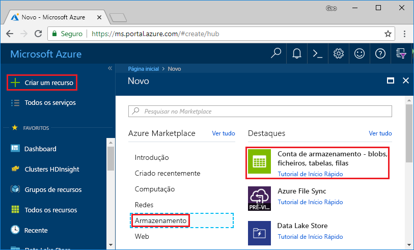
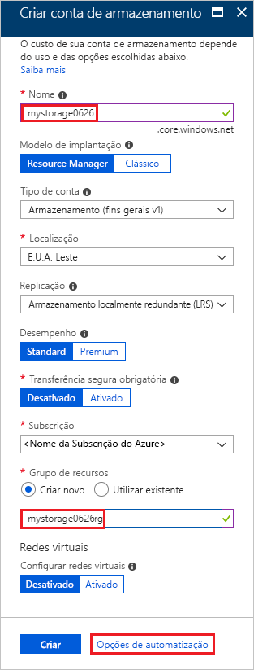
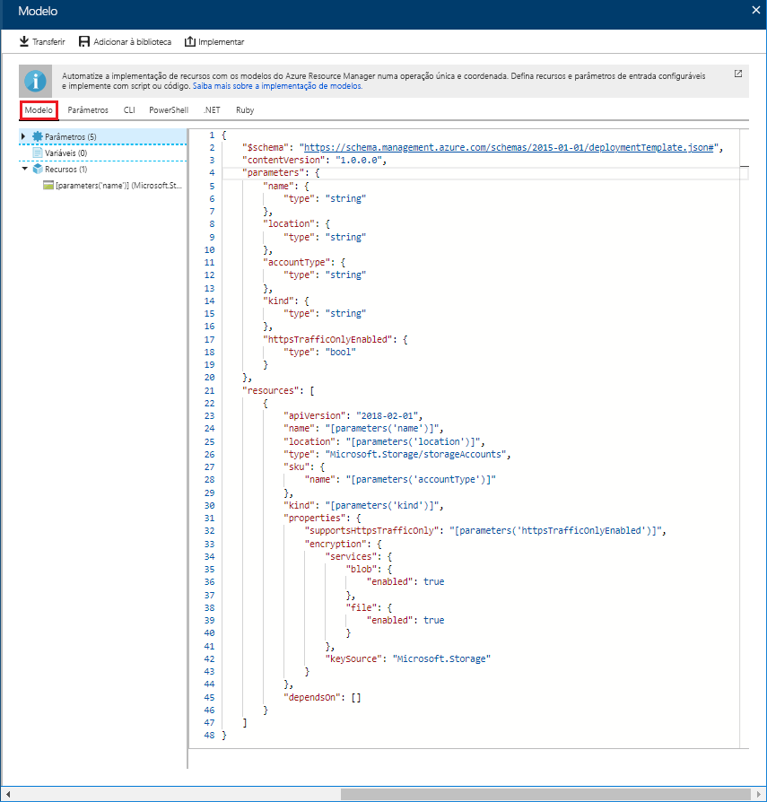
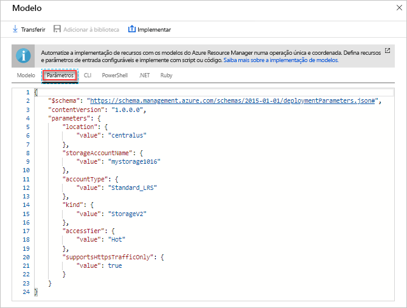
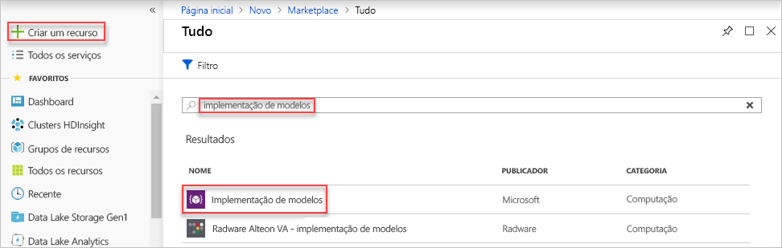
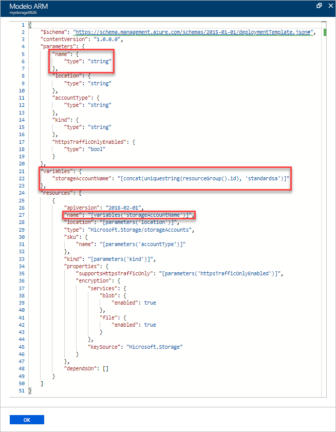
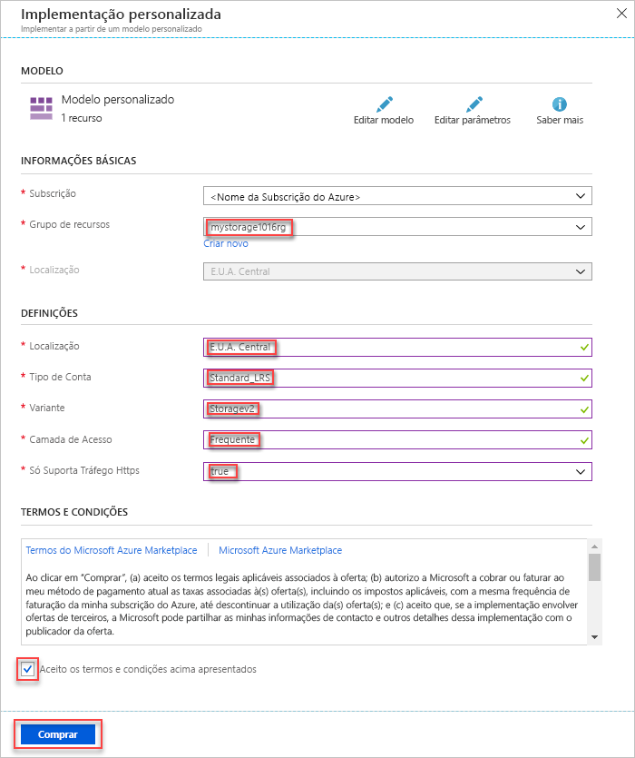
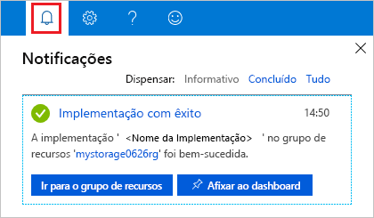
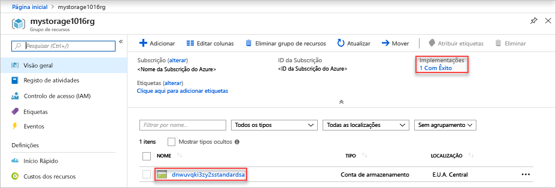

# <a name="quickstart-create-and-deploy-azure-resource-manager-templates-by-using-the-azure-portal"></a>Início Rápido: Criar e implementar um modelo do Azure Resource Manager com o portal do Azure

Saiba como gerar um modelo do Resource Manager usando o portal do Azure e o processo de edição e implantação do modelo no Portal. Os modelos do Resource Manager são ficheiros JSON que definem os recursos que precisa de implementar para a sua solução. Para compreender os conceitos associados à implementação e gestão das suas soluções do Azure, veja [Descrição geral do Azure Resource Manager](resource-group-overview.md).


Depois de concluir o tutorial, você implantará uma conta de armazenamento do Azure. O mesmo processo pode ser usado para implantar outros recursos do Azure.

Se não tiver uma subscrição do Azure, [crie uma conta gratuita](https://azure.microsoft.com/free/) antes de começar.

## <a name="generate-a-template-using-the-portal"></a>Gerar um modelo com o portal

Criar um modelo do Resource Manager a partir do zero não é uma tarefa fácil, especialmente se você for novo na implantação do Azure e não estiver familiarizado com o formato JSON. Usando o portal do Azure, você pode configurar um recurso, por exemplo, uma conta de armazenamento do Azure. Antes de implantar o recurso, você pode exportar sua configuração para um modelo do Resource Manager. Pode guardar o modelo e reutilizá-lo no futuro.

Muitos desenvolvedores de modelos experientes usam esse método para gerar modelos quando tentam implantar recursos do Azure com os quais eles não estão familiarizados. Para obter mais informações sobre como exportar modelos usando o portal, consulte [Exportar grupos de recursos para modelos](./manage-resource-groups-portal.md#export-resource-groups-to-templates). A outra maneira de localizar um modelo de trabalho é de [modelos de início rápido do Azure](https://azure.microsoft.com/resources/templates/).

1. Inicie sessão no [portal do Azure](https://portal.azure.com).
2. Selecione **Criar um recurso** > **Armazenamento** > **Conta de armazenamento – blob, ficheiro, tabela, fila**.

    
3. Introduza as seguintes informações:

    |Nome|Valor|
    |----|----|
    |**Grupo de recursos**|Selecione **criar novo**e especifique um nome de grupo de recursos de sua escolha. Na captura de ecrã, o nome do grupo de recursos é *mystorage1016rg*. O grupo de recursos é um contêiner para recursos do Azure. O grupo de recursos torna mais fácil gerenciar recursos do Azure. |
    |**Nome**|Dê um nome exclusivo à sua conta de armazenamento. O nome da conta de armazenamento deve ser exclusivo em todo o Azure e conter apenas letras minúsculas e números. O nome deve ter entre 3 e 24 caracteres. Se você receber uma mensagem de erro informando "o nome da conta de armazenamento ' mystorage1016 ' já está sendo usado", tente usar **&lt;your nome > data do &lt;Today de armazenamento em MMDD >** , por exemplo **johndolestorage1016**. Para obter mais informações, consulte [nomenclatura de regras e restrições](/azure/cloud-adoption-framework/ready/considerations/naming-and-tagging#resource-naming).|

    Pode utilizar os valores predefinidos para as restantes propriedades.

    

    > [!NOTE]
    > Alguns dos modelos exportados requerem algumas edições antes de poder implementá-los.

4. Selecione **Rever + criar**, na parte inferior do ecrã. Não selecione **criar** na próxima etapa.
5. Selecione **Transferir um modelo para automatização**, na parte inferior do ecrã. O portal mostra o modelo gerado:

    

    O painel principal mostra o modelo. É um arquivo JSON com seis elementos de nível superior-`schema`, `contentVersion`, `parameters`, `variables`, `resources` e `output`. Para obter mais informações, veja [Compreender a estrutura e a sintaxe de modelos do Azure Resource Manager](./resource-group-authoring-templates.md)

    Existem seis parâmetros definidos. Um desses parâmetros é denominado **storageAccountName**. A segunda parte realçada na captura de tela anterior mostra como fazer referência a esse parâmetro no modelo. Na próxima secção, vai editar o modelo de modo a utilizar um nome gerado para a conta de armazenamento.

    No modelo, é definido um recurso do Azure. O tipo é `Microsoft.Storage/storageAccounts`. Veja como o recurso é definido e a estrutura de definição.
6. Selecione **baixar** na parte superior da tela.
7. Abra o arquivo zip baixado e salve **Template. JSON** em seu computador. Na próxima secção, vai utilizar uma ferramenta de implementação de modelos para editar o modelo.
8. Selecione o separador **Parameter** (Parâmetro) para ver os valores que indicou para os parâmetros. Aponte-os, pois vai precisar dos mesmos na próxima secção, quando implementar o modelo.

    

    Usando o arquivo de modelo e o arquivo de parâmetros, você pode criar um recurso, neste tutorial, uma conta de armazenamento do Azure.

## <a name="edit-and-deploy-the-template"></a>Editar e implementar o modelo

O portal do Azure pode ser utilizado para fazer algumas edições básicas aos modelos. Neste início rápido, vai utilizar uma ferramenta do portal, denominada *Template Deployment*. A *implantação de modelo* é usada neste tutorial para que você possa concluir o tutorial completo usando uma interface – a Portal do Azure. Para editar um modelo mais complexo, considere o uso de [Visual Studio Code](./resource-manager-quickstart-create-templates-use-visual-studio-code.md), que fornece funcionalidades de edição mais avançadas.

> [!IMPORTANT]
> A implantação de modelo fornece uma interface para testar modelos simples. Não é recomendável usar esse recurso em produção. Em vez disso, armazene seus modelos em uma conta de armazenamento do Azure ou um repositório de código-fonte como o GitHub.

O Azure exige que cada serviço do Azure tenha um nome exclusivo. A implantação poderá falhar se você inseriu um nome de conta de armazenamento que já existe. Para evitar esse problema, modifique o modelo para usar uma chamada de função de modelo `uniquestring()` para gerar um nome de conta de armazenamento exclusivo.

1. No portal do Azure, selecione **Criar um recurso**.
2. Em **Pesquisar no Marketplace**, escreva **implementação de modelo** e prima **ENTER**.
3. Selecione **Implementação de modelo**.

    
4. Selecione **Criar**.
5. Selecione **Crie o seu próprio modelo no editor**.
6. Selecione **Carregar ficheiro** e siga as instruções para carregar template.json, que transferiu na última secção.
7. Faça as três alterações a seguir no modelo:

    

   - Remova o parâmetro **storageAccountName** conforme mostrado na captura de tela anterior.
   - Adicione uma variável chamada **storageAccountName** , conforme mostrado na captura de tela anterior:

       ```json
       "storageAccountName": "[concat(uniqueString(subscription().subscriptionId), 'storage')]"
       ```

       Duas funções de modelo são usadas aqui: `concat()` e `uniqueString()`.
   - Atualize o elemento name do recurso **Microsoft.Storage/storageAccounts** para utilizar a variável recém-definida em vez do parâmetro:

       ```json
       "name": "[variables('storageAccountName')]",
       ```

     O modelo final deve ter o seguinte aspeto:

     ```json
     {
       "$schema": "https://schema.management.azure.com/schemas/2015-01-01/deploymentTemplate.json#",
       "contentVersion": "1.0.0.0",
       "parameters": {
           "location": {
               "type": "string"
           },
           "accountType": {
               "type": "string"
           },
           "kind": {
               "type": "string"
           },
           "accessTier": {
               "type": "string"
           },
           "supportsHttpsTrafficOnly": {
               "type": "bool"
           }
       },
       "variables": {
           "storageAccountName": "[concat(uniqueString(subscription().subscriptionId), 'storage')]"
       },
       "resources": [
           {
               "name": "[variables('storageAccountName')]",
               "type": "Microsoft.Storage/storageAccounts",
               "apiVersion": "2018-07-01",
               "location": "[parameters('location')]",
               "properties": {
                   "accessTier": "[parameters('accessTier')]",
                   "supportsHttpsTrafficOnly": "[parameters('supportsHttpsTrafficOnly')]"
               },
               "dependsOn": [],
               "sku": {
                   "name": "[parameters('accountType')]"
               },
               "kind": "[parameters('kind')]"
           }
       ],
       "outputs": {}
     }
     ```
8. Selecione **Guardar**.
9. Introduza os seguintes valores:

    |Nome|Valor|
    |----|----|
    |**Grupo de recursos**|Selecione o nome do grupo de recursos que você criou na última seção. |
    |**Localização**|Selecione um local para a conta de armazenamento. Por exemplo, **EUA Central**. |
    |**Tipo de conta**|Insira **Standard_LRS** para este guia de início rápido. |
    |**Quase**|Insira **StorageV2** para este guia de início rápido. |
    |**Camada de acesso**|Insira a **quente** para este guia de início rápido. |
    |**Somente tráfego https habilitado**| Selecione **verdadeiro** para este início rápido. |
    |**Eu concordo com os termos e condições declarados acima**|Não|

    Segue-se uma captura de ecrã de uma implementação de exemplo:

    

10. Selecione **Comprar**.
11. Selecione o ícone de campainha (notificações) na parte superior do ecrã para ver o estado de implementação. Você deverá ver a **implantação em andamento**. Aguarde até que a implementação esteja concluída.

    

12. Selecione **Ir para o grupo de recursos** no painel de notificação. Deverá ver um ecrã semelhante a:

    

    Pode ver que o estado de implementação foi bem-sucedido e que não existe apenas uma conta de armazenamento no grupo de recursos. O nome da conta de armazenamento é uma cadeia de carateres exclusiva gerada pelo modelo. Para saber mais sobre como utilizar contas de armazenamento do Azure, veja [Início Rápido: Carregar, transferir e listar blobs através do portal do Azure](../storage/blobs/storage-quickstart-blobs-portal.md).

## <a name="clean-up-resources"></a>Limpar recursos

Quando os recursos do Azure já não forem necessários, limpe os recursos implementados ao eliminar o grupo de recursos.

1. No portal do Azure, selecione **Grupo de recursos** no menu à esquerda.
2. Introduza o nome do grupo de recursos no campo **Filtrar por nome**.
3. Selecione o nome do grupo de recursos.  Deverá ver a conta de armazenamento no grupo de recursos.
4. Selecione **Eliminar grupo de recursos** no menu superior.

## <a name="next-steps"></a>Passos seguintes

Neste tutorial, aprendeu a gerar um modelo a partir do portal do Azure e a implementar o modelo através do portal. O modelo utilizado neste Início Rápido é um modelo simples com um recurso do Azure. Quando o modelo é complexo, é mais fácil utilizar o Visual Studio Code ou o Visual Studio para desenvolver o modelo. Para saber mais sobre o desenvolvimento de modelos, consulte nossa nova série de tutoriais iniciantes:

> [!div class="nextstepaction"]
> [Tutoriais para iniciantes](./template-tutorial-create-first-template.md)