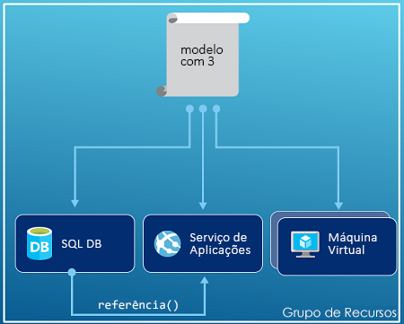
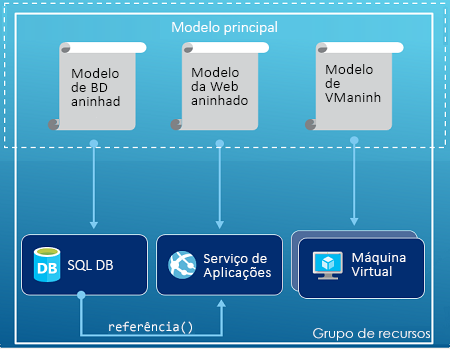
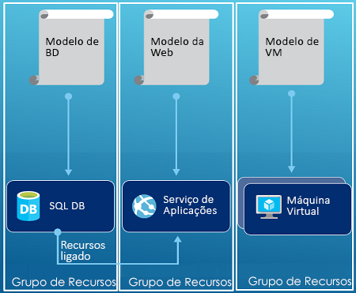

# <a name="azure-resource-manager-templates"></a>Modelos do Azure Resource Manager

Com Azure Resource Manager, você pode criar modelos que definem o que deseja implantar no Azure. O modelo é um arquivo JavaScript Object Notation (JSON) que contém a infraestrutura e a configuração da sua solução do Azure. Ao utilizar um modelo, pode implementar repetidamente a solução durante o ciclo de vida da mesma e ter a confiança de que os recursos são implementados num estado consistente.

O modelo usa a sintaxe declarativa, que permite que você declare o que pretende implantar sem precisar escrever a sequência de comandos de programação para criá-lo. No modelo, você especifica os recursos a serem implantados e as propriedades desses recursos.

## <a name="benefits-of-resource-manager-templates"></a>Benefícios dos modelos do Resource Manager

Os modelos do Resource Manager fornecem vários benefícios:

* Pode implementar, gerir e monitorizar todos os recursos da sua solução como um grupo, em vez de os processar individualmente.

* Pode implementar repetidamente a solução durante todo o ciclo de vida de desenvolvimento e ter a confiança de que os recursos são implementados num estado consistente.

* Pode gerir a sua infraestrutura através de modelos declarativos em vez de scripts.

* Pode definir as dependências entre os recursos, de modo a que sejam implementados na ordem correta.

As seguintes sugestões ajudam a tirar o máximo partido do Resource Manager ao trabalhar com as suas soluções.

* Defina e implemente a infraestrutura através da sintaxe declarativa nos modelos do Resource Manager, em vez de utilizar comandos imperativos.

* Defina todos os passos de implementação e configuração no modelo. A configuração da sua solução não deverá ter quaisquer passos manuais.

* Execute comandos imperativo para gerir os recursos, tal como para iniciar ou parar uma aplicação ou uma máquina.

* Siga [as práticas recomendadas de Azure Resource Manager modelo](template-best-practices.md).

## <a name="template-deployment-process"></a>Processo de Implantação de modelo

Quando você implanta um modelo, o Resource Manager analisa o modelo e converte sua sintaxe em operações da API REST. Ele envia essas operações para os provedores de recursos apropriados. Por exemplo, quando o Resource Manager recebe um modelo com a seguinte definição de recursos:

```json
"resources": [
  {
    "apiVersion": "2016-01-01",
    "type": "Microsoft.Storage/storageAccounts",
    "name": "mystorageaccount",
    "location": "westus",
    "sku": {
      "name": "Standard_LRS"
    },
    "kind": "Storage",
    "properties": {
    }
  }
]
```

Converte a definição para a operação de API REST seguinte, a qual é enviada para o fornecedor de recursos Microsoft.Storage:

```HTTP
PUT
https://management.azure.com/subscriptions/{subscriptionId}/resourceGroups/{resourceGroupName}/providers/Microsoft.Storage/storageAccounts/mystorageaccount?api-version=2016-01-01
REQUEST BODY
{
  "location": "westus",
  "properties": {
  }
  "sku": {
    "name": "Standard_LRS"
  },
  "kind": "Storage"
}
```

## <a name="template-structure"></a>Estrutura do modelo

A forma como define modelos e grupos de recursos é inteiramente da sua responsabilidade, bem como pretende gerir a sua solução. Por exemplo, pode implementar a sua aplicação de três camadas através de um único modelo para um grupo de recursos.



No entanto, não precisa de definir toda a infraestrutura num único modelo. Muitas vezes, faz sentido dividir os requisitos de implementação num conjunto de modelos direcionados e com uma finalidade específica. Pode reutilizar facilmente estes modelos para soluções diferentes. Para implementar uma solução específica, cria um modelo global que liga todos os modelos necessários. A imagem seguinte mostra como implementar uma solução de três camadas através de um modelo principal que inclui três modelos aninhados.



Se imaginar as suas camadas com ciclos de vida separados, pode implementar as três camadas em grupos de recursos separados. Repare que os recursos ainda podem ser ligados a recursos noutros grupos de recursos.



Para obter mais informações sobre modelos aninhados, veja [Utilizar modelos ligados com o Azure Resource Manager](resource-group-linked-templates.md).

O Azure Resource Manager analisa as dependências para garantir que os recursos são criados pela ordem correta. Se um recurso depende de um valor de outro recurso (como uma máquina virtual necessita de uma conta de armazenamento para discos), pode definir uma dependência. Para obter mais informações, consulte [Definir dependências nos modelos do Azure Resource Manager](resource-group-define-dependencies.md).

Também pode utilizar o modelo para atualizar a infraestrutura. Por exemplo, pode adicionar um recurso à solução e adicionar regras de configuração para os recursos que já estão implementados. Se o modelo definir um recurso que já existe, o Gerenciador de recursos atualizará o recurso existente em vez de criar um novo.

O Resource Manager oferece extensões para cenários em que precisa de operações adicionais, como a instalação de software específico que não está incluído na configuração. Se já estiver a utilizar um serviço de gestão de configuração, como o DSC, Chef ou Puppet, pode continuar a trabalhar com esse serviço ao utilizar extensões. Para obter informações sobre as extensões de máquina virtual, consulte [About virtual machine extensions and features (Sobre extensões e funcionalidades da máquina virtual)](../virtual-machines/windows/extensions-features.md?toc=%2fazure%2fvirtual-machines%2fwindows%2ftoc.json).

Quando cria uma solução a partir do portal, esta inclui automaticamente um modelo de implementação. Não precisa de criar o modelo a partir do zero porque pode começar com o modelo para a sua solução e personalizá-lo de modo a satisfazer as suas necessidades específicas. Para obter um exemplo, [consulte início rápido: Crie e implante modelos de Azure Resource Manager usando o portal do Azure](./resource-manager-quickstart-create-templates-use-the-portal.md). Também pode obter um modelo para um grupo de recursos existente ao exportar o estado atual do grupo de recursos ou ao visualizar o modelo utilizado para uma implementação específica. Visualizar o [modelo exportado](./manage-resource-groups-portal.md#export-resource-groups-to-templates) é uma forma útil de saber mais sobre a sintaxe do modelo.

Por último, o modelo torna-se parte do código fonte da sua aplicação. Pode verificá-lo no repositório de código fonte e atualizá-lo à medida que a aplicação evolui. Pode editar o modelo através do Visual Studio.

## <a name="next-steps"></a>Passos seguintes

Para obter mais informações sobre arquivos de modelo, consulte [entender a estrutura e a sintaxe de modelos de Azure Resource Manager](resource-group-authoring-templates.md).

Após definir o seu modelo, está pronto para implementar os recursos para o Azure. Para implantar os recursos, consulte:

* [Implementar recursos com modelos do Resource Manager e o Azure PowerShell](resource-group-template-deploy.md)
* [Implementar recursos com modelos do Resource Manager e a CLI do Azure](resource-group-template-deploy-cli.md)
* [Implementar recursos com modelos do Resource Manager e o Portal do Azure](resource-group-template-deploy-portal.md)
* [Implementar recursos com modelos do Resource Manager e a API REST do Resource Manager](resource-group-template-deploy-rest.md)

