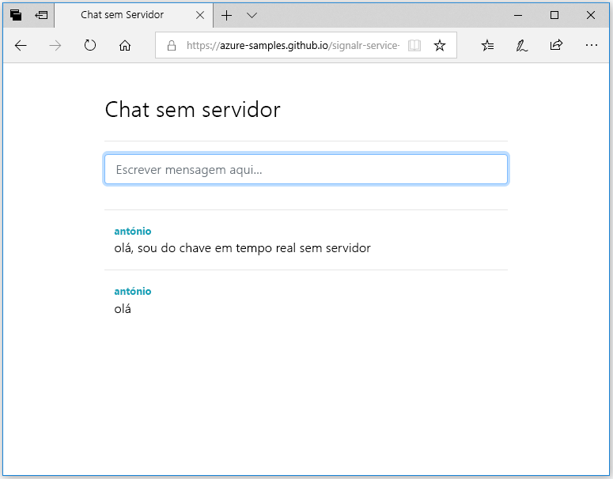

## Execute a aplicação Web

1. Há uma aplicação Web de página única de exemplo alojada no GitHub para sua conveniência. Abra o browser para [https://azure-samples.github.io/signalr-service-quickstart-serverless-chat/demo/chat-v2/](https://azure-samples.github.io/signalr-service-quickstart-serverless-chat/demo/chat-v2/).

    > [!NOTE]
    > A origem do ficheiro HTML está localizada em [/docs/demo/chat-v2/index.html](https://github.com/Azure-Samples/signalr-service-quickstart-serverless-chat/blob/master/docs/demo/chat-v2/index.html).

1. Quando lhe for pedido para o URL base da aplicação de função, introduza `http://localhost:7071`.

1. Introduza um nome de utilizador quando lhe for pedido.

1. A aplicação Web chama a função *GetSignalRInfo* na aplicação de funções para obter as informações de ligação para ligar ao Azure SignalR Service. Quando a ligação estiver concluída, é apresentada a caixa de entrada de mensagens do chat.

1. Escreva uma mensagem e prima enter. A aplicação envia a mensagem para a função *SendMessage* na aplicação de Funções do Azure que, em seguida, utiliza o enlace de saída do SignalR para transmitir a mensagem a todos os clientes ligados. Se tudo estiver a funcionar corretamente, deve aparecer a mensagem na aplicação.

    

1. Abra outra instância da aplicação Web noutra janela do browser. Verá que todas as mensagens enviadas irão aparecer em todas as instâncias da aplicação.

> [!IMPORTANT]
> Uma vez que a página HTML é fornecida através de HTTPS, mas o tempo de execução local do funções do Azure está a utilizar HTTP por predefinição, o seu browser (por exemplo, o Firefox) pode impor uma política de conteúdo misto bloquear os pedidos da página da web para as suas funções. Para resolver este problema, utilize um browser que não tenha essa restrição ou iniciar um servidor HTTP local, como [servidor http](https://www.npmjs.com/package/http-server) no */docs/demo/chat-v2* diretório. Certifique-se de que a origem é adicionada para o `CORS` definição *Settings*.