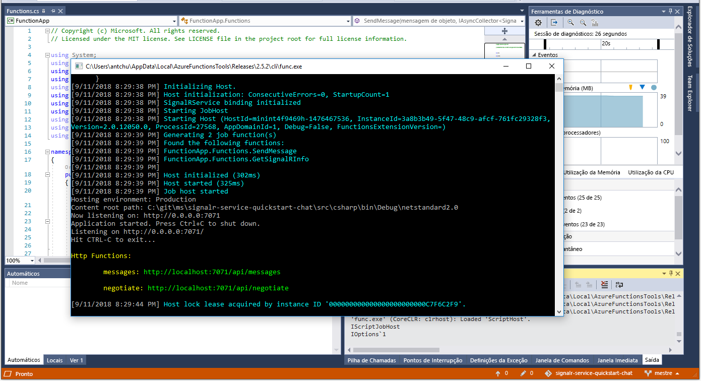

# <a name="quickstart-create-a-chat-room-with-azure-functions-and-signalr-service-using-c"></a>Quickstart: Criar uma sala de chat com funções Azure e serviço SignalR usando C\#

O Serviço Azure SignalR permite-lhe adicionar facilmente funcionalidades em tempo real à sua aplicação. As Funções do Azure são uma plataforma sem servidor que lhe permite executar código sem ter de gerir qualquer infraestrutura. Neste início rápido, saiba como utilizar o Serviço SignalR e as Funções para criar uma aplicação de chat em tempo real sem servidor.

## <a name="prerequisites"></a>Pré-requisitos

Se ainda não tiver o Visual Studio 2019 instalado, **free** pode baixar e utilizar a [Edição Comunitária visual 2019 gratuita do Visual Studio 2019.](https://www.visualstudio.com/downloads) Confirme que ativa o **desenvolvimento do Azure** durante a configuração do Visual Studio.

Pode também executar este tutorial na linha de comando (macOS, Windows ou Linux) utilizando as [Ferramentas Centrais de Funções Azure (v2),](https://github.com/Azure/azure-functions-core-tools#installing)o [.NET Core SDK](https://dotnet.microsoft.com/download)e o seu editor de código favorito.

Se não tiver uma subscrição do Azure, [crie uma gratuitamente](https://azure.microsoft.com/free/dotnet) antes de começar.

Tendo problemas? Experimente o [guia de resolução de problemas](signalr-howto-troubleshoot-guide.md) ou [avise-nos.](https://aka.ms/asrs/qscsharp)

## <a name="log-in-to-azure"></a>Iniciar sessão no Azure

Inicie sessão no portal do Azure em <https://portal.azure.com/> com a sua conta do Azure.

Tendo problemas? Experimente o [guia de resolução de problemas](signalr-howto-troubleshoot-guide.md) ou [avise-nos.](https://aka.ms/asrs/qscsharp)

[!INCLUDE [Create instance](includes/signalr-quickstart-create-instance.md)]

Tendo problemas? Experimente o [guia de resolução de problemas](signalr-howto-troubleshoot-guide.md) ou [avise-nos.](https://aka.ms/asrs/qscsharp)

[!INCLUDE [Clone application](includes/signalr-quickstart-clone-application.md)]

Tendo problemas? Experimente o [guia de resolução de problemas](signalr-howto-troubleshoot-guide.md) ou [avise-nos.](https://aka.ms/asrs/qscsharp)

## <a name="configure-and-run-the-azure-function-app"></a>Configurar e executar a aplicação Funções do Azure

1. Inicie o Visual Studio (ou outro editor de código) e abra a solução na pasta *src/chat/csharp* do repositório clonado.

1. No browser em que abriu o portal do Azure, certifique-se de que a instância Serviço SignalR implementada anteriormente foi totalmente criada com êxito ao pesquisar o nome na caixa de pesquisa na parte superior do portal. Selecione a instância para abri-la.

    

1. Selecione **Chaves** para ver as cadeias de ligação para a instância do Serviço SignalR.

1. Selecione e copie a cadeia de ligação principal.

1. De volta ao Estúdio Visual - **Solution Explorer,** mude o nome *local.settings.sample.js* para *local.settings.jsem*.

1. Em *local.settings.json*, cole a cadeia de ligação no valor da definição **AzureSignalRConnectionString**. Guarde o ficheiro.

1. Abra *Functions.cs*. Existem duas funções acionadas por HTTP nesta aplicação de funções:

    - **GetSignalRInfo** - Utiliza a `SignalRConnectionInfo` ligação de entrada para gerar e devolver informações de ligação válidas.
    - **SendMessage** - Recebe uma mensagem de chat no corpo do pedido e utiliza o enlace de saída *SignalR* para difundir a mensagem a todas as aplicações cliente ligadas.

1. Utilize uma das seguintes opções para iniciar a aplicação Azure Function localmente.

    - **Estúdio Visual**: No menu *Debug,* selecione *Comece a depurar* para executar a aplicação.

        

    - **Linha de** comando : Execute o seguinte comando para iniciar o anfitrião da função.

        ```bash
        func start
        ```
Tendo problemas? Experimente o [guia de resolução de problemas](signalr-howto-troubleshoot-guide.md) ou [avise-nos.](https://aka.ms/asrs/qscsharp)

[!INCLUDE [Run web application](includes/signalr-quickstart-run-web-application.md)]

Tendo problemas? Experimente o [guia de resolução de problemas](signalr-howto-troubleshoot-guide.md) ou [avise-nos.](https://aka.ms/asrs/qscsharp)

[!INCLUDE [Cleanup](includes/signalr-quickstart-cleanup.md)]

Tendo problemas? Experimente o [guia de resolução de problemas](signalr-howto-troubleshoot-guide.md) ou [avise-nos](https://aka.ms/asrs/qscsharp)

## <a name="next-steps"></a>Passos seguintes

Neste quickstart, construíste e executaste uma aplicação sem servidor em tempo real no Visual Studio. Em seguida, saiba mais sobre como desenvolver e implementar as Funções do Azure com o Visual Studio.

> [!div class="nextstepaction"]
> [Desenvolver as Funções do Azure com o Visual Studio](../azure-functions/functions-develop-vs.md)

