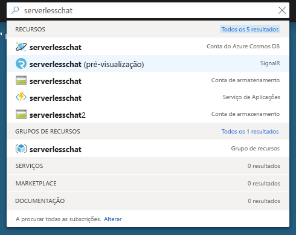

# <a name="quickstart-create-a-chat-room-with-azure-functions-and-signalr-service-using-c"></a>Quickstart: Criar uma sala de chat com funções Azure e serviço de sinalização usando C\#

O Serviço Azure SignalR permite-lhe adicionar facilmente funcionalidades em tempo real à sua aplicação. As Funções do Azure são uma plataforma sem servidor que lhe permite executar código sem ter de gerir qualquer infraestrutura. Neste início rápido, saiba como utilizar o Serviço SignalR e as Funções para criar uma aplicação de chat em tempo real sem servidor.

## <a name="prerequisites"></a>Pré-requisitos

Se ainda não tiver o Visual Studio 2019 instalado, pode descarregar e utilizar o [Visual Studio 2019 Community Edition](https://www.visualstudio.com/downloads/) **gratuito.** Confirme que ativa o **desenvolvimento do Azure** durante a configuração do Visual Studio.

Também pode executar este tutorial na linha de comando (macOS, Windows ou Linux) utilizando as [Ferramentas Core funções Azure (v2)](https://github.com/Azure/azure-functions-core-tools#installing), o [.NET Core SDK,](https://dotnet.microsoft.com/download)e o seu editor de código favorito.

[!INCLUDE [quickstarts-free-trial-note](../../includes/quickstarts-free-trial-note.md)]

## <a name="log-in-to-azure"></a>Iniciar sessão no Azure

Inicie sessão no portal do Azure em <https://portal.azure.com/> com a sua conta do Azure.

[!INCLUDE [Create instance](includes/signalr-quickstart-create-instance.md)]

[!INCLUDE [Clone application](includes/signalr-quickstart-clone-application.md)]

## <a name="configure-and-run-the-azure-function-app"></a>Configurar e executar a aplicação Funções do Azure

1. Inicie o Visual Studio (ou outro editor de código) e abra a solução na pasta *sRC/chat/csharp* do repositório clonado.

1. No browser em que abriu o portal do Azure, certifique-se de que a instância Serviço SignalR implementada anteriormente foi totalmente criada com êxito ao pesquisar o nome na caixa de pesquisa na parte superior do portal. Selecione a instância para abri-la.

    

1. Selecione **Chaves** para ver as cadeias de ligação para a instância do Serviço SignalR.

1. Selecione e copie a cadeia de ligação principal.

1. Novamente no Visual Studio, no Explorador de Soluções, renomeie *local.settings.sample.json* para *local.settings.json*.

1. Em **local.settings.json**, cole a cadeia de ligação no valor da definição **AzureSignalRConnectionString**. Guarde o ficheiro.

1. Abra **Functions.cs**. Existem duas funções acionadas por HTTP nesta aplicação de funções:

    - **GetSignalRInfo** - Utiliza o enlace de entrada *SignalRConnectionInfo* para gerar e devolver informações de ligação válidas.
    - **SendMessage** - Recebe uma mensagem de chat no corpo do pedido e utiliza o enlace de saída *SignalR* para difundir a mensagem a todas as aplicações cliente ligadas.

1. Utilize uma das seguintes opções para iniciar a aplicação Azure Function localmente.

    - **Estúdio Visual**: No menu *Debug,* selecione *Iniciar a depuração* para executar a aplicação.

        

    - **Linha de comando**: Execute o seguinte comando para iniciar o hospedeiro de funções.

        ```bash
        func start
        ```

[!INCLUDE [Run web application](includes/signalr-quickstart-run-web-application.md)]

[!INCLUDE [Cleanup](includes/signalr-quickstart-cleanup.md)]

## <a name="next-steps"></a>Passos seguintes

Neste arranque rápido, construíste e executaste uma aplicação sem servidorem em tempo real no Estúdio Visual. Em seguida, saiba mais sobre como desenvolver e implementar as Funções do Azure com o Visual Studio.

> [!div class="nextstepaction"]
> [Desenvolver as Funções do Azure com o Visual Studio](../azure-functions/functions-develop-vs.md)