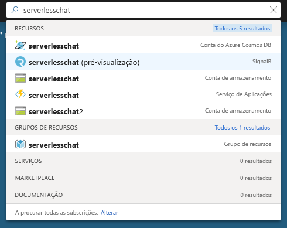
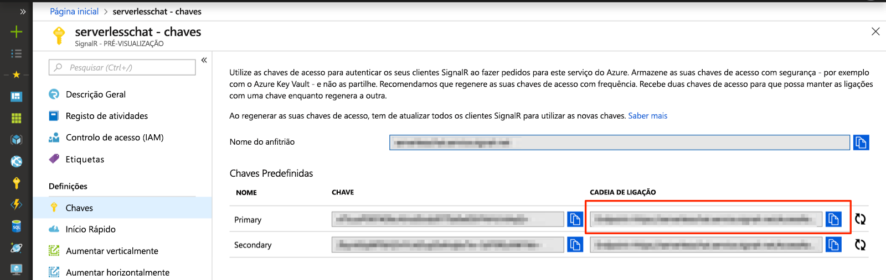

# <a name="quickstart-create-a-chat-room-with-azure-functions-and-signalr-service-using-java"></a>Início rápido: Criar uma sala de bate-papo com as funções do Azure e o serviço SignalR com Java

O Serviço Azure SignalR permite-lhe adicionar facilmente funcionalidades em tempo real à sua aplicação. As Funções do Azure são uma plataforma sem servidor que lhe permite executar código sem ter de gerir qualquer infraestrutura. Neste início rápido, saiba como utilizar o Serviço SignalR e as Funções para criar uma aplicação de chat em tempo real sem servidor.

## <a name="prerequisites"></a>Pré-requisitos

Este início rápido pode ser executado no macOS, Windows ou Linux.

Certifique-se de que tem um editor de código como o [Visual Studio Code](https://code.visualstudio.com/) instalado.

Instale o [Azure Functions Core Tools (v2)](https://github.com/Azure/azure-functions-core-tools#installing) para executar localmente aplicações das Funções do Azure.

> [!NOTE]
> Para utilizar os enlaces de serviço SignalR em Java, certifique-se de que está a utilizar a versão 2.4.419 ou superior das ferramentas de núcleo de funções do Azure (versão de anfitrião 2.0.12332).

Para instalar as extensões, o Azure Functions Core Tools necessita que o [.NET Core SDK](https://www.microsoft.com/net/download) esteja instalado. No entanto, não precisa de estar familiarizado com o .NET para criar aplicações das Funções do Azure com JavaScript.

Para desenvolver uma aplicação de funções com o Java, tem de ter o seguinte instalado:

* [Java Development Kit](https://www.azul.com/downloads/zulu/), versão 8.
* [Apache Maven](https://maven.apache.org), versão 3.0 ou superior.

[!INCLUDE [quickstarts-free-trial-note](../../includes/quickstarts-free-trial-note.md)]

## <a name="log-in-to-azure"></a>Iniciar sessão no Azure

Inicie sessão no portal do Azure em <https://portal.azure.com/> com a sua conta do Azure.

[!INCLUDE [Create instance](includes/signalr-quickstart-create-instance.md)]

[!INCLUDE [Clone application](includes/signalr-quickstart-clone-application.md)]

## <a name="configure-and-run-the-azure-function-app"></a>Configurar e executar a aplicação Funções do Azure

1. No browser em que abriu o portal do Azure, certifique-se de que a instância Serviço SignalR implementada anteriormente foi totalmente criada com êxito ao pesquisar o nome na caixa de pesquisa na parte superior do portal. Selecione a instância para abri-la.

    

1. Selecione **Chaves** para ver as cadeias de ligação para a instância do Serviço SignalR.

1. Selecione e copie a cadeia de ligação principal.

    

1. No seu editor de código, abra a *bate-papo/src/java* pasta no repositório clonado.

1. Mude o nome de *local.settings.sample.json* para *local.settings.json*.

1. Em **local.settings.json**, cole a cadeia de ligação no valor da definição **AzureSignalRConnectionString**. Guarde o ficheiro.

1. O ficheiro principal que contém as funções estão na *src/main/java/com/function/Functions.java*:

    - **negociar** - Utiliza o enlace de entrada *SignalRConnectionInfo* para gerar e devolver informações de ligação válidas.
    - **SendMessage** - recebe uma mensagem de chat no corpo do pedido e utiliza o *SignalR* de saída de enlace transmitir a mensagem a todos ligados aplicações cliente.

1. No terminal, certifique-se de que se encontra o *bate-papo/src/java* pasta. Crie a aplicação de função.

    ```bash
    mvn clean package
    ```

1. Execute a aplicação de funções localmente.

    ```bash
    mvn azure-functions:run
    ```

[!INCLUDE [Run web application](includes/signalr-quickstart-run-web-application.md)]

[!INCLUDE [Cleanup](includes/signalr-quickstart-cleanup.md)]

## <a name="next-steps"></a>Passos Seguintes

Neste início rápido, criou e executou uma aplicação sem servidor em tempo real com o Maven. Em seguida, saiba mais sobre como criar as funções do Java do Azure a partir do zero.

> [!div class="nextstepaction"]
> [Criar a primeira função com o Java e Maven](../azure-functions/functions-create-first-java-maven.md)