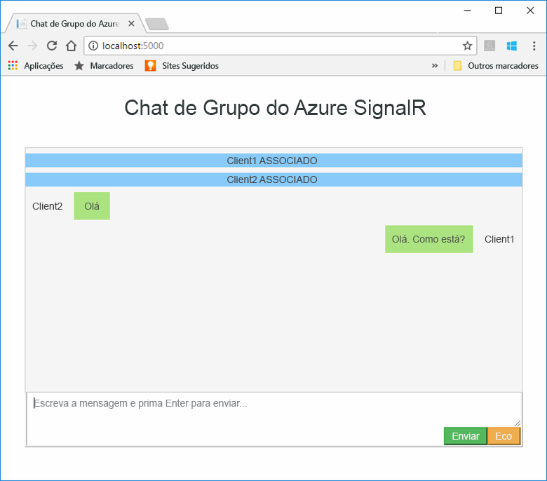
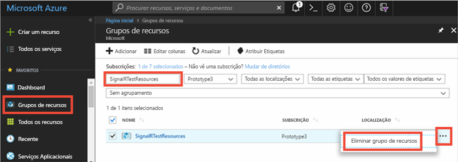

# <a name="quickstart-create-a-chat-room-by-using-signalr-service"></a>Quickstart: Criar uma sala de chat utilizando o Serviço SignalR

O Serviço Azure SignalR é um serviço do Azure que ajuda os programadores a facilmente criar aplicações web com funcionalidades em tempo real. Este serviço foi originalmente baseado no [SignalR para ASP.NET Core 2.1](/aspnet/core/signalr/introduction?preserve-view=true&view=aspnetcore-2.1), mas agora suporta versões posteriores.

Este artigo mostra-lhe como começar a utilizar o Azure SignalR Service. Neste arranque rápido, irá criar uma aplicação de chat utilizando uma aplicação web core MVC ASP.NET. Esta aplicação irá fazer uma ligação ao seu recurso do Azure SignalR Service para ativar as atualizações de conteúdos em tempo real. Você irá hospedar a aplicação web localmente e conectar-se com vários clientes de navegador. Cada cliente poderá enviar atualizações de conteúdos para todos os outros clientes. 

Pode utilizar qualquer editor de código para concluir os passos deste início rápido. Uma opção é [o Visual Studio Code](https://code.visualstudio.com/), que está disponível nas plataformas Windows, macOS e Linux.

O código deste tutorial está disponível para transferência no [repositório do GitHub AzureSignalR-samples](https://github.com/aspnet/AzureSignalR-samples/tree/master/samples/ChatRoom). Além disso, pode criar os recursos Azure utilizados neste arranque rápido seguindo o [script Criar um script de Serviço SignalR](scripts/signalr-cli-create-service.md).

[!INCLUDE [quickstarts-free-trial-note](../../includes/quickstarts-free-trial-note-dotnet.md)]

## <a name="prerequisites"></a>Pré-requisitos

* Instale o [.NET Core SDK](https://dotnet.microsoft.com/download).
* Faça o download ou clone do repositório GitHub [da amostra AzureSignalR.](https://github.com/aspnet/AzureSignalR-samples) 

Tendo problemas? Experimente o [guia de resolução de problemas](signalr-howto-troubleshoot-guide.md) ou [avise-nos.](https://aka.ms/asrs/qsnetcore)

## <a name="create-an-azure-signalr-resource"></a>Criar um recurso do Azure SignalR

[!INCLUDE [azure-signalr-create](../../includes/signalr-create.md)]

Tendo problemas? Experimente o [guia de resolução de problemas](signalr-howto-troubleshoot-guide.md) ou [avise-nos.](https://aka.ms/asrs/qsnetcore)

## <a name="create-an-aspnet-core-web-app"></a>Criar uma aplicação Web ASP.NET Core

Nesta secção, utiliza-se a [interface de linha de comando .NET Core (CLI)](/dotnet/core/tools/) para criar um projeto de aplicação web Core MVC ASP.NET. A vantagem de utilizar o .NET Core CLI sobre o Visual Studio é que está disponível nas plataformas Windows, macOS e Linux. 

1. Crie uma pasta para o seu projeto. Este arranque rápido utiliza a pasta *E:\Testing\chattest.*

2. Na nova pasta, executar o seguinte comando para criar o projeto:

    ```dotnetcli
    dotnet new mvc
    ```

Tendo problemas? Experimente o [guia de resolução de problemas](signalr-howto-troubleshoot-guide.md) ou [avise-nos.](https://aka.ms/asrs/qsnetcore)

## <a name="add-secret-manager-to-the-project"></a>Adicionar o Secret Manager ao projeto

Nesta secção, irá adicionar a [ferramenta Secret Manager](/aspnet/core/security/app-secrets) ao seu projeto. A ferramenta Secret Manager armazena dados sensíveis para trabalhos de desenvolvimento fora da sua árvore do projeto. Esta abordagem ajuda a prevenir a partilha acidental de segredos de aplicações em código fonte.

1. Abra o ficheiro *.csproj*. Adicione um elemento `DotNetCliToolReference` para incluir *Microsoft.Extensions.SecretManager.Tools*. Adicione também um `UserSecretsId` elemento como mostrado no seguinte código para *chattest.csproj*, e guarde o ficheiro.

    ```xml
    <Project Sdk="Microsoft.NET.Sdk.Web">

    <PropertyGroup>
        <TargetFramework>netcoreapp3.1</TargetFramework>
        <UserSecretsId>SignalRChatRoomEx</UserSecretsId>
    </PropertyGroup>

    <ItemGroup>
        <DotNetCliToolReference Include="Microsoft.VisualStudio.Web.CodeGeneration.Tools" Version="2.0.4" />
        <DotNetCliToolReference Include="Microsoft.Extensions.SecretManager.Tools" Version="2.0.2" />
    </ItemGroup>

    </Project>
    ```

Tendo problemas? Experimente o [guia de resolução de problemas](signalr-howto-troubleshoot-guide.md) ou [avise-nos.](https://aka.ms/asrs/qsnetcore)

## <a name="add-azure-signalr-to-the-web-app"></a>Adicionar o Azure SignalR à aplicação Web

1. Adicione uma referência ao `Microsoft.Azure.SignalR` pacote NuGet executando o seguinte comando:

    ```dotnetcli
    dotnet add package Microsoft.Azure.SignalR
    ```

2. Executar o seguinte comando para restaurar pacotes para o seu projeto:

    ```dotnetcli
    dotnet restore
    ```

3. Adicione um segredo denominado *Azure:SignalR:ConnectionString* ao Secret Manager. 

    Este segredo irá conter a cadeia de ligação para aceder ao seu recurso do SignalR Service. *Azure:SignalR:ConnectionString* é a chave de configuração padrão que o SignalR procura para estabelecer uma ligação. Substitua o valor no seguinte comando com a cadeia de ligação para o seu recurso SignalR Service.

    Tem de executar este comando no mesmo diretório que o ficheiro *.csproj.*

    ```dotnetcli
    dotnet user-secrets set Azure:SignalR:ConnectionString "<Your connection string>"
    ```

    O Secret Manager será usado apenas para testar a aplicação web enquanto estiver hospedado localmente. Num tutorial posterior, irá implementar a aplicação de chat web para o Azure. Depois de a aplicação web ser implantada no Azure, utilizará uma definição de aplicação em vez de armazenar a cadeia de ligação com o Secret Manager.

    Este segredo é acedido com a API de Configuração. Um cólon (:) funciona no nome de configuração com a API de configuração em todas as plataformas suportadas. Ver [Configuração por ambiente](/dotnet/core/extensions/configuration-providers#environment-variable-configuration-provider).


4. *Abrir startup.cs* e atualizar o método para utilizar o `ConfigureServices` Serviço Azure SignalR, ligando para os e `AddSignalR()` `AddAzureSignalR()` métodos:

    ```csharp
    public void ConfigureServices(IServiceCollection services)
    {
        services.AddSignalR()
                .AddAzureSignalR();
    }
    ```

    Ao não passar um parâmetro para `AddAzureSignalR()` , este código utiliza a chave de configuração predefinida para a cadeia de ligação de recursos SignalR Service. A chave de configuração predefinida é *Azure:SignalR:ConnectionString*.

5. No *Arranque.cs*, atualize o `Configure` método substituindo-o pelo seguinte código.

    ```csharp
    public void Configure(IApplicationBuilder app, IWebHostEnvironment env)
    {
        app.UseRouting();
        app.UseFileServer();
        app.UseEndpoints(endpoints =>
        {
            endpoints.MapHub<ChatHub>("/chat");
        });
    }
    ```

### <a name="add-a-hub-class"></a>Adicionar a classe Hub

No SignalR, um hub é um componente central que expõe um conjunto de métodos que podem ser chamados do cliente. Nesta secção, vai definir uma classe hub com dois métodos:

* `Broadcast`: este método transmite uma mensagem para todos os clientes.
* `Echo`: este método envia uma mensagem novamente para o autor da chamada.

Ambos os métodos utilizam a `Clients` interface que o ASP.NET Core SignalR SDK fornece. Esta interface dá-lhe acesso a todos os clientes conectados, para que possa empurrar o conteúdo para os seus clientes.

1. No diretório do projeto, adicione uma pasta nova designada *Hub*. Adicione um novo ficheiro de código hub chamado *ChatHub.cs* à nova pasta.

2. Adicione o seguinte código ao *ChatHub.cs* para definir a sua classe de hub e guardar o ficheiro.

    Atualize o espaço de nomes para esta classe se utilizar um nome de projeto que difere do *SignalR.Mvc*.

    ```csharp
    using Microsoft.AspNetCore.SignalR;
    using System.Threading.Tasks;
    
    namespace SignalR.Mvc
    {
        public class ChatHub : Hub
        {
            public Task BroadcastMessage(string name, string message) =>
                Clients.All.SendAsync("broadcastMessage", name, message);
    
            public Task Echo(string name, string message) =>
                Clients.Client(Context.ConnectionId)
                       .SendAsync("echo", name, $"{message} (echo from server)");
        }
    }
    ```

### <a name="add-the-client-interface-for-the-web-app"></a>Adicione a interface do cliente para a aplicação web

A interface de utilizador do cliente para esta aplicação de sala de chat será composta por HTML e JavaScript num ficheiro nomeado *index.html* no *diretório wwwroot.*

Copie o ficheiro *css/site.css* da pasta *wwwroot* do [repositório](https://github.com/aspnet/AzureSignalR-samples/tree/master/samples/ChatRoom/wwwroot)de amostras . Substitua o *css/site* do seu projeto.css pelo que copiou.

Aqui está o código principal de *index.html:*

Crie um novo ficheiro no diretório *wwwroot* nomeado *index.html*, cópia e cole o seguinte HTML no ficheiro recém-criado:

```html
<!DOCTYPE html>
<html>
<head>
    <link href="https://cdn.jsdelivr.net/npm/bootstrap@3.3.7/dist/css/bootstrap.min.css" rel="stylesheet" />
    <link href="css/site.css" rel="stylesheet" />
    <title>Azure SignalR Group Chat</title>
</head>
<body>
    <h2 class="text-center" style="margin-top: 0; padding-top: 30px; padding-bottom: 30px;">Azure SignalR Group Chat</h2>
    <div class="container" style="height: calc(100% - 110px);">
        <div id="messages" style="background-color: whitesmoke; "></div>
        <div style="width: 100%; border-left-style: ridge; border-right-style: ridge;">
            <textarea id="message"
                      style="width: 100%; padding: 5px 10px; border-style: hidden;"
                      placeholder="Type message and press Enter to send..."></textarea>
        </div>
        <div style="overflow: auto; border-style: ridge; border-top-style: hidden;">
            <button class="btn-warning pull-right" id="echo">Echo</button>
            <button class="btn-success pull-right" id="sendmessage">Send</button>
        </div>
    </div>
    <div class="modal alert alert-danger fade" id="myModal" tabindex="-1" role="dialog" aria-labelledby="myModalLabel">
        <div class="modal-dialog" role="document">
            <div class="modal-content">
                <div class="modal-header">
                    <div>Connection Error...</div>
                    <div><strong style="font-size: 1.5em;">Hit Refresh/F5</strong> to rejoin. ;)</div>
                </div>
            </div>
        </div>
    </div>

    <!--Reference the SignalR library. -->
    <script src="https://cdn.jsdelivr.net/npm/@microsoft/signalr@3.1.8/dist/browser/signalr.min.js"></script>

    <!--Add script to update the page and send messages.-->
    <script type="text/javascript">
        document.addEventListener('DOMContentLoaded', function () {

            const generateRandomName = () =>
                Math.random().toString(36).substring(2, 10);

            let username = generateRandomName();
            const promptMessage = 'Enter your name:';
            do {
                username = prompt(promptMessage, username);
                if (!username || username.startsWith('_') || username.indexOf('<') > -1 || username.indexOf('>') > -1) {
                    username = '';
                    promptMessage = 'Invalid input. Enter your name:';
                }
            } while (!username)

            const messageInput = document.getElementById('message');
            messageInput.focus();

            function createMessageEntry(encodedName, encodedMsg) {
                var entry = document.createElement('div');
                entry.classList.add("message-entry");
                if (encodedName === "_SYSTEM_") {
                    entry.innerHTML = encodedMsg;
                    entry.classList.add("text-center");
                    entry.classList.add("system-message");
                } else if (encodedName === "_BROADCAST_") {
                    entry.classList.add("text-center");
                    entry.innerHTML = `<div class="text-center broadcast-message">${encodedMsg}</div>`;
                } else if (encodedName === username) {
                    entry.innerHTML = `<div class="message-avatar pull-right">${encodedName}</div>` +
                        `<div class="message-content pull-right">${encodedMsg}<div>`;
                } else {
                    entry.innerHTML = `<div class="message-avatar pull-left">${encodedName}</div>` +
                        `<div class="message-content pull-left">${encodedMsg}<div>`;
                }
                return entry;
            }

            function bindConnectionMessage(connection) {
                var messageCallback = function (name, message) {
                    if (!message) return;
                    var encodedName = name;
                    var encodedMsg = message.replace(/&/g, "&amp;").replace(/</g, "&lt;").replace(/>/g, "&gt;");
                    var messageEntry = createMessageEntry(encodedName, encodedMsg);

                    var messageBox = document.getElementById('messages');
                    messageBox.appendChild(messageEntry);
                    messageBox.scrollTop = messageBox.scrollHeight;
                };
                connection.on('broadcastMessage', messageCallback);
                connection.on('echo', messageCallback);
                connection.onclose(onConnectionError);
            }

            function onConnected(connection) {
                console.log('connection started');
                connection.send('broadcastMessage', '_SYSTEM_', username + ' JOINED');
                document.getElementById('sendmessage').addEventListener('click', function (event) {
                    if (messageInput.value) {
                        connection.send('broadcastMessage', username, messageInput.value);
                    }

                    messageInput.value = '';
                    messageInput.focus();
                    event.preventDefault();
                });
                document.getElementById('message').addEventListener('keypress', function (event) {
                    if (event.keyCode === 13) {
                        event.preventDefault();
                        document.getElementById('sendmessage').click();
                        return false;
                    }
                });
                document.getElementById('echo').addEventListener('click', function (event) {
                    connection.send('echo', username, messageInput.value);

                    messageInput.value = '';
                    messageInput.focus();
                    event.preventDefault();
                });
            }

            function onConnectionError(error) {
                if (error && error.message) {
                    console.error(error.message);
                }
                var modal = document.getElementById('myModal');
                modal.classList.add('in');
                modal.style = 'display: block;';
            }

            const connection = new signalR.HubConnectionBuilder()
                .withUrl('/chat')
                .build();
            bindConnectionMessage(connection);
            connection.start()
                .then(() => onConnected(connection))
                .catch(error => console.error(error.message));
        });
    </script>
</body>
</html>
```

O código em *index.html* chama para fazer `HubConnectionBuilder.build()` uma ligação HTTP ao recurso Azure SignalR.

Se a ligação for bem-sucedida, é transmitida para `bindConnectionMessage`, que adiciona processadores de eventos para envios de conteúdos de entrada para o cliente. 

`HubConnection.start()` inicia a comunicação com o hub. Em seguida, `onConnected()` adiciona os manipuladores de eventos de botão. Estes processadores utilizam a ligação para permitir que este cliente envie atualizações de conteúdos para todos os clientes ligados.

## <a name="add-a-development-runtime-profile"></a>Adicionar um perfil de tempo de execução de desenvolvimento

Nesta secção, você adicionará um ambiente de desenvolvimento para ASP.NET Core. Para obter mais informações, consulte [Trabalhar com vários ambientes em ASP.NET Core.](/aspnet/core/fundamentals/environments)

1. Crie uma pasta chamada *Propriedades* no seu projeto.

2. Adicione um novo ficheiro nomeado *launchSettings.jsna* pasta, com o seguinte conteúdo, e guarde o ficheiro.

    ```json
    {
        "profiles" : {
            "ChatRoom": {
                "commandName": "Project",
                "launchBrowser": true,
                "environmentVariables": {
                    "ASPNETCORE_ENVIRONMENT": "Development"
                },
                "applicationUrl": "http://localhost:5000/"
            }
        }
    }
    ```

Tendo problemas? Experimente o [guia de resolução de problemas](signalr-howto-troubleshoot-guide.md) ou [avise-nos.](https://aka.ms/asrs/qsnetcore)

## <a name="build-and-run-the-app-locally"></a>Construa e execute a app localmente

1. Para construir a aplicação utilizando o .NET Core CLI, executar o seguinte comando na concha de comando:

    ```dotnetcli
    dotnet build
    ```

1. Após a construção terminar com sucesso, executar o seguinte comando para executar a aplicação web localmente:

    ```dotnetcli
    dotnet run
    ```

    A aplicação será hospedada localmente na porta 5000, conforme configurado no nosso perfil de execução de desenvolvimento:

    ```output
    info: Microsoft.Hosting.Lifetime[0]
          Now listening on: https://localhost:5001
    info: Microsoft.Hosting.Lifetime[0]
          Now listening on: http://localhost:5000
    info: Microsoft.Hosting.Lifetime[0]
          Application started. Press Ctrl+C to shut down.
    info: Microsoft.Hosting.Lifetime[0]
          Hosting environment: Development
    info: Microsoft.Hosting.Lifetime[0]
          Content root path: E:\Testing\chattest
    ```

1. Abra duas janelas do navegador. Em cada navegador, vá a `http://localhost:5000` . Foi solicitado que insira o seu nome. Insira o nome do cliente para clientes e teste o conteúdo de mensagem de pressão entre ambos os clientes utilizando o botão **Enviar.**

    

Tendo problemas? Experimente o [guia de resolução de problemas](signalr-howto-troubleshoot-guide.md) ou [avise-nos.](https://aka.ms/asrs/qsnetcore)

## <a name="clean-up-resources"></a>Limpar os recursos

Se continuar para o próximo tutorial, pode manter os recursos criados neste quickstart e reutilizá-los.

Se terminar com a aplicação de amostra de arranque rápido, pode eliminar os recursos Azure criados neste arranque rápido para evitar encargos. 

> [!IMPORTANT]
> A eliminação de um grupo de recursos é irreversível e inclui todos os recursos desse grupo. Confirme que não elimina acidentalmente o grupo de recursos ou recursos errados. Se criou os recursos para hospedar esta amostra num grupo de recursos existente que contém recursos que pretende guardar, pode eliminar cada recurso individualmente da sua lâmina em vez de eliminar o grupo de recursos.

Inicie sessão no [Portal do Azure](https://portal.azure.com) e selecione **Grupos de recursos**.

Na caixa de texto **Filter por nome,** digite o nome do seu grupo de recursos. As instruções neste início rápido utilizaram um grupo de recursos denominado *SignalRTestResources*. No seu grupo de recursos na lista de resultados, selecione a elipse **(...**) > **Eliminar o grupo de recursos**.



É-lhe pedido que confirme a eliminação do grupo de recursos. Introduza o nome do seu grupo de recursos para confirmar e selecione **Delete**.

Após alguns instantes, o grupo de recursos e todos os respetivos recursos são eliminados.

Tendo problemas? Experimente o [guia de resolução de problemas](signalr-howto-troubleshoot-guide.md) ou [avise-nos.](https://aka.ms/asrs/qsnetcore)

## <a name="next-steps"></a>Passos seguintes

Neste arranque rápido, criou um novo recurso do Serviço Azure SignalR. Em seguida, usou-a com uma aplicação web Core ASP.NET para empurrar atualizações de conteúdo em tempo real para vários clientes conectados. Para saber mais sobre a utilização do Serviço Azure SignalR, continue ao tutorial que demonstre autenticação.

> [!div class="nextstepaction"]
> [Azure SignalR Service authentication](./signalr-concept-authenticate-oauth.md) (Autenticação do Azure SignalR Service)
