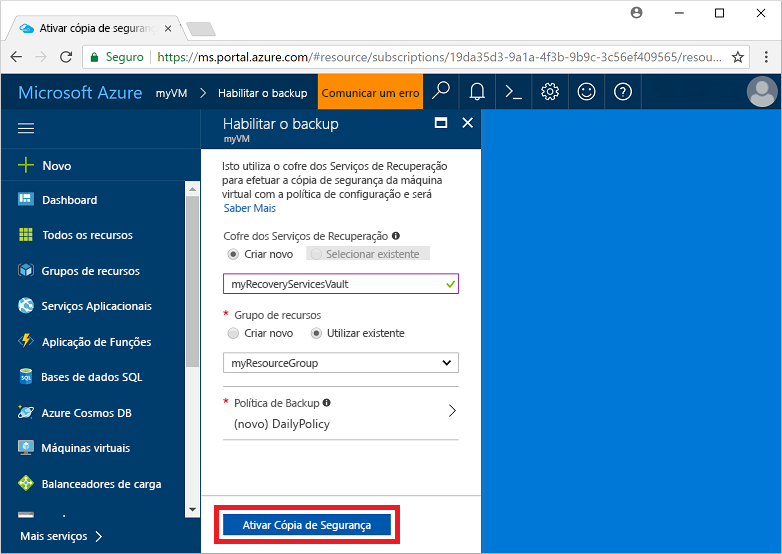
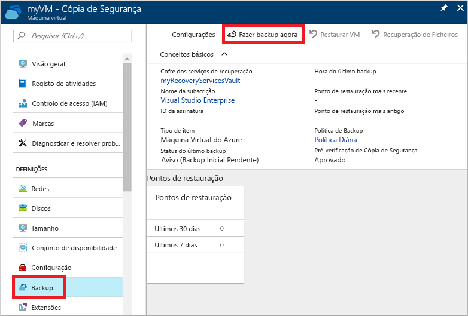
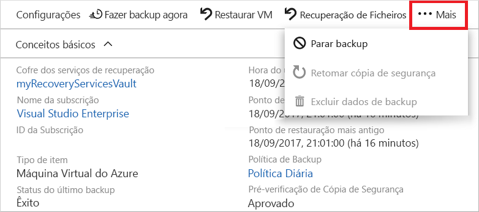

# Fazer uma cópia de segurança de uma máquina virtual no Azure
As cópias de segurança do Azure podem ser criadas através do portal do Azure. Este método fornece uma interface de utilizador baseada no browser para criar e configurar cópias de segurança do Azure e de todos os recursos relacionados. Pode criar cópias de segurança em intervalos regulares para manter os seus dados protegidos. O Azure Backup cria pontos de recuperação que podem ser armazenados em cofres de recuperação georredundantes. Este artigo mostra em detalhe como fazer uma cópia de segurança de uma máquina virtual (VM) com o portal do Azure. 

Este início rápido ativa a cópia de segurança numa VM do Azure existente. Se tiver de criar uma VM, pode [criá-la com o portal do Azure](../virtual-machines/windows/quick-create-portal.md).

## Iniciar sessão no Azure

Inicie sessão no portal do Azure em http://portal.azure.com.

## Selecionar uma VM para fazer uma cópia de segurança
Crie uma cópia de segurança diária simples para um Cofre dos Serviços de Recuperação. 

1. No menu do lado esquerdo, selecione **Máquinas virtuais**. 
2. Na lista, escolha uma VM da qual pretende fazer uma cópia de segurança. Se utilizou os comandos de início rápido de VM de exemplo, a VM tem o nome *myVM* no grupo de recursos *myResourceGroup*.
3. Na secção **Definições**, escolha **Cópia de segurança**. A janela **Ativar cópia de segurança** abre.

## Ativar a cópia de segurança numa VM
Um cofre dos Serviços de Recuperação é um contentor lógico que armazena os dados da cópia de segurança de todos os recursos protegidos, como as VMs do Azure. Quando a tarefa de cópia de segurança de um recurso protegido é executada, cria um ponto de recuperação dentro do cofre dos Serviços de Recuperação. Em seguida, pode utilizar um destes pontos de recuperação para restaurar dados para um determinado ponto no tempo.

1. Selecione **Criar novo** e forneça um nome para o novo cofre, como **myRecoveryServicesVault**.
2. Se ainda não estiver selecionado, escolha **Utilizar existente** e, em seguida, selecione o grupo de recursos da sua VM a partir do menu pendente.

    

    Por predefinição, o cofre está definido para Armazenamento georredundante. Para proteger ainda mais os seus dados, este nível de redundância de armazenamento garante que os dados das cópias de segurança são replicados numa região do Azure secundária, que está situada a centenas de quilómetros de distância da região principal.

    Para definir quando uma é executada uma tarefa de cópia de segurança e durante quanto tempo os pontos de recuperação são armazenados, tem de criar e utilizar políticas. A política de proteção predefinida executa uma tarefa de cópia de segurança todos os dias e mantém os pontos de recuperação durante 30 dias. Pode utilizar estes valores da política predefinida para proteger rapidamente a sua VM. 

3. Para aceitar os valores da política de cópia de segurança predefinida, selecione **Ativar Cópia de segurança**.

## Iniciar uma tarefa de cópia de segurança
Pode iniciar uma cópia de segurança agora em vez de aguardar até que a política predefinida execute a tarefa à hora agendada. Esta primeira tarefa de cópia de segurança cria um ponto de recuperação completo. Todas as tarefas de cópia de segurança que se seguem a esta cópia de segurança inicial criam pontos de recuperação incrementais. Os pontos de recuperação incrementais são eficientes em termos de armazenamento e tempo, uma vez que só transferem as alterações feitas desde a última cópia de segurança.

1. Na janela **Cópia de segurança** da sua VM, selecione **Fazer cópia de segurança agora**.

    

2. Para aceitar a política de retenção de cópia de segurança de 30 dias, deixe a data predefinida **Reter Cópia de Segurança Até**. Para iniciar a tarefa, selecione **Cópia de segurança**.

## Monitorizar a tarefa de cópia de segurança
Na janela **Cópia de segurança** da VM, o estado da cópia de segurança e o número de pontos de restauro concluídos são apresentados. Assim que a tarefa de cópia de segurança da VM estiver concluída, as informações sobre a **Hora da última cópia de segurança**, o **Ponto de restauro mais recente** e o **Ponto de restauro mais antigo** são apresentadas no lado direito da janela  **Descrição geral**.

## Limpar a implementação
Quando já não precisar, pode desativar a proteção na VM, remover os pontos de restauro e o cofre dos Serviços de Recuperação e, em seguida, eliminar o grupo de recursos e os recursos da VM associados.

Se quiser avançar para um tutorial de Cópia de segurança que explique como restaurar dados para a sua VM, ignore os passos desta secção e aceda a [Passos seguintes](#next-steps).

1. Selecione a opção **Cópia de segurança** para a sua VM.

2. Selecione **...Mais** para mostrar opções adicionais e, em seguida, escolha **Parar cópia de segurança**.

    

3. Selecione **Eliminar Dados da Cópia de Segurança** no menu pendente.

4. Na caixa de diálogo **Escrever o nome do item de Cópia de segurança**, introduza o nome da VM, como, por exemplo, *myVM*. Selecione **Parar Cópia de Segurança**

    Depois de a cópia de segurança da VM ter sido parada e os pontos de recuperação removidos, pode eliminar o grupo de recursos. Se utilizou uma VM existente, pode querer deixar o grupo de recursos e a VM no local.

5. No menu à esquerda, selecione **Grupos de recursos**. 
6. Na lista, escolha o grupo de recursos. Se utilizou os comandos de início rápido de VM de exemplo, o grupo de recursos tem o nome *myResourceGroup*.
7. Selecione **Eliminar grupo de recursos**. Para confirmar, introduza o nome do grupo de recursos e selecione **Eliminar**.

    

## Passos seguintes
Neste início rápido, criou um cofre dos Serviços de Recuperação, ativou a proteção numa VM e criou o ponto de recuperação inicial. Para saber mais sobre o Azure Backup e os Serviços de Recuperação, prossiga para os tutoriais.

> [!div class="nextstepaction"]
> [Back up multiple Azure VMs](./tutorial-backup-vm-at-scale.md)(Fazer uma cópia de segurança de várias VMs do Azure)
