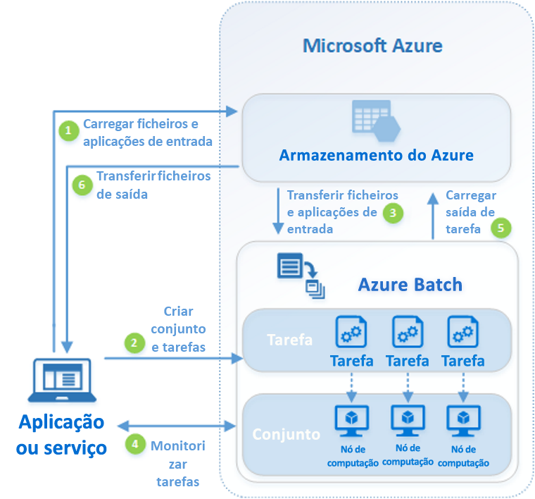

# O que é o Azure Batch?

Utilize o Azure Batch para executar trabalhos de lote de computação de alto desempenho (HPC) e paralelos em larga escala de forma eficaz no Azure. O Azure Batch cria e gere um conjunto de nós de computação (máquinas virtuais), instala as aplicações que quer executar e agenda trabalhos para execução nos nós. Não há nenhum cluster ou software de agendador de trabalho para instalar, gerir ou escalar. Em alternativa, utilize as [APIs e ferramentas do Batch](batch-apis-tools.md), scripts de linha de comandos ou o portal do Azure para configurar, gerir e monitorizar os seus trabalhos.

Os programadores podem utilizar o Batch como um serviço de plataforma para criar aplicações SaaS ou aplicações cliente quando for precisa uma execução em grande escala. Por exemplo, você pode construir um serviço com Batch para executar uma simulação de risco de Monte Carlo para uma empresa de serviços financeiros, ou um serviço para processar muitas imagens.

Não existem custos adicionais para a utilização do Batch. Paga apenas pelos recursos subjacentes consumidos, como máquinas virtuais, armazenamento e rede.

Para uma comparação entre o Batch e outras opções de solução HPC em Azure, consulte [Azure .Computação de Alto Desempenho (HPC).](/azure/architecture/topics/high-performance-computing/)

## Executar cargas de trabalho paralelas

O Batch funciona bem com cargas de trabalho intrinsecamente paralelas (também conhecidas como constrangedoramente paralelas). Cargas de trabalho paralelas intrinsecamente têm aplicações que podem ser executadas de forma independente, com cada instância completando parte do trabalho. Quando as aplicações estão a ser executadas, podem aceder a alguns dados comuns, mas não comunicam com outros casos da aplicação. As cargas de trabalho intrinsecamente paralelas conseguem executar em grande escala, determinado pela quantidade de recursos de computação disponíveis para executar aplicações em simultâneo.

Alguns exemplos de cargas de trabalho intrinsecamente paralelas que pode colocar no Batch:

- Modelação de riscos financeiros através de simulações Monte Carlo
- Composição de imagens VFX e 3D
- Análise e processamento de imagens
- Transcodificação multimédia
- Análise de sequência genética
- Reconhecimento ótico de carateres (OCR)
- Ingestão de dados, processamento e operações de ETL
- Execução de testes de software

Também pode usar o Batch para [executar cargas de trabalho bem acopladas,](batch-mpi.md)onde as aplicações que executa precisam de comunicar entre si, em vez de correrem de forma independente. As aplicações fortemente conjugadas utilizam normalmente a API de MPI (Message Passing Interface). Pode executar as cargas de trabalho fortemente conjugadas com o Batch através do [Microsoft MPI](/message-passing-interface/microsoft-mpi) ou do Intel MPI. Melhore o desempenho das aplicações com tamanhos de VM [HPC](../virtual-machines/sizes-hpc.md) e [otimizados para GPU](../virtual-machines/sizes-gpu.md) especializados.

Alguns exemplos de cargas de trabalho fortemente conjugadas:

- Análise de elementos finitos
- Dinâmica fluída
- Formação de IA com múltiplos nós

Muitas tarefas fortemente conjugadas podem ser executadas em paralelo com o Batch. Por exemplo, efetue múltiplas simulações de um líquido que circula por um tubo com várias larguras de tubos.

## Capacidades adicionais do Batch

Também estão disponíveis capacidades de nível mais elevado específicas da carga de trabalho para o Azure Batch:

- O Batch suporta [cargas de trabalho de composição](batch-rendering-service.md) em grande escala com ferramentas de composição, incluindo Autodesk Maya, 3ds Max, Arnold e V-Ray. 
- Os utilizadores de R podem instalar o [pacote R doAzureParallel](https://github.com/Azure/doAzureParallel) para aumentar horizontalmente a execução de algoritmos R em conjuntos do Batch.

Também pode executar trabalhos do Batch como parte de um fluxo de trabalho maior do Azure para transformar dados, gerido por ferramentas como o [Azure Data Factory](../data-factory/transform-data-using-dotnet-custom-activity.md).

## Como funciona

Um cenário comum do Batch envolve aumentar horizontalmente o trabalho intrinsecamente paralelo, como a composição de imagens de cenas 3D num conjunto de nós de computação. Esta piscina pode ser a sua "quinta renderizada" que fornece dezenas, centenas ou mesmo milhares de núcleos para o seu trabalho de renderização.

O diagrama seguinte mostra os passos num fluxo de trabalho comum do Batch, com uma aplicação cliente ou serviço alojado que utiliza o Batch para executar uma carga de trabalho paralela.

|Passo  |Description  |
|---------|---------|
|1. Faça upload dos **ficheiros de entrada** e das aplicações para processar esses **ficheiros** na sua conta de Armazenamento Azure.     |Os ficheiros de entrada podem ser quaisquer dados que a sua aplicação processa, tais como dados de modelação financeira ou ficheiros de vídeo para transcodificação. Os ficheiros da aplicação podem incluir scripts ou aplicações que processam os dados, como um transcodificador multimédia.|
|2. Crie um **lote** de nós computacional na sua conta Batch, um **trabalho** para executar a carga de trabalho na piscina e **tarefas** no trabalho.     | [Os nós computacional](nodes-and-pools.md) são os VMs que executam as suas [tarefas](jobs-and-tasks.md). Especifique propriedades para a sua piscina, como o número e o tamanho dos nós, uma imagem VM Windows ou Linux, e uma aplicação para instalar quando os nós se juntam à piscina. Gerencie o custo e o tamanho da piscina utilizando [VMs de baixa prioridade](batch-low-pri-vms.md) ou [escalando automaticamente](batch-automatic-scaling.md) o número de nós à medida que a carga de trabalho muda.   Ao adicionar tarefas a um trabalho, o serviço Batch agenda automaticamente as tarefas para execução nos nós de computação do conjunto. Cada tarefa utiliza a aplicação que carregou para processar os ficheiros de entrada. |
|3. Descarregue **os ficheiros** de entrada e as **aplicações** para o Batch     |Antes de cada tarefa ser executada, pode descarregar os dados de entrada que irá processar para o nó atribuído. Se a aplicação ainda não tiver sido instalada nos nós do conjunto, pode ser transferida aqui. Quando as transferências do Armazenamento do Azure estiverem concluídas, a tarefa é executada no nó atribuído.|
|4. Monitorizar a **execução da tarefa**     |À medida que as tarefas são executadas, consulte o Batch para monitorizar o progresso do trabalho e respetivas tarefas. A aplicação ou serviço de cliente comunica com o serviço Batch sobre o HTTPS. Uma vez que pode monitorizar milhares de tarefas em execução em milhares de nós de computação, certifique-se de que [consulta o serviço de Batch de forma eficiente](batch-efficient-list-queries.md).|
|5. Carregar saída de **tarefa**     |À medida que as tarefas são concluídas, elas podem carregar os respetivos dados de resultados para o Armazenamento do Azure. Também pode obter ficheiros diretamente do sistema de ficheiros num nó de computação.|
|6. Descarregar **ficheiros de saída**     |Quando a monitorização deteta que concluiu as tarefas no seu trabalho, a aplicação ou serviço de cliente pode transferir os dados de saída para processamento adicional.|

Tenha em mente que o fluxo de trabalho acima descrito é apenas uma maneira de usar o Batch, e existem muitas outras funcionalidades e opções. Por exemplo, pode executar [múltiplas tarefas em paralelo](batch-parallel-node-tasks.md) em cada nó de computação. Ou pode usar [tarefas de preparação e conclusão](batch-job-prep-release.md) de trabalho para preparar os nós para os seus trabalhos e depois limpar.

Consulte [o fluxo de trabalho do serviço Batch e os recursos](batch-service-workflow-features.md) para uma visão geral de funcionalidades como piscinas, nós, empregos e tarefas. Veja também a versão mais recente das [Atualizações de serviço do Batch](https://azure.microsoft.com/updates/?product=batch).

## Residência de dados na região
O Azure Batch não move nem armazena os dados dos clientes para fora da região em que é implantado. 

## Passos seguintes

Introdução ao Azure Batch com um dos seguintes inícios rápidos:
- [Executar a primeira tarefa do Batch com a CLI do Azure](quick-create-cli.md)
- [Executar o seu primeiro trabalho do Batch com o portal do Azure](quick-create-portal.md)
- [Executar o seu primeiro trabalho do Batch com a API .NET](quick-run-dotnet.md)
- [Executar o seu primeiro trabalho do Batch com a API Python](quick-run-python.md)
