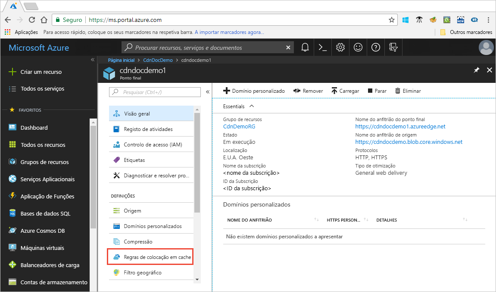

# Controlar o comportamento da colocação em cache da CDN do Azure com as regras de colocação em cache

> [!NOTE] 
> As regras de caching estão disponíveis apenas para **Azure CDN Standard da Verizon** e **Azure CDN Standard a partir de** perfis Akamai. Para **o Azure CDN a partir dos** perfis da Microsoft, tem de utilizar o motor de [regras Standard](cdn-standard-rules-engine-reference.md) Para **Azure CDN Premium a partir de** perfis Verizon, deve utilizar o motor de [regras Verizon Premium](cdn-rules-engine.md) no portal **Manage** para obter funcionalidades semelhantes.
 
A Azure Content Delivery Network (CDN) oferece duas formas de controlar como os seus ficheiros estão em cache: 

- Regras de cache: Este artigo descreve como pode usar as regras de cache da rede de entrega de conteúdos (CDN) para definir ou modificar o comportamento de expiração da cache padrão, tanto a nível global como com condições personalizadas, como um caminho URL e extensão de ficheiros. A CDN do Azure dispõe de dois tipos de regras de colocação em cache:

   - Regras globais de colocação em cache: pode definir uma regra global de colocação em cache para cada ponto final no seu perfil, o que afeta todos os pedidos para o ponto final. A regra global de colocação em cache substitui quaisquer cabeçalhos de diretivas de cache HTTP, se for definido algum.

   - Regras personalizadas de colocação em cache: pode configurar uma ou mais regras personalizadas de colocação em cache para cada ponto final no seu perfil. As regras personalizadas de colocação em cache correspondem a extensões de ficheiro e a caminhos específicos, são processadas por ordem e substituem a regra global de colocação em cache, se definida. 

- Caching de cordas de consulta: Pode ajustar a forma como o Azure CDN trata o caching para pedidos com cordas de consulta. Para obter informações, consulte [o comportamento do controle Azure CDN com cordas de consulta](cdn-query-string.md). Se o ficheiro não for cacheable, a definição de cache de cadeia de consulta não tem efeito, com base nas regras de cache e nos comportamentos predefinidos do CDN.

Para obter informações sobre o comportamento padrão do caching e cabeçalhos da diretiva de caching, consulte [como funciona o caching](cdn-how-caching-works.md). 

## Aceder às regras de caching do Azure CDN

1. Abra o portal Azure, selecione um perfil CDN e, em seguida, selecione um ponto final.

2. No painel esquerdo, em Definições, selecione **Regras de colocação em cache**.

   

   É apresentada a página **Regras de colocação em cache**.

   

## Caching definições de comportamento
Para regras globais e personalizadas de caching, pode especificar as seguintes definições **de comportamento de Caching:**

- **Cache de bypass**: Não cache e ignore cabeçalhos de diretiva de cache fornecidos pela origem.

- **Sobreposição**: Ignorar a duração da cache fornecida pela origem; em vez disso, utilize a duração da cache fornecida. Isto não irá sobrepor-se ao controlo de cache: sem cache.

- **Conjunto, se faltar**: Cabeçalhos de diretiva de cache fornecidos pela origem honorária, se existirem; caso contrário, utilize a duração da cache fornecida.

## Duração da expiração da cache
Para regras globais e personalizadas de cache, pode especificar a duração de validade da cache em dias, horas, minutos e segundos:

- Para o **override** e **o conjunto se faltarem** as definições **de comportamento do Cache,** as durações válidas da cache variam entre 0 segundos e 366 dias. Por um valor de 0 segundos, o CDN caches o conteúdo, mas deve revalidar cada pedido com o servidor de origem.

- Para a definição **de cache bypass,** a duração do cache é automaticamente definida para 0 segundos e não pode ser alterada.

## Regras de caching personalizadas correspondem às condições

Para regras de cache personalizadas, estão disponíveis duas condições de jogo:
 
- **Caminho**: Esta condição corresponde ao caminho do URL, excluindo o nome de domínio, e suporta o símbolo wildcard \* (). Por exemplo, _/myfile.html,_ _/my/folder/*_, e _/my/images/*.jpg_. O comprimento máximo é de 260 caracteres.

- **Extensão**: Esta condição corresponde à extensão do ficheiro solicitado. Pode fornecer uma lista de extensões de ficheiros separadas por vírgula para combinar. Por exemplo, _.jpg_, _.mp3_, ou _.png_. O número máximo de extensões é de 50 e o número máximo de caracteres por extensão é de 16. 

## Ordem de processamento de regras global e personalizada
As regras globais e personalizadas de caching são processadas na seguinte ordem:

- As regras globais de cache têm precedência sobre o comportamento padrão do cache caching (definições de cabeçalho de cache-directiva HTTP). 

- As regras de caching personalizadas têm precedência sobre as regras globais de caching, onde se aplicam. As regras de caching personalizadas são processadas de cima para baixo. Ou seja, se um pedido corresponder a ambas as condições, as regras na parte inferior da lista têm precedência sobre as regras no topo da lista. Portanto, deve colocar regras mais específicas mais baixas na lista.

**Exemplo:**
- Regra global do caching: 
   - Comportamento caching: **Override**
   - Duração de validade da cache: 1 dia

- Regra de caching personalizado #1:
   - Condição do jogo: **Caminho**
   - Valor da correspondência: _/home/*_
   - Comportamento caching: **Override**
   - Duração de validade da cache: 2 dias

- Regra de caching personalizado #2:
   - Condição do jogo: **Extensão**
   - Valor do jogo: _.html_
   - Comportamento caching: **Definir se faltar**
   - Duração de validade da cache: 3 dias

Quando estas regras são definidas, um pedido de _ &lt; nome de anfitrião &gt; _de ponto final .azureedge.net/home/index.html aciona a regra de caching personalizado #2, que está definido para: Definir se **faltar** e 3 dias. Portanto, se o * ficheiroindex.html* tiver ou os `Cache-Control` `Expires` cabeçalhos HTTP, eles são honrados; caso contrário, se estes cabeçalhos não estiverem definidos, o ficheiro fica em cache durante 3 dias.

> [!NOTE] 
> Os ficheiros que estão em cache antes de uma alteração de regras mantêm a definição de duração da cache de origem. Para repor as durações da cache, tem de [limpar o ficheiro](cdn-purge-endpoint.md). 
>
> As alterações de configuração do Azure CDN podem demorar algum tempo a propagar-se através da rede: 
> - Para os perfis **CDN do Azure Standard da Akamai**, a propagação normalmente fica concluída num minuto. 
> - Para **o Azure CDN Standard dos** perfis Verizon, a propagação geralmente completa em 10 minutos.  
>

## Consulte também

- [How caching works](cdn-how-caching-works.md) (Como funciona a colocação em cache)
- [Tutorial: Definir regras de colocação em cache da CDN do Azure](cdn-caching-rules-tutorial.md)
