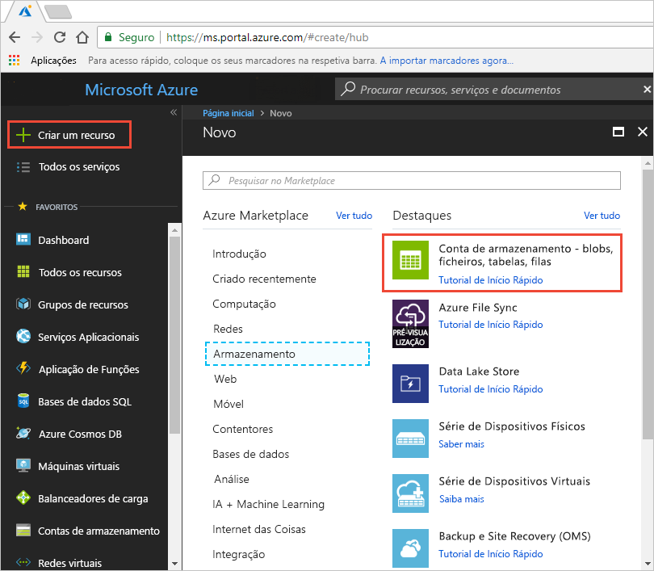
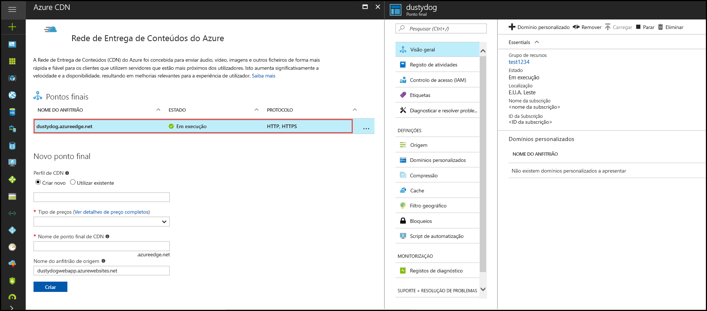
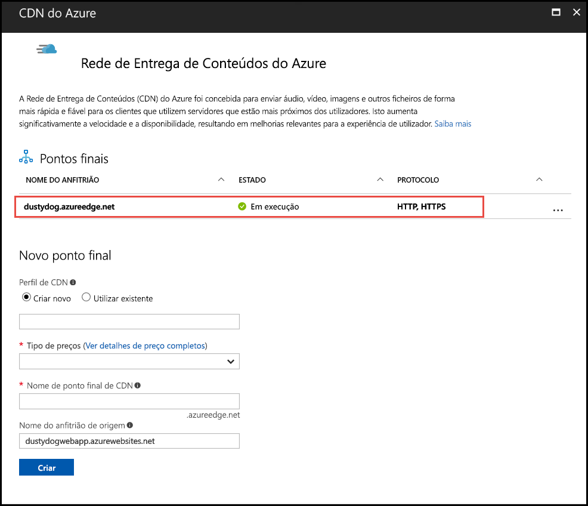

# Quickstart: Integrar uma conta de Armazenamento Azure com a Azure CDN

Neste arranque rápido, você ativa a [Azure Content Delivery Network (CDN)](cdn-overview.md) para cache conteúdo a partir de Azure Storage. A CDN do Azure oferece aos programadores uma solução global para entregar conteúdo de largura de banda elevada. Pode colocar blobs e conteúdo estático em cache de instâncias de computação em nós físicos nos Estados Unidos da América, Europa, Ásia, Austrália e América do Sul.

## Pré-requisitos

- Uma conta Azure com uma subscrição ativa. [Crie uma conta gratuita.](https://azure.microsoft.com/free/?ref=microsoft.com&utm_source=microsoft.com&utm_medium=docs&utm_campaign=visualstudio)

## Iniciar sessão no portal do Azure

Inicie sessão no [portal do Azure](https://portal.azure.com) com a sua conta do Azure.

## Criar uma conta de armazenamento

Uma conta de armazenamento dá acesso a serviços de Armazenamento do Microsoft Azure. A conta de armazenamento representa o nível mais elevado de espaço de nomes para aceder a cada componente de serviços de Armazenamento do Microsoft Azure: armazenamento de Blobs, Filas e Tabelas do Azure. Para mais informações, consulte [Introdução ao Armazenamento do Microsoft Azure](../storage/common/storage-introduction.md).

Para criar uma conta de armazenamento, tem de ser o administrador de serviços ou um coadministrador da subscrição associada.

1. No portal Azure, **selecione Criar um recurso** na parte superior esquerda. O painel **Novo** é apresentado.

1. Procure por **conta de Armazenamento** e selecione conta de armazenamento - **blob, ficheiro, tabela, fila** da lista de drop-down. Em seguida, **selecione Criar**:
    
    

1. No painel de **conta de armazenamento Create,** insira os seguintes detalhes:

    | Definição | Valor | 
    | --- | --- |
    | Detalhes do projeto > grupo de recursos | Selecione **Criar novo** e use o nome *CDNQuickstart-rg*. Também pode utilizar um grupo de recursos existente, se preferir. |
    | Detalhes de instância > nome da conta de armazenamento | Introduza um nome para a conta usando apenas letras e números minúsculos 3-24. O nome deve ser único em todo o Azure, e torna-se o nome de anfitrião no URL que é usado para abordar recursos blob, fila ou mesa para a subscrição. Para abordar um recurso de contentor no armazenamento blob, utilize um URI no seguinte formato: http://*&lt; o nome &gt; de contagem de armazenamento*.blob.core.windows.net/.*&lt; &gt;*
    | Detalhes da > localização | Selecione uma região Azure perto de si a partir da lista de drop-down. |
    
    Deixe todos os outros detalhes definidos para os predefinidos e, em seguida, selecione **Review + create**.

1. A criação da conta de armazenamento pode demorar vários minutos a ser concluída. Uma vez concluída a criação, selecione **Ir para** o recurso para abrir a página da conta de armazenamento para o próximo passo.

## Ativar a CDN do Azure para a conta de armazenamento

1. Na página para a sua conta de armazenamento, selecione **Blob service**  >  **Azure CDN** a partir do menu esquerdo. A página **CDN do Azure** é apresentada.

    
    
1. Na secção **Novo ponto final,** insira as seguintes informações:

    | Definição  | Valor |
    | -------- | ----- |
    | **Perfil da CDN** | Selecione **Criar novo** e insira o nome do seu perfil, por exemplo, *cdn-profile-123*. Um perfil é uma coleção de pontos finais. |
    | **Escalão de preço** | Selecione uma das opções **Standard,** como **a Standard Microsoft**. |
    | **Nome do ponto final da CDN** | Insira o seu nome de anfitrião do ponto final, tal como *o cdn-endpoint-123*. Este nome deve ser globalmente único em todo o Azure porque é para aceder aos seus recursos em cache no _&lt; nome &gt; final_ url .azureedge.net. |
    | **Nome de anfitrião da origem** | Por predefinição, um novo ponto final da CDN utiliza o nome do anfitrião da conta de armazenamento com o servidor de origem. |

1. Selecione **Criar**. Depois da criação do ponto final, este é apresentado na lista de pontos finais.

    

> [!TIP]
> Se quiser especificar definições de configuração avançadas para o ponto final da CDN, como a [otimização da transferência de ficheiros grandes](cdn-optimization-overview.md#large-file-download), pode utilizar a [extensão da CDN do Azure](cdn-create-new-endpoint.md) para criar um perfil e um ponto final de CDN.

## Ativar funcionalidades da CDN adicionais

Na página **CDN do Azure** da conta de armazenamento, selecione o ponto de final da CDN na lista para abrir a página de configuração do ponto final da CDN.

A partir desta página, pode ativar funcionalidades adicionais da CDN para a entrega, como [compressão](cdn-improve-performance.md), [colocação em cache de cadeias de consulta](cdn-query-string.md) e [filtragem geográfica](cdn-restrict-access-by-country.md). 
    
## Ativar a SAS

Se pretender conceder acesso limitado a contentores de armazenamento privados, pode utilizar a funcionalidade Assinatura de Acesso Partilhado (SAS) da sua conta de Armazenamento Azure. Uma SAS é um URI que concede direitos de acesso restritos aos recursos de Armazenamento do Azure sem expor a sua chave de conta. Para obter mais informações, veja [Utilizar a CDN do Azure com a SAS](cdn-sas-storage-support.md).

## Aceder ao conteúdo da CDN

Para aceder a conteúdo em cache na CDN, utilize o URL da CDN fornecido no portal. O endereço de um blob em cache tem o seguinte formato:

http://<*endpoint-name* \> .azureedge.net/<*myPublicContainer* \> /< *BlobName*\>

> [!NOTE]
> Depois de ativar o acesso da CDN do Azure a uma conta de armazenamento, todos os objetos publicamente disponíveis são elegíveis para colocação em cache de POP da CDN. Se modificar um objeto que esteja atualmente em cache na CDN, o novo conteúdo não estará disponível através da CDN do Azure até a CDN do Azure atualizar o conteúdo depois do período TTL do conteúdo em cache expirar.

## Remover conteúdo da CDN do Azure

Se já não pretender ter um objeto em cache na CDN do Azure, poderá efetuar um dos seguintes passos:

- Torne o contentor privado em vez de público. Para obter mais informações, veja [Manage anonymous read access to containers and blobs](../storage/blobs/anonymous-read-access-configure.md) (Gerir o acesso de leitura anónima a contentores e blobs).
- Desative ou elimine o ponto final da CDN ao utilizar o portal do Azure.
- Modifique o serviço alojado para deixar de responder a pedidos para o objeto.

Um objeto que já esteja em cache na CDN do Azure permanece em cache até o período TTL do objeto expirar ou até o ponto final ser [removido](cdn-purge-endpoint.md). Quando o período TTL expirar, a CDN do Azure determina se o ponto final da CDN ainda é válido e se o objeto ainda é acessível anonimamente. Se não forem, o objeto não já estará em cache.

## Limpar os recursos

Nos passos anteriores, criou um perfil e um ponto final de CDN num grupo de recursos. Guarde estes recursos, se pretender aceder aos [Passos seguintes](#next-steps) e aprender a adicionar um domínio personalizado ao ponto final. No entanto, se não pretende utilizar estes recursos no futuro pode eliminá-los, ao eliminar o grupo de recursos, evitando assim encargos adicionais:

1. A partir do menu à esquerda no portal Azure, selecione **grupos de recursos** e, em seguida, selecione *CDNQuickstart-rg**.

2. Na página do **grupo De recursos,** selecione **Delete resource group**, insira *CDNQuickstart-rg* na caixa de texto e, em seguida, selecione **Delete**.

    Esta ação irá eliminar o grupo de recursos, o perfil e o ponto final que criou neste início rápido.

3. Para eliminar a conta de armazenamento, selecione-a no dashboard e, em seguida, selecione **Eliminar** no menu superior.

## Passos seguintes

> [!div class="nextstepaction"]
> [Tutorial: Use o CDN para servir conteúdo estático a partir de uma aplicação web](cdn-add-to-web-app.md)
