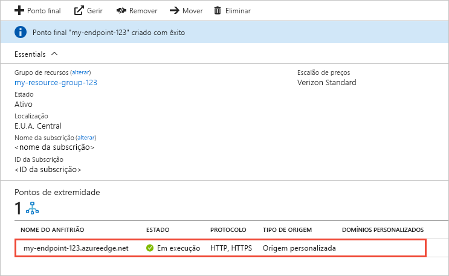

# Criar um ponto final Azure CDN
Este artigo descreve todas as definições para a criação de um ponto final [da Rede de Entrega de Conteúdos Azure (CDN)](cdn-overview.md) num perfil CDN existente. Depois de criar um perfil e um ponto final, pode começar a entregar conteúdo aos seus clientes. Para iniciar rapidamente a criação de um perfil e ponto final, consulte [Quickstart: Crie um perfil e ponto final Azure CDN](cdn-create-new-endpoint.md).

## Pré-requisitos
Antes de poder criar um ponto final CDN, deve ter criado pelo menos um perfil CDN, que pode conter um ou mais pontos finais de CDN. Para organizar os seus pontos finais da CDN por domínio de Internet, aplicação Web ou alguns outros critérios, pode utilizar vários perfis. Uma vez que os preços do CDN são aplicados ao nível do perfil cdn, deve criar vários perfis de CDN se quiser utilizar uma mistura de níveis de preços Azure CDN. Para criar um perfil CDN, consulte [criar um novo perfil CDN](cdn-create-new-endpoint.md#create-a-new-cdn-profile).

## Iniciar sessão no portal do Azure
Inicie sessão no [Portal do Azure](https://portal.azure.com) com a sua conta do Azure.

## Criar um novo ponto final da CDN

1. No [portal Azure,](https://portal.azure.com)navegue para o seu perfil CDN. É possível que o tenha afixado ao dashboard no passo anterior. Caso contrário, pode encontrá-lo ao selecionar **Todos os serviços** e, em seguida, selecionar **Perfis da CDN**. No painel **Perfis da CDN**, selecione o perfil no qual pretende adicionar o ponto final. 
   
    É apresentado o painel do perfil da CDN.

2. Selecione **Ponto final**.
   
    
   
    A página **Adicionar um ponto final** é apresentada.
   
    

3. Para **Nome**, introduza um nome exclusivo para o novo ponto final da CDN. Este nome é usado para aceder aos seus recursos em cache no domínio _\<endpointname>_ .azureedge.net.

4. Para **o tipo origem,** escolha um dos seguintes tipos de origem: 
   - **Armazenamento** para Armazenamento Azure
   - **Serviço em nuvem** para serviços Azure Cloud
   - **Web App** para aplicações web Azure
   - **Origem personalizada** para qualquer outro servidor web de origem acessível ao público (hospedado em Azure ou em qualquer outro lugar)

5. Para **o nome de anfitrião Origin,** selecione ou introduza o domínio do servidor de origem. O drop-down lista todos os servidores de origem disponíveis do tipo especificado no passo 4. Se selecionou **a origem personalizada** como o seu tipo de origem, insira o domínio do seu servidor de origem personalizada.
    
6. Para **o caminho da Origem,** insira o caminho para os recursos que deseja cache. Para permitir a caching de qualquer recurso no domínio especificado no passo 5, deixe esta definição em branco.
    
7. No **Cabeçalho de anfitrião de origem**, introduza o cabeçalho de anfitrião que pretende que a CDN do Azure envie com cada pedido ou deixe a predefinição.
   
   > [!NOTE]
   > Alguns tipos de origens, como o Armazenamento e as Aplicações Web do Azure, requerem que o cabeçalho de anfitrião coincida com o domínio da origem. A menos que tenha uma origem que necessite de um cabeçalho de anfitrião diferente do respetivo domínio, deve deixar o valor predefinido.
   > 
    
8. Para a porta **Protocol** e **Origin,** especifique os protocolos e portas para utilizar para aceder aos seus recursos no servidor de origem. Tem de ser selecionado pelo menos um protocolo (HTTP ou HTTPS). Utilize o domínio fornecido pelo CDN _\<endpointname>_ (.azureedge.net) para aceder ao conteúdo HTTPS. 
   
   > [!NOTE]
   > O valor **da porta Origin** determina apenas a porta que o ponto final utiliza para obter informações do servidor de origem. O próprio ponto final só está disponível para clientes finais nas portas HTTP e HTTPS predefinidas (80 e 443), independentemente do valor **Porta de origem**.  
   > 
   > Os pontos finais nos perfis da **CDN do Azure da Akamai** não permitem o intervalo de portas TCP completo para portas de origem. Para obter uma lista das portas de origem que não são permitidas, consulte [Portas de Origem Permitidas do Azure CDN da Akamai](/previous-versions/azure/mt757337(v=azure.100)).  
   > 
   > O suporte HTTPS para domínios personalizados Azure CDN não é suportado em **Azure CDN a partir de** produtos Akamai. Para obter mais informações, veja [Configure HTTPS on an Azure CDN custom domain](cdn-custom-ssl.md) (Configurar HTTPS num domínio personalizado da CDN do Azure).
    
9. Para **Otimizado para**, selecione um tipo de otimização que melhor corresponda ao cenário e tipo de conteúdo que pretende que o ponto final entregue. Para obter mais informações, consulte [Otimize Azure CDN para o tipo de entrega de conteúdo.](cdn-optimization-overview.md)

    As seguintes definições de tipo de otimização são suportadas, de acordo com o tipo de perfil:
    - **Norma Azure CDN dos** perfis da Microsoft:
       - [**Entrega geral da web**](cdn-optimization-overview.md#general-web-delivery)

    - **Azure CDN Standard da Verizon** e **Azure CDN Premium dos** perfis Verizon:
       - [**Entrega geral da web**](cdn-optimization-overview.md#general-web-delivery)
       - [**Aceleração de site dinâmico**](cdn-optimization-overview.md#dynamic-site-acceleration)

    - **Norma Azure CDN dos** perfis da Akamai:
       - [**Entrega geral da web**](cdn-optimization-overview.md#general-web-delivery)
       - [**Streaming de meios de comunicação geral**](cdn-optimization-overview.md#general-media-streaming)
       - [**Vídeo a pedido de streaming de mídia**](cdn-optimization-overview.md#video-on-demand-media-streaming)
       - [**Descarregamento de ficheiros grandes**](cdn-optimization-overview.md#large-file-download)
       - [**Aceleração de site dinâmico**](cdn-optimization-overview.md#dynamic-site-acceleration)

10. Selecione **Adicionar** para criar o novo ponto final.
   
    Depois de o ponto final ser criado, aparece na lista de pontos finais para o perfil.
    
    
    
    Dado que a propagação do registo demora algum tempo, o ponto final não está imediatamente disponível para utilização: 
    - Para os perfis **CDN do Azure Standard da Microsoft**, a propagação normalmente fica concluída em 10 minutos. 
    - Para os perfis **CDN do Azure Standard da Akamai**, a propagação normalmente fica concluída num minuto. 
    - Para os perfis **CDN do Azure Standard da Verizon** e **CDN do Azure Premium da Verizon**, a propagação normalmente fica concluída no prazo de 90 minutos. 
   
    Se tentar utilizar o nome de domínio CDN antes da configuração do ponto final se ter propagado aos servidores do ponto de presença (POP), poderá receber um estado de resposta HTTP 404. Se já passaram várias horas desde que criou o seu ponto final e ainda está a receber um estado de resposta 404, consulte [os pontos finais do Azure CDN que devolvem um código de estado 404](cdn-troubleshoot-endpoint.md).

## Limpar os recursos
Para eliminar um ponto final quando já não for necessário, selecione-o e, em seguida, **selecione Delete**. 

## Passos seguintes
Para aprender sobre domínios personalizados, continue ao tutorial para adicionar um domínio personalizado ao seu ponto final CDN.

> [!div class="nextstepaction"]
> [Adicionar um domínio personalizado](cdn-map-content-to-custom-domain.md)

