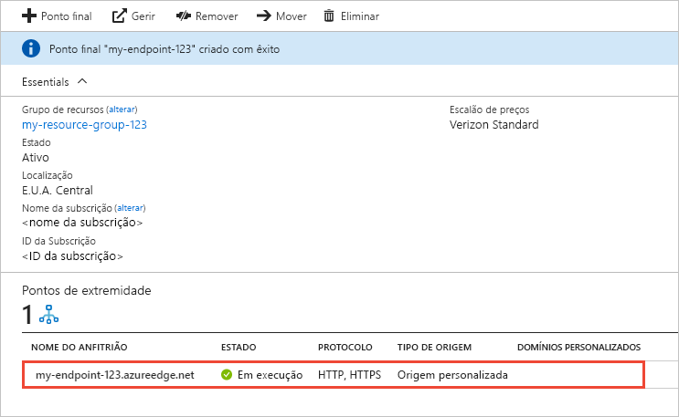

# Início Rápido: Criar um perfil e um ponto final da CDN do Azure

Neste arranque rápido, você ativa a Azure Content Delivery Network (CDN) criando um novo perfil CDN, que é uma coleção de um ou mais pontos finais CDN. Depois de criar um perfil e um ponto final, pode começar a entrega de conteúdos aos seus clientes.

## Pré-requisitos

- Uma conta Azure com uma subscrição ativa. [Crie uma conta gratuita.](https://azure.microsoft.com/free/?ref=microsoft.com&utm_source=microsoft.com&utm_medium=docs&utm_campaign=visualstudio)
- Uma conta de Armazenamento Azure chamada *cdnstorageacct123,* que você usa para o nome de hospedeiro de origem. Para completar este requisito, consulte [Integrar uma conta de Armazenamento Azure com a Azure CDN](cdn-create-a-storage-account-with-cdn.md).

## Iniciar sessão no portal do Azure

Inicie sessão no [portal do Azure](https://portal.azure.com) com a sua conta do Azure.

[!INCLUDE [cdn-create-profile](../../includes/cdn-create-profile.md)]

## Criar um novo ponto final da CDN

Depois de criar um perfil CDN, use-o para criar um ponto final.

1. No Portal do Azure, selecione no dashboard o perfil da CDN que criou. Se não conseguir encontrá-lo, pode abrir o grupo de recursos no qual o criou, ou utilizar a barra de pesquisa no topo do portal, introduzir o nome do perfil e selecionar o perfil a partir dos resultados.
   
1. Na página de perfil do CDN, selecione **+ Ponto final.**
   
    
   
    O painel **Adicionar um ponto final** aparece.

3. Introduza os seguintes valores de definição:

    | Definição | Valor |
    | ------- | ----- |
    | **Nome** | *Insira o ponto final do CDN-123* para o seu nome de anfitrião do ponto final. Este nome deve ser globalmente único em todo o Azure; se já estiver em uso, insira um nome diferente. Este nome é usado para aceder aos seus recursos em cache no _&lt; nome &gt; final_ do ponto de domínio .azureedge.net.|
    | **Tipo de origem** | Selecione **Armazenamento**. | 
    | **Nome de anfitrião da origem** | Selecione o nome de anfitrião da conta Azure Storage que está a usar na lista de drop-down, como *cdnstorageacct123.blob.core.windows.net*. |
    | **Caminho de origem** | Deixe em branco. |
    | **Cabeçalho de anfitrião de origem** | Deixe o valor predefinido (que é o nome de anfitrião da conta de armazenamento). |  
    | **Protocolo** | Deixe as opções **HTTP** e **HTTPS** predefinidas selecionadas. |
    | **Porta de origem** | Deixe os valores de porta predefinidos. | 
    | **Otimizado para** | Deixe a seleção predefinida, **Entrega geral Web**. |

    

3. Selecione **Adicionar** para criar o novo ponto final. Depois de o ponto final ser criado, aparece na lista de pontos finais para o perfil.
    
   
    
   O tempo que o ponto final leva para se propagar depende do nível de preços selecionado quando criou o perfil. **A Standard Akamai** normalmente completa dentro de um minuto, **a Standard Microsoft** em 10 minutos e a Standard **Verizon** e a **Premium Verizon** em até 30 minutos.

## Limpar os recursos

Nos passos anteriores, criou um perfil e um ponto final de CDN num grupo de recursos. Guarde estes recursos, se pretender aceder aos [Passos seguintes](#next-steps) e aprender a adicionar um domínio personalizado ao ponto final. No entanto, se não pretende utilizar estes recursos no futuro pode eliminá-los, ao eliminar o grupo de recursos, evitando assim encargos adicionais:

1. A partir do menu à esquerda no portal Azure, selecione **grupos de recursos** e, em seguida, selecione **CDNQuickstart-rg**.

2. Na página do **grupo De recursos,** selecione **Delete resource group**, insira *CDNQuickstart-rg* na caixa de texto e, em seguida, selecione **Delete**. Esta ação elimina o grupo de recursos, perfil e ponto final que criou neste arranque rápido.

## Passos seguintes

> [!div class="nextstepaction"]
> [Tutorial: Use CDN para servidor de conteúdo estático a partir de uma aplicação web](cdn-add-to-web-app.md)

> [!div class="nextstepaction"]
> [Tutorial: Adicionar um domínio personalizado ao ponto final da CDN do Azure](cdn-map-content-to-custom-domain.md)
