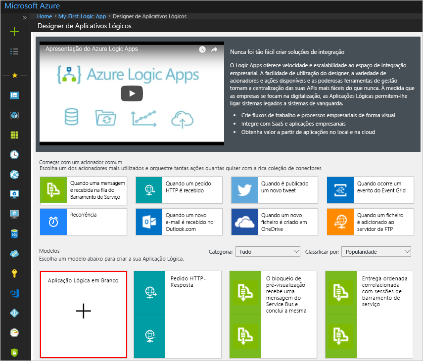

# <a name="tutorial-use-form-recognizer-with-azure-logic-apps-to-analyze-invoices"></a>Tutorial: usar o reconhecedor de formulário com aplicativos lógicos do Azure para analisar faturas

Neste tutorial, você cria um fluxo de trabalho em aplicativos lógicos do Azure que usa o reconhecedor de formulário, um serviço que faz parte do pacote de serviços cognitivas do Azure, para extrair dados de faturas. Você usa o reconhecedor de formulário para treinar primeiro um modelo usando um conjunto de dados de exemplo e, em seguida, testar o modelo usando outro conjunto de dados. Os dados de exemplo usados neste tutorial são armazenados em contêineres de blob de armazenamento do Azure.

Eis o que este tutorial aborda:

> [!div class="checklist"]
> * Solicitar acesso para o reconhecedor de formulário
> * Criar um contêiner de blob de armazenamento do Azure
> * Carregar dados de exemplo no contêiner de blob do Azure
> * Criar um aplicativo lógico do Azure
> * Configurar o aplicativo lógico para usar um recurso do reconhecedor de formulário
> * Testar o fluxo de trabalho executando o aplicativo lógico

## <a name="prerequisites"></a>Pré-requisitos

* Assinatura do Azure- [crie um gratuitamente](https://azure.microsoft.com/free/).

## <a name="request-access-for-form-recognizer"></a>Solicitar acesso para o reconhecedor de formulário

O reconhecedor de formulário está disponível em uma versão prévia de acesso limitado. Para obter acesso à visualização, preencha e envie o formulário [solicitação de acesso do reconhecedor de formulário](https://aka.ms/FormRecognizerRequestAccess) . Depois que sua solicitação for aprovada pela equipe de serviços cognitivas do Azure, você receberá um email com instruções para acessar o serviço.

## <a name="understand-the-invoice-to-be-analyzed"></a>Entender a fatura a ser analisada

O conjunto de dados de exemplo que usamos para treinar o modelo e testar o modelo está disponível como um arquivo. zip do [GitHub](https://go.microsoft.com/fwlink/?linkid=2090451). Baixe e extraia o arquivo. zip e abra um arquivo PDF de nota fiscal na pasta **/Train** Observe como ele tem uma tabela com o número da nota fiscal, a data da fatura, etc. 

> [!div class="mx-imgBorder"]
>  de nota fiscal de amostra

Neste tutorial, aprendemos como extrair as informações de tais tabelas para um formato JSON usando um fluxo de trabalho criado usando aplicativos lógicos do Azure e o reconhecedor de formulário.

## <a name="create-an-azure-storage-blob-container"></a>Criar um contêiner de blob de armazenamento do Azure

Você usa esse contêiner para carregar dados de exemplo necessários para treinar o modelo.

1. Siga as instruções em [criar uma conta de armazenamento do Azure](../../storage/common/storage-quickstart-create-account.md) para criar uma conta de armazenamento. Use **formrecostorage** como o nome da conta de armazenamento.
1. Siga as instruções em [criar um contêiner de blob do Azure](../../storage/blobs/storage-quickstart-blobs-portal.md) para criar um contêiner dentro da conta de armazenamento do Azure. Use **formrecocontainer** como o nome do contêiner. Certifique-se de definir o nível de acesso público como **contêiner (acesso de leitura anônimo para contêineres e BLOBs)** .

    > [!div class="mx-imgBorder"]
    > 

## <a name="upload-sample-data-to-the-azure-blob-container"></a>Carregar dados de exemplo no contêiner de blob do Azure

Baixe os dados de exemplo disponíveis no [GitHub](https://go.microsoft.com/fwlink/?linkid=2090451). Extraia os dados para uma pasta local e carregue o conteúdo da pasta **/Train** para o **formrecocontainer** que você criou anteriormente. Siga as instruções em [carregar um blob de blocos](../../storage/blobs/storage-quickstart-blobs-portal.md#upload-a-block-blob) para carregar dados em um contêiner.

Copie a URL do contêiner. Isso será necessário posteriormente neste tutorial. Se você criou a conta de armazenamento e o contêiner com os mesmos nomes listados neste tutorial, a URL será *https://formrecostorage.blob.core.windows.net/formrecocontainer/* .

## <a name="create-a-form-recognizer-resource"></a>Criar um recurso de reconhecimento de formulário

[!INCLUDE [create resource](./includes/create-resource.md)]

## <a name="create-your-logic-app"></a>Criar uma aplicação lógica

Você pode usar os aplicativos lógicos do Azure para automatizar e orquestrar tarefas e fluxos de trabalho. Neste tutorial, você cria um aplicativo lógico que é disparado recebendo uma fatura que você deseja analisar como um anexo de email. Neste fluxo de trabalho, você executa as seguintes tarefas:
* Configure o aplicativo lógico para disparar automaticamente quando você receber um email com uma fatura anexada.
* Configure o aplicativo lógico para usar uma operação de **modelo de treinamento** do reconhecedor de formulário para treinar um modelo usando os dados de exemplo que você carregou no armazenamento de BLOBs do Azure.
* Configure o aplicativo lógico para usar uma operação de **análise de formulário** do reconhecedor de formulário para usar o modelo que você já treinou. Este componente analisará a fatura que você fornecer a esse aplicativo lógico com base no modelo treinado anteriormente.

Vamos começar! Siga estas etapas para configurar seu fluxo de trabalho.

1. No menu principal do Azure, selecione **criar um recurso** > **integração** > **aplicativo lógico**.

1. Em **Criar aplicação lógica**, forneça detalhes sobre a sua aplicação lógica, conforme aqui apresentado. Depois de terminar, selecione **criar**.

   | Propriedade | Valor | Descrição |
   |----------|-------|-------------|
   | **Nome** | <*Logic-app-name*> | O nome do aplicativo lógico, que pode conter apenas letras, números, hifens (`-`), sublinhados (`_`), parênteses (`(`, `)`) e pontos (`.`). Este exemplo usa "My-First-Logic-app". |
   | **Subscrição** | <*Azure-subscription-name*> | O nome da sua assinatura do Azure |
   | **Grupo de recursos** | <*Azure-Resource-Group-name* > | O nome do [grupo de recursos do Azure](./../../azure-resource-manager/resource-group-overview.md) usado para organizar os recursos relacionados. Este exemplo usa "My-First-LA-RG". |
   | **Localização** | <*Azure-region*> | A região onde armazenar as informações do aplicativo lógico. Este exemplo usa "oeste dos EUA". |
   | **Log Analytics** | Desativado | Mantenha a definição **Desativado** para o registo de diagnósticos. |
   ||||

1. Depois que o Azure implantar seu aplicativo, na barra de ferramentas do Azure, selecione **notificações**  > **ir para o recurso** para seu aplicativo lógico implantado. Ou, você pode encontrar e selecionar seu aplicativo lógico digitando o nome na caixa de pesquisa.

   O Estruturador da Aplicação Lógica é aberto e mostra uma página com um vídeo de introdução e os acionadores habitualmente utilizados. Em **Modelos**, selecione **Aplicação Lógica em Branco**.

   > [!div class="mx-imgBorder"]
   > 

### <a name="configure-the-logic-app-to-trigger-the-workflow-when-an-email-arrives"></a>Configurar o aplicativo lógico para disparar o fluxo de trabalho quando um email chegar

Neste tutorial, você disparará o fluxo de trabalho quando um email for recebido com uma fatura anexada. Para este tutorial, escolhemos o Office 365 como o serviço de email, mas você pode usar qualquer outro provedor de email que queira usar.

1. Nas guias, selecione tudo, selecione **Office 365 Outlook**e, em **gatilhos**, selecione **quando um novo email chegar**.

    

1. Na caixa **Outlook do Office 365** , clique em **entrar**e insira os detalhes para fazer logon em uma conta do Office 365.

1. Na próxima caixa de diálogo, execute as etapas a seguir.
    1. Selecione a pasta que deve ser monitorada para qualquer novo email.
    1. Para **tem anexos** , selecione **Sim**. Isso garante que apenas os emails com anexos disparem o fluxo de trabalho.
    1. Para **incluir anexos** , selecione **Sim**. Isso garante que o conteúdo do anexo seja usado no processamento de downstream.

        > [!div class="mx-imgBorder"]
        > 

1. Clique em **salvar** na barra de ferramentas na parte superior.

### <a name="configure-the-logic-app-to-use-form-recognizer-train-model-operation"></a>Configurar o aplicativo lógico para usar a operação de modelo de treinamento do reconhecedor de formulário

Antes de usar o serviço de reconhecimento de formulário para analisar faturas, você precisa treinar um modelo fornecendo a ele alguns dados de notas fiscais de exemplo que o modelo pode analisar e aprender.

1. Selecione **nova etapa**e, em **escolher uma ação**, pesquise **reconhecedor de formulário**. Nos resultados que aparecem, selecione **reconhecedor de formulário**e, em seguida, nas ações disponíveis para o reconhecedor de formulário, selecione **treinar modelo**.

    > [!div class="mx-imgBorder"]
    > 

1. Na caixa de diálogo reconhecedor de formulário, forneça um nome para a conexão e insira a URL do ponto de extremidade e a chave que você recuperou para o recurso reconhecedor de formulário.

    > [!div class="mx-imgBorder"]
    > 

    Clique em **Criar**.

1. Na caixa de diálogo **treinar modelo** , para **origem**, insira a URL para o contêiner em que você carregou os dados de exemplo.

    > [!div class="mx-imgBorder"]
    > 

1. Clique em **salvar** na barra de ferramentas na parte superior.

### <a name="configure-the-logic-app-to-use-the-form-recognizer-analyze-form-operation"></a>Configurar o aplicativo lógico para usar a operação de análise de formulário do reconhecedor de formulário

Nesta seção, você adicionará a operação **analisar formulário** ao fluxo de trabalho. Esta operação usa o modelo já treinado para analisar uma nova fatura fornecida para o aplicativo lógico.

1. Selecione **nova etapa**e, em **escolher uma ação**, pesquise **reconhecedor de formulário**. Nos resultados que aparecem, selecione **reconhecedor de formulário**e, em seguida, nas ações disponíveis para o reconhecedor de formulário, selecione **analisar formulário**.

    > [!div class="mx-imgBorder"]
    > 

1. Na caixa de diálogo **analisar formulário** , faça o seguinte:

    1. Clique na caixa de texto **ID do modelo** e, na caixa de diálogo que é aberta, em guia **conteúdo dinâmico** , selecione **modelador**. Ao fazer isso, você fornece ao aplicativo de fluxo a ID do modelo que você treinou na última seção.

        > [!div class="mx-imgBorder"]
        > 

    2. Clique na caixa de texto **documento** e, na caixa de diálogo que é aberta, em guia **conteúdo dinâmico** , selecione **conteúdo de anexos**. Ao fazer isso, você configura o fluxo para usar o arquivo de nota fiscal de exemplo que está anexado no email que é enviado para disparar o fluxo de trabalho.

        > [!div class="mx-imgBorder"]
        > 

1. Clique em **salvar** na barra de ferramentas na parte superior.

### <a name="extract-the-table-information-from-the-invoice"></a>Extrair as informações da tabela da fatura

Nesta seção, configuramos o aplicativo lógico para extrair as informações da tabela dentro das notas fiscais.

1. Selecione **Adicionar uma ação**e, em **escolher uma ação**, procure **Compose** e, sob as ações disponíveis, selecione **compor** novamente.
    

1. Na caixa de diálogo **Compose** , clique na caixa de texto **entradas** e, na caixa de diálogo exibida, selecione **tabelas**.

    > [!div class="mx-imgBorder"]
    > 

1. Clique em **Guardar**.

## <a name="test-your-logic-app"></a>Testar seu aplicativo lógico

Para testar o aplicativo lógico, use as notas fiscais de exemplo na pasta **/Test** do conjunto de dados de exemplo que você baixou do [GitHub](https://go.microsoft.com/fwlink/?linkid=2090451). Execute as seguintes etapas:

1. No designer de aplicativos lógicos do Azure para seu aplicativo, selecione **executar** na barra de ferramentas na parte superior. O fluxo de trabalho está ativo agora e aguarda receber um email com a fatura anexada.
1. Envie um email com uma nota fiscal de exemplo anexada ao endereço de email que você forneceu ao criar o aplicativo lógico. Certifique-se de que o email seja entregue à pasta que você forneceu ao configurar o aplicativo lógico.
1. Assim que o email é entregue à pasta, o designer de aplicativos lógicos mostra uma tela com o progresso de cada estágio. Na captura de tela abaixo, você verá que um email com anexo é recebido e o fluxo de trabalho está em andamento.

    > [!div class="mx-imgBorder"]
    > 

1. Depois que todos os estágios do fluxo de trabalho terminarem de ser executados, o designer de aplicativos lógicos mostrará uma caixa de seleção verde em cada estágio. Na janela do designer, selecione **para cada 2**e, em seguida, selecione **compor**.

    > [!div class="mx-imgBorder"]
    > 

    Na caixa **saídas** , copie a saída e cole-a em qualquer editor de texto.

1. Compare a saída JSON com a nota fiscal de exemplo que você enviou como um anexo no email. Verifique se os dados JSON correspondem aos dados na tabela dentro da fatura.

    ```json
    [
      {
        "id": "table_0",
        "columns": [
          {
            "header": [
              {
                "text": "Invoice Number",
                "boundingBox": [
                  38.5,
                  585.2,
                  113.4,
                  585.2,
                  113.4,
                  575.8,
                  38.5,
                  575.8
                ]
              }
            ],
            "entries": [
              [
                {
                  "text": "7689302",
                  "boundingBox": [
                    38.5,
                    549.8,
                    77.3,
                    549.8,
                    77.3,
                    536.2,
                    38.5,
                    536.2
                  ],
                  "confidence": 1
                }
              ]
            ]
          },
          {
            "header": [
              {
                "text": "Invoice Date",
                "boundingBox": [
                  139.7,
                  585.2,
                  198.5,
                  585.2,
                  198.5,
                  575.8,
                  139.7,
                  575.8
                ]
              }
            ],
            "entries": [
              [
                {
                  "text": "3/09/2015",
                  "boundingBox": [
                    139.7,
                    548.1,
                    184,
                    548.1,
                    184,
                    536.2,
                    139.7,
                    536.2
                  ],
                  "confidence": 1
                }
              ]
            ]
          },
          {
            "header": [
              {
                "text": "Invoice Due Date",
                "boundingBox": [
                  240.5,
                  585.2,
                  321,
                  585.2,
                  321,
                  575.8,
                  240.5,
                  575.8
                ]
              }
            ],
            "entries": [
              [
                {
                  "text": "6/29/2016",
                  "boundingBox": [
                    240.5,
                    549,
                    284.8,
                    549,
                    284.8,
                    536.2,
                    240.5,
                    536.2
                  ],
                  "confidence": 1
                }
              ]
            ]
          },
          {
            "header": [
              {
                "text": "Charges",
                "boundingBox": [
                  341.3,
                  585.2,
                  381.2,
                  585.2,
                  381.2,
                  575.8,
                  341.3,
                  575.8
                ]
              }
            ],
            "entries": [
              [
                {
                  "text": "$22,123.24",
                  "boundingBox": [
                    380.6,
                    548.5,
                    430.5,
                    548.5,
                    430.5,
                    536.2,
                    380.6,
                    536.2
                  ],
                  "confidence": 1
                }
              ]
            ]
          },
          {
            "header": [
              {
                "text": "VAT ID",
                "boundingBox": [
                  442.1,
                  590,
                  474.8,
                  590,
                  474.8,
                  575.8,
                  442.1,
                  575.8
                ]
              }
            ],
            "entries": [
              [
                {
                  "text": "QR",
                  "boundingBox": [
                    447.7,
                    549.8,
                    462.6,
                    549.8,
                    462.6,
                    536.2,
                    447.7,
                    536.2
                  ],
                  "confidence": 1
                }
              ]
            ]
          }
        ]
      }
    ]
    ```
    Você concluiu este tutorial com êxito!

## <a name="next-steps"></a>Passos seguintes

Neste tutorial, você configura um fluxo de trabalho de aplicativos lógicos do Azure para usar o reconhecedor de formulário para treinar um modelo e extrair o conteúdo de uma fatura. Em seguida, saiba como criar um conjunto de dados de treinamento para que você possa criar um cenário semelhante com seus próprios formulários.

> [!div class="nextstepaction"]
> [Criar um conjunto de dados de treinamento](build-training-data-set.md)