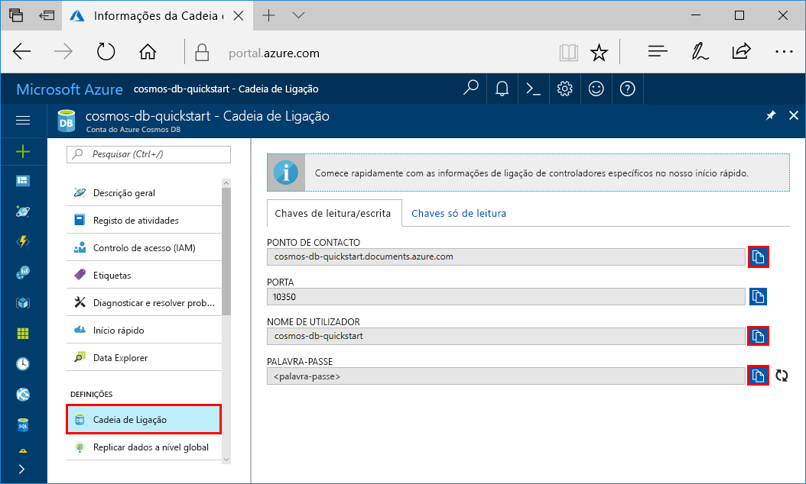
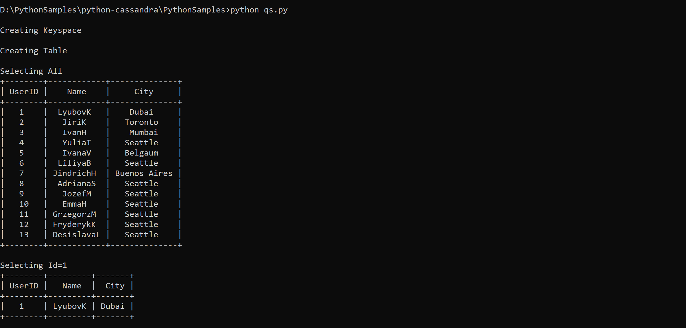
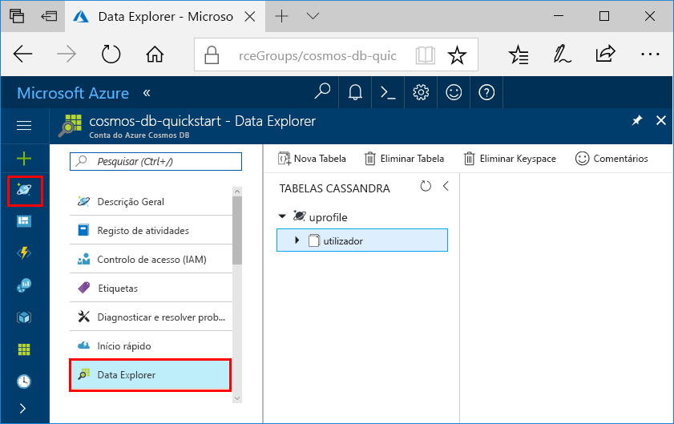

# <a name="quickstart-build-a-cassandra-app-with-python-sdk-and-azure-cosmos-db"></a>Quickstart: Construa uma app Cassandra com Python SDK e Azure Cosmos DB

> [!div class="op_single_selector"]
> * [.NET](create-cassandra-dotnet.md)
> * [Java](create-cassandra-java.md)
> * [Node.js](create-cassandra-nodejs.md)
> * [Python](create-cassandra-python.md)
>  

Neste arranque rápido, cria-se uma conta API Da API da Azure Cosmos DB Cassandra, e usa-se uma aplicação Cassandra Python clonada do GitHub para criar uma base de dados e um contentor da Cassandra. Azure Cosmos DB é um serviço de base de dados multi-modelo que permite criar e consultar rapidamente documentos, tabelas, basede-chaves e bases de dados de gráficos com capacidades de distribuição global e escala horizontal.

## <a name="prerequisites"></a>Pré-requisitos

- Uma conta Azure com uma subscrição ativa. [Crie um de graça.](https://azure.microsoft.com/free/?ref=microsoft.com&utm_source=microsoft.com&utm_medium=docs&utm_campaign=visualstudio) Ou [experimente o Azure Cosmos DB gratuitamente](https://azure.microsoft.com/try/cosmosdb/) sem uma subscrição Azure.
- [Python 2.7.14+ ou 3.4+](https://www.python.org/downloads/).
- [Git.](https://git-scm.com/downloads)
- [Condutor de Python para Apache Cassandra.](https://github.com/datastax/python-driver)

## <a name="create-a-database-account"></a>Criar uma conta de base de dados

Antes de poder criar uma base de dados de documentos, tem de criar uma conta do Cassandra com o Azure Cosmos DB.

[!INCLUDE [cosmos-db-create-dbaccount-cassandra](../../includes/cosmos-db-create-dbaccount-cassandra.md)]

## <a name="clone-the-sample-application"></a>Clonar a aplicação de exemplo

Agora vamos clonar uma aplicação Cassandra API do GitHub, definir a cadeia de ligação e executá-la. Vai ver como é fácil trabalhar com dados programaticamente. 

1. Abra uma linha de comandos. Crie uma nova pasta com o nome `git-samples`. Em seguida, feche a linha de comandos.

    ```bash
    md "C:\git-samples"
    ```

2. Abra uma janela de terminal do git, como o git bash e utilize o comando `cd` para alterar para uma nova pasta e instalar a aplicação de exemplo.

    ```bash
    cd "C:\git-samples"
    ```

3. Execute o seguinte comando para clonar o repositório de exemplo. Este comando cria uma cópia da aplicação de exemplo no seu computador.

    ```bash
    git clone https://github.com/Azure-Samples/azure-cosmos-db-cassandra-python-getting-started.git
    ```

## <a name="review-the-code"></a>Rever o código

Este passo é opcional. Se estiver interessado em saber de que forma o código cria os recursos da base de dados, pode rever os fragmentos seguintes. Os cortes são todos retirados do ficheiro *pyquickstart.py.* Caso contrário, pode avançar diretamente para [Update your connection string (Atualizar a cadeia de ligação)](#update-your-connection-string). 

* Os valores nome de utilizador e palavra-passe são definidos através da página da cadeia de ligação no portal do Azure. O `path\to\cert` fornece um caminho para um certificado X509. 

   ```python
    ssl_opts = {
            'ca_certs': 'path\to\cert',
            'ssl_version': ssl.PROTOCOL_TLSv1_2
            }
    auth_provider = PlainTextAuthProvider( username=cfg.config['username'], password=cfg.config['password'])
    cluster = Cluster([cfg.config['contactPoint']], port = cfg.config['port'], auth_provider=auth_provider, ssl_options=ssl_opts)
    session = cluster.connect()
   
   ```

* O `cluster` é inicializado com informações de contactPoint. O contactPoint é obtido a partir do portal do Azure.

    ```python
   cluster = Cluster([cfg.config['contactPoint']], port = cfg.config['port'], auth_provider=auth_provider)
    ```

* O `cluster` liga à Cassandra API do Azure Cosmos DB.

    ```python
    session = cluster.connect()
    ```

* É criado um novo keyspace.

    ```python
   session.execute('CREATE KEYSPACE IF NOT EXISTS uprofile WITH replication = {\'class\': \'NetworkTopologyStrategy\', \'datacenter1\' : \'1\' }')
    ```

* É criada uma nova tabela.

   ```
   session.execute('CREATE TABLE IF NOT EXISTS uprofile.user (user_id int PRIMARY KEY, user_name text, user_bcity text)');
   ```

* São introduzidas entidades de chave/valor.

    ```Python
    insert_data = session.prepare("INSERT INTO  uprofile.user  (user_id, user_name , user_bcity) VALUES (?,?,?)")
    session.execute(insert_data, [1,'Lybkov','Seattle'])
    session.execute(insert_data, [2,'Doniv','Dubai'])
    session.execute(insert_data, [3,'Keviv','Chennai'])
    session.execute(insert_data, [4,'Ehtevs','Pune'])
    session.execute(insert_data, [5,'Dnivog','Belgaum'])
    ....
    
    ```

* Consulte para obter todas as chaves-valor.

    ```Python
    rows = session.execute('SELECT * FROM uprofile.user')
    ```  
    
* Consulte para obter uma chave-valor.

    ```Python
    
    rows = session.execute('SELECT * FROM uprofile.user where user_id=1')
    ```  

## <a name="update-your-connection-string"></a>Atualizar a cadeia de ligação

Agora, regresse ao portal do Azure para obter as informações da cadeia de ligação e copie-as para a aplicação. A cadeia de ligação permite que a aplicação comunique com a base de dados alojada.

1. Na sua conta Azure Cosmos DB no [portal Azure,](https://portal.azure.com/)selecione **Connection String**. 

    Utilize o  botão à direita do ecrã, para copiar o valor superior, o PONTO DE CONTACTO.

    

2. Abra o ficheiro *config.py.* 

3. Cole o valor do PONTO DE CONTACTO do portal em `<FILLME>` na linha 10.

    A linha 10 deve ter agora um aspeto semelhante a 

    `'contactPoint': 'cosmos-db-quickstarts.cassandra.cosmosdb.azure.com:10350'`

4. Copie o valor do NOME DE UTILIZADOR no portal e cole-o em `<FILLME>` na linha 6.

    A linha 6 deve ter agora um aspeto semelhante a 

    `'username': 'cosmos-db-quickstart',`
    
5. Copie o valor da PALAVRA-PASSE no portal e cole-o em `<FILLME>` na linha 8.

    A linha 8 deve ter agora um aspeto semelhante a

    `'password' = '2Ggkr662ifxz2Mg==`';`

6. Guarde o ficheiro *config.py.*
    
## <a name="use-the-x509-certificate"></a>Utilizar o certificado X509

1. Descarregue o certificado Baltimore [https://cacert.omniroot.com/bc2025.crt](https://cacert.omniroot.com/bc2025.crt)CyberTrust Root localmente a partir de . Mude o nome do ficheiro utilizando a extensão do ficheiro *.cer*.

   O certificado tem o número de série `02:00:00:b9` e a identificação digital SHA1 `d4🇩🇪20:d0:5e:66:fc:53:fe:1a:50:88:2c:78:db:28:52:ca:e4:74`.

2. Abra *pyquickstart.py* e `path\to\cert` mude o ponto para o seu novo certificado.

3. Guarde *pyquickstart.py.*

## <a name="run-the-python-app"></a>Executar a aplicação Python

1. Utilize o comando cd do terminal do Git para mudar para a pasta `azure-cosmos-db-cassandra-python-getting-started`. 

2. Execute os comandos seguintes para instalar os módulos necessários:

    ```python
    python -m pip install cassandra-driver
    python -m pip install prettytable
    python -m pip install requests
    python -m pip install pyopenssl
    ```

2. Execute o seguinte comando para iniciar a sua aplicação Python:

    ```
    python pyquickstart.py
    ```

3. Verifique os resultados como esperado na linha de comandos.

    Prima CTRL+C para parar a execução do programa e fechar a janela da consola. 

    
    
4. No portal do Azure, abra o **Data Explorer** para consultar, modificar e trabalhar com estes dados novos. 

    

## <a name="review-slas-in-the-azure-portal"></a>Rever os SLAs no portal do Azure

[!INCLUDE [cosmosdb-tutorial-review-slas](../../includes/cosmos-db-tutorial-review-slas.md)]

## <a name="clean-up-resources"></a>Limpar recursos

[!INCLUDE [cosmosdb-delete-resource-group](../../includes/cosmos-db-delete-resource-group.md)]

## <a name="next-steps"></a>Passos seguintes

Neste arranque rápido, aprendeu a criar uma conta Azure Cosmos DB com a Cassandra API, e a executar uma app Cassandra Python que cria uma base de dados e um contentor de Cassandra. Agora pode importar dados adicionais para a sua conta Azure Cosmos DB. 

> [!div class="nextstepaction"]
> [Importar dados do Cassandra para o Azure Cosmos DB](cassandra-import-data.md)

