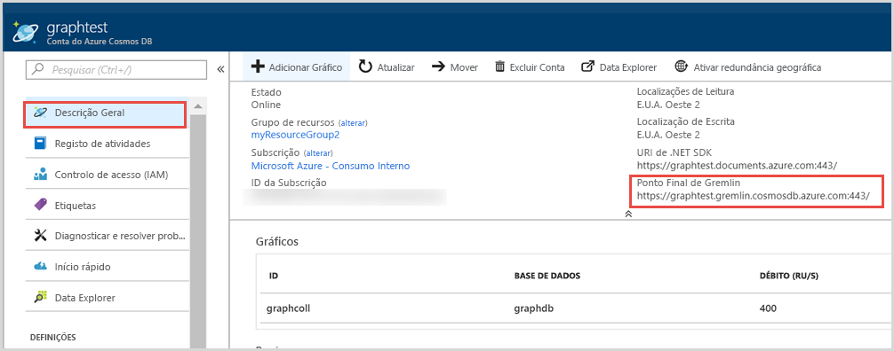
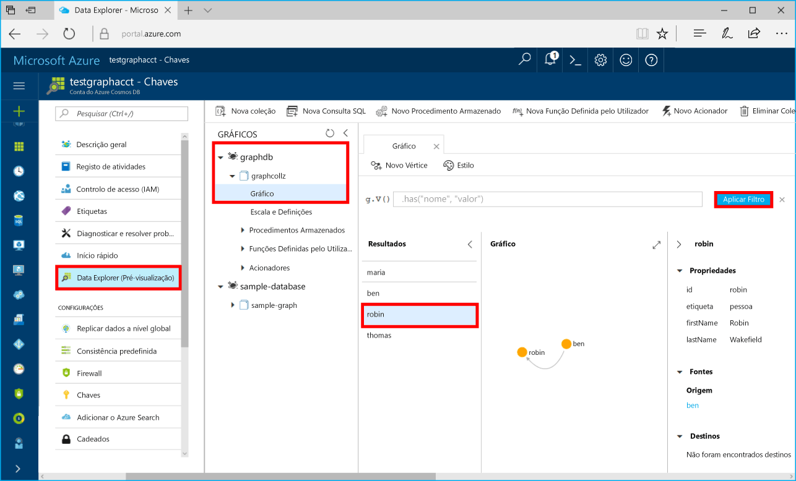

# <a name="quickstart-build-a-net-framework-or-core-application-using-the-azure-cosmos-db-gremlin-api-account"></a>Quickstart: Construa uma aplicação .NET Framework ou Core utilizando a conta API Azure Cosmos DB Gremlin

> [!div class="op_single_selector"]
> * [Consola do Gremlin](create-graph-gremlin-console.md)
> * [.NET](create-graph-dotnet.md)
> * [Java](create-graph-java.md)
> * [Node.js](create-graph-nodejs.md)
> * [python](create-graph-python.md)
> * [PHP](create-graph-php.md)
>  

O Azure Cosmos DB é um serviço de bases de dados com vários modelos e distribuído globalmente da Microsoft. Pode criar e consultar rapidamente o documento, a chave/valor e as bases de dados de gráficos, que beneficiam de capacidades de escalamento horizontal e distribuição global no centro do Azure Cosmos DB. 

Este quickstart demonstra como criar uma conta API Azure Cosmos DB [Gremlin,](graph-introduction.md) base de dados e gráfico (recipiente) usando o portal Azure. Em seguida, irá criar e executar uma aplicação de consola com o controlador open-source [Gremlin.Net](https://tinkerpop.apache.org/docs/3.2.7/reference/#gremlin-DotNet).  

## <a name="prerequisites"></a>Pré-requisitos

Se ainda não tiver o Visual Studio 2019 instalado, pode descarregar e utilizar o [Visual Studio 2019 Community Edition](https://www.visualstudio.com/downloads/) **gratuito.** Confirme que ativa o **desenvolvimento do Azure** durante a configuração do Visual Studio.

[!INCLUDE [quickstarts-free-trial-note](../../includes/quickstarts-free-trial-note.md)]

## <a name="create-a-database-account"></a>Criar uma conta de base de dados

[!INCLUDE [cosmos-db-create-dbaccount-graph](../../includes/cosmos-db-create-dbaccount-graph.md)]

## <a name="add-a-graph"></a>Adicionar um gráfico

[!INCLUDE [cosmos-db-create-graph](../../includes/cosmos-db-create-graph.md)]

## <a name="clone-the-sample-application"></a>Clonar a aplicação de exemplo

Agora vamos clonar uma aplicação da API do Gremlin a partir do GitHub, definir a cadeia de ligação e executá-la. Vai ver como é fácil trabalhar com dados programaticamente. 

1. Abra uma linha de comandos, crie uma nova pasta designada git-samples e, em seguida, feche a linha de comandos.

    ```bash
    md "C:\git-samples"
    ```

2. Abra uma janela de terminal do git, como o git bash e utilize o comando `cd` para alterar para uma nova pasta e instalar a aplicação de exemplo.

    ```bash
    cd "C:\git-samples"
    ```

3. Execute o seguinte comando para clonar o repositório de exemplo. Este comando cria uma cópia da aplicação de exemplo no seu computador.

    ```bash
    git clone https://github.com/Azure-Samples/azure-cosmos-db-graph-gremlindotnet-getting-started.git
    ```

4. Em seguida, abra o Visual Studio e o ficheiro da solução.

5. Restaure os pacotes NuGet no projeto. Isto deve incluir o controlador Gremlin.Net, bem como o pacote Newtonsoft.Json.


6. Também pode instalar manualmente o controlador Gremlin.Net com o gestor de pacotes Nuget ou o [utilitário de linha de comandos do nuget](https://docs.microsoft.com/nuget/install-nuget-client-tools): 

    ```bash
    nuget install Gremlin.Net
    ```

## <a name="review-the-code"></a>Rever o código

Este passo é opcional. Se estiver interessado em aprender de que forma os recursos da base de dados são criados no código, pode consultar os seguintes fragmentos. Caso contrário, pode avançar diretamente para [Update your connection string (Atualizar a cadeia de ligação)](#update-your-connection-string). 

Os seguintes fragmentos são retirados do ficheiro Program.cs.

* Defina os parâmetros de ligação com base na conta acima criada: 

   :::code language="csharp" source="~/azure-cosmosdb-graph-dotnet/GremlinNetSample/Program.cs" id="configureConnectivity":::

* Os comandos Gremlin a executar estão listados num Dicionário:

   :::code language="csharp" source="~/azure-cosmosdb-graph-dotnet/GremlinNetSample/Program.cs" id="defineQueries":::

* Criar uma nova `GremlinServer` e `GremlinClient` objetos de ligação utilizando os parâmetros acima fornecidos:

   :::code language="csharp" source="~/azure-cosmosdb-graph-dotnet/GremlinNetSample/Program.cs" id="defineClientandServerObjects":::

* Execute cada consulta de Gremlin utilizando o objeto `GremlinClient` com uma tarefa de sincronização. Pode ler as consultas de Gremlin do dicionário definidas no passo anterior e executá-las. Mais tarde obtenha o resultado e leia os valores, que são formatados como um dicionário, usando a classe `JsonSerializer` do pacote Newtonsoft.Json:

   :::code language="csharp" source="~/azure-cosmosdb-graph-dotnet/GremlinNetSample/Program.cs" id="executeQueries":::

## <a name="update-your-connection-string"></a>Atualizar a cadeia de ligação

Agora, regresse ao portal do Azure para obter as informações da cadeia de ligação e copie-as para a aplicação.

1. A partir do [portal do Azure](https://portal.azure.com/), navegue até à sua conta da base de dados de gráficos. No separador **Descrição geral**, pode ver dois pontos finais- 
 
   **.NET SDK URI** - Este valor é utilizado quando se conecta à conta de gráfico utilizando a biblioteca Microsoft.Azure.Graphs. 

   **Ponto final do Gremlin** – Este valor é utilizado quando se liga à conta de gráficos através da biblioteca de Gremlin.Net.

    

   Para executar esta amostra, copie o valor **Gremlin Endpoint,** elimine o número da porta no final, ou seja, o URI torna-se `https://<your cosmos db account name>.gremlin.cosmosdb.azure.com`. O valor final deve parecer `testgraphacct.gremlin.cosmosdb.azure.com`

1. Em seguida, navegue para o separador **Keys** e **copie** o valor CHAVE PRIMÁRIO do portal Azure. 

1. Depois de ter copiado a CHAVE URI e PRIMÁRIA da sua conta, guarde-as para uma nova variável ambiental na máquina local que executa a aplicação. Para definir a variável ambiental, abra uma janela de comando rápida e execute o seguinte comando. Certifique-se de substituir os valores <Your_Azure_Cosmos_account_URI> e <Your_Azure_Cosmos_account_PRIMARY_KEY>

   ```console
   setx EndpointUrl "https://<your cosmos db account name>.gremlin.cosmosdb.azure.com"
   setx PrimaryKey "<Your_Azure_Cosmos_account_PRIMARY_KEY>"
   ```

1. Abra o ficheiro *Program.cs* e atualize as variáveis "base de dados e "contentores" com os nomes da base de dados e do contentor (que é também o nome do gráfico) acima criados.

    `private static string database = "your-database-name";` `private static string container = "your-container-or-graph-name";`

1. Guarde o ficheiro Program.cs. 

Atualizou agora a sua aplicação com todas as informações necessárias para comunicar com o Azure Cosmos DB. 

## <a name="run-the-console-app"></a>Executar a aplicação de consola

Clique em CTRL + F5 para executar a aplicação. A aplicação irá imprimir os comandos de consulta Gremlin e os resultados na consola.

   A janela de consola apresenta os vértices e as margens a adicionar ao gráfico. Quando o script tiver concluído, prima ENTER para fechar a janela da consola.

## <a name="browse-using-the-data-explorer"></a>Utilizar o Data Explorer para pesquisar

Agora, pode voltar ao Data Explorer no portal do Azure e procurar e consultar os dados do gráfico novo.

1. No Data Explorer, a nova base de dados é apresentada no painel Gráficos. Expanda a base de dados e os nós do contentor e, em seguida, clique em **Gráfico**.

2. Clique no botão **Aplicar Filtro** para utilizar a consulta predefinida para ver todos os vértices no gráfico. Os dados gerados pela aplicação de exemplo são apresentados no painel Gráficos.

    Pode ampliar e reduzir o gráfico, expandir o espaço de visualização do gráfico, adicionar mais vértices e mover vértices na superfície de visualização.

    

## <a name="review-slas-in-the-azure-portal"></a>Rever os SLAs no portal do Azure

[!INCLUDE [cosmosdb-tutorial-review-slas](../../includes/cosmos-db-tutorial-review-slas.md)]

## <a name="clean-up-resources"></a>Limpar recursos

[!INCLUDE [cosmosdb-delete-resource-group](../../includes/cosmos-db-delete-resource-group.md)]

## <a name="next-steps"></a>Passos seguintes

Neste guia rápido, aprendeu a criar uma conta do Azure Cosmos DB, a criar um gráfico com o Data Explorer e a executar uma aplicação. Agora, pode criar consultas mais complexas e implementar lógica poderosa para percorrer gráficos com Gremlin. 

> [!div class="nextstepaction"]
> [Query using Gremlin](tutorial-query-graph.md) (Utilizar Gremlin para consultar)

