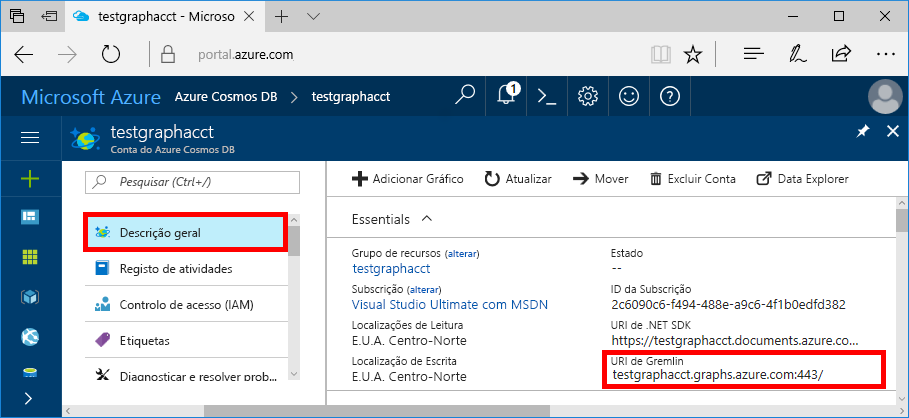
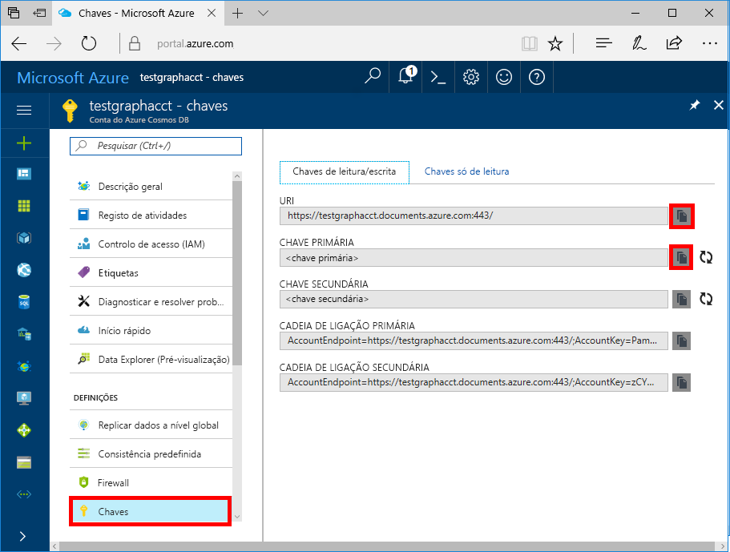

# <a name="quickstart-build-a-nodejs-application-by-using-azure-cosmos-db-gremlin-api-account"></a>Início rápido: Criar um aplicativo node. js usando Azure Cosmos DB conta da API Gremlin

> [!div class="op_single_selector"]
> * [Consola do Gremlin](create-graph-gremlin-console.md)
> * [.NET](create-graph-dotnet.md)
> * [Java](create-graph-java.md)
> * [Node.js](create-graph-nodejs.md)
> * [Python](create-graph-python.md)
> * [PHP](create-graph-php.md)
>  

O Azure Cosmos DB é um serviço de bases de dados da Microsoft com vários modelos e distribuído globalmente. Pode criar e consultar rapidamente o documento, a chave/valor e as bases de dados de gráficos, que beneficiam de capacidades de escalamento horizontal e distribuição global no centro do Azure Cosmos DB. 

Este guia de início rápido demonstra como criar um Azure Cosmos DB uma conta de [API Gremlin](graph-introduction.md) , um banco de dados e um grafo usando o portal do Azure. Em seguida, irá criar e executar uma aplicação de consola com o controlador [Gremlin Node.js](https://www.npmjs.com/package/gremlin) «open-source».

## <a name="prerequisites"></a>Pré-requisitos

Antes de poder executar este exemplo, tem de ter os pré-requisitos seguintes:
* Versão de [Node.js](https://nodejs.org/en/) v0.10.29 ou superior
* [Git](https://git-scm.com/)

[!INCLUDE [quickstarts-free-trial-note](../../includes/quickstarts-free-trial-note.md)]

## <a name="create-a-database-account"></a>Criar uma conta de base de dados

[!INCLUDE [cosmos-db-create-dbaccount-graph](../../includes/cosmos-db-create-dbaccount-graph.md)]

## <a name="add-a-graph"></a>Adicionar um gráfico

[!INCLUDE [cosmos-db-create-graph](../../includes/cosmos-db-create-graph.md)]

## <a name="clone-the-sample-application"></a>Clonar a aplicação de exemplo

Agora vamos clonar uma aplicação da API do Gremlin a partir do GitHub, definir a cadeia de ligação e executá-la. Vai ver como é fácil trabalhar com dados programaticamente. 

1. Abra uma linha de comandos, crie uma nova pasta designada git-samples e, em seguida, feche a linha de comandos.

    ```bash
    md "C:\git-samples"
    ```

2. Abra uma janela de terminal do git, como o git bash e utilize o comando `cd` para alterar para uma nova pasta e instalar a aplicação de exemplo.

    ```bash
    cd "C:\git-samples"
    ```

3. Execute o seguinte comando para clonar o repositório de exemplo. Este comando cria uma cópia da aplicação de exemplo no seu computador.

    ```bash
    git clone https://github.com/Azure-Samples/azure-cosmos-db-graph-nodejs-getting-started.git
    ```

3. Abra o ficheiro da solução no Visual Studio. 

## <a name="review-the-code"></a>Rever o código

Este passo é opcional. Se estiver interessado em aprender de que forma os recursos da base de dados são criados no código, pode consultar os seguintes fragmentos. Caso contrário, pode avançar diretamente para [Update your connection string (Atualizar a cadeia de ligação)](#update-your-connection-string). 

Os seguintes fragmentos são retirados do ficheiro app.js.

* O cliente Gremlin é criado.

    ```javascript
    const authenticator = new Gremlin.driver.auth.PlainTextSaslAuthenticator(
        `/dbs/${config.database}/colls/${config.collection}`, 
        config.primaryKey
    )


    const client = new Gremlin.driver.Client(
        config.endpoint, 
        { 
            authenticator,
            traversalsource : "g",
            rejectUnauthorized : true,
            mimeType : "application/vnd.gremlin-v2.0+json"
        }
    );

    ```

  As configurações estão todas em `config.js` e podem ser editadas [na secção seguinte](#update-your-connection-string).

* São definidas diversas funções para executar diferentes operações do Gremlin. Esta é uma delas:

    ```javascript
    function addVertex1()
    {
        console.log('Running Add Vertex1'); 
        return client.submit("g.addV(label).property('id', id).property('firstName', firstName).property('age', age).property('userid', userid).property('pk', 'pk')", {
                label:"person",
                id:"thomas",
                firstName:"Thomas",
                age:44, userid: 1
            }).then(function (result) {
                    console.log("Result: %s\n", JSON.stringify(result));
            });
    }
    ```

* Cada função executa um método `client.execute` com um parâmetro de cadeia de consulta do Gremlin. Eis um exemplo de como `g.V().count()` é executada:

    ```javascript
    function countVertices()
    {
        console.log('Running Count');
        return client.submit("g.V().count()", { }).then(function (result) {
            console.log("Result: %s\n", JSON.stringify(result));
        });
    }
    ```

* No final do arquivo, todos os métodos são invocados. Esta ação irá executar uma após a outra:

    ```javascript
    client.open()
    .then(dropGraph)
    .then(addVertex1)
    .then(addVertex2)
    .then(addEdge)
    .then(countVertices)
    .catch((err) => {
        console.error("Error running query...");
        console.error(err)
    }).then((res) => {
        client.close();
        finish();
    }).catch((err) => 
        console.error("Fatal error:", err)
    );
    ```


## <a name="update-your-connection-string"></a>Atualizar a cadeia de ligação

1. Abra o ficheiro config.js. 

2. No config.js, preencha a chave `config.endpoint` com o valor **URI de Gremlin** a partir da página **Descrição Geral** do portal do Azure. 

    `config.endpoint = "https://<your_Gremlin_account_name>.gremlin.cosmosdb.azure.com:443/";`

    

3. No config.js, preencha o valor de config.primaryKey com o valor da **Chave Primária** a partir da página **Chaves** do portal do Azure. 

    `config.primaryKey = "PRIMARYKEY";`

   

4. Insira o nome da base de dados e o nome de gráfico (contentor) para o valor de config.database e config.collection. 

Eis um exemplo de como deve ser o aspeto do seu ficheiro config.js concluído:

```javascript
var config = {}

// Note that this must not have HTTPS or the port number
config.endpoint = "https://testgraphacct.gremlin.cosmosdb.azure.com:443/"; 
config.primaryKey = "Pams6e7LEUS7LJ2Qk0fjZf3eGo65JdMWHmyn65i52w8ozPX2oxY3iP0yu05t9v1WymAHNcMwPIqNAEv3XDFsEg==";
config.database = "graphdb"
config.collection = "Persons"

module.exports = config;
```

## <a name="run-the-console-app"></a>Executar a aplicação de consola

1. Abra uma janela do terminal e mude (como o comando `cd`) para o diretório de instalação, para o ficheiro package.json que está incluído no projeto.

2. Execute `npm install` para instalar os módulos npm necessários, incluindo `gremlin`.

3. Execute `node app.js` num terminal para iniciar a aplicação Node.js.

## <a name="browse-with-data-explorer"></a>Procurar com o Data Explorer

Agora, pode voltar ao Data Explorer no portal do Azure para ver, consultar, alterar e trabalhar os dados do gráfico novo.

No Data Explorer, a nova base de dados é apresentada no painel **Gráficos**. Expanda a base de dados, seguido do contentor e, em seguida, selecione **Gráfico**.

Os dados gerados pela aplicação de exemplo são apresentados no painel seguinte dentro do separador **Gráfico** quando selecionar **Aplicar Filtro**.

Experimente concluir `g.V()` com `.has('firstName', 'Thomas')`, para testar o filtro. Tenha em atenção que o valor é sensível às maiúsculas e minúsculas.

## <a name="review-slas-in-the-azure-portal"></a>Rever os SLAs no portal do Azure

[!INCLUDE [cosmosdb-tutorial-review-slas](../../includes/cosmos-db-tutorial-review-slas.md)]

## <a name="clean-up-your-resources"></a>Apague os seus recursos

[!INCLUDE [cosmosdb-delete-resource-group](../../includes/cosmos-db-delete-resource-group.md)]

## <a name="next-steps"></a>Passos Seguintes

Neste artigo, aprendeu a criar uma conta do Azure Cosmos DB, a criar um gráfico com o Data Explorer e a executar uma aplicação. Agora pode criar consultas mais complexas e implementar a lógica de passagem de gráfico através do Gremlin. 

> [!div class="nextstepaction"]
> [Utilizar Gremlin para consultar](tutorial-query-graph.md)
