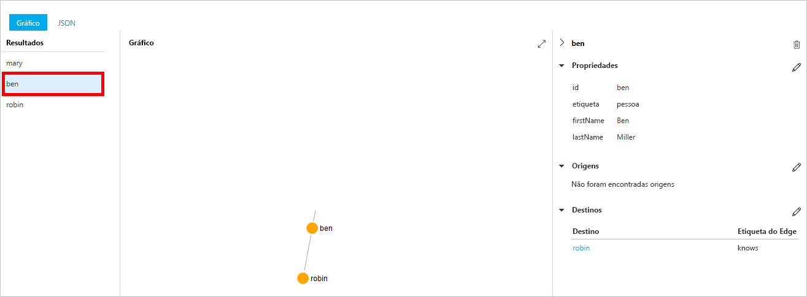
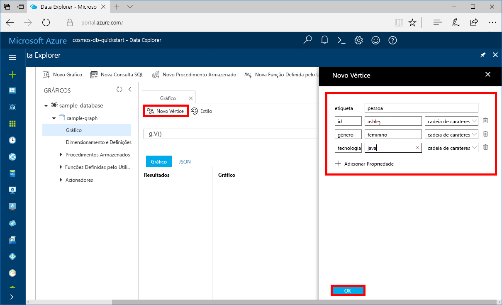
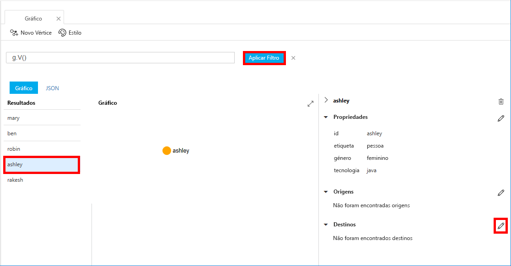
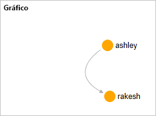

# <a name="quickstart-create-a-graph-database-in-azure-cosmos-db-using-python-and-the-azure-portal"></a>Quickstart: Criar uma base de dados de gráficos em Azure Cosmos DB usando Python e o portal Azure

> [!div class="op_single_selector"]
> * [Consola do Gremlin](create-graph-gremlin-console.md)
> * [.NET](create-graph-dotnet.md)
> * [Java](create-graph-java.md)
> * [Node.js](create-graph-nodejs.md)
> * [Python](create-graph-python.md)
> * [PHP](create-graph-php.md)
>  

Neste quickstart, você cria e gere uma conta API AZure Cosmos DB Gremlin (gráfico) a partir do portal Azure, e adiciona dados usando uma aplicação Python clonada do GitHub. Azure Cosmos DB é um serviço de base de dados multi-modelo que permite criar e consultar rapidamente documentos, tabelas, valor-chave e bases de dados de gráficos com capacidades de distribuição global e escala horizontal.

## <a name="prerequisites"></a>Pré-requisitos
- Uma conta Azure com uma subscrição ativa. [Crie um de graça.](https://azure.microsoft.com/free/?ref=microsoft.com&utm_source=microsoft.com&utm_medium=docs&utm_campaign=visualstudio) Ou [experimente a Azure Cosmos DB gratuitamente](https://azure.microsoft.com/try/cosmosdb/) sem uma subscrição do Azure.
- [Python 3.5+](https://www.python.org/downloads/) incluindo o instalador [de pacotes de pip.](https://pip.pypa.io/en/stable/installing/)
- [Python Driver for Gremlin.](https://github.com/apache/tinkerpop/tree/master/gremlin-python)
- [Git.](https://git-scm.com/downloads)

> [!NOTE]
> Este guia de introdução exige uma conta de base de dados de gráficos que tenha sido criada numa data posterior a 20 de dezembro de 2017. As contas existentes irão suportar Python depois de serem migradas para disponibilidade geral.

## <a name="create-a-database-account"></a>Criar uma conta de base de dados

Antes de poder criar uma base de dados de gráficos, tem de criar uma conta de base de dados do Gremlin (Gráfico) com o Azure Cosmos DB.

[!INCLUDE [cosmos-db-create-dbaccount-graph](../../includes/cosmos-db-create-dbaccount-graph.md)]

## <a name="add-a-graph"></a>Adicionar um gráfico

[!INCLUDE [cosmos-db-create-graph](../../includes/cosmos-db-create-graph.md)]

## <a name="clone-the-sample-application"></a>Clonar a aplicação de exemplo

Agora, vamos trabalhar com código. Vamos clonar uma aplicação API do Gremlin a partir do GitHub, definir a cadeia de ligação e executá-la. Vai ver como é fácil trabalhar com dados programaticamente.  

1. Abra uma linha de comandos, crie uma nova pasta designada git-samples e, em seguida, feche a linha de comandos.

    ```bash
    md "C:\git-samples"
    ```

2. Abra uma janela de terminal do git, como o git bash e utilize o comando `cd` para alterar para uma pasta e instalar a aplicação de exemplo.  

    ```bash
    cd "C:\git-samples"
    ```

3. Execute o seguinte comando para clonar o repositório de exemplo. Este comando cria uma cópia da aplicação de exemplo no seu computador. 

    ```bash
    git clone https://github.com/Azure-Samples/azure-cosmos-db-graph-python-getting-started.git
    ```

## <a name="review-the-code"></a>Rever o código

Este passo é opcional. Se estiver interessado em aprender de que forma os recursos da base de dados são criados no código, pode consultar os seguintes fragmentos. Os snippets são todos retirados do ficheiro *connect.py* na pasta *C:\git-samples\azure-cosmos-db-graph-python-start-starter- \\ * fold. Caso contrário, pode avançar diretamente para [Update your connection string (Atualizar a cadeia de ligação)](#update-your-connection-information). 

* O Gremlin `client` é rubricado na linha 104 em *connect.py:*

    ```python
    ...
    client = client.Client('wss://<YOUR_ENDPOINT>.gremlin.cosmosdb.azure.com:443/','g', 
        username="/dbs/<YOUR_DATABASE>/colls/<YOUR_COLLECTION_OR_GRAPH>", 
        password="<YOUR_PASSWORD>")
    ...
    ```

* Uma série de passos gremlin são declarados no início do ficheiro *connect.py.* Em seguida, são executados com o método `client.submitAsync()`:

    ```python
    client.submitAsync(_gremlin_cleanup_graph)
    ```

## <a name="update-your-connection-information"></a>Atualizar as informações da ligação

Agora, regresse ao portal do Azure para obter as informações da ligação e copie-as para a aplicação. Estas definições permitem à aplicação comunicar com a base de dados alojada.

1. Na sua conta DB Azure Cosmos no [portal Azure,](https://portal.azure.com/)selecione **Keys**. 

    Copie a primeira parte do valor do URI.

    

2. Abra o ficheiro *connect.py* e na linha 104 cole o valor URI `<YOUR_ENDPOINT>` aqui:

    ```python
    client = client.Client('wss://<YOUR_ENDPOINT>.gremlin.cosmosdb.azure.com:443/','g', 
        username="/dbs/<YOUR_DATABASE>/colls/<YOUR_COLLECTION_OR_GRAPH>", 
        password="<YOUR_PASSWORD>")
    ```

    A parte do URI do objeto de cliente deve agora ter um aspeto semelhante a este código:

    ```python
    client = client.Client('wss://test.gremlin.cosmosdb.azure.com:443/','g', 
        username="/dbs/<YOUR_DATABASE>/colls/<YOUR_COLLECTION_OR_GRAPH>", 
        password="<YOUR_PASSWORD>")
    ```

3. Altere o segundo parâmetro do objeto `client` para substituir as cadeias `<YOUR_DATABASE>` e `<YOUR_COLLECTION_OR_GRAPH>`. Se utilizou os valores sugeridos, o parâmetro deve ser semelhante a este código:

    `username="/dbs/sample-database/colls/sample-graph"`

    O objeto `client` completo deverá agora ser semelhante a este código:

    ```python
    client = client.Client('wss://test.gremlin.cosmosdb.azure.com:443/','g', 
        username="/dbs/sample-database/colls/sample-graph", 
        password="<YOUR_PASSWORD>")
    ```

4. Na página **Chaves,** utilize o botão de cópia para copiar a CHAVE PRINCIPAL e `<YOUR_PASSWORD>` cole-a no `password=<YOUR_PASSWORD>` parâmetro.

    A definição do objeto `client` completa deve agora ser semelhante a este código:
    ```python
    client = client.Client('wss://test.gremlin.cosmosdb.azure.com:443/','g', 
        username="/dbs/sample-database/colls/sample-graph", 
        password="asdb13Fadsf14FASc22Ggkr662ifxz2Mg==")
    ```

6. Guarde o ficheiro *connect.py.*

## <a name="run-the-console-app"></a>Executar a aplicação de consola

1. Na janela de terminal do git, `cd` na pasta azure-cosmos-db-graph-python-getting-started.

    ```git
    cd "C:\git-samples\azure-cosmos-db-graph-python-getting-started"
    ```

2. Na janela de terminal do git, utilize o seguinte comando para instalar os pacotes Python necessários.

   ```
   pip install -r requirements.txt
   ```

3. Na janela de terminal do git, utilize o seguinte comando para iniciar a aplicação Python.
    
    ```
    python connect.py
    ```

    A janela de terminal apresenta os vértices e as extremidades que estão a ser adicionados ao gráfico. 
    
    Se ocorrerem erros de tempo limite, verifique se atualizou as informações de ligação corretamente em [Atualizar as suas informações de ligação](#update-your-connection-information) e tente executar o último comando novamente. 
    
    Assim que o programa parar, prima Enter e, em seguida, mude novamente para o portal do Azure no browser.

<a id="add-sample-data"></a>
## <a name="review-and-add-sample-data"></a>Rever e adicionar dados de exemplo

Depois de inserir os vértices e bordas, pode agora voltar ao Data Explorer e ver os vértices adicionados ao gráfico e adicionar pontos de dados adicionais.

1. Na sua conta DB Azure Cosmos no portal Azure, selecione **Data Explorer,** expanda **o gráfico de amostras,** selecione **Graph**, e, em seguida, selecione **Apply Filter**. 

   

2. Na lista **de Resultados,** note que três novos utilizadores são adicionados ao gráfico. Pode mover os vértices ao redor ao arrastar e largar, ampliar e reduzir ao deslocar a roda do rato e expandir o tamanho do gráfico com a seta dupla. 

   

3. Vamos adicionar alguns utilizadores novos. Selecione o botão **Novo Vértex** para adicionar dados ao seu gráfico.

   

4. Introduza uma etiqueta de *pessoa*.

5. **Selecione Adicionar propriedade** para adicionar cada uma das seguintes propriedades. Tenha em atenção que pode criar propriedades exclusivas para cada pessoa no seu gráfico. Só é necessária a chave de id.

    chave|valor|Notas
    ----|----|----
    pk|/pk| 
    ID|ashley|O identificador exclusivo do vértice. Se não especificar, é gerado um id automaticamente.
    género|feminino| 
    técnico | java | 

    > [!NOTE]
    > Neste guia de introdução, criámos uma coleção não particionada. No entanto, se criar uma coleção particionada mediante a especificação de uma chave de partição durante a criação da coleção, terá de incluir a chave da partição como uma chave em cada vértice novo. 

6. Selecione **OK**. Poderá ter de expandir o ecrã para ver **OK**, na parte inferior.

7. Selecione **Novo Vertex** novamente e adicione um novo utilizador adicional. 

8. Introduza uma etiqueta de *pessoa*.

9. **Selecione Adicionar propriedade** para adicionar cada uma das seguintes propriedades:

    chave|valor|Notas
    ----|----|----
    pk|/pk| 
    ID|rakesh|O identificador exclusivo do vértice. Se não especificar, é gerado um id automaticamente.
    género|masculino| 
    escola|MIT| 

10. Selecione **OK**. 

11. Selecione o botão **'Aplicar filtro'** com o filtro predefinido `g.V()` para visualizar todos os valores do gráfico. Todos os utilizadores aparecem agora na lista **Resultados**. 

    À medida que adiciona mais dados, pode utilizar filtros para limitar os resultados. Por predefinição, o Data Explorer utiliza o `g.V()` para obter todos os vértices num gráfico. Pode alterá-lo para uma [consulta de gráfico](tutorial-query-graph.md) diferente, como `g.V().count()`, para devolver uma contagem de todos os vértices no gráfico no formato JSON. Se tiver mudado o filtro, volte a alterar o filtro `g.V()` e selecione **Apply Filter** para exibir todos os resultados novamente.

12. Agora, podemos ligar rakesh e ashley. Certifique-se de que a **ashley** está selecionada na lista **de Resultados** e, em seguida, selecione o botão de edição ao lado **dos Alvos** no lado inferior direito. Poderá ter de alargar a janela para ver a área **Propriedades**.

    

13. Na **caixa-alvo** *rakesh*, e no tipo de caixa **de etiqueta Edge** *sabe*, e, em seguida, selecione a verificação.

    

14. Agora, selecione **rakesh** na lista de resultados e veja se ashley e rakesh estão ligados. 

    

Esta ação conclui a parte da criação de recursos deste tutorial. Pode continuar a adicionar vértices ao seu gráfico, modificar os vértices existentes ou alterar as consultas. Agora vamos rever as métricas que o Azure Cosmos DB oferece e, em seguida, limpar os recursos. 

## <a name="review-slas-in-the-azure-portal"></a>Rever os SLAs no portal do Azure

[!INCLUDE [cosmosdb-tutorial-review-slas](../../includes/cosmos-db-tutorial-review-slas.md)]

## <a name="clean-up-resources"></a>Limpar recursos

[!INCLUDE [cosmosdb-delete-resource-group](../../includes/cosmos-db-delete-resource-group.md)]

## <a name="next-steps"></a>Passos seguintes

Neste quickstart, aprendeu a criar uma conta DB Azure Cosmos, criar um gráfico utilizando o Data Explorer e executar uma aplicação Python para adicionar dados ao gráfico. Agora, pode criar consultas mais complexas e implementar lógica poderosa para percorrer gráficos com Gremlin. 

> [!div class="nextstepaction"]
> [Query using Gremlin](tutorial-query-graph.md) (Utilizar Gremlin para consultar)

