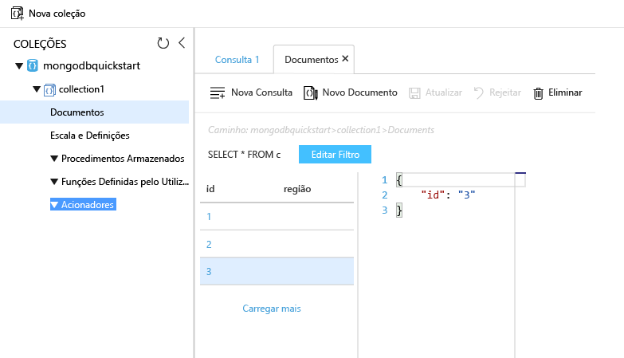

# <a name="quickstart-migrate-an-existing-mongodb-nodejs-web-app-to-azure-cosmos-db"></a>Quickstart: Migrar uma aplicação web mongoDB node.js existente para Azure Cosmos DB 

> [!div class="op_single_selector"]
> * [.NET](create-mongodb-dotnet.md)
> * [Java](create-mongodb-java.md)
> * [Node.js](create-mongodb-nodejs.md)
> * [Python](create-mongodb-flask.md)
> * [Xamarin](create-mongodb-xamarin.md)
> * [Golang](create-mongodb-golang.md)
>  

Neste arranque rápido, cria-se e gere-se uma conta Azure Cosmos DB para mongo DB API utilizando a Concha de Nuvem Azure, e com uma app MEAN (MongoDB, Express, Angular e Node.js) clonada do GitHub. Azure Cosmos DB é um serviço de base de dados multi-modelo que permite criar e consultar rapidamente documentos, tabelas, basede-chaves e bases de dados de gráficos com capacidades de distribuição global e escala horizontal.

## <a name="prerequisites"></a>Pré-requisitos
- Uma conta Azure com uma subscrição ativa. [Crie um de graça.](https://azure.microsoft.com/free/?ref=microsoft.com&utm_source=microsoft.com&utm_medium=docs&utm_campaign=visualstudio) Ou [experimente o Azure Cosmos DB gratuitamente](https://azure.microsoft.com/try/cosmosdb/) sem uma subscrição Azure. Também pode utilizar o [Emulador DB Azure Cosmos](https://aka.ms/cosmosdb-emulator) com a corda `.mongodb://localhost:C2y6yDjf5/R+ob0N8A7Cgv30VRDJIWEHLM+4QDU5DE2nQ9nDuVTqobD4b8mGGyPMbIZnqyMsEcaGQy67XIw/Jw==@localhost:10255/admin?ssl=true`de ligação .
- [Node.js,](https://nodejs.org/)e um conhecimento de trabalho de Node.js.
- [Git.](https://git-scm.com/downloads)
- Se não quiser utilizar a Azure Cloud Shell, [Azure CLI 2.0+](/cli/azure/install-azure-cli).

[!INCLUDE [cloud-shell-try-it](../../includes/cloud-shell-try-it.md)]

## <a name="clone-the-sample-application"></a>Clonar a aplicação de exemplo

Execute os seguintes comandos para clonar o repositório de exemplo. Este repositório de exemplo contém a aplicação [MEAN.js](https://meanjs.org/) predefinida.

1. Abra uma linha de comandos, crie uma nova pasta designada git-samples e, em seguida, feche a linha de comandos.

    ```bash
    mkdir "C:\git-samples"
    ```

2. Abra uma janela de terminal do git, como o git bash e utilize o comando `cd` para alterar para uma nova pasta e instalar a aplicação de exemplo.

    ```bash
    cd "C:\git-samples"
    ```

3. Execute o seguinte comando para clonar o repositório de exemplo. Este comando cria uma cópia da aplicação de exemplo no seu computador. 

    ```bash
    git clone https://github.com/prashanthmadi/mean
    ```

## <a name="run-the-application"></a>Executar a aplicação

Esta aplicação MongoDB escrita no Node.js liga-se à sua base de dados Azure Cosmos DB, que suporta o cliente MongoDB. Por outras palavras, é transparente para a aplicação que os dados são armazenados numa base de dados Da Azure Cosmos DB.

Instale os pacotes necessários e inicie a aplicação.

```bash
cd mean
npm install
npm start
```
A aplicação irá tentar ligar a uma origem do MongoDB e falhar, saia da aplicação quando devolver o resultado "[MongoError: connect ECONNREFUSED 127.0.0.1:27017]".

## <a name="sign-in-to-azure"></a>Iniciar sessão no Azure

Se optar por instalar e usar a CLI localmente, este tópico requer a execução da versão 2.0 ou posterior da CLI do Azure. Executar `az --version` para localizar a versão. Se precisar de instalar ou atualizar, consulte [Instale o Azure CLI]. 

Se estiver a utilizar um Azure CLI instalado, inicie sessão na subscrição do Azure com o comando [de login az](/cli/azure/reference-index#az-login) e siga as instruções no ecrã. Pode ignorar esta etapa se estiver a utilizar o Azure Cloud Shell.

```azurecli
az login 
``` 
   
## <a name="add-the-azure-cosmos-db-module"></a>Adicionar o módulo Azure Cosmos DB

Se estiver a utilizar uma CLI do Azure instalada, veja se o componente `cosmosdb` já está instalado ao executar o comando `az`. Se `cosmosdb` está na lista de comandos de base, siga para o próximo comando. Pode ignorar esta etapa se estiver a utilizar o Azure Cloud Shell.

Se `cosmosdb` não estiver na lista de comandos de base, reinstale a [CLI do Azure](/cli/azure/install-azure-cli).

## <a name="create-a-resource-group"></a>Criar um grupo de recursos

Criar um [grupo de recursos](../azure-resource-manager/management/overview.md) com o grupo [Az criar](/cli/azure/group#az-group-create). Um grupo de recursos do Azure é um contentor lógico no qual os recursos do Azure, como aplicações Web, bases de dados e contas de armazenamento, são implementados e geridos. 

O exemplo seguinte cria um grupo de recursos na região Europa Ocidental. Escolha um nome exclusivo para o grupo de recursos.

Se estiver a utilizar a Casca de Nuvem Azure, selecione **Try It**, siga as instruções no ecrã para iniciar sessão e, em seguida, copie o comando para o pedido de comando.

```azurecli-interactive
az group create --name myResourceGroup --location "West Europe"
```

## <a name="create-an-azure-cosmos-db-account"></a>Criar uma conta do Azure Cosmos DB

Crie uma conta Cosmos com o [az cosmosdb criar](/cli/azure/cosmosdb#az-cosmosdb-create) comando.

No seguinte comando, substitua o seu nome único `<cosmosdb-name>` de conta Cosmos onde vê o espaço reservado. Este nome único será usado como parte do`https://<cosmosdb-name>.documents.azure.com/`seu ponto final cosmos DB , por isso o nome precisa ser único em todas as contas da Cosmos em Azure. 

```azurecli-interactive
az cosmosdb create --name <cosmosdb-name> --resource-group myResourceGroup --kind MongoDB
```

O parâmetro `--kind MongoDB` permite ligações de cliente da MongoDB.

Após criar a conta do DB Cosmos Azure, a CLI do Azure mostra informações semelhantes ao exemplo seguinte. 

> [!NOTE]
> Este exemplo utiliza o JSON como formato de saída da CLI do Azure, que é a predefinição. Para utilizar outro formato de saída, veja [Formatos de saída para os comandos da CLI do Azure](https://docs.microsoft.com/cli/azure/format-output-azure-cli).

```json
{
  "databaseAccountOfferType": "Standard",
  "documentEndpoint": "https://<cosmosdb-name>.documents.azure.com:443/",
  "id": "/subscriptions/00000000-0000-0000-0000-000000000000/resourceGroups/myResourceGroup/providers/Microsoft.Document
DB/databaseAccounts/<cosmosdb-name>",
  "kind": "MongoDB",
  "location": "West Europe",
  "name": "<cosmosdb-name>",
  "readLocations": [
    {
      "documentEndpoint": "https://<cosmosdb-name>-westeurope.documents.azure.com:443/",
      "failoverPriority": 0,
      "id": "<cosmosdb-name>-westeurope",
      "locationName": "West Europe",
      "provisioningState": "Succeeded"
    }
  ],
  "resourceGroup": "myResourceGroup",
  "type": "Microsoft.DocumentDB/databaseAccounts",
  "writeLocations": [
    {
      "documentEndpoint": "https://<cosmosdb-name>-westeurope.documents.azure.com:443/",
      "failoverPriority": 0,
      "id": "<cosmosdb-name>-westeurope",
      "locationName": "West Europe",
      "provisioningState": "Succeeded"
    }
  ]
} 
```

## <a name="connect-your-nodejs-application-to-the-database"></a>Ligar a aplicação Node.js à base de dados

Neste passo, liga a sua aplicação de amostra MEAN.js à conta de base de dados Azure Cosmos DB que acabou de criar. 

<a name="devconfig"></a>
## <a name="configure-the-connection-string-in-your-nodejs-application"></a>Configurar a cadeia de ligação na aplicação Node.js

No repositório MEAN.js, abra `config/env/local-development.js`.

Substitua o conteúdo deste ficheiro pelo código seguinte. Certifique-se de que `<cosmosdb-name>` também substitui os dois espaços reservados pelo nome da sua conta Cosmos.

```javascript
'use strict';

module.exports = {
  db: {
    uri: 'mongodb://<cosmosdb-name>:<primary_master_key>@<cosmosdb-name>.documents.azure.com:10255/mean-dev?ssl=true&sslverifycertificate=false'
  }
};
```

## <a name="retrieve-the-key"></a>Obter a chave

Para se ligar a uma base de dados da Cosmos, precisa da chave de base de dados. Use o comando da lista de [chaves az cosmosdb](/cli/azure/cosmosdb/keys#az-cosmosdb-keys-list) para recuperar a chave primária.

```azurecli-interactive
az cosmosdb keys list --name <cosmosdb-name> --resource-group myResourceGroup --query "primaryMasterKey"
```

A CLI do Azure apresenta informações semelhantes ao exemplo seguinte. 

```json
"RUayjYjixJDWG5xTqIiXjC..."
```

Copie o valor de `primaryMasterKey`. Cole-o em `<primary_master_key>` em `local-development.js`.

Guarde as alterações.

### <a name="run-the-application-again"></a>Execute novamente a aplicação.

Execute novamente `npm start`. 

```bash
npm start
```

Uma mensagem de consola deverá agora indicar que o ambiente de desenvolvimento está ativo e em execução. 

Vá `http://localhost:3000` a um navegador. Selecione **Inscrever-se** no menu superior e tente criar dois utilizadores de bonecos. 

A aplicação MEAN.js de exemplo armazena os dados do utilizador na base de dados. Se o procedimento for concluído com êxito e a aplicação MEAN.js iniciar automaticamente sessão com o utilizador criado, significa que a ligação do DB Cosmos Azure está a funcionar. 


## <a name="view-data-in-data-explorer"></a>Ver dados no Data Explorer

Os dados armazenados numa base de dados da Cosmos estão disponíveis para visualização e consulta no portal Azure.

Para ver, consultar e trabalhar com os dados do utilizador criados no passo anterior, inicie a sessão no [portal do Azure](https://portal.azure.com) no browser.

Na caixa de pesquisa superior, entre em **Azure Cosmos DB**. Quando a sua lâmina de conta Cosmos abrir, selecione a sua conta Cosmos. Na navegação à esquerda, selecione **Data Explorer**. Expanda a coleção no painel Coleções e, em seguida, pode ver os documentos na coleção, consultar os dados e, ainda, criar e executar UDFs, acionadores e procedimentos armazenados. 




## <a name="deploy-the-nodejs-application-to-azure"></a>Implementar a aplicação Node.js no Azure

Neste passo, você implementa a sua aplicação Node.js para cosmos DB.

Poderá ter reparado que o ficheiro de configuração que alterou anteriormente se destina ao ambiente de desenvolvimento (`/config/env/local-development.js`). Ao implementar a aplicação no Serviço de Aplicações, esta será executada, por predefinição, no ambiente de produção. Por isso, agora, tem de efetuar a mesma alteração no ficheiro de configuração respetivo.

No repositório MEAN.js, abra `config/env/production.js`.

No objeto `db`, substitua o valor do `uri`, conforme apresentado no exemplo seguinte. Confirme que substitui os marcadores de posição, como indicado anteriormente.

```javascript
'mongodb://<cosmosdb-name>:<primary_master_key>@<cosmosdb-name>.documents.azure.com:10255/mean?ssl=true&sslverifycertificate=false',
```

> [!NOTE] 
> A `ssl=true` opção é importante devido aos requisitos da Cosmos DB. Para mais informações, consulte [os requisitos](connect-mongodb-account.md#connection-string-requirements)de cadeia de ligação .
>
>

No terminal, confirme todas as alterações no Git. Pode copiar os dois comandos para executá-los em simultâneo.

```bash
git add .
git commit -m "configured MongoDB connection string"
```
## <a name="clean-up-resources"></a>Limpar recursos

[!INCLUDE [cosmosdb-delete-resource-group](../../includes/cosmos-db-delete-resource-group.md)]

## <a name="next-steps"></a>Passos seguintes

Neste arranque rápido, aprendeu a criar uma conta API Azure Cosmos DB MongoDB utilizando a Azure Cloud Shell, e criar e executar uma app MEAN.js para adicionar utilizadores à conta. Agora, pode importar dados adicionais para a sua conta do Azure Cosmos DB.

> [!div class="nextstepaction"]
> [Import MongoDB data into Azure Cosmos DB](mongodb-migrate.md) (Importar dados do MongoDB para o Azure Cosmos DB)
