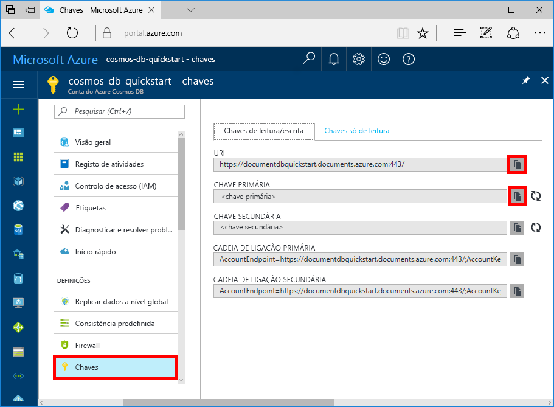
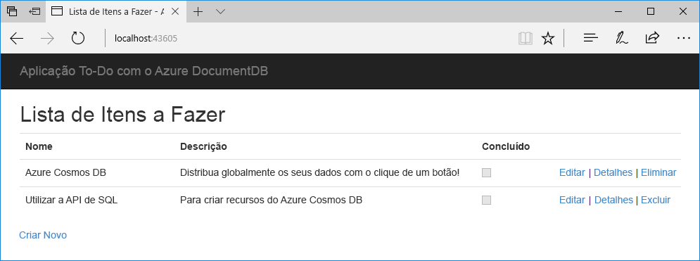

# <a name="quickstart-build-a-net-web-app-using-azure-cosmos-db-sql-api-account"></a>Início rápido: Criar uma aplicação de web do .NET com a conta do Azure Cosmos DB SQL API

> [!div class="op_single_selector"]
> * [.NET](create-sql-api-dotnet.md)
> * [.NET (pré-visualização)](create-sql-api-dotnet-preview.md)
> * [Java](create-sql-api-java.md)
> * [Node.js](create-sql-api-nodejs.md)
> * [Python](create-sql-api-python.md)
> * [Xamarin](create-sql-api-xamarin-dotnet.md)
>  
> 

O Azure Cosmos DB é um serviço de base de dados com vários modelos e de distribuição global da Microsoft. Pode criar e consultar rapidamente o documento, a chave/valor e as bases de dados de gráficos, que beneficiam de capacidades de escalamento horizontal e distribuição global no centro do Azure Cosmos DB. 

Este início rápido demonstra como criar um Azure Cosmos DB [API do SQL](sql-api-introduction.md) de conta, base de dados, coleção, de documentos e adicionar dados de exemplo para a coleção com o portal do Azure. Em seguida, vai criar e implementar uma aplicação de web de lista a fazer criada com o [SDK de .NET de SQL](sql-api-sdk-dotnet.md), para adicionar a gerir mais dados dentro da coleção. 

## <a name="prerequisites"></a>Pré-requisitos

Se ainda não tiver o Visual Studio 2017 instalado, pode transferir e utilizar a [Visual Studio 2017 Community Edition](https://www.visualstudio.com/downloads/) **gratuita**. Confirme que ativa o **desenvolvimento do Azure** durante a configuração do Visual Studio.

[!INCLUDE [quickstarts-free-trial-note](../../includes/quickstarts-free-trial-note.md)] 
[!INCLUDE [cosmos-db-emulator-docdb-api](../../includes/cosmos-db-emulator-docdb-api.md)]  

<a id="create-account"></a>
## <a name="create-an-account"></a>Criar uma conta

[!INCLUDE [cosmos-db-create-dbaccount](../../includes/cosmos-db-create-dbaccount.md)]

<a id="create-collection-database"></a>
## <a name="add-a-database-and-a-collection"></a>Adicionar uma base de dados e uma coleção

Agora, pode utilizar a ferramenta Data Explorer no portal do Azure para criar uma base de dados e uma coleção. 

1. Clique em **Explorador de Dados** > **Nova Coleção**. 
    
    A área **Adicionar Coleção** é apresentada na extremidade direita, pelo que poderá ter de se deslocar para a direita para vê-la.

    

2. Na página **Adicionar coleção**, introduza as definições para a nova coleção.

    Definição|Valor sugerido|Descrição
    ---|---|---
    **Id de base de dados**|ToDoList|Introduza *ToDoList* como o nome para a nova base de dados. Nomes de base de dados tem de conter entre 1 e 255 carateres e não podem conter `/, \\, #, ?`, ou um espaço à direita.
    **Id da coleção**|Itens|Denomine a nova coleção como *Itens*. Os IDs das coleções têm os mesmos requisitos como nomes de base de dados.
    **Chave de partição**| `<your_partition_key>`| Introduza uma chave de partição. O exemplo descrito neste artigo usa */category* como a chave de partição.
    **Débito**|400 RU|Altere o débito para 400 unidades de pedido por segundo (RU/s). Se pretender reduzir a latência, pode aumentar o débito mais tarde. 
    
    Além das definições anteriores, pode adicionar opcionalmente **Chaves exclusivas** para a coleção. Vamos deixar o campo vazio neste exemplo. As chaves exclusivas oferecem aos programadores a capacidade de adicionar uma camada de integridade dos dados na base de dados. Ao criar uma política de chaves exclusivas durante a criação de uma coleção, está a assegurar a exclusividade de um ou mais valores por chave de partição. Para saber mais, consulte o artigo [Chaves exclusivas no Azure Cosmos DB](unique-keys.md).
    
    Clique em **OK**.

    O Data Explorer mostra a base de dados e a coleção novas.

    

<a id="add-sample-data"></a>
## <a name="add-sample-data"></a>Adicionar dados de exemplo

Pode agora utilizar o Data Explorer para adicionar dados à sua coleção nova.

1. No Data Explorer, a base de dados nova aparece no painel Coleções. Expanda a base de dados **Tarefas**, expanda a coleção **Itens**, clique em **Documentos** e clique em **Documentos Novos**. 

   
  
2. Agora, adicione um documento à coleção com a seguinte estrutura.

     ```json
     {
         "id": "1",
         "category": "personal",
         "name": "groceries",
         "description": "Pick up apples and strawberries.",
         "isComplete": false
     }
     ```

3. Depois de ter adicionado o json ao separador **Documentos**, clique em **Guardar**.

    

4. Crie e guarde mais um documento onde insere um valor exclusivo para a propriedade `id` e altere as outras propriedades conforme necessário. Agora, os documentos podem ter qualquer estrutura que queira criar, uma vez que o Azure Cosmos DB não impõe qualquer esquema aos seus dados.

## <a name="query-your-data"></a>Consultar os seus dados

[!INCLUDE [cosmos-db-create-sql-api-query-data](../../includes/cosmos-db-create-sql-api-query-data.md)]

## <a name="clone-the-sample-application"></a>Clonar a aplicação de exemplo

Agora, vamos trabalhar com código. Vamos clonar uma [aplicação da SQL API a partir do GitHub](https://github.com/Azure-Samples/documentdb-dotnet-todo-app), definir a cadeia de ligação e executá-la. Vai ver como é fácil trabalhar com dados programaticamente. 

1. Abra uma linha de comandos, crie uma nova pasta designada git-samples e, em seguida, feche a linha de comandos.

    ```bash
    md "C:\git-samples"
    ```

2. Abra uma janela de terminal do git, como o git bash e utilize o comando `cd` para alterar para uma nova pasta e instalar a aplicação de exemplo.

    ```bash
    cd "C:\git-samples"
    ```

3. Execute o seguinte comando para clonar o repositório de exemplo. Este comando cria uma cópia da aplicação de exemplo no seu computador.

    ```bash
    git clone https://github.com/Azure-Samples/documentdb-dotnet-todo-app.git
    ```

4. Em seguida, abra o ficheiro da solução de lista a fazer no Visual Studio. 

## <a name="review-the-code"></a>Rever o código

Este passo é opcional. Se estiver interessado em aprender de que forma os recursos da base de dados são criados no código, pode consultar os seguintes fragmentos. Caso contrário, pode avançar diretamente para [Update your connection string (Atualizar a cadeia de ligação)](#update-your-connection-string). Neste início rápido, criar uma base de dados e uma coleção com o portal do Azure e adicionar dados de exemplo utilizando o exemplo de .NET. No entanto, também pode criar a base de dados e a coleção utilizando o exemplo de .NET. 

Os seguintes fragmentos são retirados do ficheiro DocumentDBRepository.cs.

* O DocumentClient é inicializado, conforme mostrado no seguinte código:

    ```csharp
    client = new DocumentClient(new Uri(ConfigurationManager.AppSettings["endpoint"]), ConfigurationManager.AppSettings["authKey"]);
    ```

* Uma nova base de dados é criada utilizando o `CreateDatabaseAsync` método conforme mostrado no seguinte código:

    ```csharp
    await client.CreateDatabaseAsync(new Database { Id = DatabaseId });
    ```

* Uma nova coleção é criada utilizando o `CreateDocumentCollectionAsync` conforme mostrado no seguinte código:

    ```csharp
    private static async Task CreateCollectionIfNotExistsAsync()
    {
        try
        {
           await client.ReadDocumentCollectionAsync(UriFactory.CreateDocumentCollectionUri(DatabaseId, CollectionId));
        }
        catch (DocumentClientException e)
        {
           if (e.StatusCode == System.Net.HttpStatusCode.NotFound)
           {
              await client.CreateDocumentCollectionAsync(
              UriFactory.CreateDatabaseUri(DatabaseId),
              new DocumentCollection
              {
                  Id = CollectionId
              },
              new RequestOptions { OfferThroughput = 400 });
           }
           else
           {
             throw;
           }
        }
    }
    ```

## <a name="update-your-connection-string"></a>Atualizar a cadeia de ligação

Agora, regresse ao portal do Azure para obter as informações da cadeia de ligação e copie-as para a aplicação.

1. No [portal do Azure](https://portal.azure.com/), na sua conta do Azure Cosmos DB, na navegação da esquerda, selecione **Chaves** e, em seguida, selecione **Chaves de leitura/escrita**. Vai utilizar os botões de copiar no lado direito do ecrã para copiar o URI e a Chave Primária para o ficheiro web.config no próximo passo.

    

2. No Visual Studio 2017, abra o ficheiro web.config. 

3. Copie o valor do URI a partir do portal (com o botão Copiar) e faça deste o valor da chave do ponto final em web.config. 

    `<add key="endpoint" value="FILLME" />`

4. Em seguida, copie o valor de CHAVE PRIMÁRIA do portal e faça do mesmo o valor de authKey em web.config. 

    `<add key="authKey" value="FILLME" />`
    
5. Em seguida, atualize os valores de base de dados e coleção de acordo com o nome da base de dados que criou anteriormente. Atualizou agora a sua aplicação com todas as informações necessárias para comunicar com o Azure Cosmos DB. 

   ```csharp
   <add key="database" value="ToDoList"/>
   <add key="collection" value="Items"/>
   ```
 
## <a name="run-the-web-app"></a>Executar a aplicação Web
1. No Visual Studio, clique com o botão direito do rato no projeto no **Explorador de Soluções** e selecione **Gerir Pacotes NuGet**. 

2. Na caixa **Procurar** do NuGet, escreva *DocumentDB*.

3. Nos resultados, instale a biblioteca **Microsoft.Azure.DocumentDB**. Esta ação instala o pacote Microsoft.Azure.DocumentDB, bem como as dependências.

4. Selecione CTRL + F5 para executar a aplicação. A aplicação é apresentada no browser. 

5. Selecione **Criar Nova** no browser e crie algumas tarefas novas na aplicação de tarefas.

   

Agora, pode voltar ao Data Explorer e ver, consultar, modificar e trabalhar com estes dados novos. 

## <a name="review-slas-in-the-azure-portal"></a>Rever os SLAs no portal do Azure

[!INCLUDE [cosmosdb-tutorial-review-slas](../../includes/cosmos-db-tutorial-review-slas.md)]

## <a name="clean-up-resources"></a>Limpar recursos

[!INCLUDE [cosmosdb-delete-resource-group](../../includes/cosmos-db-delete-resource-group.md)]

## <a name="next-steps"></a>Passos Seguintes

Neste guia rápido, aprendeu a criar uma conta do Azure Cosmos DB, a criar uma coleção com o Data Explorer e a executar uma aplicação Web. Agora, pode importar dados adicionais à sua conta do Cosmos DB. 

> [!div class="nextstepaction"]
> [Import data into Azure Cosmos DB](import-data.md) (Importar dados para o Azure Cosmos DB).


