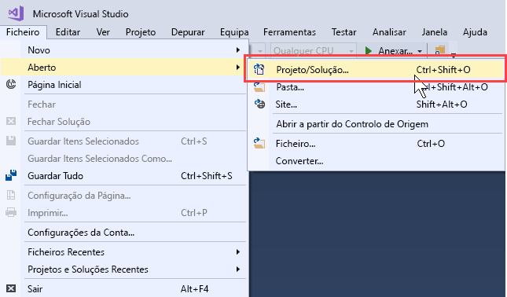
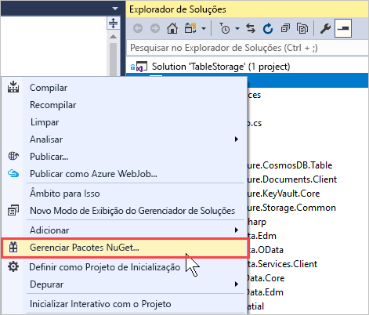
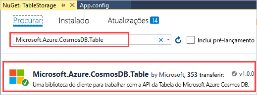
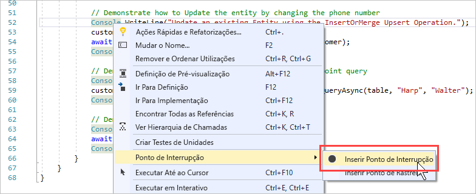
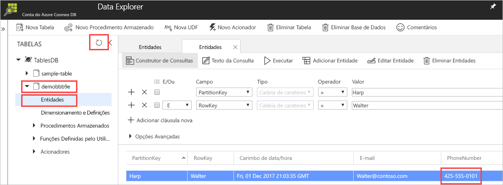

# <a name="quickstart-build-a-table-api-app-with-net-sdk-and-azure-cosmos-db"></a>Início rápido: Criar uma aplicação de API com o SDK do .NET e o Azure Cosmos DB tabela 

> [!div class="op_single_selector"]
> * [.NET](create-table-dotnet.md)
> * [Java](create-table-java.md)
> * [Node.js](create-table-nodejs.md)
> * [Python](create-table-python.md)
>  

Este guia de introdução mostra como utilizar o .NET e a [API de Tabela](table-introduction.md) do Azure Cosmos DB para criar uma aplicação através da clonagem de um exemplo do GitHub. Este guia de introdução mostra também como criar uma conta do Azure Cosmos DB e como utilizar o Data Explorer para criar tabelas e entidades no portal do Azure baseado na Web.

## <a name="prerequisites"></a>Pré-requisitos

Se ainda não tiver o Visual Studio 2017 instalado, pode transferir e utilizar a [Visual Studio 2017 Community Edition](https://www.visualstudio.com/downloads/) **gratuita**. Confirme que ativa o **desenvolvimento do Azure** durante a configuração do Visual Studio.

[!INCLUDE [quickstarts-free-trial-note](../../includes/quickstarts-free-trial-note.md)]

## <a name="create-a-database-account"></a>Criar uma conta de base de dados

[!INCLUDE [cosmos-db-create-dbaccount-table](../../includes/cosmos-db-create-dbaccount-table.md)]

## <a name="add-a-table"></a>Adicionar uma tabela

[!INCLUDE [cosmos-db-create-table](../../includes/cosmos-db-create-table.md)]

## <a name="add-sample-data"></a>Adicionar dados de exemplo

[!INCLUDE [cosmos-db-create-table-add-sample-data](../../includes/cosmos-db-create-table-add-sample-data.md)]

## <a name="clone-the-sample-application"></a>Clonar a aplicação de exemplo

Agora, vamos clonar uma aplicação de Tabela a partir do GitHub, definir a cadeia de ligação e executá-la. Vai ver como é fácil trabalhar com dados programaticamente. 

1. Abra uma linha de comandos, crie uma nova pasta designada git-samples e, em seguida, feche a linha de comandos.

   ```bash
   md "C:\git-samples"
   ```

2. Abra uma janela de terminal do git, como o git bash e utilize o comando `cd` para alterar para uma nova pasta e instalar a aplicação de exemplo.

   ```bash
   cd "C:\git-samples"
   ```

3. Execute o seguinte comando para clonar o repositório de exemplo. Este comando cria uma cópia da aplicação de exemplo no seu computador.

   ```bash
   git clone https://github.com/Azure-Samples/azure-cosmos-table-dotnet-core-getting-started.git
   ```
   > [!NOTE]
   > O exemplo de padrão do .NET descrito neste documento funciona com a API de tabela do Azure Cosmos DB e armazenamento de tabelas do Azure. Se estiver interessado em executar o exemplo que funciona com o .NET Framework 4.5, consulte a [armazenamento-tabela-dotnet-getting-started](https://github.com/Azure-Samples/storage-table-dotnet-getting-started) exemplo. 


## <a name="open-the-sample-application-in-visual-studio"></a>Abra a aplicação de exemplo no Visual Studio

1. No Visual Studio, a partir do menu **ficheiro**, escolha **Abrir** e, em seguida, escolha **Projeto/Solução**. 

    

2. Navegue para a pasta onde clonou o aplicativo de exemplo e abra o ficheiro de TableStorage.sln.

## <a name="update-your-connection-string"></a>Atualizar a cadeia de ligação

Agora, regresse ao portal do Azure para obter as informações da cadeia de ligação e copie-as para a aplicação. Isto permite à aplicação comunicar com a base de dados alojada. 

1. No [portal do Azure](https://portal.azure.com/), clique em **Cadeia de ligação**. Utilize o botão de cópia à direita da janela, para copiar a **CADEIA DE LIGAÇÃO PRIMÁRIA**.

   

2. No Visual Studio, abra a **Settings** ficheiro. 

3. Colar o **cadeia de ligação primária** do portal no valor de StorageConnectionString. Cole a cadeia dentro de aspas.

   ```csharp
   {
      "StorageConnectionString": "<Primary connection string from Azure portal>"
   }
   ```
   Se estiver a utilizar o [.NET Framework](https://github.com/Azure-Samples/storage-table-dotnet-getting-started) exemplo, deve atualizar a cadeia de ligação que está localizada no **App. config** ficheiro.

4. Prima CTRL + S para guardar a **Settings** ficheiro.

Atualizou agora a sua aplicação com todas as informações necessárias para comunicar com o Azure Cosmos DB. 

## <a name="build-and-deploy-the-app"></a>Criar e implementar a aplicação

1. No Visual Studio, clique com botão direito no **CosmosTableSamples** projeto **Explorador de soluções** e, em seguida, clique em **gerir pacotes NuGet**. 

   

2. Do NuGet **procurar** caixa, escreva Microsoft.Azure.Cosmos.Table. Esta ação encontrará a biblioteca de cliente da API da Tabela do Cosmos DB. Tenha em atenção que esta biblioteca está atualmente disponível para .NET Framework e .NET Standard. 

   > [!NOTE]
   > Se estiver a utilizar os exemplos que utiliza o .NET Framework, deve instalar o *cosmosdb*, pacote NuGet. Se estiver a utilizar o exemplo de .NET Framework com armazenamento de tabelas do Azure, além do pacote de NuGet específico do Cosmos DB também necessita de *Microsoft.Azure.Storage.Common* pacote NuGet. 
   
   

3. Clique em **instale** para instalar o **Microsoft.Azure.Cosmos.Table** biblioteca. Esta ação instala o pacote da API de Tabela do Azure Cosmos DB e todas as dependências do mesmo.

4. Quando executar todo o aplicativo, os dados de exemplo são inseridos para a entidade de tabela e excluídos ao final, para que não verá quaisquer dados inseridos se executar o exemplo inteiro. No entanto pode inserir alguns pontos de interrupção para ver os dados. Abra BasicSamples.cs ficheiro e clique com o botão direito na linha 52, selecione **ponto de interrupção**, em seguida, selecione **Inserir ponto de interrupção**. Insira outro ponto de interrupção na linha 55.

    

5. Prima F5 para executar a aplicação. A janela da consola apresenta o nome da base de dados de tabela nova (no caso, demoa13b1) no Azure Cosmos DB. 
    
   

   Quando atingir o primeiro ponto de interrupção, volte para Data Explorer no portal do Azure. Clique no botão **Atualizar**, expanda a tabela de demonstração* e clique em **Entidades**. O separador **Entidades** no lado direito apresenta a nova entidade que foi adicionada para Walter Harp. Tenha em atenção que o número de telefone para a nova entidade 425-555-0101.

   
    
   Se receber um erro que diz que não é possível localizar o ficheiro Settings quando a execução do projeto, pode resolver adicionando a seguinte entrada XML para as definições do projeto. Clique com o botão direito do rato no CosmosTableSamples, selecione CosmosTableSamples.csproj editar e adicionar itemGroup seguinte: 

   ```csharp
     <ItemGroup>
       <None Update="Settings.json">
         <CopyToOutputDirectory>PreserveNewest</CopyToOutputDirectory>
       </None>
     </ItemGroup>
   ```

6. Feche o separador **Entidades** no Data Explorer.
    
7. Prima F5 para executar a aplicação para o ponto de interrupção seguinte. 

    Quando atingir o ponto de interrupção, mude novamente para o portal do Azure, clique em **Entidades** novamente para abrir o separador **Entidades** e tenha em atenção que o número de telefone foi atualizado para 425-555-0105.

8. Prima F5 para executar a aplicação. 
 
   A aplicação adiciona entidades para utilização numa aplicação de exemplo avançado que a API de tabela não suporta atualmente. A aplicação, em seguida, elimina a tabela criada pela aplicação de exemplo.

9. Na janela da consola, prima Enter para terminar a execução da aplicação. 
  

## <a name="review-slas-in-the-azure-portal"></a>Rever os SLAs no portal do Azure

[!INCLUDE [cosmosdb-tutorial-review-slas](../../includes/cosmos-db-tutorial-review-slas.md)]

## <a name="clean-up-resources"></a>Limpar recursos

[!INCLUDE [cosmosdb-delete-resource-group](../../includes/cosmos-db-delete-resource-group.md)]

## <a name="next-steps"></a>Passos Seguintes

Neste guia de introdução, aprendeu a criar uma conta do Azure Cosmos DB, a criar uma tabela com o Data Explorer e a executar uma aplicação.  Agora, pode consultar os dados com a API de Tabela.  

> [!div class="nextstepaction"]
> [Importar dados da tabela para a API de Tabela](table-import.md)

