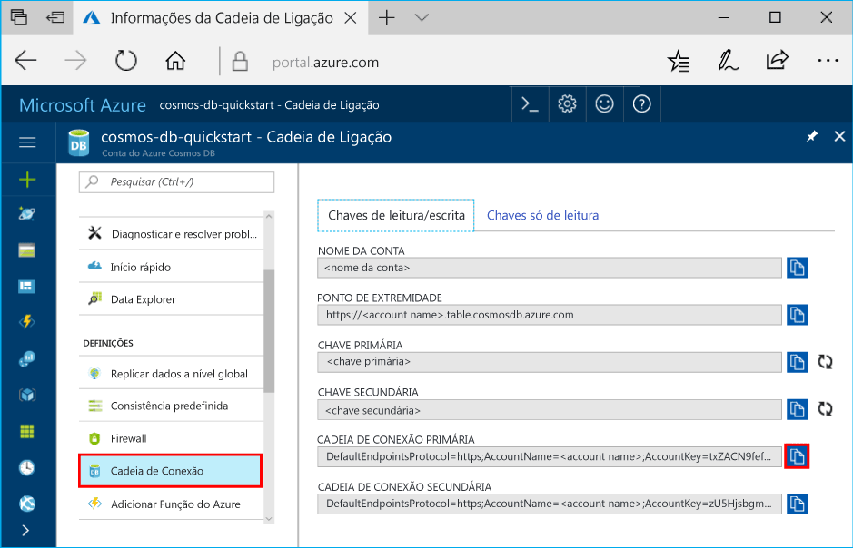

# <a name="quickstart-build-a-table-api-app-with-nodejs-and-azure-cosmos-db"></a>Guia de Introdução: Criar uma aplicação de API de Tabela com Node.js e Azure Cosmos DB

> [!div class="op_single_selector"]
> * [.NET](create-table-dotnet.md)
> * [Java](create-table-java.md)
> * [Node.js](create-table-nodejs.md)
> * [Python](create-table-python.md)
> 

Neste arranque rápido, cria-se uma conta API de Mesa Azure Cosmos DB, e utiliza-se o Data Explorer e uma app Node.js clonada do GitHub para criar tabelas e entidades. Azure Cosmos DB é um serviço de base de dados multi-modelo que permite criar e consultar rapidamente documentos, tabelas, basede-chaves e bases de dados de gráficos com capacidades de distribuição global e escala horizontal.

## <a name="prerequisites"></a>Pré-requisitos

- Uma conta Azure com uma subscrição ativa. [Crie um de graça.](https://azure.microsoft.com/free/?ref=microsoft.com&utm_source=microsoft.com&utm_medium=docs&utm_campaign=visualstudio) Ou [experimente o Azure Cosmos DB gratuitamente](https://azure.microsoft.com/try/cosmosdb/) sem uma subscrição Azure. Você também pode usar o [Emulador Db Azure Cosmos](https://aka.ms/cosmosdb-emulator) com um URI de `https://localhost:8081` e a chave. `C2y6yDjf5/R+ob0N8A7Cgv30VRDJIWEHLM+4QDU5DE2nQ9nDuVTqobD4b8mGGyPMbIZnqyMsEcaGQy67XIw/Jw==`
- [Node.js 0.10.29+](https://nodejs.org/) .
- [Git.](https://git-scm.com/downloads)

## <a name="create-a-database-account"></a>Criar uma conta de base de dados

> [!IMPORTANT] 
> Tem de criar uma nova conta da API de Tabela para trabalhar com os SDKs de API de Tabela geralmente disponíveis. As contas de API de Tabela criadas durante a pré-visualização não são suportadas pelos SDKs geralmente disponíveis.
>

[!INCLUDE [cosmos-db-create-dbaccount-table](../../includes/cosmos-db-create-dbaccount-table.md)]

## <a name="add-a-table"></a>Adicionar uma tabela

[!INCLUDE [cosmos-db-create-table](../../includes/cosmos-db-create-table.md)]

## <a name="add-sample-data"></a>Adicionar dados de exemplo

[!INCLUDE [cosmos-db-create-table-add-sample-data](../../includes/cosmos-db-create-table-add-sample-data.md)]

## <a name="clone-the-sample-application"></a>Clonar a aplicação de exemplo

Agora, vamos clonar uma aplicação de Tabela a partir do GitHub, definir a cadeia de ligação e executá-la. Vai ver como é fácil trabalhar com dados programaticamente.

1. Abra uma linha de comandos, crie uma nova pasta designada git-samples e, em seguida, feche a linha de comandos.

    ```bash
    md "C:\git-samples"
    ```

2. Abra uma janela de terminal do git, como o git bash e utilize o comando `cd` para alterar para uma nova pasta e instalar a aplicação de exemplo.

    ```bash
    cd "C:\git-samples"
    ```

3. Execute o seguinte comando para clonar o repositório de exemplo. Este comando cria uma cópia da aplicação de exemplo no seu computador.

    ```bash
    git clone https://github.com/Azure-Samples/storage-table-node-getting-started.git
    ```

> ! [DICA] Para uma passagem mais detalhada de código semelhante, consulte o artigo da amostra da [Tabela Cosmos DB API.](table-storage-how-to-use-nodejs.md) 

## <a name="update-your-connection-string"></a>Atualizar a cadeia de ligação

Agora, regresse ao portal do Azure para obter as informações da cadeia de ligação e copie-as para a aplicação. Isto permite à aplicação comunicar com a base de dados alojada. 

1. Na sua conta Azure Cosmos DB no [portal Azure,](https://portal.azure.com/)selecione **Connection String**. 

    

2. Copie o FIO DE LIGAÇÃO PRIMÁRIO utilizando o botão de cópia do lado direito.

3. Abra o ficheiro *app.config* e colá o valor na ligaçãoString na linha três. 

    > [!IMPORTANT]
    > Se o Ponto final utilizar documents.azure.com, significa que tem uma conta de pré-visualização, e tem de criar uma [nova conta de API de Tabela](#create-a-database-account) para trabalhar com o SDK de API de Tabela geralmente disponível.
    >

3. Guarde o ficheiro *app.config.*

Atualizou agora a sua aplicação com todas as informações necessárias para comunicar com o Azure Cosmos DB. 

## <a name="run-the-app"></a>Executar a aplicação

1. Na janela de terminal do git, `cd` na pasta storage-table-java-getting-started.

    ```
    cd "C:\git-samples\storage-table-node-getting-started"
    ```

2. Executar o seguinte comando para instalar os módulos [azul], [nó-uuid], [nconf] e [async] localmente, bem como para guardar uma entrada para eles no ficheiro *package.json.*

   ```
   npm install azure-storage node-uuid async nconf --save
   ```

2. Na janela do terminal git, execute os seguintes comandos para executar a aplicação Nó.js.

    ```
    node ./tableSample.js 
    ```

    A janela da consola apresenta os dados da tabela adicionados para a nova base de dados de tabela no Azure Cosmos DB.

    Agora pode voltar ao Data Explorer e ver, consultar, modificar e trabalhar com estes novos dados. 

## <a name="review-slas-in-the-azure-portal"></a>Rever os SLAs no portal do Azure

[!INCLUDE [cosmosdb-tutorial-review-slas](../../includes/cosmos-db-tutorial-review-slas.md)]

## <a name="clean-up-resources"></a>Limpar recursos

[!INCLUDE [cosmosdb-delete-resource-group](../../includes/cosmos-db-delete-resource-group.md)]

## <a name="next-steps"></a>Passos seguintes

Neste arranque rápido, aprendeu a criar uma conta Azure Cosmos DB, criar uma tabela usando o Data Explorer, e executar uma app Node.js para adicionar dados de tabela.  Agora, pode consultar os dados com a API de Tabela.  

> [!div class="nextstepaction"]
> [Importar dados da tabela para a API de Tabela](table-import.md)
