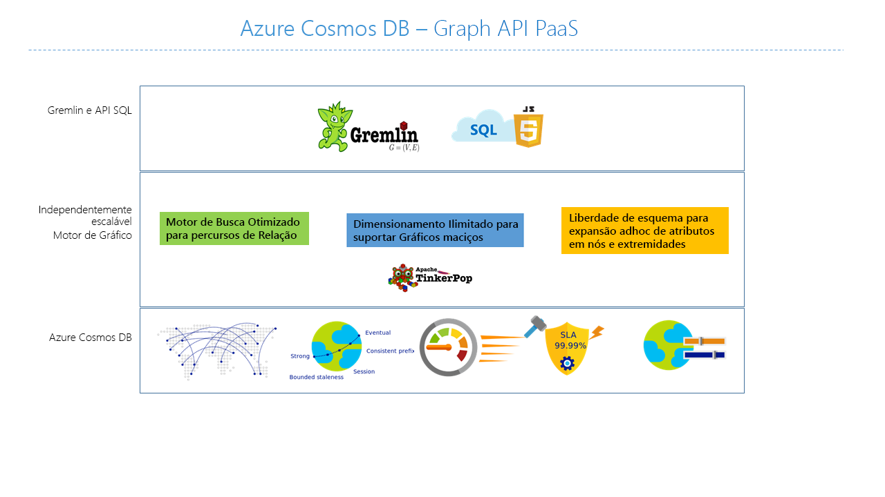
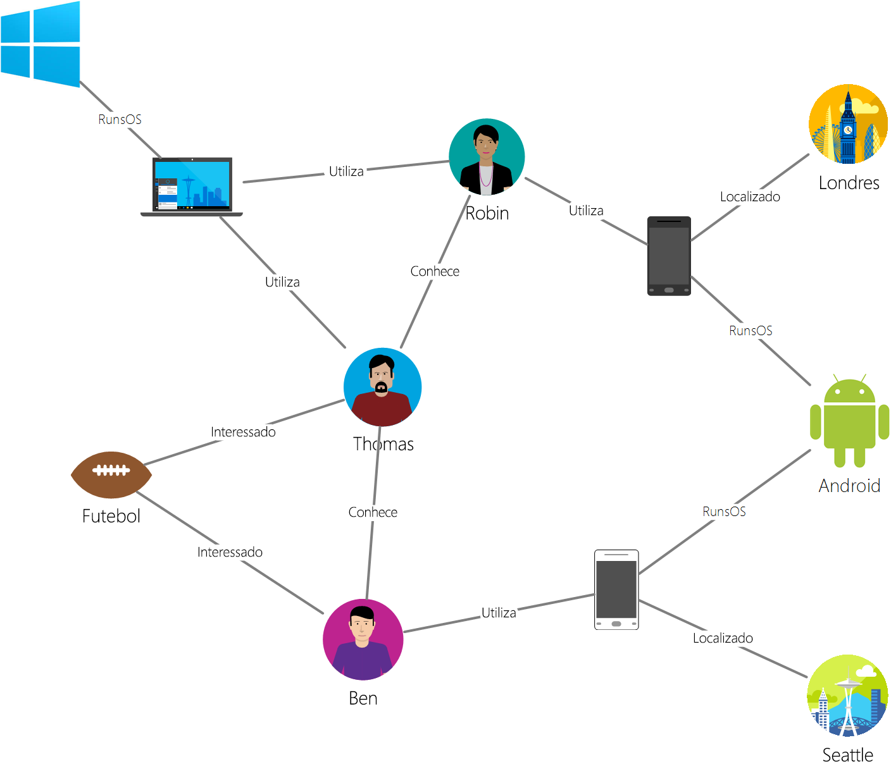

# <a name="introduction-to-azure-cosmos-db-gremlin-api"></a>Introdução ao Azure Cosmos DB: API do Gremlin

[Azure Cosmos DB](introduction.md) é o serviço de banco de dados multimodelo distribuído globalmente da Microsoft para aplicativos de missão crítica. É um banco de dados multimodelo e oferece suporte a modelos de documentos, de valor de chave, de gráfico e de família de colunas. A API Azure Cosmos DB Gremlin é usada para armazenar e operar com dados de grafo em um serviço de banco de dados totalmente gerenciado projetado para qualquer escala.  



Este artigo fornece uma descrição geral da API do Gremlin do Azure Cosmos DB e explica como pode utilizá-la para armazenar gráficos enormes com milhares de milhões de vértices e margens. Você pode consultar os grafos com latência de milissegundos e desenvolver a estrutura do gráfico facilmente. A API Gremlin do Azure Cosmos DB é baseada no padrão de banco de dados de grafo [Apache TinkerPop](https://tinkerpop.apache.org) e usa a linguagem de consulta Gremlin. 

A API Gremlin da Azure Cosmos DB combina o poder dos algoritmos de banco de dados do grafo com infraestrutura gerenciada e altamente escalonável para fornecer uma solução exclusiva e flexível para os problemas de dados mais comuns associados à falta de flexibilidade e abordagens relacionais. 

## <a name="features-of-azure-cosmos-db-graph-database"></a>Funcionalidades da base de dados de gráficos do Azure Cosmos DB
 
O Azure Cosmos DB é uma base de dados de gráficos completamente gerida que oferece distribuição global, dimensionamento elástico do débito e armazenamento, consulta e indexação automática, níveis de consistência ajustáveis e suporte para o padrão TinkerPop. 

Veja a seguir os recursos diferenciados que Azure Cosmos DB a API do Gremlin oferece:

* **Produtividade e armazenamento escalonáveis de forma elástica**

  Os gráficos no mundo real precisam de ser dimensionados para além da capacidade de um único servidor. O Azure Cosmos DB dá suporte a bancos de dados de grafo escalonáveis horizontalmente que podem ter um tamanho praticamente ilimitado em termos de armazenamento e taxa de transferência provisionada. À medida que a escala do banco de dados do grafo cresce, os dados serão automaticamente distribuídos usando o [particionamento do grafo](https://docs.microsoft.com/azure/cosmos-db/graph-partitioning).

* **Replicação de várias regiões**

  Azure Cosmos DB pode replicar automaticamente os dados do grafo para qualquer região do Azure em todo o mundo. A replicação global simplifica o desenvolvimento de aplicativos que exigem acesso global aos dados. Além de minimizar a latência de leitura e gravação em qualquer lugar do mundo, Azure Cosmos DB fornece um mecanismo de failover regional automático que pode garantir a continuidade do seu aplicativo no caso raro de uma interrupção de serviço em uma região. 

* **Consultas e atravessamentos rápidos com o padrão de consulta de grafo mais amplamente adotado**

  Armazene bordas e vértices heterogêneos e consulte-os por meio de uma sintaxe Gremlin familiar. Gremlin é uma linguagem de consulta imperativa e funcional que fornece uma interface rica para implementar algoritmos de grafo comuns. 
  
  O Azure Cosmos DB permite consultas e atravessamentos em tempo real sem a necessidade de especificar dicas de esquema, índices secundários ou exibições. Saiba mais em [Query graphs by using Gremlin](gremlin-support.md) (Consultar gráficos com o Gremlin).

* **Banco de dados de grafo totalmente gerenciado**

  O Azure Cosmos DB elimina a necessidade de gerir recursos de máquinas e bases de dados. A maioria das plataformas de banco de dados de grafo existentes estão ligadas às limitações de sua infraestrutura e, muitas vezes, exigem um alto grau de manutenção para garantir sua operação. 
  
  Como um serviço totalmente gerenciado, o Cosmos DB elimina a necessidade de gerenciar máquinas virtuais, atualizar o software de tempo de execução, gerenciar a fragmentação ou a replicação ou lidar com atualizações complexas da camada de dados. São criadas cópias de segurança automáticas de todos os gráficos e estes são protegidos contra falhas regionais. Essas garantias permitem que os desenvolvedores se concentrem no fornecimento do valor do aplicativo em vez de operar e gerenciar seus bancos de dados de grafo. 

* **Indexação automática**

  Por predefinição, o Azure Cosmos DB indexa automaticamente todas as propriedades dos nós e margens do gráfico e não precisa de nenhum esquema ou criação de índices secundários. Saiba mais sobre a [indexação no Azure Cosmos DB](https://docs.microsoft.com/azure/cosmos-db/index-overview). 

* **Compatibilidade com o Apache TinkerPop**

  Azure Cosmos DB dá suporte ao [padrão Apache TinkerPop de código aberto](https://tinkerpop.apache.org/). O padrão Tinkerpop tem um amplo ecossistema de aplicativos e bibliotecas que podem ser facilmente integrados à API Gremlin do Azure Cosmos DB. 

* **Níveis de consistência ajustáveis**

  O Azure Cosmos DB fornece cinco níveis de consistência bem definidos para alcançar a compensação certa entre consistência e desempenho para seu aplicativo. Para consultas e operações de leitura, o Azure Cosmos DB oferece cinco níveis de consistência distintos: forte, consistência vinculada, sessão, prefixo de consistência e eventual. Estes níveis de consistência granulares e bem definidos permitem-lhe atingir um equilíbrio eficaz entre a consistência, a disponibilidade e a latência. Saiba mais em [Tunable data consistency levels in Azure Cosmos DB](consistency-levels.md) (Níveis de consistência de dados ajustáveis no Azure Cosmos DB).

## <a name="scenarios-that-can-use-gremlin-api"></a>Cenários que podem utilizar a API do Gremlin
Aqui estão alguns cenários em que o suporte a grafo do Azure Cosmos DB pode ser útil:

* **Redes sociais/cliente 365**

  Ao combinar dados sobre os seus clientes e as respetivas interações com outras pessoas, pode desenvolver experiências personalizadas, prever o comportamento dos clientes ou ligar pessoas com interesses semelhantes. O Azure Cosmos DB pode ser utilizado para gerir redes sociais e registar os dados e preferências dos clientes.

* **Mecanismos de recomendação**

  Este cenário é normalmente utilizado na indústria do retalho. Ao combinar informações sobre produtos, utilizadores e as respetivas interações, como compras, pesquisas ou classificações de produtos, pode criar recomendações personalizadas. A baixa latência, a escala elástica e o suporte a grafo nativo do Azure Cosmos DB é ideal para esses cenários.

* **Geoespaciais**

  Muitas aplicações de telecomunicações, logística e planeamento de viagens precisam de localizar um ponto de interesse numa área ou o caminho mais curto/ideal entre duas localizações. O Azure Cosmos DB é uma solução natural para estes problemas.

* **Internet das Coisas**

  Com a rede e ligações entre dispositivos da IoT modeladas como um gráfico, pode compreender melhor o estado dos seus dispositivos e recursos. Também pode saber como as alterações numa parte da rede podem potencialmente afetar outra parte.

## <a name="introduction-to-graph-databases"></a>Introdução aos bancos de dados de grafo
Os dados, tal como são apresentados no mundo real, estão ligados naturalmente. A modelagem de dados tradicional se concentra na definição de entidades separadamente e na computação de suas relações em tempo de execução. Embora esse modelo tenha suas vantagens, os dados altamente conectados podem ser desafiadores a serem gerenciados sob suas restrições.  

Uma abordagem de banco de dados de grafo depende das relações persistentes na camada de armazenamento, o que leva a operações de recuperação de grafo altamente eficientes. A API Gremlin do Azure Cosmos DB dá suporte ao [modelo de gráfico de propriedades](https://tinkerpop.apache.org/docs/current/reference/#intro).

### <a name="property-graph-objects"></a>Objetos de gráfico de propriedades

Um [grafo](http://mathworld.wolfram.com/Graph.html) de propriedades é uma estrutura composta por [vértices](http://mathworld.wolfram.com/GraphVertex.html) e [bordas](http://mathworld.wolfram.com/GraphEdge.html). Ambos os objetos podem ter um número arbitrário de pares chave-valor como propriedades. 

* **Vértices** -vértices denotam entidades discretas, como uma pessoa, um local ou um evento.

* **Margens** - As margens denotam as relações entre vértices. Por exemplo, uma pessoa pode conhecer outra pessoa, participar num evento e ter estado numa localização recentemente. 

* **Propriedades** - As propriedades expressam informações sobre os vértices e margens. Pode haver qualquer número de propriedades em vértices ou bordas, e elas podem ser usadas para descrever e filtrar os objetos em uma consulta. As propriedades de exemplo incluem um vértice que tem nome e idade, ou uma borda, que pode ter um carimbo de data/hora e/ou um peso. 

Os bancos de dados de grafo geralmente são incluídos na categoria NoSQL ou não relacional do banco de dados, já que não há nenhuma dependência de um esquema ou de um modelo de dado restrito. Essa falta de esquema permite modelar e armazenar estruturas conectadas de forma natural e eficiente. 

### <a name="gremlin-by-example"></a>Exemplo do Gremlin
Vamos utilizar um gráfico de exemplo para compreender como as consultas podem ser expressadas no Gremlin. A imagem seguinte apresenta uma aplicação empresarial que gere dados sobre os utilizadores, interesses e dispositivos sob a forma de um gráfico.  

 

Esse grafo tem os seguintes tipos de *vértice* (chamados de "rótulo" em Gremlin):

- **Pessoas**: o grafo tem três pessoas, Robin, Thomas e Ben
- **Interesses**: seus interesses, neste exemplo, o jogo de futebol
- **Dispositivos**: os dispositivos que as pessoas usam
- **Sistemas operacionais**: os sistemas operacionais nos quais os dispositivos são executados

Representamos as relações entre essas entidades por meio dos seguintes tipos/rótulos de *borda* :

- **Sabe**: por exemplo, "Thomas sabe Robin"
- **Interessado**: para representar os interesses das pessoas em nosso grafo, por exemplo, "Ben está interessado em futebol"
- **RunsOS**: o laptop executa o sistema operacional Windows
- **Usa**: para representar o dispositivo usado por uma pessoa. Por exemplo, a Robin utiliza um telemóvel Motorola com o número de série 77

Vamos executar algumas operações em relação a este gráfico com a [Consola do Gremlin](https://tinkerpop.apache.org/docs/3.3.2/reference/#gremlin-console). Também pode efetuar estas operações com os controladores do Gremlin na plataforma que preferir (Java, Node.js, Python ou .NET).  Antes de vermos o que é suportado no Azure Cosmos DB, vamos ver alguns exemplos para se familiarizar com a sintaxe.

Em primeiro lugar, vamos ver o CRUD. A seguinte instrução do Gremlin insere o vértice "Thomas" no gráfico:

```java
:> g.addV('person').property('id', 'thomas.1').property('firstName', 'Thomas').property('lastName', 'Andersen').property('age', 44)
```

Em seguida, a seguinte instrução do Gremlin insere um limite "knows" (conhece) entre o Thomas e a Robin.

```java
:> g.V('thomas.1').addE('knows').to(g.V('robin.1'))
```

A consulta seguinte devolve os vértices "person" (pessoa) por ordem descendente dos nomes próprios:
```java
:> g.V().hasLabel('person').order().by('firstName', decr)
```

Os gráficos são bastante úteis quando tem de responder a perguntas como "What operating systems do friends of Thomas use?" (Que sistemas operativos utilizam os amigos do Thomas?). Você pode executar essa passagem Gremlin para obter essas informações do grafo:

```java
:> g.V('thomas.1').out('knows').out('uses').out('runsos').group().by('name').by(count())
```

## <a name="next-steps"></a>Passos seguintes
Para saber mais sobre o suporte de gráficos no Azure Cosmos DB, veja:

* Introdução ao [tutorial sobre gráficos do Azure Cosmos DB](create-graph-dotnet.md).
* Saiba como [consultar gráficos no Azure Cosmos DB com o Gremlin](gremlin-support.md).
