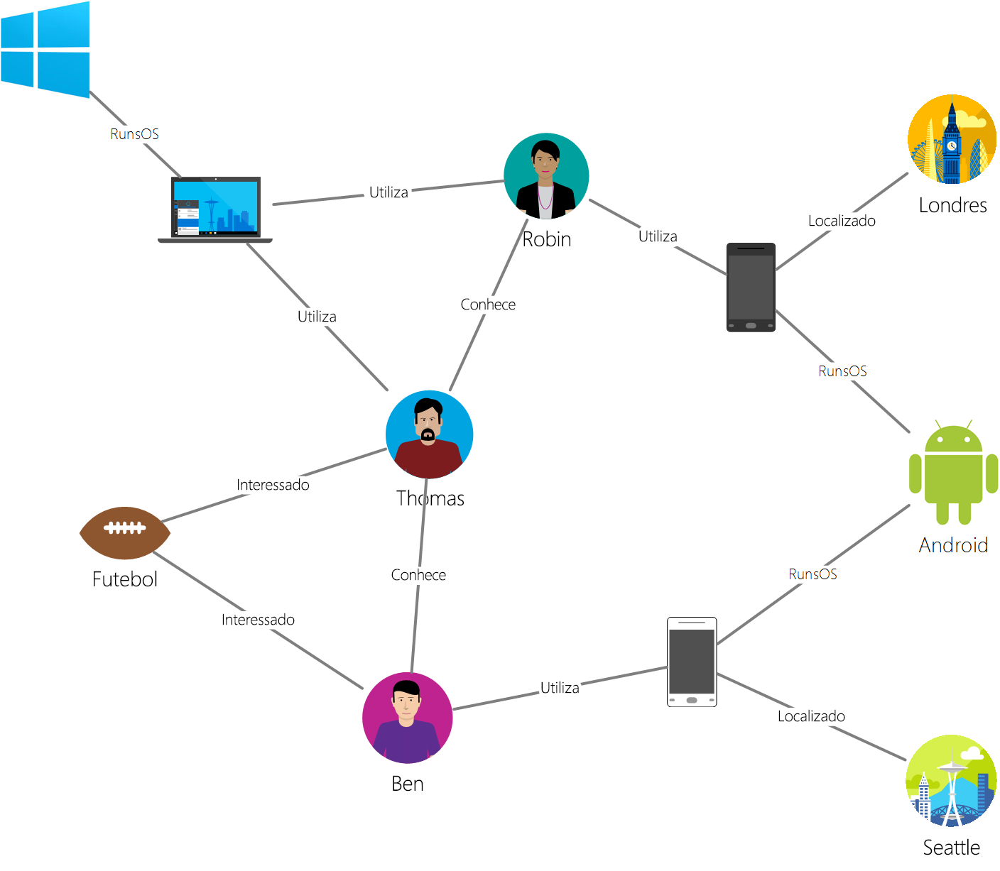

# <a name="azure-cosmos-db-gremlin-graph-support"></a>Suporte de gráficos do Gremlin do Azure Cosmos DB
Azure Cosmos DB suporta [Apache Tinkerpop](https://tinkerpop.apache.org) criar um gráfico de linguagem de passagem, conhecida como [Gremlin](https://tinkerpop.apache.org/docs/3.3.2/reference/#graph-traversal-steps). Pode utilizar a linguagem Gremlin para criar entidades de gráfico (vértices e limites), modificar propriedades nessas entidades, efetuar consultas e transversais e eliminar entidades. 

O Azure Cosmos DB oferece funcionalidades prontas para empresas para bases de dados de gráficos. Estas funcionalidades incluem a distribuição global, independente de dimensionamento de armazenamento e débito, latências de milissegundo de dígito previsível, a indexação automática, SLAs, leia a disponibilidade para as contas de base de dados em duas ou mais regiões do Azure. Como o Azure Cosmos DB suporta TinkerPop/Gremlin, pode migrar facilmente aplicativos escritos com a outra base de dados do gráfico compatível. Além disso, graças ao suporte do Gremlin, o Azure Cosmos DB está totalmente integrado com arquiteturas de análise ativadas para TinkerPop, como o [Apache Spark GraphX](https://spark.apache.org/graphx/). 

Neste artigo, iremos fornecer uma passo a passo rápido do Gremlin e enumerar os recursos de Gremlin que são suportados pela API do Gremlin.

## <a name="gremlin-by-example"></a>Exemplo do Gremlin
Vamos utilizar um gráfico de exemplo para compreender como as consultas podem ser expressadas no Gremlin. A imagem seguinte apresenta uma aplicação empresarial que gere dados sobre os utilizadores, interesses e dispositivos sob a forma de um gráfico.  

 

Este gráfico tem os seguintes tipos de vértices (denominados "label" [etiqueta] no Gremlin):

- Pessoas: O gráfico tem três pessoas, Round Robin, Thomas e Ben
- Interesses: Seus interesses, neste exemplo, o jogo de futebol americano
- Dispositivos: Os dispositivos que as pessoas a utilização
- Sistemas operativos: Os sistemas operativos que os dispositivos a executar em

Representamos as relações entre estas entidades através das seguintes etiquetas/tipos de limites:

- Sabe: Por exemplo, "Thomas sabe Round Robin"
- Está interessado: Para representar os interesses das pessoas em nosso gráfico, por exemplo, "Ben está interessado em Football"
- RunsOS: Computador portátil executa o SO Windows
- Utiliza: Para representar que tipo de dispositivo utiliza uma pessoa. Por exemplo, a Robin utiliza um telemóvel Motorola com o número de série 77

Vamos executar algumas operações em relação a este gráfico com a [Consola do Gremlin](https://tinkerpop.apache.org/docs/3.3.2/reference/#gremlin-console). Também pode efetuar estas operações com os controladores do Gremlin na plataforma que preferir (Java, Node.js, Python ou .NET).  Antes de vermos o que é suportado no Azure Cosmos DB, vamos ver alguns exemplos para se familiarizar com a sintaxe.

Em primeiro lugar, vamos ver o CRUD. A seguinte instrução do Gremlin insere o vértice "Thomas" no gráfico:

```java
:> g.addV('person').property('id', 'thomas.1').property('firstName', 'Thomas').property('lastName', 'Andersen').property('age', 44)
```

Em seguida, a seguinte instrução do Gremlin insere um limite "knows" (conhece) entre o Thomas e a Robin.

```java
:> g.V('thomas.1').addE('knows').to(g.V('robin.1'))
```

A consulta seguinte devolve os vértices "person" (pessoa) por ordem descendente dos nomes próprios:
```java
:> g.V().hasLabel('person').order().by('firstName', decr)
```

Os gráficos são bastante úteis quando tem de responder a perguntas como "What operating systems do friends of Thomas use?" (Que sistemas operativos utilizam os amigos do Thomas?). Pode executar esta passagem de Gremlin para obter essa informação do gráfico:

```java
:> g.V('thomas.1').out('knows').out('uses').out('runsos').group().by('name').by(count())
```
Agora vamos ver o que o Azure Cosmos DB disponibiliza aos programadores do Gremlin.

## <a name="gremlin-features"></a>Funcionalidades do Gremlin
O TinkerPop é um padrão que abrange uma grande variedade de tecnologias de gráficos. Portanto, tem terminologia padrão para descrever as funcionalidades disponibilizadas pelo fornecedor de gráficos. O Azure Cosmos DB fornece uma base de dados de gráficos gravável, de alta simultaneidade e persistente que pode ser dividida em múltiplos servidores ou clusters. 

A tabela seguinte indica as funcionalidades do TinkerPop implementadas pelo Azure Cosmos DB: 

| Categoria | Implementação do Azure Cosmos DB |  Notas | 
| --- | --- | --- |
| Funcionalidades de gráficos | Fornece Persistência e Acesso em Simultâneo. Concebido para suportar Transações | Os métodos de computador podem ser implementados através do conector do Spark. |
| Funcionalidades de variável | Suporta Boolean, Integer, Byte, Double, Float, Integer, Long, String | Suporta tipos primitivos, é compatível com tipos complexos através do modelo de dados |
| Funcionalidades de vértice | Suporta RemoveVertices, MetaProperties, AddVertices, MultiProperties, StringIds, UserSuppliedIds, AddProperty, RemoveProperty  | Suporta a criação, modificação e eliminação de vértices |
| Funcionalidades de propriedade de vértice | StringIds, UserSuppliedIds, AddProperty, RemoveProperty, BooleanValues, ByteValues, DoubleValues, FloatValues, IntegerValues, LongValues, StringValues | Suporta a criação, modificação e eliminação de propriedades de vértice |
| Funcionalidades de limite | AddEdges, RemoveEdges, StringIds, UserSuppliedIds, AddProperty, RemoveProperty | Suporta a criação, modificação e eliminação de limites |
| Funcionalidades de propriedades de limites | Properties, BooleanValues, ByteValues, DoubleValues, FloatValues, IntegerValues, LongValues, StringValues | Suporta a criação, modificação e eliminação de propriedades de limites |

## <a name="gremlin-wire-format-graphson"></a>Formato de conexão do gremlin: GraphSON

O Azure Cosmos DB utiliza o [formato GraphSON](https://tinkerpop.apache.org/docs/3.3.2/reference/#graphson-reader-writer) ao devolver resultados das operações do Gremlin. GraphSON é o formato padrão do Gremlin para representar vértices, limites e propriedades (propriedades com um valor e com múltiplos valores) com JSON. 

Por exemplo, o fragmento seguinte mostra uma representação GraphSON de um vértice *devolvido ao cliente* a partir do Azure Cosmos DB. 

```json
  {
    "id": "a7111ba7-0ea1-43c9-b6b2-efc5e3aea4c0",
    "label": "person",
    "type": "vertex",
    "outE": {
      "knows": [
        {
          "id": "3ee53a60-c561-4c5e-9a9f-9c7924bc9aef",
          "inV": "04779300-1c8e-489d-9493-50fd1325a658"
        },
        {
          "id": "21984248-ee9e-43a8-a7f6-30642bc14609",
          "inV": "a8e3e741-2ef7-4c01-b7c8-199f8e43e3bc"
        }
      ]
    },
    "properties": {
      "firstName": [
        {
          "value": "Thomas"
        }
      ],
      "lastName": [
        {
          "value": "Andersen"
        }
      ],
      "age": [
        {
          "value": 45
        }
      ]
    }
  }
```

As propriedades utilizadas por GraphSON para vértices são descritas abaixo:

| Propriedade | Descrição | 
| --- | --- | --- |
| `id` | O ID do vértice. Tem de ser exclusivo (em combinação com o valor de `_partition` se aplicável). Se não for fornecido nenhum valor, ele serão automaticamente fornecido com um GUID | 
| `label` | A etiqueta do vértice. Isso é usado para descrever o tipo de entidade. |
| `type` | É utilizado para distinguir vértices de documentos que não são gráficos |
| `properties` | Conjunto de propriedades definidas pelo utilizador associadas ao vértice. Cada propriedade tem múltiplos valores. |
| `_partition` | A chave de partição do vértice. Utilizado para [criação de partições de gráfico](graph-partitioning.md). |
| `outE` | Esta propriedade contém uma lista das margens de um vértice. Armazenar a informação de contiguidade com o vértice permite uma execução rápida das transversais. Os limites são agrupados com base nas etiquetas. |

O limite contém a seguinte informação para ajudar com a navegação para outras partes do gráfico.

| Propriedade | Descrição |
| --- | --- |
| `id` | O ID do limite. Tem de ser exclusivo (em combinação com o valor de `_partition` se aplicável) |
| `label` | A etiqueta do limite. Esta propriedade é opcional e é utilizada para descrever o tipo de relação. |
| `inV` | Esta propriedade contém uma lista de em vértices de um edge. Armazenar as informações de contiguidade com o limite permite uma execução rápida das transversais. Os vértices são agrupados com base nas etiquetas. |
| `properties` | Conjunto de propriedades definidas pelo utilizador associadas ao limite. Cada propriedade tem múltiplos valores. |

Cada propriedade pode armazenar múltiplos valores numa matriz. 

| Propriedade | Descrição |
| --- | --- |
| `value` | O valor da propriedade

## <a name="gremlin-steps"></a>Passos do Gremlin
Vamos observar os passos do Gremlin suportados pelo Azure Cosmos DB. Para obter referências completas do Gremlin, veja [Referências do TinkerPop](https://tinkerpop.apache.org/docs/3.3.2/reference).

| passo | Descrição | Documentação do TinkerPop 3.2 |
| --- | --- | --- |
| `addE` | Adiciona um limite entre dois vértices | [passo addE](https://tinkerpop.apache.org/docs/3.3.2/reference/#addedge-step) |
| `addV` | Adiciona um vértice ao gráfico | [passo addV](https://tinkerpop.apache.org/docs/3.3.2/reference/#addvertex-step) |
| `and` | Garante que todas as transversais devolvem um valor | [passo and](https://tinkerpop.apache.org/docs/3.3.2/reference/#and-step) |
| `as` | Um modulador de passos para atribuir uma variável ao resultado de um passo | [passo as](https://tinkerpop.apache.org/docs/3.3.2/reference/#as-step) |
| `by` | Um modulador de passos utilizado com `group` e `order` | [passo by](https://tinkerpop.apache.org/docs/3.3.2/reference/#by-step) |
| `coalesce` | Devolve a primeira transversal que devolve um resultado | [passo coalesce](https://tinkerpop.apache.org/docs/3.3.2/reference/#coalesce-step) |
| `constant` | Devolve um valor constante. Utilizado com `coalesce`| [passo constant](https://tinkerpop.apache.org/docs/3.3.2/reference/#constant-step) |
| `count` | Devolve a contagem da transversal | [passo count](https://tinkerpop.apache.org/docs/3.3.2/reference/#count-step) |
| `dedup` | Devolve os valores com os duplicados removidos | [passo dedup](https://tinkerpop.apache.org/docs/3.3.2/reference/#dedup-step) |
| `drop` | Ignora os valores (vértice/limite) | [passo drop](https://tinkerpop.apache.org/docs/3.3.2/reference/#drop-step) |
| `executionProfile` | Cria uma descrição de todas as operações geradas pela etapa executada do Gremlin | [passo executionProfile](graph-execution-profile.md) |
| `fold` | Age como uma barreira que calcula a agregação de resultados| [passo fold](https://tinkerpop.apache.org/docs/3.3.2/reference/#fold-step) |
| `group` | Agrupa os valores com base nas etiquetas especificadas| [passo group](https://tinkerpop.apache.org/docs/3.3.2/reference/#group-step) |
| `has` | Utilizado para filtrar propriedades, vértices e limites. Suporta variantes `hasLabel`, `hasId`, `hasNot` e `has`. | [passo has](https://tinkerpop.apache.org/docs/3.3.2/reference/#has-step) |
| `inject` | Insere valores numa transmissão| [passo inject](https://tinkerpop.apache.org/docs/3.3.2/reference/#inject-step) |
| `is` | Utilizado para efetuar um filtro com uma expressão booleana | [passo is](https://tinkerpop.apache.org/docs/3.3.2/reference/#is-step) |
| `limit` | Utilizado para limitar o número de itens na transversal| [passo limit](https://tinkerpop.apache.org/docs/3.3.2/reference/#limit-step) |
| `local` | Encapsula uma secção de uma transversal, da mesma forma que uma subconsulta | [passo local](https://tinkerpop.apache.org/docs/3.3.2/reference/#local-step) |
| `not` | Utilizado para produzir a negação de um filtro | [passo not](https://tinkerpop.apache.org/docs/3.3.2/reference/#not-step) |
| `optional` | Devolve o resultado da transversal especificada se gerar um resultado, caso contrário, devolve o elemento de chamada | [passo optional](https://tinkerpop.apache.org/docs/3.3.2/reference/#optional-step) |
| `or` | Garante que pelo menos uma das transversais devolve um valor | [passo or](https://tinkerpop.apache.org/docs/3.3.2/reference/#or-step) |
| `order` | Devolve resultados na sequência de ordenação especificada | [passo order](https://tinkerpop.apache.org/docs/3.3.2/reference/#order-step) |
| `path` | Devolve o caminho completo da transversal | [passo path](https://tinkerpop.apache.org/docs/3.3.2/reference/#path-step) |
| `project` | Projeta as propriedades como um Mapa | [passo project](https://tinkerpop.apache.org/docs/3.3.2/reference/#project-step) |
| `properties` | Devolve as propriedades das etiquetas especificadas | [passo properties](https://tinkerpop.apache.org/docs/3.3.2/reference/#_properties_step) |
| `range` | Filtra o intervalo especificado de valores| [passo range](https://tinkerpop.apache.org/docs/3.3.2/reference/#range-step) |
| `repeat` | Repete o passo o número de vezes especificado. Utilizado para criar ciclos | [passo repeat](https://tinkerpop.apache.org/docs/3.3.2/reference/#repeat-step) |
| `sample` | Utilizado para exemplificar resultados da transversal | [passo sample](https://tinkerpop.apache.org/docs/3.3.2/reference/#sample-step) |
| `select` | Utilizado para projetar resultados da transversal |  [passo select](https://tinkerpop.apache.org/docs/3.3.2/reference/#select-step) |
| `store` | Utilizado para agregações que não sejam de bloqueio da transversal | [passo store](https://tinkerpop.apache.org/docs/3.3.2/reference/#store-step) |
| `TextP.startingWith(string)` | Função de filtragem de cadeia. Essa função é usada como um predicado para o `has()` passo para corresponder a uma propriedade com o início de uma determinada seqüência de caracteres | [Predicados de TextP](http://tinkerpop.apache.org/docs/3.4.0/reference/#a-note-on-predicates) |
| `TextP.endingWith(string)` |  Função de filtragem de cadeia. Essa função é usada como um predicado para o `has()` passo para corresponder a uma propriedade com o fim de uma determinada seqüência de caracteres | [Predicados de TextP](http://tinkerpop.apache.org/docs/3.4.0/reference/#a-note-on-predicates) |
| `TextP.containing(string)` | Função de filtragem de cadeia. Essa função é usada como um predicado para o `has()` passo para corresponder a uma propriedade com o conteúdo de uma determinada seqüência de caracteres | [Predicados de TextP](http://tinkerpop.apache.org/docs/3.4.0/reference/#a-note-on-predicates) |
| `TextP.notStartingWith(string)` | Função de filtragem de cadeia. Essa função é usada como um predicado para o `has()` passo para corresponder a uma propriedade que não começa com uma determinada seqüência de caracteres | [Predicados de TextP](http://tinkerpop.apache.org/docs/3.4.0/reference/#a-note-on-predicates) |
| `TextP.notEndingWith(string)` | Função de filtragem de cadeia. Essa função é usada como um predicado para o `has()` passo para corresponder a uma propriedade que não termina com uma determinada seqüência de caracteres | [Predicados de TextP](http://tinkerpop.apache.org/docs/3.4.0/reference/#a-note-on-predicates) |
| `TextP.notContaining(string)` | Função de filtragem de cadeia. Essa função é usada como um predicado para o `has()` passo para corresponder a uma propriedade que não contém uma determinada seqüência de caracteres | [Predicados de TextP](http://tinkerpop.apache.org/docs/3.4.0/reference/#a-note-on-predicates) |
| `tree` | Agrega caminhos de um vértice numa árvore | [passo tree](https://tinkerpop.apache.org/docs/3.3.2/reference/#tree-step) |
| `unfold` | Mostra um iterador como um passo| [passo unfold](https://tinkerpop.apache.org/docs/3.3.2/reference/#unfold-step) |
| `union` | Intercala resultados de múltiplas transversais| [passo union](https://tinkerpop.apache.org/docs/3.3.2/reference/#union-step) |
| `V` | Inclui os passos necessários para transversais entre vértices e limites `V`, `E`, `out`, `in`, `both`, `outE`, `inE`, `bothE`, `outV`, `inV`, `bothV` e `otherV` | [passos vertex](https://tinkerpop.apache.org/docs/3.3.2/reference/#vertex-steps) |
| `where` | Utilizado para filtrar resultados da transversal. Suporta os operadores `eq`, `neq`, `lt`, `lte`, `gt`, `gte` e `between`  | [passo where](https://tinkerpop.apache.org/docs/3.3.2/reference/#where-step) |

O motor otimizado para escrita fornecido pelo Azure Cosmos DB suporta a indexação automática de todas as propriedades nos vértices e limites por predefinição. Portanto, as consultas com filtros, as consultas de intervalo, a ordenação ou as agregações em qualquer propriedade são processadas no índice e fornecidas de forma eficiente. Para obter mais informações sobre como a indexação funciona no Azure Cosmos DB, veja a nossa documentação sobre [indexação sem esquema](https://www.vldb.org/pvldb/vol8/p1668-shukla.pdf).

## <a name="next-steps"></a>Passos Seguintes
* Comece a criar uma aplicação de gráficos [com os nossos SDKs](create-graph-dotnet.md) 
* Saiba mais sobre o [suporte de gráficos](graph-introduction.md) no Azure Cosmos DB
