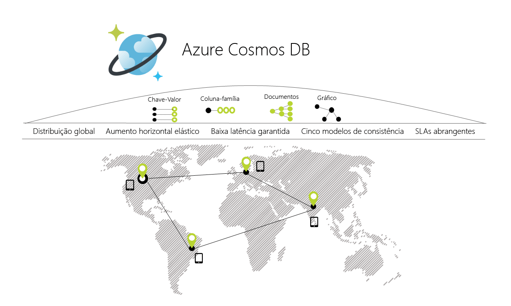

# Bem-vindo ao Azure Cosmos DB

Aplicações atuais são necessários para estar sempre online e elevada capacidade de resposta. Para alcançar a baixa latência e elevada disponibilidade, instâncias desses aplicativos precisam ser implantados nos centros de dados que estão próximas dos seus usuários. Aplicativos precisam responder em tempo real para grandes alterações na utilização nas horas de pico, armazenar aumento constante dos volumes de dados e disponibilizar estes dados aos utilizadores em milissegundos.

O Azure Cosmos DB é um serviço da base de dados de vários modelos distribuída globalmente da Microsoft. Com um clique de um botão, o Cosmos DB permite-lhe de forma elástica e dimensionar de forma independente o débito e armazenamento em qualquer número de regiões do Azure em todo o mundo. Elástica pode dimensionar o débito e armazenamento e tirar partido de acesso de dados de milissegundos de dígito único de forma rápida usando sua API favorita, incluindo SQL, MongoDB, Cassandra, tabelas ou Gremlin. O cosmos DB fornece abrangente [contratos de nível de serviço](https://aka.ms/acdbsla) (SLAs) de débito, latência, disponibilidade e garantias de consistência, algo nenhum outro serviço de base de dados oferece.

Pode [Experimentar o Azure Cosmos DB gratuitamente](https://azure.microsoft.com/try/cosmosdb/) sem uma subscrição do Azure, sem encargos nem compromissos.

> [!div class="nextstepaction"]
> [Experimentar o Azure Cosmos DB gratuitamente](https://azure.microsoft.com/try/cosmosdb/)

## Principais vantagens

### Distribuição global chave na mão

O cosmos DB permite-lhe criar elevada capacidade de resposta e aplicações de elevada disponibilidade em todo o mundo. O cosmos DB replica de forma transparente os dados onde quer que estejam os seus utilizadores, para que os usuários podem interagir com uma réplica dos dados que esteja mais próximos deles.

O cosmos DB permite-lhe adicionar ou remover qualquer uma das regiões do Azure à sua conta do Cosmos em qualquer altura, com um clique de um botão. O cosmos DB será perfeitamente replicar os seus dados para todas as regiões à sua conta do Cosmos enquanto a sua aplicação continua a ser de elevada disponibilidade, graças à *multi homing* capacidades do serviço. Para obter mais informações, consulte a [distribuição global](distribute-data-globally.md) artigo.

### Sempre Ativo

Devido uma integração profunda com a infraestrutura do Azure e [replicação de vários mestre transparente](global-dist-under-the-hood.md), Cosmos DB fornece [elevada disponibilidade de 99,999%](high-availability.md) para as leituras e escritas. O cosmos DB também fornece a capacidade de forma programática (ou através do Portal) invocar a ativação pós-falha regional da sua conta do Cosmos. Esta capacidade ajuda a garantir que seu aplicativo foi projetado para ativação pós-falha no caso de desastre regional.

### Escalabilidade elástica de débito e armazenamento, em todo o mundo

Concebido com a criação de partições horizontais transparente e replicação multimestre, o Cosmos DB oferece uma escalabilidade elástica sem precedentes para o seu escritas e leituras, tudo em todo o mundo. Pode elasticamente ampliação de milhares a centenas de milhões de pedidos por segundo em todo o mundo, com uma única chamada de API e pague apenas pelo débito (e armazenamento) que precisa. Esta capacidade ajuda-o a lidar com picos inesperados em suas cargas de trabalho sem ter de aprovisionar excessivamente para o pico. Para obter mais informações, consulte [criação de partições no Cosmos DB](partitioning-overview.md), [débito aprovisionado em contentores e bases de dados](set-throughput.md), e [dimensionar o débito aprovisionado globalmente](scaling-throughput.md).

### Baixa latência garantida no percentil 99, em todo o mundo

Com o Cosmos DB, pode criar aplicações altamente responsivo, à escala planetária. Com o protocolo de replicação de vários mestres novo e, em seguida, livre de bloqueios temporários e [motor de base de dados otimizado para escrita](index-policy.md), Cosmos DB garante latências inferiores a 10 ms para ambos, leituras e gravações no percentil 99, em todo o mundo (indexadas) . Esta capacidade permite constante ingestão de dados e consultas de incrivelmente rápida para aplicações de elevada capacidade de resposta.

### Precisamente definido, várias escolhas de consistência

Quando criar globalmente distribuído aplicativos no Cosmos DB, já não é preciso fazer extremo [as responsabilidades entre consistência, disponibilidade, latência e débito](consistency-levels-tradeoffs.md). Protocolo de replicação de vários mestres do cosmos DB foi criado com cuidado para oferecer [cinco escolhas de consistência bem definidos](consistency-levels.md) - *forte*, *estagnação limitada*, *sessão*, *prefixo consistente*, e *eventual* — para um modelo de programação intuitivo com baixa latência e elevada disponibilidade para seu globalmente aplicação distribuída.

### Sem gestão de índices ou esquemas

Manter o esquema de base de dados e os índices em sincronia com o esquema de um aplicativo é particularmente dolorosa para aplicações distribuídas globalmente. Com o Cosmos DB, não é necessário lidar com a gestão de índices ou esquemas. O motor de base de dados é totalmente sem esquema.  Uma vez que sem gestão de esquemas e índices for necessário, também não precisa se preocupar sobre o tempo de inatividade da aplicação enquanto a migração de esquemas. O cosmos DB [indexa automaticamente todos os dados](index-policy.md) e serve consultas rápidas.

### Serviço de base de dados totalmente testada

O cosmos DB é um serviço fundamental no Azure. Há quase uma década, o Cosmos DB tem sido usado por muitos dos produtos da Microsoft para aplicativos de missão crítica à escala global, incluindo o Skype, Xbox, Office 365, Azure e muitos outros. Hoje em dia, o Cosmos DB é um dos serviços mais rápida crescentes no Azure, utilizado por muitos clientes externos e aplicativos de missão crítica que requerem o dimensionamento elástico, distribuição global chave na mão, replicação de vários mestre para baixa latência e elevada disponibilidade de ambos leituras e gravações.

### Onipresente presença regional

O cosmos DB está disponível em todas as regiões do Azure em todo o mundo, incluindo 54 + regiões na cloud pública, [Azure China 21Vianet](https://www.azure.cn/en-us/), Azure Alemanha, o Azure Government e o Azure Government para o departamento de defesa (DoD). Ver [presença regional do Cosmos DB](regional-presence.md).

### Seguro por padrão e pronto para as empresas

O cosmos DB está certificado para um [vasto leque de normas de conformidade](compliance.md). Além disso, todos os dados no Cosmos DB são encriptados em descanso e em movimento. O cosmos DB fornece autorização ao nível da linha e em conformidade com normas de segurança restritos.

### Poupanças significativas de custo total de posse

Uma vez que o Cosmos DB é um serviço totalmente gerido, já não terá de gerir e operar implementações de centro de dados de várias complexas e atualizações de software da base de dados, pagar o suporte, licenciamento ou operações ou terá de provisionar seu banco de dados para o pico de carga de trabalho. Para obter mais informações, consulte [otimizar o custo com o Cosmos DB](total-cost-ownership.md).

### SLAs abrangentes de líder da indústria

O cosmos DB é o primeiro e único serviço a oferecer [SLAs abrangentes líderes da indústria](https://azure.microsoft.com/support/legal/sla/cosmos-db/) incluindo elevada disponibilidade de 99,999%, ler e latência no percentil 99, débito e consistência a garantia de escrita.

### Análise operacional e distribuída globalmente com o Spark

Pode executar [Spark](spark-connector.md) diretamente em dados armazenados no Cosmos DB. Esta capacidade permite-lhe efetuar análises operacionais de baixa latência, à escala global sem afetar as cargas de trabalho transacionais operacional diretamente no Cosmos DB. Para obter mais informações, consulte [distribuído globalmente análise operacional](lambda-architecture.md).

### Desenvolver aplicações no Cosmos DB com APIs populares de NoSQL

O cosmos DB oferece uma opção de APIs para trabalhar com os dados armazenados no seu banco de dados do Cosmos. Por predefinição, [é possível usar SQL](how-to-sql-query.md) (um núcleo API) para consultar a base de dados do Cosmos. O cosmos DB também implementa as APIs para [Cassandra](cassandra-introduction.md), [MongoDB](mongodb-introduction.md), [Gremlin](graph-introduction.md) e [Azure Table Storage](table-introduction.md). Pode apontar os controladores de cliente (e ferramentas) para o NoSQL comumente usado (por exemplo, o MongoDB, Cassandra, Gremlin) diretamente para a base de dados do Cosmos. Ao suportar os protocolos de transmissão de frequentemente utilizadas APIs de NoSQL, o Cosmos DB permite-lhe:

* Migre facilmente a sua aplicação para o Cosmos DB, preservando a partes significativas da lógica do aplicativo.
* Mantenha seu aplicativo portátil e continuará desconhecidas do fornecedor na cloud.
* Obtenha um serviço cloud totalmente gerido com o setor SLAs líderes do setor, com apoio financeiro para as APIs do NoSQL comuns. 
* Elástica dimensionar o débito aprovisionado e armazenamento para as bases de dados com base nas suas necessidades e pague apenas o débito e armazenamento de que precisa. Isso leva à redução significativa de custos.

## Soluções que tiram partido do Azure Cosmos DB

Qualquer [web, móvel, jogos e aplicações de IoT](use-cases.md) que tem de lidar com quantidades gigantescas de dados, leituras e escritas um [escala global](distribute-data-globally.md) com resposta em tempo quase real vezes para uma variedade de dados se beneficiará de Cosmos DB [elevada disponibilidade garantida](https://azure.microsoft.com/support/legal/sla/cosmos-db/), débito elevado, baixa latência e consistência adaptável. Saiba mais sobre como o Azure Cosmos DB pode ser usado para compilar [IoT e telemática](use-cases.md#iot-and-telematics), [revenda e marketing](use-cases.md#retail-and-marketing), [jogos](use-cases.md#gaming) e [deaplicaçõesmóveiseweb](use-cases.md#web-and-mobile-applications).

## Passos Seguintes

Leia mais sobre o Cosmos DB principais conceitos [distribuição global chave na mão](distribute-data-globally.md) e [criação de partições](partitioning-overview.md) e [débito aprovisionado](request-units.md).

Introdução ao Azure Cosmos DB com um dos nossos manuais de introdução:

* [Introdução à API SQL do Azure Cosmos DB](create-sql-api-dotnet.md)
* [Introdução à API do Azure Cosmos DB para MongoDB](create-mongodb-nodejs.md)
* [Introdução à API Cassandra do Azure Cosmos DB](create-cassandra-dotnet.md)
* [Introdução à API do Gremlin do Azure Cosmos DB](create-graph-dotnet.md)
* [Introdução à API de Tabela do Azure Cosmos DB](create-table-dotnet.md)

> [!div class="nextstepaction"]
> [Experimentar o Azure Cosmos DB gratuitamente](https://azure.microsoft.com/try/cosmosdb/)
