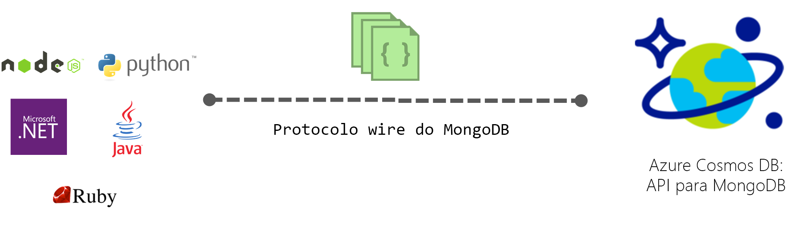

# API do Azure Cosmos DB para MongoDB

O [Azure Cosmos DB](introduction.md) é um serviço de bases de dados com vários modelos e distribuído globalmente da Microsoft para aplicações críticas para atividades. O Azure Cosmos DB proporciona [distribuição global chave na mão](distribute-data-globally.md), [dimensionamento elástico de débito e de armazenamento](partition-data.md) em todo o mundo, latências de milissegundos de um só dígito no percentil 99 e elevada disponibilidade garantida, tudo com o suporte de [SLA líderes da indústria](https://azure.microsoft.com/support/legal/sla/cosmos-db/). O Azure Cosmos DB [indexa automaticamente os dados](https://www.vldb.org/pvldb/vol8/p1668-shukla.pdf) sem que tenha de lidar com a gestão de esquemas e índices. É multimodal e suporte modelos de dados em documentos, chaves-valores, gráficos e em colunas. Por padrão, pode interagir com cosmos DB usando API SQL. Além disso, o serviço Cosmos DB implementa protocolos de arame para APIs noSQL comuns, incluindo Cassandra, MongoDB, Gremlin e Azure Table Storage. Isto permite-lhe utilizar os seus familiares controladores e ferramentas de clientes NoSQL para interagir com a sua base de dados Cosmos.

## Compatibilidade do protocolo de arame

A Azure Cosmos DB implementa protocolos de arame de bases de dados noSQL comuns, incluindo Cassandra, MongoDB, Gremlin e Azure Tables Storage. Ao fornecer uma implementação nativa dos protocolos de arame direta e eficientemente dentro da Cosmos DB, permite que os SDKs, motoristas e ferramentas existentes das bases de dados NoSQL interajam com cosmos DB de forma transparente. Cosmos DB não utiliza nenhum código fonte das bases de dados para fornecer APIs compatíveis com fios para qualquer uma das bases de dados NoSQL.

Por padrão, as novas contas criadas utilizando a API da Azure Cosmos DB para o MongoDB são compatíveis com a versão 3.6 do protocolo de arame MongoDB. Qualquer condutor de cliente da MongoDB que compreenda esta versão protocole deve ser capaz de ligar-se de forma nativa ao Cosmos DB.

## Principais vantagens

Os principais benefícios da Cosmos DB como uma base de dados totalmente gerida e globalmente distribuída como um serviço são descritos [aqui](introduction.md). Adicionalmente, através da implementação nativa de protocolos de arame de APIs populares noSQL, cosmos DB fornece os seguintes benefícios:

* Emigre facilmente a sua aplicação para cosmos DB, preservando partes significativas da sua lógica de aplicação.
* Mantenha a sua aplicação portátil e continue a permanecer agnóstica em nuvem.
* Obtenha sLAs líderes da indústria, apoiados financeiramente para as APIs noSQL comuns alimentadas pela Cosmos DB.
* Dimensione elástico a entrada e armazenamento aprovisionados para as suas bases de dados Cosmos com base na sua necessidade e pague apenas pela entrada e armazenamento de que necessita. Isto leva a uma significativa poupança de custos.
* Chave na mão, distribuição global com replicação multi-master.

## API da Cosmos DB para mongoDB

Siga os quickstarts para criar uma conta Azure Cosmos e migrar a sua aplicação MongoDB existente para usar o Azure Cosmos DB, ou construir uma nova:

* [Migrar uma aplicação web MongoDB Node.js existente.](create-mongodb-nodejs.md)
* [Construa uma aplicação web utilizando a API da Azure Cosmos DB para MongoDB e .NET SDK](create-mongodb-dotnet.md)
* [Construa uma aplicação de consola utilizando a API da Azure Cosmos DB para MongoDB e Java SDK](create-mongodb-java.md)

## Passos seguintes

Eis alguns sítios por onde começar:

* Siga a [aplicação Connect a MongoDB para o tutorial De DD Azure Cosmos](connect-mongodb-account.md) para aprender a obter informações sobre cordas de ligação à sua conta.
* Siga o Use Studio 3T com o tutorial [Azure Cosmos DB](mongodb-mongochef.md) para aprender a criar uma ligação entre a sua base de dados Cosmos e a aplicação MongoDB no Studio 3T.
* Siga os [dados da Import MongoDB no tutorial Da BD da Azure Cosmos](mongodb-migrate.md) para importar os seus dados para uma base de dados da Cosmos.
* Ligue-se a uma conta Cosmos usando [Robo 3T](mongodb-robomongo.md).
* Saiba como [configurar as preferências de leitura de aplicações distribuídas globalmente.](../cosmos-db/tutorial-global-distribution-mongodb.md)

Nota: Este artigo descreve uma característica do Azure Cosmos DB que proporciona compatibilidade de protocolo de arame com bases de dados mongoDB. A Microsoft não executa bases de dados Do MongoDB para fornecer este serviço. A Azure Cosmos DB não está afiliada à MongoDB, Inc.
