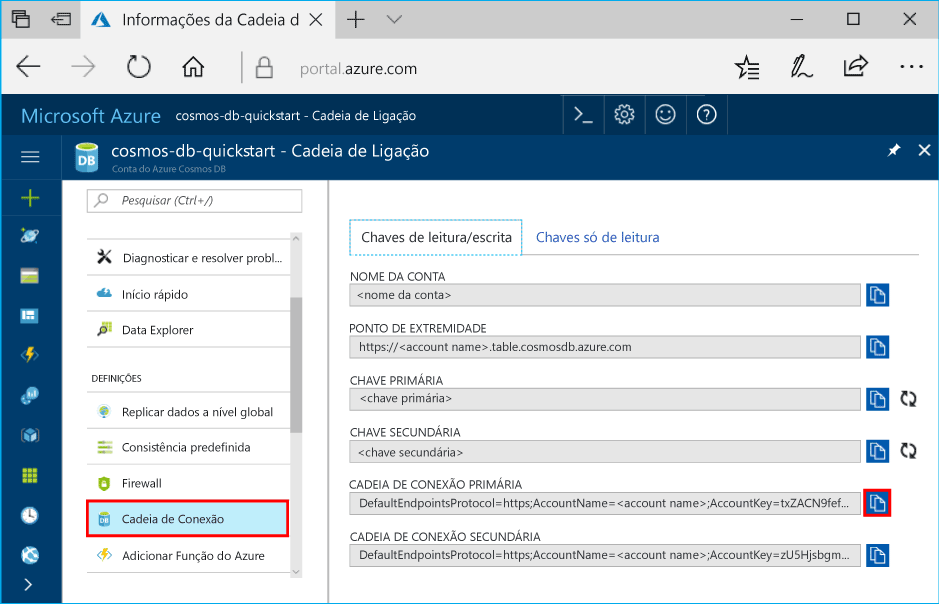

# <a name="get-started-with-azure-cosmos-db-table-api-and-azure-table-storage-using-the-net-sdk"></a>Introdução ao armazenamento de API de tabela do Azure Cosmos DB e tabelas do Azure com o SDK .NET

[!INCLUDE [storage-selector-table-include](../../includes/storage-selector-table-include.md)]

[!INCLUDE [storage-table-applies-to-storagetable-and-cosmos](../../includes/storage-table-applies-to-storagetable-and-cosmos.md)]

Pode utilizar o armazenamento de API de tabela do Azure Cosmos DB ou tabelas do Azure para armazenar o NoSQL estruturado do arquivo de dados na cloud, fornecendo um chaves/atributos com um esquema menos design. Como API de tabela do Azure Cosmos DB e a tabela de armazenamento são esquema menos, é fácil adaptar os seus dados conforme as necessidades da sua aplicação evoluem. Pode utilizar a API de tabela do Azure Cosmos DB ou o armazenamento de tabelas para armazenar conjuntos de dados flexíveis, como dados de utilizador para aplicações web, livros de endereços, informações do dispositivo ou outros tipos de metadados do que seu serviço requer. 

Este tutorial descreve um exemplo que mostra-lhe como utilizar o [biblioteca de tabela do Microsoft Azure Cosmos DB para .NET](https://www.nuget.org/packages/Microsoft.Azure.Cosmos.Table) com cenários de armazenamento de tabelas do Azure e de API de tabela do Azure Cosmo DB. Tem de utilizar a ligação específica ao serviço do Azure. Estes cenários são explorados usando C# exemplos que mostram como criar tabelas, Inserir / Atualizar dados, consultar dados e eliminar as tabelas.

## <a name="prerequisites"></a>Pré-requisitos

Para concluir este exemplo com êxito, precisa do seguinte:

* [Microsoft Visual Studio](https://www.visualstudio.com/downloads/)

* [Biblioteca de tabela do Microsoft Azure cosmos DB para .NET](https://www.nuget.org/packages/Microsoft.Azure.Cosmos.Table) -essa biblioteca está atualmente disponível para .NET Standard e o .NET framework. 

* [Conta do Azure da API de tabela do Cosmos DB](create-table-dotnet.md#create-a-database-account).

## <a name="create-an-azure-cosmos-db-table-api-account"></a>Criar uma conta da API de Tabelas do Azure Cosmos DB

[!INCLUDE [cosmos-db-create-dbaccount-table](../../includes/cosmos-db-create-dbaccount-table.md)]

## <a name="create-a-net-console-project"></a>Crie um projeto de consola .NET

No Visual Studio, crie uma nova aplicação de consola .NET. Os passos seguintes mostram como criar uma aplicação de consola no Visual Studio 2017. Os passos são semelhantes aos de outras versões do Visual Studio. Pode usar a biblioteca de tabela do Azure Cosmos DB em qualquer tipo de aplicações de .NET, incluindo uma aplicação de web ou serviço de cloud do Azure e aplicações de dispositivos móveis e computadores. Neste guia, utilizamos uma aplicação de consola pela simplicidade.

1. Selecione **Ficheiro** > **Novo** > **Projeto**.

1. Selecione **instalados** > **Visual C#**   >  **consola App (.NET Core)**.

1. Na **Name** campo, introduza um nome para a sua aplicação, por exemplo, **CosmosTableSamples** (pode fornecer um nome diferente conforme necessário).

1. Selecione **OK**.

Todos os exemplos de código neste exemplo, podem ser adicionados ao método Main () da sua aplicação de consola **Program.cs** ficheiro.

## <a name="install-the-required-nuget-package"></a>Instale o pacote de NuGet necessário

Para obter o pacote NuGet, siga estes passos:

1. Clique com o botão direito do rato no projeto no **Explorador de Soluções** e escolha **Gerir Pacotes NuGet**.

1. Procure online `Microsoft.Azure.Cosmos.Table`, `Microsoft.Extensions.Configuration`, `Microsoft.Extensions.Configuration.Json`, `Microsoft.Extensions.Configuration.Binder` e selecione **instalar** para instalar a biblioteca de tabela do Microsoft Azure Cosmos DB.

## <a name="configure-your-storage-connection-string"></a>Configurar a cadeia de ligação de armazenamento

1. Partir do [portal do Azure](https://portal.azure.com/), clique em **cadeia de ligação**. Utilize o botão de cópia à direita da janela, para copiar a **CADEIA DE LIGAÇÃO PRIMÁRIA**.

   
   
1. Para configurar a cadeia de ligação, a partir do visual studio com o botão direito clique no seu projeto **CosmosTableSamples**.

1. Selecione **adicione** e, em seguida **Novo Item**. Criar um novo arquivo **Settings** com o tipo de ficheiro como **configuração de JSON do TypeScript** ficheiro. 

1. Substitua o código no ficheiro Settings JSON com o seguinte código e atribuir a cadeia de ligação primária:

   ```csharp
   {
   "StorageConnectionString": <Primary connection string of your Azure Cosmos DB account>
   }
   ```

1. Clique com o botão direito do rato no seu projeto **CosmosTableSamples**. Selecione **Add**, **Novo Item** e adicionar uma classe chamada **AppSettings.cs**.

1. Adicione o seguinte código ao ficheiro AppSettings.cs. Este ficheiro lê a cadeia de ligação a partir do ficheiro Settings JSON e atribui-o para o parâmetro de configuração:

   ```csharp
   namespace CosmosTableSamples
   {
    using Microsoft.Extensions.Configuration;
    public class AppSettings
    {
        public string StorageConnectionString { get; set; }
        public static AppSettings LoadAppSettings()
        {
            IConfigurationRoot configRoot = new ConfigurationBuilder()
                .AddJsonFile("Settings.json")
                .Build();
            AppSettings appSettings = configRoot.Get<AppSettings>();
            return appSettings;
        }
    }
   }
   ```

## <a name="parse-and-validate-the-connection-details"></a>Analisar e validar os detalhes de ligação 

1. Clique com o botão direito do rato no seu projeto **CosmosTableSamples**. Selecione **Add**, **Novo Item** e adicionar uma classe chamada **Common.cs**. Vai escrever código para validar os detalhes de ligação e criar uma tabela nessa classe.

1. Definir um método `CreateStorageAccountFromConnectionString` conforme mostrado abaixo. Este método irá analisar os detalhes de cadeia de ligação e validar que o nome da conta e os detalhes chave da conta fornecidos no ficheiro "Settings". são válidos. 

   ```csharp
   public static CloudStorageAccount CreateStorageAccountFromConnectionString(string storageConnectionString)
    {
            CloudStorageAccount storageAccount;
            try
            {
                storageAccount = CloudStorageAccount.Parse(storageConnectionString);
            }
            catch (FormatException)
            {
                Console.WriteLine("Invalid storage account information provided. Please confirm the AccountName and AccountKey are valid in the app.config file - then restart the application.");
                throw;
            }
            catch (ArgumentException)
            {
                Console.WriteLine("Invalid storage account information provided. Please confirm the AccountName and AccountKey are valid in the app.config file - then restart the sample.");
                Console.ReadLine();
                throw;
            }

            return storageAccount;
        }
   ```


## <a name="create-a-table"></a>Criar uma tabela 

A classe [CloudTableClient](https://docs.microsoft.com/dotnet/api/microsoft.windowsazure.storage.table.cloudtableclient?redirectedfrom=MSDN&view=azure-dotnet) permite-lhe obter tabelas e entidades armazenadas no Table Storage. Porque não temos todas as tabelas na conta de API de tabela do Cosmos DB, vamos adicionar os `CreateTableAsync` método para o **Common.cs** classe para criar uma tabela:

```csharp
public static async Task<CloudTable> CreateTableAsync(string tableName)
  {
    string storageConnectionString = AppSettings.LoadAppSettings().StorageConnectionString;

    // Retrieve storage account information from connection string.
    CloudStorageAccount storageAccount = CreateStorageAccountFromConnectionString(storageConnectionString);

    // Create a table client for interacting with the table service
    CloudTableClient tableClient = storageAccount.CreateCloudTableClient(new TableClientConfiguration());

    Console.WriteLine("Create a Table for the demo");

    // Create a table client for interacting with the table service 
    CloudTable table = tableClient.GetTableReference(tableName);
    if (await table.CreateIfNotExistsAsync())
    {
      Console.WriteLine("Created Table named: {0}", tableName);
    }
    else
    {
      Console.WriteLine("Table {0} already exists", tableName);
    }

    Console.WriteLine();
    return table;
}
```

## <a name="define-the-entity"></a>Definir a entidade 

As entidades mapeiam para C# objetos através de uma classe personalizada derivam [TableEntity](https://msdn.microsoft.com/library/microsoft.windowsazure.storage.table.tableentity.aspx). Para adicionar uma entidade a uma tabela, crie uma classe que define as propriedades de entidade.

Clique com o botão direito do rato no seu projeto **CosmosTableSamples**. Selecione **Add**, **nova pasta** e nomeie-o como **modelo**. Dentro da pasta de modelo, adicione uma classe chamada **CustimerEntity.cs** e adicione o seguinte código ao mesmo.

```csharp
namespace CosmosTableSamples.Model
{
    using Microsoft.Azure.Cosmos.Table;
    public class CustomerEntity : TableEntity
    {
        public CustomerEntity()
        {
        }

        public CustomerEntity(string lastName, string firstName)
        {
            PartitionKey = lastName;
            RowKey = firstName;
        }

        public string Email { get; set; }
        public string PhoneNumber { get; set; }
    }
}
```

Esse código define uma classe de entidade que utiliza o nome próprio do cliente como a chave de linha e o apelido como a chave de partição. Em conjunto, a chave da fila e a partição da entidade identificam-na de forma exclusiva na tabela. Entidades com a mesma chave de partição podem ser consultadas mais rapidamente do que as entidades com chaves de partição diferentes, mas utilização várias chaves de partição permite uma maior escalabilidade de operações simultâneas. Entidades para ser armazenados em tabelas tem de ser um tipo suportado, por exemplo derivadas dos [TableEntity](https://docs.microsoft.com/dotnet/api/microsoft.windowsazure.storage.table.tableentity?redirectedfrom=MSDN&view=azure-dotnet) classe. As propriedades de entidade que pretende armazenar numa tabela têm de ser propriedades públicas do tipo e suportar a introdução e a definição de valores. Além disso, o tipo de entidade deve expor um construtor sem parâmetros.

## <a name="insert-or-merge-an-entity"></a>Inserir ou intercalar uma entidade

O exemplo de código seguinte cria um objeto de entidade e adiciona-o para a tabela. O método InsertOrMerge dentro de [TableOperation](https://docs.microsoft.com/dotnet/api/microsoft.windowsazure.storage.table.tableoperation?redirectedfrom=MSDN&view=azure-dotnet) classe é usada para inserir ou intercalar uma entidade. O [CloudTable.ExecuteAsync](https://docs.microsoft.com/dotnet/api/microsoft.windowsazure.storage.table.cloudtable.executeasync?view=azure-dotnet) método é chamado para executar a operação. 

Clique com o botão direito do rato no seu projeto **CosmosTableSamples**. Selecione **Add**, **Novo Item** e adicionar uma classe chamada **SamplesUtils.cs**. Essa classe armazena todo o código necessário para executar operações de CRUD nas entidades. 

```csharp
public static async Task<CustomerEntity> InsertOrMergeEntityAsync(CloudTable table, CustomerEntity entity)
    {
      if (entity == null)
    {
       throw new ArgumentNullException("entity");
    }
    try
    {
       // Create the InsertOrReplace table operation
       TableOperation insertOrMergeOperation = TableOperation.InsertOrMerge(entity);

       // Execute the operation.
       TableResult result = await table.ExecuteAsync(insertOrMergeOperation);
       CustomerEntity insertedCustomer = result.Result as CustomerEntity;
        
        // Get the request units consumed by the current operation. RequestCharge of a TableResult is only applied to Azure CosmoS DB 
        if (result.RequestCharge.HasValue)
          {
            Console.WriteLine("Request Charge of InsertOrMerge Operation: " + result.RequestCharge);
          }

        return insertedCustomer;
        }
        catch (StorageException e)
        {
          Console.WriteLine(e.Message);
          Console.ReadLine();
          throw;
        }
    }
```

### <a name="get-an-entity-from-a-partition"></a>Obter uma entidade a partir de uma partição

Pode obter a entidade de uma partição ao utilizar o método de recuperação no [TableOperation](https://docs.microsoft.com/dotnet/api/microsoft.windowsazure.storage.table.tableoperation?redirectedfrom=MSDN&view=azure-dotnet) classe. O exemplo de código seguinte obtém a chave de linha de chave de partição, o e-mail e número de telefone de uma entidade de cliente. Este exemplo imprime também as unidades de pedido consumidas para a consulta para a entidade. Para consultar uma entidade, acrescente o seguinte código para **SamplesUtils.cs** ficheiro: 

```csharp
public static async Task<CustomerEntity> RetrieveEntityUsingPointQueryAsync(CloudTable table, string partitionKey, string rowKey)
    {
      try
      {
        TableOperation retrieveOperation = TableOperation.Retrieve<CustomerEntity>(partitionKey, rowKey);
        TableResult result = await table.ExecuteAsync(retrieveOperation);
        CustomerEntity customer = result.Result as CustomerEntity;
        if (customer != null)
        {
          Console.WriteLine("\t{0}\t{1}\t{2}\t{3}", customer.PartitionKey, customer.RowKey, customer.Email, customer.PhoneNumber);
        }

        // Get the request units consumed by the current operation. RequestCharge of a TableResult is only applied to Azure CosmoS DB 
        if (result.RequestCharge.HasValue)
        {
           Console.WriteLine("Request Charge of Retrieve Operation: " + result.RequestCharge);
        }

        return customer;
        }
        catch (StorageException e)
        {
           Console.WriteLine(e.Message);
           Console.ReadLine();
           throw;
        }
    }
```

## <a name="delete-an-entity"></a>Eliminar uma entidade

Pode facilmente eliminar uma entidade depois de a ter obtido através do mesmo padrão mostrado para atualizar uma entidade. O código seguinte obtém e elimina uma entidade de cliente. Para eliminar uma entidade, acrescente o código seguinte ao **SamplesUtils.cs** ficheiro: 

```csharp
public static async Task DeleteEntityAsync(CloudTable table, CustomerEntity deleteEntity)
   {
     try
     {
        if (deleteEntity == null)
     {
        throw new ArgumentNullException("deleteEntity");
     }

    TableOperation deleteOperation = TableOperation.Delete(deleteEntity);
    TableResult result = await table.ExecuteAsync(deleteOperation);

    // Get the request units consumed by the current operation. RequestCharge of a TableResult is only applied to Azure CosmoS DB 
    if (result.RequestCharge.HasValue)
    {
       Console.WriteLine("Request Charge of Delete Operation: " + result.RequestCharge);
    }

    }
    catch (StorageException e)
    {
        Console.WriteLine(e.Message);
        Console.ReadLine();
        throw;
    }
}
```

## <a name="execute-the-crud-operations-on-sample-data"></a>Executar as operações de CRUD em dados de exemplo

Depois de definir os métodos para criar entidades de tabela, inserção ou intercalação, execute esses métodos nos dados de exemplo. Para tal, clique com botão direito no seu projeto **CosmosTableSamples**. Selecione **Add**, **Novo Item** e adicionar uma classe chamada **BasicSamples.cs** e adicione o seguinte código ao mesmo. Este código cria uma tabela, que adiciona entidades a ele. Se pretender eliminar a entidade e uma tabela no final do projeto, remover os comentários do `table.DeleteIfExistsAsync()` e `SamplesUtils.DeleteEntityAsync(table, customer)` métodos do seguinte código:

```csharp
using System;
namespace CosmosTableSamples
{
    using System.Threading.Tasks;
    using Microsoft.Azure.Cosmos.Table;
    using Model;

    class BasicSamples
    {
        public async Task RunSamples()
        {
            Console.WriteLine("Azure Cosmos DB Table - Basic Samples\n");
            Console.WriteLine();

            string tableName = "demo" + Guid.NewGuid().ToString().Substring(0, 5);

            // Create or reference an existing table
            CloudTable table = await Common.CreateTableAsync(tableName);

            try
            {
                // Demonstrate basic CRUD functionality 
                await BasicDataOperationsAsync(table);
            }
            finally
            {
                // Delete the table
                // await table.DeleteIfExistsAsync();
            }
        }

        private static async Task BasicDataOperationsAsync(CloudTable table)
        {
            // Create an instance of a customer entity. See the Model\CustomerEntity.cs for a description of the entity.
            CustomerEntity customer = new CustomerEntity("Harp", "Walter")
            {
                Email = "Walter@contoso.com",
                PhoneNumber = "425-555-0101"
            };

            // Demonstrate how to insert the entity
            Console.WriteLine("Insert an Entity.");
            customer = await SamplesUtils.InsertOrMergeEntityAsync(table, customer);

            // Demonstrate how to Update the entity by changing the phone number
            Console.WriteLine("Update an existing Entity using the InsertOrMerge Upsert Operation.");
            customer.PhoneNumber = "425-555-0105";
            await SamplesUtils.InsertOrMergeEntityAsync(table, customer);
            Console.WriteLine();

            // Demonstrate how to Read the updated entity using a point query 
            Console.WriteLine("Reading the updated Entity.");
            customer = await SamplesUtils.RetrieveEntityUsingPointQueryAsync(table, "Harp", "Walter");
            Console.WriteLine();

            // Demonstrate how to Delete an entity
            //Console.WriteLine("Delete the entity. ");
            //await SamplesUtils.DeleteEntityAsync(table, customer);
            //Console.WriteLine();
        }
    }
}
```

O código anterior cria uma tabela que começa com "demonstração" e o GUID gerado é acrescentado ao nome de tabela. Em seguida, adiciona uma entidade de cliente com o nome próprio e apelido como "Harp Walter" e mais tarde atualiza o número de telefone deste utilizador. 

Neste tutorial, criou o código para executar operações CRUD básicas em dados armazenados na conta de API de tabela. Também pode efetuar operações avançadas, tais como – inserção de dados em lote, consultas de todos os dados dentro de uma partição, consulta um intervalo de dados dentro de uma partição, listas de tabelas na conta cujos nomes comecem com o prefixo especificado. Pode baixar o formulário de exemplo completo [azure-cosmos-table-dotnet-core-getting-started](https://github.com/Azure-Samples/azure-cosmos-table-dotnet-core-getting-started) repositório do GitHub. O [AdvancedSamples.cs](https://github.com/Azure-Samples/azure-cosmos-table-dotnet-core-getting-started/blob/master/CosmosTableSamples/AdvancedSamples.cs) classe tem mais operações que pode efetuar nos dados.  

## <a name="run-the-project"></a>Executar o projeto

Agora, crie a solução e pressione F5 para executar o projeto. Quando o projeto é executado, verá o resultado seguinte no prompt de comando:


Se receber um erro que diz que não é possível localizar o ficheiro Settings quando a execução do projeto, pode resolver adicionando a seguinte entrada XML para as definições do projeto. Clique com o botão direito do rato no CosmosTableSamples, selecione CosmosTableSamples.csproj editar e adicionar itemGroup seguinte: 

```csharp
  <ItemGroup>
    <None Update="Settings.json">
      <CopyToOutputDirectory>PreserveNewest</CopyToOutputDirectory>
    </None>
  </ItemGroup>
```
Agora pode iniciar sessão no portal do Azure e verifique se os dados existem na tabela. 


## <a name="next-steps"></a>Passos Seguintes

Agora pode avançar para o próximo tutorial e saiba como migrar dados para a conta de API de tabela do Azure Cosmos DB. 

> [!div class="nextstepaction"]
>[Como consultar dados](../cosmos-db/table-import.md)
