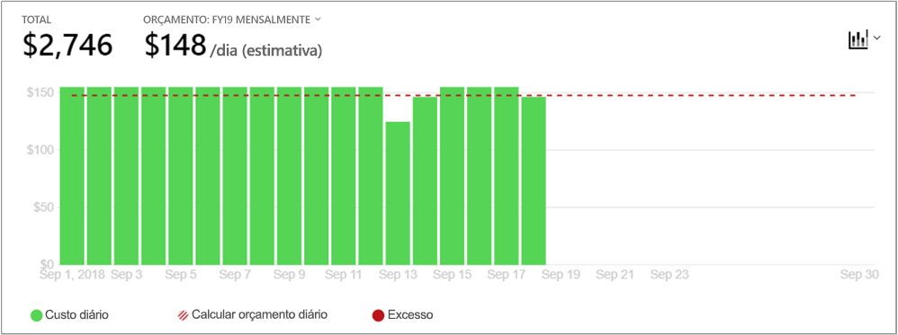

# <a name="quickstart-explore-and-analyze-costs-with-cost-analysis"></a>Início rápido: Explore e analise os custos com a análise de custos

Antes de conseguir controlar e otimizar corretamente os custos do Azure, tem de compreender qual é a origem dos custos dentro da sua organização. Também é útil saber quanto dinheiro seus serviços de custos e para oferecer suporte a quais ambientes e sistemas. Ter visibilidade sobre todos os custos é fundamental para compreender com precisão os padrões das despesas da organização. Pode utilizar padrões de gastos para impor a mecanismos de controle de custos, como orçamentos.

Neste guia de início rápido, irá utilizar a análise de custos para explorar e analisar os custos da organização. Pode ver os custos agregados por organização para compreender onde os custos ocorrem ao longo do tempo e para identificar tendências das despesas. Pode ver os custos acumulados ao longo do tempo para fazer uma estimativa mensal, trimestral ou até anual das tendências das despesas em relação a um orçamento. Um orçamento ajuda a empresa a cumprir determinadas restrições financeiras. Além disso, o orçamento é utilizado para ver os custos diários ou mensais no sentido de isolar as irregularidades das despesas. Também pode transferir os dados do relatório atual para uma análise mais profunda ou para utilizar num sistema externo.

Neste início rápido, vai aprender a:

- Rever os custos na análise de custos
- Personalizar as vistas de custos
- Transferir dados da análise de custos


## <a name="prerequisites"></a>Pré-requisitos

Análise de custo oferece suporte a diferentes tipos de tipos de conta do Azure. Para ver a lista completa dos tipos de conta suportados, consulte [dados de compreender a gestão de custos](understand-cost-mgt-data.md). Para ver dados de custo, precisa de acesso de leitura, pelo menos, para a sua conta do Azure.

Para [Enterprise Agreement (EA)](https://azure.microsoft.com/pricing/enterprise-agreement/) clientes, deve ter, pelo menos, acesso de leitura para um ou mais dos seguintes âmbitos para ver os dados de custo.

- Conta de faturação
- Departamento
- Conta de inscrição
- Grupo de gestão
- Subscrição
- Resource group

Para obter mais informações sobre a atribuir acesso a dados do Azure Cost Management, consulte [atribuir acesso a dados](assign-access-acm-data.md).

## <a name="sign-in-to-azure"></a>Iniciar sessão no Azure

- Inicie sessão no portal do Azure em https://portal.azure.com.

## <a name="review-costs-in-cost-analysis"></a>Rever os custos na análise de custos

Para rever os seus custos na análise de custos, abra o âmbito no portal do Azure e selecione **análise de custo** no menu. Por exemplo, aceda a **subscrições**, selecione uma subscrição na lista e, em seguida, selecione **análise de custo** no menu. Utilize o **âmbito** envenenadas para mudar para outro âmbito na análise de custo. Para obter mais informações sobre âmbitos, consulte [entender e trabalhar com âmbitos](understand-work-scopes.md).

O âmbito que selecionar é utilizado em toda a gestão de custos para fornecer dados consolidação e controlar o acesso às informações de custo. Quando utiliza âmbitos, não faz uma seleção múltipla dos mesmos. Em vez disso, seleciona um âmbito maior, o que outras pessoas até implementar, e, em seguida, filtrar apenas os âmbitos aninhados que tem. Essa abordagem é importante compreender porque algumas pessoas podem não ter acesso a um âmbito único principal, que abrange vários âmbitos aninhados.

A vista de análise de custo inicial inclui as seguintes áreas.

**Acumulados custo vista**: Representa a configuração de vista de análise de custo predefinidos. Cada vista inclui o intervalo de datas, a granularidade, agrupar por e definições do filtro. A vista predefinida mostra os custos acumulados para o período de faturação atual, mas pode alterar a outras vistas incorporadas. Para obter mais informações, consulte [personalizar vistas de custos](#customize-cost-views).

**Custo real**: Mostra os custos de utilização e de compra total para o mês atual, tal como está a ser acumulados e irá mostrar na sua fatura.

**Previsão**: Mostra os custos previstos total para o período de tempo que escolher. (Previsão está em pré-visualização.)

**Orçamento**: Mostra o limite de gastos planeado para o âmbito selecionado, se disponível.

**Granularidade acumulada**: Mostra os total agregados custos diários, desde o início do período de faturação. Depois de [criar um orçamento](tutorial-acm-create-budgets.md) para a sua conta de faturação ou subscrição, pode ver rapidamente a tendência das despesas em relação ao orçamento. Paire o rato sobre uma data para ver os custos acumulados desse dia.

**(Anel) gráficos dinâmicos**: Fornece tabelas dinâmicas dinâmicas, dividindo o total de custos por um conjunto comum de propriedades padrão. Eles mostram o maior para os custos de menores para o mês atual. Pode alterar os gráficos dinâmicos a qualquer momento ao selecionar um gráfico diferente. Por predefinição, os custos são categorizados pelo serviço (categoria do medidor), localização (região) e âmbito subordinado. Por exemplo, as contas de inscrição são em contas de faturação, grupos de recursos estão em subscrições e recursos estão em grupos de recursos.


## <a name="customize-cost-views"></a>Personalizar as vistas de custos

Análise de custos tem quatro vistas incorporadas, otimizadas para os objetivos mais comuns:

Vista | Responder a perguntas como
--- | ---
Custo acumulado | Quanto passaram até aqui este mês? Ficarei dentro do meu orçamento?
Custo diário | Tem havido quaisquer aumenta os custos por dia nos últimos 30 dias?
Custo por serviço | Tem como minha utilização mensal variar ao longo de notas três fiscais últimos?
Custos por recurso | Quais recursos o custo mais até aqui este mês?


No entanto, há muitos casos em que precisa de uma análise mais aprofundada. A personalização começa na parte superior da página, com a seleção da data.

A análise de custos mostra os dados do mês atual por predefinição. Utilize o Seletor de datas para mudar para os intervalos de datas comuns, o mais rapidamente. Os exemplos incluem os últimos sete dias, no mês passado, o ano atual ou um intervalo de datas personalizadas. Subscrições pay as you go também incluem intervalos de datas com base no período de faturação, o que não está vinculado ao calendário mensal, como o período de faturação atual ou a última fatura. Utilize o **< PREVIOUS** e **PRÓXIMA >** ligações na parte superior do menu para ir para período anterior ou seguinte, respectivamente. Por exemplo, **< PREVIOUS** irá alternar entre a **últimos 7 dias** para **8 a 14 dias atrás** ou **21 de 15 dias atrás**.


A análise de custos mostra os custos **acumulados** por predefinição. Os custos acumulados incluem todos os custos para cada dia e dias anteriores, para uma visão constantemente em expansão dos seus custos diários, agregação. Esta vista está otimizada para mostrar a evolução das suas despesas em relação a um orçamento no intervalo de tempo selecionado.

Utilize a vista de gráfico de previsão para identificar potenciais falhas de orçamento. Quando existe uma falha potencial do orçamento, gastos excessivos invulgares prevista é mostrado em vermelho. Um símbolo de indicador também é mostrado no gráfico. Pairar o rato sobre o símbolo mostra a data estimada da violação de orçamento.


Também tem a vista **diária**, que mostra os custos de cada dia. A vista diária não mostra uma tendência de crescimento. A vista foi concebida para mostrar irregularidades na forma de picos ou quebras de custos de cada dia individual. Se tiver selecionado um orçamento, a vista diária também mostra uma estimativa de seu orçamento de diário.

Quando os seus custos diários consistentemente acima do orçamento de diário estimado, pode esperar que irá superar as seu orçamento mensal. O orçamento de diário estimado é um meio para ajudar a visualizar o seu orçamento num nível inferior. Quando existem flutuações nos custos diários, a comparação do orçamento diário estimado com o orçamento mensal é menos precisa.

Eis uma vista diária dos gastos recentes com gastos previsão ativada.


Quando desativar a gastos previsão, não ver gastos estimados para datas futuras. Além disso, quando examinar os custos para nos últimos períodos de tempo, previsão de custos não mostra os custos.

Em geral, pode esperar ver os dados ou notificações para recursos consumidos dentro de 8 a 12 horas.


**Agrupar por** propriedades comuns para dividir os custos e identificar principais contribuintes. Para agrupar por etiquetas de recursos, por exemplo, selecione a chave de etiqueta que pretende agrupar por. Os custos são divididos por cada valor de etiqueta, com um segmento extra para os recursos que não têm essa etiqueta aplicada.

A maioria dos [recursos do Azure suportam a etiquetagem](../azure-resource-manager/tag-support.md). No entanto, algumas etiquetas não estão disponíveis na gestão de custos e de faturação. Além disso, os sinalizadores de grupo de recursos não são suportados. O Cost Management suporta apenas os sinalizadores de recurso a contar da data, que as etiquetas são aplicadas diretamente para o recurso. Veja a [como rever as políticas de etiqueta com o Azure Cost Management](https://www.youtube.com/watch?v=nHQYcYGKuyw) vídeo para saber como utilizar a política de etiqueta do Azure para melhorar a visibilidade de dados de custo.

Eis uma vista dos custos de serviço do Azure para o mês atual.


Por predefinição, análise de custos mostra todos os custos de utilização e de compra à medida que são acumulados e irão mostrar na sua fatura, também conhecido como **custo real**. Ver o custo real é ideal para reconciliar a sua fatura. No entanto, os picos de compra de custo podem ser alarmante quando a manter um olho para anomalias e outras alterações no custo de gastos. Aplanar os picos causados por custos de compra de reserva, mude para **amortizado custo**. 


Custo amortizado divide a reserva de compras em segmentos diárias e se propaga-los ao longo da duração do período de reserva. Por exemplo, em vez de ver um 365 us $ comprar a 1 de Janeiro, verá um 1 $ comprar todos os dias a partir de 1 de Janeiro a 31 de Dezembro. Além de amortização básica, esses custos também são realocados e associados utilizando os recursos específicos que utilizados a reserva. Por exemplo, se esse custo diário de US $1 foi dividido entre duas máquinas virtuais, verá duas cobranças de US $0,50 para o dia. Se a parte da reserva não foi utilizada para o dia, verá um US $0,50 cobrar associados à máquina virtual aplicável e outro US $0,50 cobrar com um tipo de custo de `UnusedReservation`. Tenha em atenção que podem ser vistos os custos de reserva não utilizada apenas quando visualizar amortizado custo.

Devido à alteração na forma como os custos são representados, é importante observar esse custo real e vistas de custo amortizado irão mostrar diferentes números de total. Em geral, o custo total de meses com uma compra de reserva diminuirá quando visualizar custos amortizados, e irão aumentar meses após a compra de reserva. Amortização está disponível apenas para compras de reserva e não se aplica a compras no Azure Marketplace neste momento.

A imagem seguinte mostra os nomes dos grupos de recursos. Pode agrupar por etiqueta para ver os custos totais por etiqueta ou utilizar o **de custos por recurso** vista para ver todas as etiquetas para um recurso em particular.


Quando estiver agrupando os custos por um atributo específico, os principais contribuintes de 10 custo são apresentados de mais alto ao mais baixo. Se existirem mais de 10, os custo de principais nove colaboradores são exibidos numa **outros** grupo. Este grupo abrange todos os restantes grupos em conjunto. Quando estiver agrupando por etiquetas, um **Untagged** grupo aparece para os custos que não têm a chave de etiqueta aplicada. **Não marcada** é sempre pela última vez, mesmo que custos não marcados são superiores aos custos marcados. Custos não marcados vão fazer parte da **outros**, se existirem 10 ou mais valores de etiqueta.

Recursos de armazenamento, rede e máquinas virtuais clássicas não partilhar dados detalhados de faturas. Eles são intercalados como **serviços clássicos** ao agrupar os custos.

Gráficos dinâmicos sob os agrupamentos de diferentes da Mostrar gráfico principal, que proporcionam uma visão mais abrangente dos seus custos globais para o período de tempo selecionado e filtros. Selecione uma propriedade ou etiquetas para ver os custos agregados por qualquer dimensão.


Pode ver o conjunto de dados completo para qualquer vista. Qualquer que seja seleções ou filtros que aplicar afetam os dados apresentados. Para ver o conjunto de dados completo, selecione o **tipo de gráfico** lista e, em seguida, selecione **tabela** vista.


## <a name="understanding-grouping-and-filtering-options"></a>Opções de filtragem e agrupamento de compreensão

A tabela seguinte lista algumas do agrupamento mais comuns e filtragem de opções e quando deve usá-los.

| Propriedade | Quando utilizar |
| --- | --- |
| **Período de faturação** | Divida os custos por mês de nota fiscal. Esta opção é importante para subscrições pay as you go e desenvolvimento/teste, que não estão obrigadas a meses de calendário. Contas EA/MCA podem utilizar meses de calendário no Seletor de datas ou granularidade mensal para atingir o mesmo objetivo. |
| **Tipo de custos** | Divida os custos de reserva não utilizada, reembolso, compra e utilização. As compras de reserva e reembolsos estão disponíveis apenas quando utilizar os custos de ação e não quando utilizar amortizados custos. Os custos de reserva não utilizada só estão disponíveis ao examinar os custos amortizados. |
| **Cloud** | Divida os custos ao AWS e do Azure. Os custos do AWS estão disponíveis apenas a partir de grupos de gestão, as contas externas de faturas e subscrições externas. |
| **Departamento** / **secção de nota fiscal** | Divida os custos pelo departamento de EA ou secção da nota fiscal MCA. Esta opção só está disponível para contas de faturas de EA/MCA e MCA perfis de faturação. |
| **Conta de inscrição** | Divida os custos ao proprietário da conta EA. Esta opção só está disponível para contas de faturas de EA e departamentos. |
| **Frequência** | Divida os custos com base na utilização, uma única vez e recorrentes. |
| **Medidor** | Divida os custos por medidor de utilização do Azure. Esta opção só está disponível para utilização do Azure. Todas as compras e a utilização de Marketplace irão mostrar como **não especificado** ou **não atribuídos**. |
| **Tipo de publicador** | Divida os custos do AWS, o Azure e o Marketplace. |
| **Reserva** | Divida os custos por reserva. Qualquer utilização que não inclui uma reserva será mostrado como **não especificado**. |
| **Recurso** | Divida os custos por recurso. Todas as compras serão mostrado como **não especificado**, uma vez que estas são aplicadas numa conta de cobrança de EA/PAYG ou MCA nível do perfil de faturação.  |
| **Grupo de recursos** | Divida os custos por grupo de recursos. Esta opção só está disponível para utilização não clássica. Utilização de recursos clássicos será mostrado como **outras**, e compras serão apresentado como **não especificado**. |
| **Tipo de recurso** | Divida os custos por tipo de recurso. Esta opção só está disponível para utilização não clássica. Utilização de recursos clássicos será mostrado como **outras**, e compras serão apresentado como **não especificado**. |
| **Nome do serviço** ou **categoria do medidor** | Divida o custo por serviço do Azure. Esta opção só está disponível para utilização do Azure. Todas as compras e a utilização de Marketplace irão mostrar como **não especificado** ou **não atribuídos**. |
| **Escalão de serviço** ou **subcategoria do medidor** | Divida o custo por subclassification de medidor de utilização do Azure. Esta opção só está disponível para utilização do Azure. Todas as compras e a utilização de Marketplace irão mostrar como **não especificado** ou **não atribuídos**. |
| **Subscrição** | Divida os custos por subscrição. Todas as compras mostram como **não especificado**. |
| **Tag** | Divida os custos pelos valores de marca para uma chave de etiqueta específica. |

Para obter mais informações sobre termos, consulte [compreender os termos utilizados no ficheiro de utilização e os encargos do Azure](../billing/billing-understand-your-usage.md).


## <a name="saving-and-sharing-customized-views"></a>A guardar e partilhar vistas personalizadas

Guardar e partilhar vistas personalizadas com outras pessoas ao afixar a análise de custos ao dashboard do portal do Azure ou ao copiar um link para análise de custos. 

Para afixar a análise de custos, selecione o ícone de pin no canto superior direito. A afixação de análise de custo salvará apenas gráfico ou na tabela exibição principal. Partilhe o dashboard para permitir que outras pessoas aceda ao mosaico. Tenha em atenção que isto compartilha apenas a configuração do dashboard e não concede outras pessoas acesso aos dados subjacentes. Se não tem acesso aos custos, mas tem acesso a um dashboard partilhado, verá uma mensagem de "acesso negado".

Para partilhar uma ligação para a análise de custo, selecione **partilhar** na parte superior do painel. Será apresentado um URL personalizado, que abre esta vista específica para este âmbito específico. Se não tiver o custo de acesso e obter este URL, verá uma mensagem de "acesso negado". 

Para saber mais sobre como conceder acesso aos custos para cada âmbito suportado, consulte [entender e trabalhar com âmbitos](understand-work-scopes.md).

## <a name="automation-and-offline-analysis"></a>Automatização e a análise offline

Há momentos quando precisa para transferir os dados para análise adicional, intercalá-los com os seus dados, ou integrá-lo em seus próprios sistemas. O Cost Management oferece algumas opções diferentes. Como ponto de partida, se precisar de um resumo de alto nível ad hoc, como o que obtenha dentro de análise de custos, crie a vista que precisa. Em seguida, transferi-lo selecionando **exportar** e selecionando **transferir dados para CSV** ou **transferir dados para Excel**. O download do Excel fornece o contexto adicional na vista que utilizou para gerar o download, como o âmbito, a configuração, total, de consulta e a data gerado.

Se precisar do conjunto de dados completo e unaggregated, transfira-o da conta de faturação. Em seguida, a partir da lista de serviços no painel de navegação à esquerda do portal, aceda a **gestão de custos + faturação**. Selecione a sua conta de cobrança, se aplicável. Aceda a **utilização e custos**e, em seguida, selecione a **transferir** ícone para o período de faturação pretendido.

Adotar uma abordagem semelhante para automatizar a receber dados de custo. Utilizar o [API de consulta](/rest/api/cost-management/query) para uma análise mais rica com filtragem dinâmica, agrupamento e a agregação ou utilize o [UsageDetails API](/rest/api/consumption/usageDetails) para toda a unaggregated conjunto de dados. A versão de disponibilidade geral (GA) dessas APIs é 2019-01-01. Uso **2019-04-01-pré-visualização** para obter acesso à pré-visualização de reserva e compras do Marketplace dentro dessas APIs. 

Por exemplo, segue-se uma exibição agregada dos custos amortizados divididas por tipo de custos (utilização, compra ou reembolso), o tipo de publicador (Azure ou do Marketplace), o grupo de recursos (vazio para compras) e reserva (vazio se não for aplicável).

```
POST https://management.azure.com/{scope}/providers/Microsoft.CostManagement/query?api-version=2019-04-01-preview
Content-Type: application/json
 
{
  "type": "AmortizedCost",
  "timeframe": "Custom",
  "timePeriod": { "from": "2019-04-01", "to": "2019-04-30" },
  "dataset": {
    "granularity": "None",
    "aggregation": {
      "totalCost": { "name": "PreTaxCost", "function": "Sum" }
    },
    "grouping": [
      { "type": "dimension", "name": "ChargeType" },
      { "type": "dimension", "name": "PublisherType" },
      { "type": "dimension", "name": "Frequency" },
      { "type": "dimension", "name": "ResourceGroup" },
      { "type": "dimension", "name": "SubscriptionName" },
      { "type": "dimension", "name": "SubscriptionId" },
      { "type": "dimension", "name": "ReservationName" },
      { "type": "dimension", "name": "ReservationId" },
    ]
  },
}
```

E se não precisa a agregação e preferem o conjunto de dados não processado, completo:

```
GET https://management.azure.com/{scope}/providers/Microsoft.Consumption/usageDetails?metric=AmortizedCost&$filter=properties/usageStart+ge+'2019-04-01'+AND+properties/usageEnd+le+'2019-04-30'&api-version=2019-04-01-preview
```

Se precisar de custos reais para mostrar as compras à medida que são acumulados, altere **tipo**/**métrica** para **ActualCost**. Para obter mais informações acerca destas APIs, consulte a [consulta](/rest/api/cost-management/query) e [UsageDetails](/rest/api/consumption/usageDetails) documentação da API. Tenha em atenção que os documentos publicados destinam-se a versão de DG. No entanto, ambos funcionam da mesma para o *2019-04-01-pré-visualização* versão de API fora o novo atributo de tipo/métrica e nomes de propriedade alterada. (Leia mais sobre os nomes de propriedade abaixo.)
 
Trabalho de APIs de gestão de custos em todos os âmbitos acima recursos: grupo de recursos, subscrição e grupo de gestão através do RBAC do Azure acesso, EA contas de faturas (inscrições), os departamentos e contas de inscrição através do acesso ao portal de EA. Saiba mais sobre âmbitos, incluindo como determinar o seu ID de âmbito ou gerir o acesso, no [entender e trabalhar com âmbitos](understand-work-scopes.md).

## <a name="next-steps"></a>Passos seguintes

Avance para o primeiro tutorial para saber como criar e gerir orçamentos.

> [!div class="nextstepaction"]
> [Criar e gerir orçamentos](tutorial-acm-create-budgets.md)
