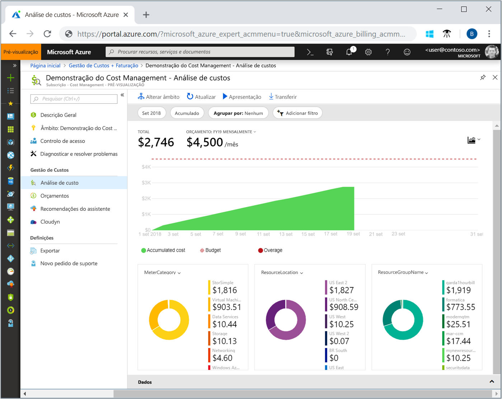
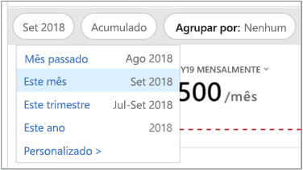
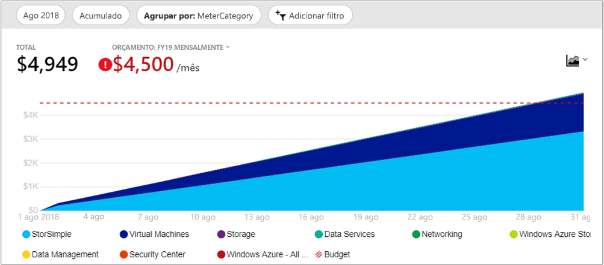
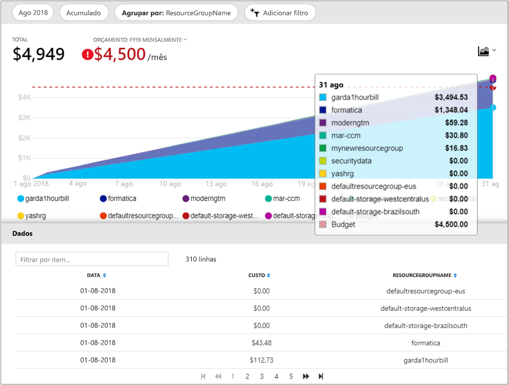

# <a name="quickstart-explore-and-analyze-costs-with-cost-analysis"></a>Início rápido: explorar e analisar custos com análise de custo

Antes de conseguir controlar e otimizar corretamente os custos do Azure, tem de compreender qual é a origem dos custos dentro da sua organização. Também é útil saber quanto dinheiro os serviços custam e para dar suporte a quais ambientes e sistemas. Ter visibilidade sobre todos os custos é fundamental para compreender com precisão os padrões das despesas da organização. Você pode usar padrões de gastos para impor mecanismos de controle de custo, como orçamentos.

Neste guia de início rápido, irá utilizar a análise de custos para explorar e analisar os custos da organização. Pode ver os custos agregados por organização para compreender onde os custos ocorrem ao longo do tempo e para identificar tendências das despesas. Pode ver os custos acumulados ao longo do tempo para fazer uma estimativa mensal, trimestral ou até anual das tendências das despesas em relação a um orçamento. Um orçamento ajuda a empresa a cumprir determinadas restrições financeiras. Além disso, o orçamento é utilizado para ver os custos diários ou mensais no sentido de isolar as irregularidades das despesas. Também pode transferir os dados do relatório atual para uma análise mais profunda ou para utilizar num sistema externo.

Neste início rápido, vai aprender a:

- Rever os custos na análise de custos
- Personalizar as vistas de custos
- Transferir dados da análise de custos


## <a name="prerequisites"></a>Pré-requisitos

A análise de custo dá suporte a diferentes tipos de tipos de conta do Azure. Para exibir a lista completa de tipos de conta com suporte, consulte [entender os dados de gerenciamento de custos](understand-cost-mgt-data.md). Para exibir dados de custo, você precisa de pelo menos acesso de leitura para sua conta do Azure.

Para obter informações sobre como atribuir acesso aos dados de gerenciamento de custos do Azure, consulte [assign Access to data](assign-access-acm-data.md).

## <a name="sign-in-to-azure"></a>Iniciar sessão no Azure

- Inicie sessão no portal do Azure em https://portal.azure.com.

## <a name="review-costs-in-cost-analysis"></a>Rever os custos na análise de custos

Para analisar os custos na análise de custo, abra o escopo no portal do Azure e selecione **análise de custo** no menu. Por exemplo, vá para **assinaturas**, selecione uma assinatura na lista e, em seguida, selecione **análise de custo** no menu. Utilize o atalho **Âmbito** para alternar para um âmbito diferente na análise de custos. Para obter mais informações sobre escopos, consulte [entender e trabalhar com escopos](understand-work-scopes.md).

O escopo selecionado é usado em todo o gerenciamento de custos para fornecer consolidação de dados e controlar o acesso a informações de custo. Quando utiliza âmbitos, não faz uma seleção múltipla dos mesmos. Em vez disso, você seleciona um escopo maior, que outras pessoas acumulam e filtram os escopos aninhados de que você precisa. Essa abordagem é importante para entender porque algumas pessoas podem não ter acesso a um único escopo pai, que abrange vários escopos aninhados.

A exibição análise de custo inicial inclui as áreas a seguir.

**Exibição de custo acumulada**: representa a configuração de exibição de análise de custo predefinida. Cada exibição inclui o intervalo de datas, a granularidade, o agrupamento e as configurações de filtro. A exibição padrão mostra os custos acumulados para o período de cobrança atual, mas você pode alterar para outras exibições internas. Para obter mais informações, consulte [Personalizar exibições de custo](#customize-cost-views).

**Custo real**: mostra o uso total e os custos de compra para o mês atual, pois eles são acumulados e mostrados em sua fatura.

**Previsão**: mostra o total de custos previstos para o período de tempo que você escolher. (A previsão está em visualização.)

**Orçamento**: mostra o limite de gastos planejado para o escopo selecionado, se disponível.

**Granularidade acumulada**: mostra os custos diários agregados totais desde o início do período de cobrança. Depois de [criar um orçamento](tutorial-acm-create-budgets.md) para a sua conta de faturação ou subscrição, pode ver rapidamente a tendência das despesas em relação ao orçamento. Paire o rato sobre uma data para ver os custos acumulados desse dia.

**Gráficos dinâmicos (rosca)** : fornecem pivôs dinâmicos, dividindo o custo total por um conjunto comum de propriedades padrão. Eles mostram o maior para o menor custo para o mês atual. Pode alterar os gráficos dinâmicos a qualquer momento ao selecionar um gráfico diferente. Os custos são categorizados por serviço (categoria de medidor), local (região) e escopo filho por padrão. Por exemplo, as contas de registro estão sob contas de cobrança, os grupos de recursos estão sob assinaturas e os recursos estão em grupos de recursos.



## <a name="customize-cost-views"></a>Personalizar as vistas de custos

A análise de custo tem quatro exibições internas, otimizadas para as metas mais comuns:

Ver | Responder perguntas como
--- | ---
Custo acumulado | Quanto eu passei até agora neste mês? Ficarei dentro do meu orçamento?
Custo diário | Há algum aumento nos custos por dia nos últimos 30 dias?
Custo por serviço | Como o meu uso mensal varia nas últimas três faturas?
Custo por recurso | Quais recursos custam mais até agora neste mês?


No entanto, há muitos casos em que precisa de uma análise mais aprofundada. A personalização começa na parte superior da página, com a seleção da data.

A análise de custos mostra os dados do mês atual por predefinição. Use o seletor de data para mudar rapidamente para intervalos de datas comuns. Os exemplos incluem os últimos sete dias, o último mês, o ano atual ou um intervalo de datas personalizado. As assinaturas pagas conforme o uso também incluem intervalos de datas com base no período de cobrança, que não está associado ao mês do calendário, como o período de cobrança atual ou a última fatura. Use os links **< anterior** e **Próximo >** na parte superior do menu para saltar para o período anterior ou próximo, respectivamente. Por exemplo, **< anterior** será alternado dos **últimos 7 dias** para **8-14 dias atrás** ou **15-21 dias atrás**.



A análise de custos mostra os custos **acumulados** por predefinição. Os custos acumulados incluem todos os custos de cada dia, mais os dias anteriores, para uma exibição constantemente crescente de seus custos de agregação diários. Esta vista está otimizada para mostrar a evolução das suas despesas em relação a um orçamento no intervalo de tempo selecionado.

Use a exibição gráfico de previsão para identificar possíveis violações de orçamento. Quando há uma possível violação de orçamento, o projeto de excesso de gastos é mostrado em vermelho. Um símbolo de indicador também é mostrado no gráfico. Passar o mouse sobre o símbolo mostra a data estimada da violação do orçamento.


Também tem a vista **diária**, que mostra os custos de cada dia. A vista diária não mostra uma tendência de crescimento. A vista foi concebida para mostrar irregularidades na forma de picos ou quebras de custos de cada dia individual. Se você tiver selecionado um orçamento, a exibição diária também mostrará uma estimativa do seu orçamento diário.

Quando os custos diários estiverem consistentemente acima do orçamento estimado diário, você poderá esperar que você ultrapasse o orçamento mensal. O orçamento diário estimado é um meio para ajudá-lo a visualizar seu orçamento em um nível mais baixo. Quando existem flutuações nos custos diários, a comparação do orçamento diário estimado com o orçamento mensal é menos precisa.

Aqui está uma exibição diária dos gastos recentes com a previsão de gastos ativada.
exibição de @no__t 0Daily mostrando os custos diários de exemplo para o mês atual @ no__t-1

Ao desativar a previsão de gastos, você não verá os gastos projetados para datas futuras. Além disso, quando você analisa os custos dos períodos de tempo anteriores, a previsão de custo não mostra os custos.

Em geral, você pode esperar ver dados ou notificações para recursos consumidos dentro de 8 a 12 horas.


**Agrupe por** Propriedades comuns para dividir os custos e identificar os principais colaboradores. Para agrupar por marcas de recurso, por exemplo, selecione a chave de marca que você deseja agrupar. Os custos são divididos por cada valor de marca, com um segmento extra para os recursos que não têm essa marca aplicada.

A maioria dos [recursos do Azure dá suporte à marcação](../azure-resource-manager/tag-support.md). No entanto, algumas marcas não estão disponíveis no gerenciamento de custos e na cobrança. Além disso, as marcas do grupo de recursos não têm suporte. O gerenciamento de custos só dá suporte a marcas de recurso da data em que as marcas são aplicadas diretamente ao recurso. Assista ao vídeo [como examinar políticas de marcas com o gerenciamento de custos do Azure](https://www.youtube.com/watch?v=nHQYcYGKuyw) para saber mais sobre como usar a política de marca do Azure para melhorar a visibilidade dos dados de custo.

Aqui está uma exibição dos custos de serviço do Azure para o mês atual.



Por padrão, a análise de custo mostra todos os custos de uso e de compra à medida que eles são acumulados e mostrados em sua fatura, também conhecido como **custo real**. A exibição do custo real é ideal para reconciliar sua fatura. No entanto, os picos de compra no custo podem ser alarmes quando você estiver se lembrando das anomalias de gastos e outras mudanças de custo. Para mesclar picos causados por custos de compra de reserva, mude para **custo amortizado**.


O custo amortizado divide as compras de reserva em partes diárias e as espalha durante o período de reserva. Por exemplo, em vez de ver uma compra de $365 em 1º de Janeiro, você verá uma compra de $1 todos os dias, de 1º de janeiro a 31 de dezembro. Além de amortização básica, esses custos também são realocados e associados usando os recursos específicos que usaram a reserva. Por exemplo, se o encargo diário $1 foi dividido entre duas máquinas virtuais, você veria $2 0,50 encargos para o dia. Se parte da reserva não for utilizada para o dia, você verá $1 0,50 encargos associados à máquina virtual aplicável e outro custo de $0.50 com um tipo de encargo de `UnusedReservation`. Observe que os custos de reserva não utilizados podem ser vistos somente ao exibir o custo amortizado.

Devido à alteração na forma como os custos são representados, é importante observar que o custo real e as exibições de custo amortizado mostrarão números totais diferentes. Em geral, o custo total de meses com uma compra de reserva diminuirá ao exibir os custos amortizados e os meses após uma compra de reserva aumentarão. A amortização está disponível apenas para compras de reserva e não se aplica a compras do Azure Marketplace no momento.

A imagem a seguir mostra os nomes dos grupos de recursos. Você pode agrupar por marca para exibir os custos totais por marca ou usar a exibição de **custo por recurso** para ver todas as marcas de um recurso específico.



Quando você está agrupando os custos por um atributo específico, os 10 principais colaboradores de custo são mostrados da mais alta para a mais baixa. Se houver mais de 10, os nove principais colaboradores de custo serão mostrados com um grupo **outros** que representa todos os grupos restantes combinados. Quando você está agrupando por marcas, um grupo não **marcado** é exibido para custos que não têm a chave de marca aplicada. A **marca não marcada** é sempre por último, mesmo que os custos não marcados sejam maiores do que os custos marcados. Os custos não marcados serão parte de **outros**, se houver 10 ou mais valores de marca. Alterne para o modo de exibição de tabela e altere a granularidade para **nenhum** para ver todos os valores classificados de maior para menor custo.

As máquinas virtuais clássicas, a rede e os recursos de armazenamento não compartilham dados de cobrança detalhados. Eles são mesclados como **Serviços clássicos** durante o agrupamento de custos.

Os gráficos dinâmicos no gráfico principal mostram agrupamentos diferentes, que oferecem uma imagem mais ampla de seus custos gerais para o período de tempo e os filtros selecionados. Selecione uma propriedade ou marca para exibir os custos agregados por qualquer dimensão.


Você pode exibir o conjunto de qualquer modo de exibição completo. Qualquer seleção ou filtro que você aplicar afetará os dados apresentados. Para ver o conjunto de texto completo, selecione a lista **tipo de gráfico** e, em seguida, selecione exibição de **tabela** .


## <a name="understanding-grouping-and-filtering-options"></a>Compreendendo as opções de agrupamento e filtragem

A tabela a seguir lista algumas das opções mais comuns de agrupamento e filtragem e quando você deve usá-las.

| Propriedade | Quando utilizar |
| --- | --- |
| **Período de cobrança** | Dividir os custos por mês da nota fiscal. Essa opção é importante para assinaturas pré-pagas e de desenvolvimento/teste, que não estão associadas a meses de calendário. As contas EA/MCA podem usar meses de calendário no seletor de data ou granularidade mensal para atingir a mesma meta. |
| **Tipo de encargo** | Separe os custos de uso, compra, reembolso e reserva não utilizada. As compras e reembolsos de reserva estão disponíveis somente ao usar os custos de ação e não ao usar custos amortizados. Os custos de reserva não utilizados estão disponíveis apenas ao examinar os custos amortizados. |
| **Cloud** | Divida os custos por AWS e pelo Azure. Os custos de AWS estão disponíveis somente de grupos de gerenciamento, contas de cobrança externa e assinaturas externas. |
| **Seção de fatura**  /  do **Departamento** | Dividir os custos por departamento de EA ou seção de fatura de MCA. Essa opção está disponível somente para contas de cobrança EA/MCA e perfis de cobrança de MCA. |
| **Conta de registro** | Dividir os custos por proprietário da conta EA. Essa opção só está disponível para contas e departamentos de cobrança de EA. |
| **Frequência** | Divida os custos com base no uso, de uma vez e recorrentes. |
| **Limitados** | Dividir os custos pelo medidor de uso do Azure. Essa opção está disponível apenas para uso do Azure. Todas as compras e o uso do Marketplace serão mostrados como **não especificados ou não** **atribuídos**. |
| **Tipo de editor** | Divida os custos do AWS, do Azure e do Marketplace. |
| **Contra** | Reduza os custos por reserva. Qualquer uso que não inclua uma reserva será mostrado como **não especificado**. |
| **Recurso** | Dividir os custos por recurso. Todas as compras serão mostradas como **não especificadas**, pois elas são aplicadas a uma conta de cobrança do ea/PAYG ou ao nível do perfil de cobrança MCA.  |
| **Grupo de recursos** | Dividir os custos por grupo de recursos. Essa opção está disponível apenas para uso não clássico. O uso clássico de recursos será exibido como **outro**e as compras serão mostradas como **não especificadas**. |
| **Tipo de recurso** | Dividir os custos por tipo de recurso. Essa opção está disponível apenas para uso não clássico. O uso clássico de recursos será exibido como **outro**e as compras serão mostradas como **não especificadas**. |
| **Nome do serviço** ou **categoria do medidor** | Custo de interrupção pelo serviço do Azure. Essa opção está disponível apenas para uso do Azure. Todas as compras e o uso do Marketplace serão mostrados como **não especificados ou não** **atribuídos**. |
| **Camada de serviço** ou **subcategoria de medidor** | Custo de interrupção por subclasse do medidor de uso do Azure. Essa opção está disponível apenas para uso do Azure. Todas as compras e o uso do Marketplace serão mostrados como **não especificados ou não** **atribuídos**. |
| **Subscrição** | Dividir os custos por assinatura. Todas as compras são mostradas como **não especificadas**. |
| **Tag** | Dividir os custos por valores de marca para uma chave de marca específica. |

Para obter mais informações sobre os termos, consulte [entender os termos usados no arquivo de uso e encargos do Azure](../billing/billing-understand-your-usage.md).


## <a name="saving-and-sharing-customized-views"></a>Salvando e compartilhando exibições personalizadas

Salve e compartilhe exibições personalizadas com outras pessoas fixando a análise de custo no painel de portal do Azure ou copiando um link para a análise de custo.

Para fixar a análise de custo, selecione o ícone de pino no canto superior direito. A análise de custo de fixação salvará apenas o gráfico principal ou a exibição de tabela. Compartilhe o painel para conceder a outros acesso ao bloco. Observe que isso compartilha apenas a configuração do painel e não concede a outros acesso aos dados subjacentes. Se você não tiver acesso aos custos, mas tiver acesso a um painel compartilhado, verá uma mensagem de "acesso negado".

Para compartilhar um link para a análise de custo, selecione **compartilhar** na parte superior da folha. Uma URL personalizada será mostrada, que abre essa exibição específica para esse escopo específico. Se você não tiver acesso de custo e receber essa URL, verá uma mensagem de "acesso negado".

Para saber mais sobre como conceder acesso aos custos de cada escopo com suporte, examine [entender e trabalhar com escopos](understand-work-scopes.md).

## <a name="automation-and-offline-analysis"></a>Automação e análise offline

Há ocasiões em que você precisa baixar os dados para análise adicional, mesclá-los com seus próprios dados ou integrá-los a seus próprios sistemas. O gerenciamento de custos oferece algumas opções diferentes. Como ponto de partida, se você precisar de um resumo ad hoc de alto nível, como o que você obtém na análise de custo, crie a exibição de que você precisa. Em seguida, baixe-o selecionando **Exportar** e selecionando **baixar dados para CSV** ou **baixar dados para o Excel**. O download do Excel fornece contexto adicional na exibição usada para gerar o download, como escopo, configuração de consulta, total e data de geração.

Se você precisar do conjunto de todos os conjuntos de e não agregados, baixe-o da conta de cobrança. Em seguida, na lista de serviços no painel de navegação esquerdo do portal, vá para **Gerenciamento de custos + cobrança**. Selecione sua conta de cobrança, se aplicável. Acesse **uso + encargos**e, em seguida, selecione o ícone de **Download** para o período de cobrança desejado.

Adote uma abordagem semelhante para automatizar o recebimento de dados de custo. Use a [API de consulta](/rest/api/cost-management/query) para uma análise mais rica com filtragem dinâmica, agrupamento e agregação, ou use a [API UsageDetails](/rest/api/consumption/usageDetails) para o conjunto de todos os conjuntos de e não agregados. A versão de GA (disponibilidade geral) dessas APIs é 2019-01-01. Use **2019-04-01-Preview** para obter acesso à visualização de reservas e compras do Marketplace dentro dessas APIs.

Por exemplo, a seguir está uma exibição agregada de custos amortizados divididos por tipo de encargo (uso, compra ou reembolso), tipo de editor (Azure ou Marketplace), grupo de recursos (vazio para compras) e Reserva (vazio se não aplicável).

```
POST https://management.azure.com/{scope}/providers/Microsoft.CostManagement/query?api-version=2019-04-01-preview
Content-Type: application/json

{
  "type": "AmortizedCost",
  "timeframe": "Custom",
  "timePeriod": { "from": "2019-04-01", "to": "2019-04-30" },
  "dataset": {
    "granularity": "None",
    "aggregation": {
      "totalCost": { "name": "PreTaxCost", "function": "Sum" }
    },
    "grouping": [
      { "type": "dimension", "name": "ChargeType" },
      { "type": "dimension", "name": "PublisherType" },
      { "type": "dimension", "name": "Frequency" },
      { "type": "dimension", "name": "ResourceGroup" },
      { "type": "dimension", "name": "SubscriptionName" },
      { "type": "dimension", "name": "SubscriptionId" },
      { "type": "dimension", "name": "ReservationName" },
      { "type": "dimension", "name": "ReservationId" },
    ]
  },
}
```

E se você não precisar da agregação e preferir o conjunto de conjuntos completo e bruto:

```
GET https://management.azure.com/{scope}/providers/Microsoft.Consumption/usageDetails?metric=AmortizedCost&$filter=properties/usageStart+ge+'2019-04-01'+AND+properties/usageEnd+le+'2019-04-30'&api-version=2019-04-01-preview
```

Se você precisar de custos reais para mostrar as compras conforme elas são acumuladas, altere o **tipo**/**métrica** para **ActualCost**. Para obter mais informações sobre essas APIs, consulte a documentação da API de [consulta](/rest/api/cost-management/query) e [UsageDetails](/rest/api/consumption/usageDetails) . Observe que os documentos publicados são para a versão GA. No entanto, ambos funcionam da mesma forma para a versão da API *2019-04-01-Preview* fora do novo tipo/atributo de métrica e nomes de propriedade alterados. (Leia mais sobre os nomes de propriedade abaixo.)

As APIs de gerenciamento de custos funcionam em todos os escopos acima dos recursos: grupo de recursos, assinatura e grupo de gerenciamento por meio do acesso RBAC do Azure, contas de cobrança EA (registros), departamentos e contas de registro por meio do acesso ao portal EA. Saiba mais sobre escopos, incluindo como determinar sua ID de escopo ou gerenciar o acesso, em [entender e trabalhar com escopos](understand-work-scopes.md).

## <a name="next-steps"></a>Passos seguintes

Avance para o primeiro tutorial para saber como criar e gerir orçamentos.

> [!div class="nextstepaction"]
> [Criar e gerir orçamentos](tutorial-acm-create-budgets.md)
