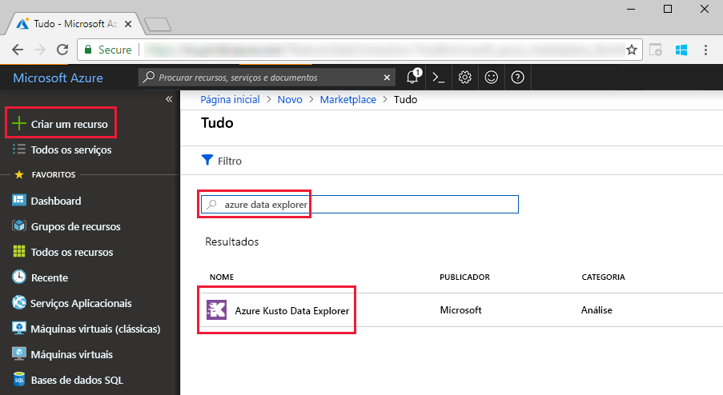
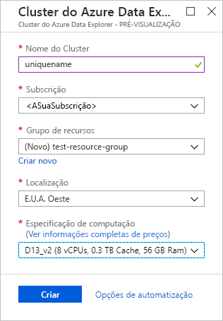
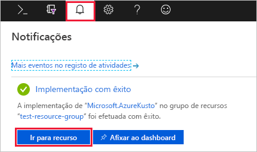
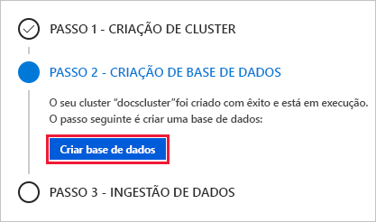
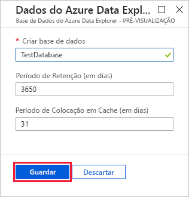
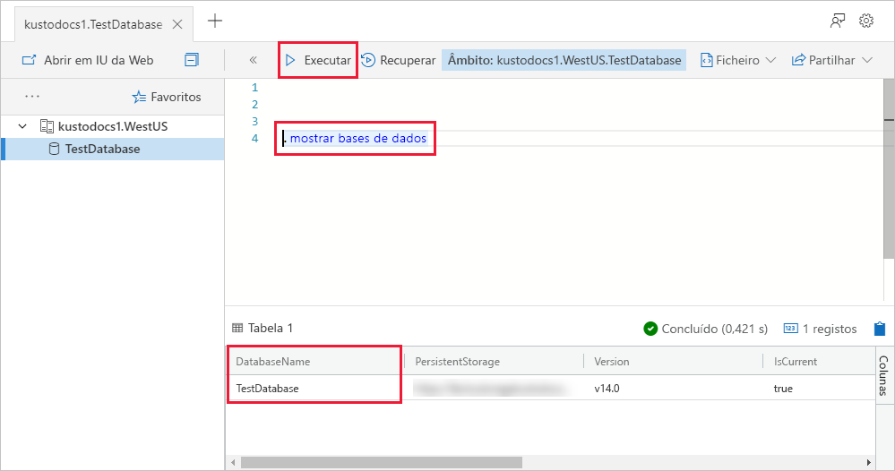

# Início rápido: Criar um cluster do Explorador de dados do Azure e a base de dados

> [!div class="op_single_selector"]
> * [Portal](create-cluster-database-portal.md)
> * [CLI](create-cluster-database-cli.md)
> * [PowerShell](create-cluster-database-powershell.md)
> * [C#](create-cluster-database-csharp.md)
> * [Python](create-cluster-database-python.md)
>  

O Azure Data Explorer é um serviço de exploração de dados rápido e altamente dimensionável para dados telemétricos e de registo. Para utilizar o Explorador de dados do Azure, primeiro cria um cluster e criar um ou mais bases de dados desse cluster. Em seguida, ingerir (carregar) dados numa base de dados para que pode executar consultas em relação a ele. Neste início rápido, irá criar um cluster e uma base de dados.

Se não tiver uma subscrição do Azure, crie uma [conta do Azure gratuita](https://azure.microsoft.com/free/) antes de começar.

## Iniciar sessão no portal do Azure

Inicie sessão no [portal do Azure](https://portal.azure.com/).

## Criar um cluster

Crie um cluster do Explorador de dados do Azure com um conjunto definido de recursos de computação e armazenamento num grupo de recursos do Azure.

1. Selecione o botão (+) **Criar um recurso**, no canto superior esquerdo do portal.

1. Procure o *Azure Data Explorer*.

   

1. No **Azure Data Explorer**, na parte inferior do ecrã, selecione **Criar**.

1. Preencha os detalhes de cluster básico com as seguintes informações.

   

    **Definição** | **Valor sugerido** | **Descrição do campo**
    |---|---|---|
    | Subscrição | A sua subscrição | Selecione a subscrição do Azure que quer utilizar para o cluster.|
    | Grupo de recursos | *test-resource-group* | Utilizar um grupo de recursos existente ou criar um novo grupo de recursos. |
    | Nome do cluster | Um nome exclusivo de cluster | Escolha um nome exclusivo que identifique o seu cluster. Por exemplo, *mydataexplorercluster*. O nome de domínio *[região].kusto.windows.net* é anexado ao nome de cluster que indicar. O nome pode conter apenas letras minúsculas e números. Tem de conter entre 3 e 22 carateres.
    | Localização | *E.U.A. Oeste* | Selecione *E.U.A. Oeste* para este início rápido. Para um sistema de produção, selecione a região que melhor se adequa às suas necessidades.
    | Especificações do dispositivo | *D13_v2* | Selecione a especificação de preço mais baixa para este início rápido. Para um sistema de produção, selecione a especificação que melhor se adequa às suas necessidades.
    | | |

1. Selecione **rever + criar** para rever os detalhes do seu cluster, e **criar** para aprovisionar o cluster. Normalmente, o aprovisionamento demora cerca de 10 minutos.

1. Quando a implementação estiver concluída, selecione **Ir para recurso**.

    

## Criar uma base de dados

Está agora pronto para o segundo passo do processo: a criação da base de dados.

1. No separador **Descrição Geral**, selecione **Criar base de dados**.

    

1. Preencha o formulário com as seguintes informações.

    

    **Definição** | **Valor sugerido** | **Descrição do campo**
    |---|---|---|
    | Nome da base de dados | *TestDatabase* | O nome da base de dados tem de ser exclusivo dentro do cluster.
    | Período de retenção | *3650* | O intervalo de tempo (em dias) para o qual é garantido que os dados são mantidos disponíveis para consulta. O intervalo de tempo é medido desde o momento em que os dados são ingeridos.
    | Período de colocação em cache | *31* | O tempo de span (em dias) para o qual pretende manter os dados consultados com frequência disponíveis no armazenamento SSD ou RAM, em vez de no armazenamento de longo prazo.
    | | | |

1. Selecione **criar** para criar a base de dados. Normalmente, a criação demora menos de um minuto. Quando o processo estiver concluído, volta ao separador **Descrição Geral** do cluster.

## Executar comandos básicos na base de dados

Agora que tem o cluster e a base de dados, pode executar consultas e comandos. Ainda não tem quaisquer dados na base de dados, mas pode ver como funcionam as ferramentas.

1. No cluster, selecione **Consulta**. Cole o comando `.show databases` para a janela de consulta, em seguida, selecione **executar**.

    

    O conjunto de resultados mostra **TestDatabase**, a única base de dados no cluster.

1. Cole o comando `.show tables` para a janela de consulta e selecione **executar**.

    Este comando devolve um conjunto de resultados vazio porque ainda não tem quaisquer tabelas. Vai adicionar uma tabela no próximo artigo desta série.

## Parar e reiniciar o cluster

Pode parar e reiniciar um cluster consoante as necessidades empresariais.

1. Para parar o cluster, na parte superior do separador **Descrição Geral**, selecione **Parar**.

    Quando o cluster está parado, os dados não estão disponíveis para consultas e não pode ingerir dados novos.

1. Para reiniciar o cluster, na parte superior do separador **Descrição Geral**, selecione **Iniciar**.

    Quando o cluster é reiniciado, demora cerca de 10 minutos para que fiquem disponíveis (como quando foi originalmente aprovisionado). Demora mais tempo a carregar os dados para a cache frequente.  

## Limpar recursos

Se planeja seguir outros inícios rápidos e tutoriais, mantenha os recursos que criou. Caso contrário, limpe o grupo de recursos, para evitar incorrer em custos.

1. No portal do Azure, selecione **grupos de recursos** na extrema esquerda e, em seguida, selecione o grupo de recursos que contém o cluster do Data Explorer.  

1. Selecione **eliminar grupo de recursos** para eliminar o grupo de recursos inteiro. Se utilizar um grupo de recursos existente, pode optar por eliminar apenas o cluster de Data Explorer.

## Passos Seguintes

> [!div class="nextstepaction"]
> [Quickstart: Ingerir dados de Hub de eventos no Explorador de dados do Azure](ingest-data-event-hub.md)

