# <a name="ingest-data-from-event-hub-into-azure-data-explorer"></a>Ingerir dados do hub de eventos para o Azure Data Explorer

> [!div class="op_single_selector"]
> * [Portal](ingest-data-event-hub.md)
> * [C#](data-connection-event-hub-csharp.md)
> * [Python](data-connection-event-hub-python.md)

O Azure Data Explorer é um serviço de exploração de dados rápido e altamente dimensionável para dados telemétricos e de registo. O Azure Data Explorer fornece ingestão (carregamento de dados) a partir dos Hubs de Eventos, uma plataforma de transmissão de macrodados e um serviço de ingestão de eventos. Os [hubs de eventos](/azure/event-hubs/event-hubs-about) podem processar milhões de eventos por segundo quase em tempo real. Neste artigo, você cria um hub de eventos, conecta-o do Azure Data Explorer e vê o fluxo de dados por meio do sistema.

## <a name="prerequisites"></a>Pré-requisitos

* Se não tiver uma subscrição do Azure, crie uma [conta do Azure gratuita](https://azure.microsoft.com/free/) antes de começar.

* [Um cluster de teste e um banco de dados](create-cluster-database-portal.md).

* [Um aplicativo de exemplo](https://github.com/Azure-Samples/event-hubs-dotnet-ingest) que gera dados e os envia para um hub de eventos. Baixe o aplicativo de exemplo em seu sistema.

* [Visual Studio 2019](https://visualstudio.microsoft.com/vs/) para executar o aplicativo de exemplo.

## <a name="sign-in-to-the-azure-portal"></a>Iniciar sessão no portal do Azure

Inicie sessão no [Portal do Azure](https://portal.azure.com/).

## <a name="create-an-event-hub"></a>Criar um hub de eventos

Neste artigo, você gera dados de exemplo e os envia para um hub de eventos. O primeiro passo é criar um hub de eventos. Pode fazê-lo através de um modelo do Azure Resource Manager no portal do Azure.

1. Para criar um hub de eventos, use o botão a seguir para iniciar a implantação. Clique com o botão direito do mouse e selecione **abrir em nova janela**para que você possa seguir o restante das etapas neste artigo.

    [](https://portal.azure.com/#create/Microsoft.Template/uri/https%3A%2F%2Fraw.githubusercontent.com%2FAzure%2Fazure-quickstart-templates%2Fmaster%2F201-event-hubs-create-event-hub-and-consumer-group%2Fazuredeploy.json)

    O botão **Implementar no Azure** leva-o para o portal do Azure para preencher um formulário de implementação.

    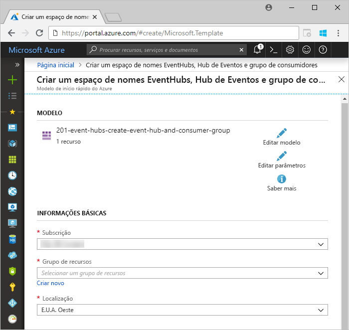

1. Selecione a subscrição em que quer criar o hub de eventos e crie um grupo de recursos chamado *test-hub-rg*.

    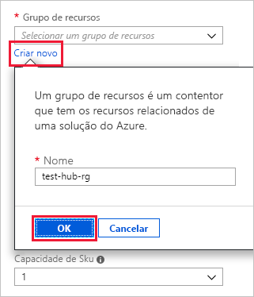

1. Preencha o formulário com as seguintes informações.

    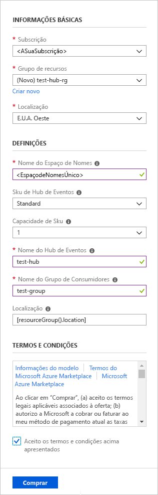

    Utilize as predefinições para todas as definições não listadas na tabela seguinte.

    **Definição** | **Valor sugerido** | **Descrição do campo**
    |---|---|---|
    | Subscrição | A sua subscrição | Selecione a subscrição do Azure que quer utilizar para o hub de eventos.|
    | Grupo de recursos | *test-hub-rg* | Crie um novo grupo de recursos. |
    | Localização | *E.U.A. Oeste* | Selecione *oeste dos EUA* para este artigo. Para um sistema de produção, selecione a região que melhor se adequa às suas necessidades. Crie o namespace do hub de eventos no mesmo local que o cluster Kusto para obter o melhor desempenho (o mais importante para namespaces do hub de eventos com alta taxa de transferência).
    | Nome do espaço de nomes | Um nome de espaço de nomes exclusivo | Escolha um nome exclusivo que identifique o seu espaço de nomes. Por exemplo, *mytestnamespace*. O nome de domínio *servicebus.windows.net* é anexado ao nome que indicar. O nome só pode conter letras, números e hífenes. O nome tem de começar com uma letra e terminar com uma letra ou número. O valor deve ter entre 6 e 50 carateres.
    | Nome do hub de eventos | *test-hub* | O hub de eventos encontra-se no espaço de nomes, que fornece um contentor de âmbito exclusivo. O nome do hub de eventos tem de ser exclusivo no espaço de nomes. |
    | Nome do grupo de consumidores | *test-group* | Os grupos de consumidores permitem que cada aplicação de consumo tenha uma vista separada do fluxo de eventos. |
    | | |

1. Selecione **Comprar**, que reconhece que está a criar recursos na sua subscrição.

1. Selecione **Notificações** na barra de ferramentas para monitorizar o processo de aprovisionamento. Poderá demorar alguns minutos até que a implementação seja bem-sucedida, mas pode avançar para o passo seguinte agora.

    

## <a name="create-a-target-table-in-azure-data-explorer"></a>Criar uma tabela de destino no Azure Data Explorer

Agora, vai criar uma tabela no Azure Data Explorer, para onde os Hubs de Eventos vão enviar os dados. Cria a tabela no cluster e na base de dados aprovisionada em **Pré-requisitos**.

1. No portal do Azure, navegue para o cluster e, em seguida, selecione **Consulta**.

    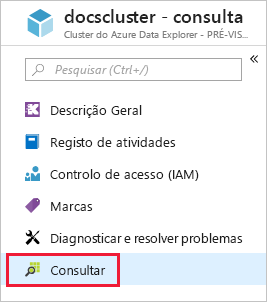

1. Copie o seguinte comando na janela e selecione **executar** para criar a tabela (TestTable) que receberá os dados ingeridos.

    ```Kusto
    .create table TestTable (TimeStamp: datetime, Name: string, Metric: int, Source:string)
    ```

    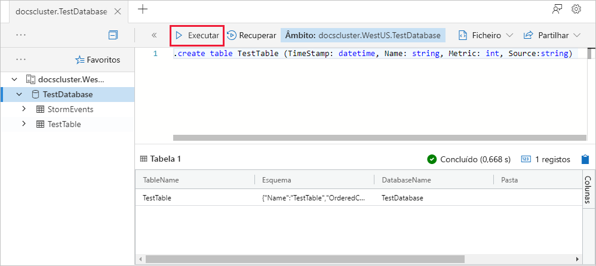

1. Copie o seguinte comando na janela e selecione **executar** para mapear os dados JSON de entrada para os nomes de coluna e tipos de dados da tabela (TestTable).

    ```Kusto
    .create table TestTable ingestion json mapping 'TestMapping' '[{"column":"TimeStamp","path":"$.timeStamp","datatype":"datetime"},{"column":"Name","path":"$.name","datatype":"string"},{"column":"Metric","path":"$.metric","datatype":"int"},{"column":"Source","path":"$.source","datatype":"string"}]'
    ```

## <a name="connect-to-the-event-hub"></a>Ligar ao hub de eventos

Agora ligue ao hub de eventos do Azure Data Explorer. Quando esta ligação está no lugar, os dados que fluem para o hub de eventos são transmitidos para a tabela de teste que criou anteriormente neste artigo.

1. Selecione **Notificações** na barra de ferramentas para verificar se a implementação do hub de eventos foi concluída com êxito.

1. No cluster que criou, selecione **Bases de dados** e, em seguida, **TestDatabase**.

    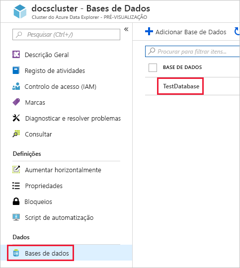

1. Selecione **ingestão de dados** e **Adicionar conexão de dados**. Em seguida, preencha o formulário com as informações a seguir. Selecione **criar** quando terminar.

    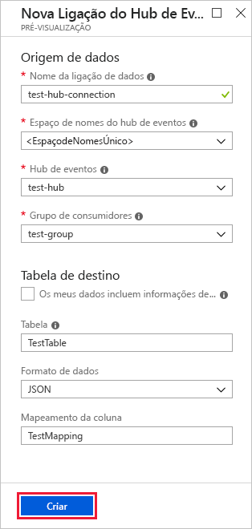

    Fonte de dados:

    **Definição** | **Valor sugerido** | **Descrição do campo**
    |---|---|---|
    | Nome da ligação de dados | *test-hub-connection* | O nome da ligação que quer criar no Azure Data Explorer.|
    | Espaço de nomes do hub de eventos | Um nome de espaço de nomes exclusivo | O nome que escolheu anteriormente que identifica o seu espaço de nomes. |
    | Hub de eventos | *test-hub* | O hub de eventos que criou. |
    | Grupo de consumidores | *test-group* | O grupo de consumidores definido no hub de eventos que criou. |
    | Propriedades do sistema de eventos | Selecionar propriedades relevantes | As [Propriedades do sistema do hub de eventos](/azure/service-bus-messaging/service-bus-amqp-protocol-guide#message-annotations). Se houver vários registros por mensagem de evento, as propriedades do sistema serão adicionadas ao primeiro. Ao adicionar propriedades do sistema, [crie](/azure/kusto/management/tables#create-table) ou [atualize](/azure/kusto/management/tables#alter-table-and-alter-merge-table) o esquema de tabela e o [mapeamento](/azure/kusto/management/mappings) para incluir as propriedades selecionadas. |
    | | |

    Tabela de destino:

    Há duas opções para rotear os dados ingeridos: *estático* e *dinâmico*. 
    Para este artigo, use o roteamento estático, no qual você especifica o nome da tabela, o formato de dados e o mapeamento. Portanto, deixe que **meus dados incluam as informações de roteamento** desmarcadas.

     **Definição** | **Valor sugerido** | **Descrição do campo**
    |---|---|---|
    | Tabela | *TestTable* | A tabela que criou em **TestDatabase**. |
    | Formato de dados | *JSON* | Os formatos com suporte são Avro, CSV, JSON, JSON MULTILINHA, PSV, SOHSV, SCSV, TSV, TSVE e TXT. Opções de compactação com suporte: GZip |
    | Mapeamento de colunas | *TestMapping* | O [mapeamento](/azure/kusto/management/mappings) que você criou em **TestDatabase**, que mapeia os dados JSON de entrada para os nomes de coluna e tipos de dados de **TestTable**. Necessário para JSON, JSON MULTILINHA ou AVRO, e opcional para outros formatos.|
    | | |

    > [!NOTE]
    > * Selecionar **meus dados inclui informações de roteamento** para usar o roteamento dinâmico, onde os dados incluem as informações de roteamento necessárias, como visto nos comentários do [aplicativo de exemplo](https://github.com/Azure-Samples/event-hubs-dotnet-ingest) . Se ambas as propriedades estática e dinâmica forem definidas, as propriedades dinâmicas substituirão as estáticas. 
    > * Somente os eventos enfileirados após a criação da conexão de dados são ingeridos.
    > * Habilite a compactação GZip para roteamento estático abrindo uma [solicitação de suporte no portal do Azure](https://ms.portal.azure.com/#blade/Microsoft_Azure_Support/HelpAndSupportBlade/overview). Habilite a compactação GZip para roteamento dinâmico como visto no [aplicativo de exemplo](https://github.com/Azure-Samples/event-hubs-dotnet-ingest). 
    > * O formato Avro e as propriedades do sistema de eventos não têm suporte na carga de compactação.

## <a name="copy-the-connection-string"></a>Copiar a cadeia de ligação

Quando executa a [aplicação de exemplo](https://github.com/Azure-Samples/event-hubs-dotnet-ingest) listada nos Pré-requisitos, precisa da cadeia de ligação para o espaço de nomes do hub de eventos.

1. No espaço de nomes do hub de eventos que criou, selecione **Políticas de acesso partilhado** e, em seguida, **RootManageSharedAccessKey**.

    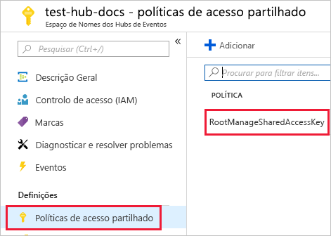

1. Copie **Cadeia de ligação - chave primária**. Cole na próxima secção.

    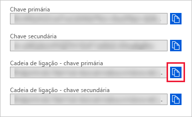

## <a name="generate-sample-data"></a>Gerar dados de exemplo

Use o [aplicativo de exemplo](https://github.com/Azure-Samples/event-hubs-dotnet-ingest) que você baixou para gerar dados.

1. Abra a solução de aplicação de exemplo no Visual Studio.

1. No ficheiro *program.cs*, atualize a constante `connectionString` para a cadeia de ligação que copiou do espaço de nomes do hub de eventos.

    ```csharp
    const string eventHubName = "test-hub";
    // Copy the connection string ("Connection string-primary key") from your Event Hub namespace.
    const string connectionString = @"<YourConnectionString>";
    ```

1. Compile e execute a aplicação. A aplicação envia mensagens para o hub de eventos e apresenta o estado a cada dez segundos.

1. Depois de a aplicação enviar algumas mensagens, avance para o próximo passo: rever o fluxo de dados no hub de eventos e testar a tabela.

## <a name="review-the-data-flow"></a>Rever o fluxo de dados

Com a aplicação de geração de dados, agora pode ver o fluxo dos dados do hub de eventos para a tabela no seu cluster.

1. No portal do Azure, no seu hub de eventos, verá o pico de atividade enquanto a aplicação está em execução.

    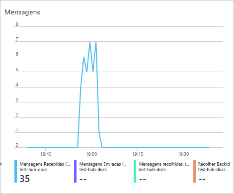

1. Para verificar quantas mensagens chegaram à base de dados até ao momento, execute a consulta seguintes na base de dados de teste.

    ```Kusto
    TestTable
    | count
    ```

1. Para ver o conteúdo das mensagens, execute a seguinte consulta:

    ```Kusto
    TestTable
    ```

    O conjunto de resultados deve ser semelhante ao seguinte:

    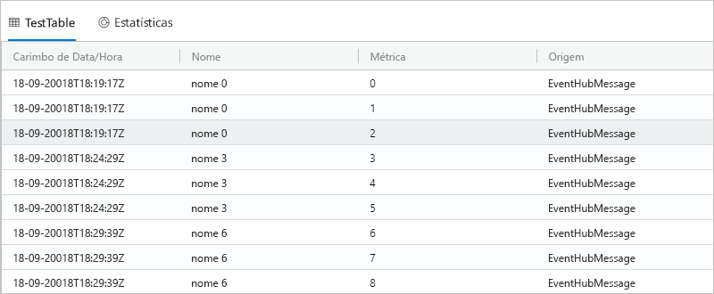

    > [!NOTE]
    > * O Azure Data Explorer tem uma política de agregação (em lote) para ingestão de dados, projetada para otimizar o processo de ingestão. A política é configurada para 5 minutos ou 500 MB de dados, por padrão, para que você possa experimentar uma latência. Consulte [política de envio em lote](/azure/kusto/concepts/batchingpolicy) para obter opções de agregação. 
    > * A ingestão de Hub de eventos inclui o tempo de resposta do hub de eventos de 10 segundos ou 1 MB. 
    > * Configure sua tabela para dar suporte ao streaming e remova a latência no tempo de resposta. Consulte a [política de streaming](/azure/kusto/concepts/streamingingestionpolicy). 

## <a name="clean-up-resources"></a>Limpar recursos

Se não planear voltar a utilizar o hub de eventos, limpe **test-hub-rg**, para evitar incorrer em custos.

1. No portal do Azure, selecione **Grupos de recursos** à esquerda e, em seguida, selecione o grupo de recursos que criou.  

    Se o menu à esquerda estiver fechado, selecione  para expandi-lo.

   

1. Em **test-resource-group**, selecione **Eliminar grupo de recursos**.

1. Na nova janela, escreva o nome do grupo de recursos a eliminar (*test-hub-rg*) e, em seguida, selecione **Eliminar**.

## <a name="next-steps"></a>Passos seguintes

* [Consultar dados no Azure Data Explorer](web-query-data.md)
