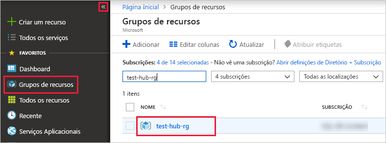

# <a name="ingest-data-from-iot-hub-into-azure-data-explorer-preview"></a>Ingerir dados do Hub IoT para o Azure Data Explorer (versão prévia)

> [!div class="op_single_selector"]
> * [Portal](ingest-data-iot-hub.md)
> * [C#](data-connection-iot-hub-csharp.md)
> * [Python](data-connection-iot-hub-python.md)
> * [Modelo do Azure Resource Manager](data-connection-iot-hub-resource-manager.md)

O Azure Data Explorer é um serviço de exploração de dados rápido e altamente dimensionável para dados telemétricos e de registo. O Azure Data Explorer oferece ingestão (carregamento de dados) do Hub IoT, uma plataforma Big Data streaming e serviço de ingestão de IoT.

## <a name="prerequisites"></a>Pré-requisitos

* Se não tiver uma subscrição do Azure, crie uma [conta do Azure gratuita](https://azure.microsoft.com/free/) antes de começar.
* Crie [um cluster de teste e um banco de dados](create-cluster-database-portal.md) com o nome do banco de dados *TestDB*.
* [Um aplicativo de exemplo](https://github.com/Azure-Samples/azure-iot-samples-csharp) e documentação para simular um dispositivo.
* [Visual Studio 2019](https://visualstudio.microsoft.com/vs/) para executar o aplicativo de exemplo.

## <a name="create-an-iot-hub"></a>Criar um hub IOT

[!INCLUDE [iot-hub-include-create-hub](../../includes/iot-hub-include-create-hub.md)]

## <a name="register-a-device-to-the-iot-hub"></a>Registrar um dispositivo no Hub IoT

[!INCLUDE [iot-hub-get-started-create-device-identity](../../includes/iot-hub-get-started-create-device-identity.md)]

## <a name="create-a-target-table-in-azure-data-explorer"></a>Criar uma tabela de destino no Azure Data Explorer

Agora, você cria uma tabela no Azure Data Explorer à qual os hubs IoT enviarão dados. Você cria a tabela no cluster e no banco de dados provisionado em [**pré-requisitos**](#prerequisites).

1. Na portal do Azure, navegue até o cluster e selecione **consulta**.

    

1. Copie o seguinte comando na janela e selecione **executar** para criar a tabela (TestTable) que receberá os dados ingeridos.

    ```Kusto
    .create table TestTable (temperature: real, humidity: real)
    ```
    
    

1. Copie o seguinte comando na janela e selecione **executar** para mapear os dados JSON de entrada para os nomes de coluna e tipos de dados da tabela (TestTable).

    ```Kusto
    .create table TestTable ingestion json mapping 'TestMapping' '[{"column":"humidity","path":"$.humidity","datatype":"real"},{"column":"temperature","path":"$.temperature","datatype":"real"}]'
    ```

## <a name="connect-azure-data-explorer-table-to-iot-hub"></a>Conectar a tabela de Data Explorer do Azure ao Hub IoT

Agora você se conecta ao Hub IoT do Azure Data Explorer. Quando essa conexão é concluída, os dados que fluem para os fluxos do Hub IOT para a [tabela de destino que você criou](#create-a-target-table-in-azure-data-explorer).

1. Selecione **notificações** na barra de ferramentas para verificar se a implantação do Hub IOT foi bem-sucedida.

1. No cluster que você criou, selecione **bancos** de dados e, em seguida, selecione o Database que você criou **TestDB**.
    
    

1. Selecione **ingestão de dados** e **Adicionar conexão de dados**. Em seguida, preencha o formulário com as informações a seguir. Selecione **criar** quando tiver terminado.

    

    **Fonte de dados**:

    **Definição** | **Descrição do campo**
    |---|---|
    | Nome da ligação de dados | O nome da conexão que você deseja criar no Azure Data Explorer
    | Hub IoT | Nome do Hub IoT |
    | Política de acesso compartilhado | O nome da política de acesso compartilhado. Deve ter permissões de leitura |
    | Grupo de consumidores |  O grupo de consumidores definido no ponto de extremidade interno do Hub IoT |
    | Propriedades do sistema de eventos | As [Propriedades do sistema de eventos do Hub IOT](/azure/iot-hub/iot-hub-devguide-messages-construct#system-properties-of-d2c-iot-hub-messages). Ao adicionar propriedades do sistema, [crie](/azure/kusto/management/tables#create-table) ou [atualize](/azure/kusto/management/tables#alter-table-and-alter-merge-table) o esquema de tabela e o [mapeamento](/azure/kusto/management/mappings) para incluir as propriedades selecionadas. | | | 

    > [!NOTE]
    > No caso de um [failover manual](/azure/iot-hub/iot-hub-ha-dr#manual-failover), você deve recriar a conexão de dados.

    **Tabela de destino**:

    Há duas opções para rotear os dados ingeridos: *estático* e *dinâmico*. 
    Para este artigo, use o roteamento estático, no qual você especifica o nome da tabela, o formato de dados e o mapeamento. Portanto, deixe que **meus dados incluam as informações de roteamento** desmarcadas.

     **Definição** | **Valor sugerido** | **Descrição do campo**
    |---|---|---|
    | Tabelas | *TestTable* | A tabela que você criou em **TestDB**. |
    | Formato de dados | *JSON* | Os formatos com suporte são Avro, CSV, JSON, JSON MULTILINHA, PSV, SOHSV, SCSV, TSV, TSVE e TXT. |
    | Mapeamento de colunas | *TestMapping* | O [mapeamento](/azure/kusto/management/mappings) que você criou em **TestDB**, que mapeia dados JSON de entrada para os nomes de coluna e tipos de dados de **TestDB**. Necessário para JSON, JSON MULTILINHA e AVRO, e opcional para outros formatos.|
    | | |

    > [!NOTE]
    > * Selecionar **meus dados inclui informações de roteamento** para usar o roteamento dinâmico, onde os dados incluem as informações de roteamento necessárias, como visto nos comentários do [aplicativo de exemplo](https://github.com/Azure-Samples/event-hubs-dotnet-ingest) . Se ambas as propriedades estática e dinâmica forem definidas, as propriedades dinâmicas substituirão as estáticas. 
    > * Somente os eventos enfileirados após a criação da conexão de dados são ingeridos.

[!INCLUDE [data-explorer-container-system-properties](../../includes/data-explorer-container-system-properties.md)]

## <a name="generate-sample-data-for-testing"></a>Gerar dados de exemplo para teste

A aplicação de dispositivo simulado liga-se a um ponto final específico do dispositivo no seu hub IoT e envia telemetria simulada de humidade e de temperatura.

1. Transfira o projeto C# de exemplo de https://github.com/Azure-Samples/azure-iot-samples-csharp/archive/master.zip e extraia o arquivo ZIP.

1. Numa janela de terminal local, navegue para a pasta raiz do projeto C# de exemplo. Em seguida, navegue para a pasta **iot-hub\Quickstarts\simulated-device**.

1. Abra o ficheiro **SimulatedDevice.cs** num editor de texto à sua escolha.

    Substitua o valor da variável `s_connectionString` pela cadeia de conexão do dispositivo de [registrar um dispositivo no Hub IOT](#register-a-device-to-the-iot-hub). Em seguida, guarde as alterações feitas ao ficheiro **SimulatedDevice.cs**.

1. Na janela de terminal local, execute os seguintes comandos para instalar os pacotes exigidos para a aplicação de dispositivo simulado:

    ```cmd/sh
    dotnet restore
    ```

1. Na janela de terminal local, execute o seguinte comando para compilar e executar a aplicação de dispositivo simulado:

    ```cmd/sh
    dotnet run
    ```

    A seguinte captura de ecrã mostra a saída à medida que a aplicação de dispositivo simulado envia telemetria para o seu hub IoT:

    

## <a name="review-the-data-flow"></a>Rever o fluxo de dados

Com o aplicativo que gera dados, agora você pode ver o fluxo de dados do Hub IoT para a tabela no cluster.

1. Na portal do Azure, em seu hub IoT, você verá o pico na atividade enquanto o aplicativo estiver em execução.

    

1. Para verificar quantas mensagens chegaram à base de dados até ao momento, execute a consulta seguintes na base de dados de teste.

    ```Kusto
    TestTable
    | count
    ```

1. Para ver o conteúdo das mensagens, execute a seguinte consulta:

    ```Kusto
    TestTable
    ```

    O conjunto de resultados:
    
    

    > [!NOTE]
    > * O Azure Data Explorer tem uma política de agregação (em lote) para ingestão de dados, projetada para otimizar o processo de ingestão. A política é configurada para 5 minutos ou 500 MB de dados, por padrão, para que você possa experimentar uma latência. Consulte [política de envio em lote](/azure/kusto/concepts/batchingpolicy) para obter opções de agregação. 
    > * Configure sua tabela para dar suporte ao streaming e remova a latência no tempo de resposta. Consulte a [política de streaming](/azure/kusto/concepts/streamingingestionpolicy). 

## <a name="clean-up-resources"></a>Limpar recursos

Se você não planeja usar o Hub IoT novamente, limpe **Test-Hub-RG**para evitar incorrer em custos.

1. No portal do Azure, selecione **Grupos de recursos** à esquerda e, em seguida, selecione o grupo de recursos que criou.  

    Se o menu à esquerda estiver fechado, selecione  para expandi-lo.

   

1. Em **test-resource-group**, selecione **Eliminar grupo de recursos**.

1. Na nova janela, escreva o nome do grupo de recursos a eliminar (*test-hub-rg*) e, em seguida, selecione **Eliminar**.

## <a name="next-steps"></a>Passos seguintes

* [Consultar dados no Azure Data Explorer](web-query-data.md)
