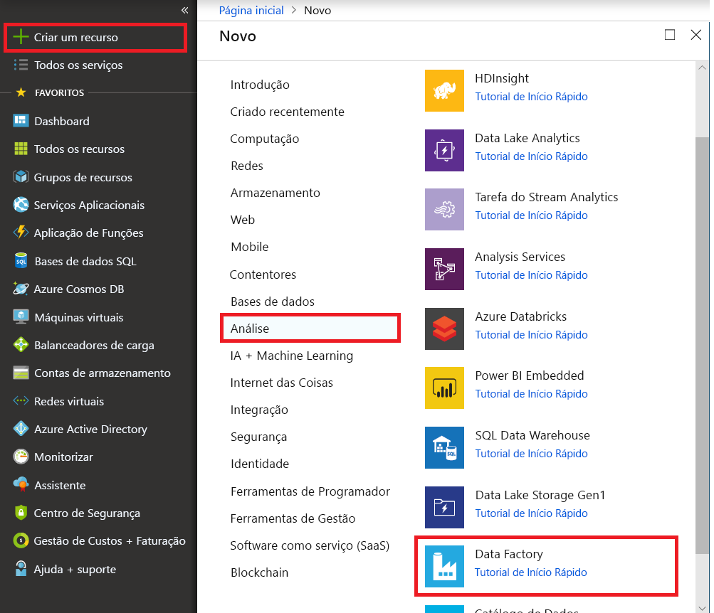

# Copiar dados do Azure Data Lake Storage Gen1 para a Gen2 com a Azure Data Factory

[!INCLUDE[appliesto-adf-xxx-md](includes/appliesto-adf-xxx-md.md)]

Azure Data Lake Storage Gen2 é um conjunto de capacidades dedicadas à análise de big data que é incorporada no [armazenamento Azure Blob](../storage/blobs/storage-blobs-introduction.md). Pode utilizá-lo para interagir com os dados ao utilizar os paradigmas de armazenamento de objetos e do sistema de ficheiros.

Se utilizar atualmente o Azure Data Lake Storage Gen1, pode avaliar a Azure Data Lake Storage Gen2 copiando dados da Data Lake Storage Gen1 para a Gen2 utilizando a Azure Data Factory.

AZure Data Factory é um serviço de integração de dados totalmente gerido na nuvem. Você pode usar o serviço para povoar o lago com dados de um rico conjunto de lojas de dados baseadas em nuvem e economizar tempo quando você constrói suas soluções de análise. Para obter uma lista de conectores suportados, consulte a tabela de lojas de [dados suportadas.](copy-activity-overview.md#supported-data-stores-and-formats)

A Azure Data Factory oferece uma solução de movimento de dados gerida e dimensionada. Devido à arquitetura de escala da Data Factory, pode ingerir dados a uma produção elevada. Para obter mais informações, consulte [o desempenho da atividade copy](copy-activity-performance.md).

Este artigo mostra-lhe como utilizar a ferramenta de dados de cópia da Data Factory para copiar dados da Azure Data Lake Storage Gen1 para a Azure Data Lake Storage Gen2. Pode seguir passos semelhantes para copiar dados de outros tipos de lojas de dados.

## Pré-requisitos

* Uma subscrição do Azure. Se não tiver uma subscrição do Azure, crie uma [conta gratuita](https://azure.microsoft.com/free/) antes de começar.
* Conta Azure Data Lake Storage Gen1 com dados.
* Conta de armazenamento Azure com data lake storage gen2 ativada. Se não tiver uma conta de Armazenamento, [crie uma conta](https://ms.portal.azure.com/#create/Microsoft.StorageAccount-ARM).

## Criar uma fábrica de dados

1. No menu esquerdo, **selecione Criar um data de recurso**+ Fábrica de  >    >  **Dados** de Análise .
   
   

2. Na nova página de **fábrica de dados,** forneça valores para os campos que são mostrados na seguinte imagem: 
      
   
 
    * **Nome**: Introduza um nome globalmente único para a sua fábrica de dados Azure. Se receber o erro "O nome da fábrica \" de dados LoadADLSDemo \" não está disponível", insira um nome diferente para a fábrica de dados. Por exemplo, utilize o nome _**oseunome**_**ADFTutorialDataFactory**. Crie a fábrica de dados novamente. Para ter acesso às regras de nomenclatura para artefactos do Data Factory, veja [Regras de nomenclatura do Data Factory](naming-rules.md).
    * **Subscrição**: Selecione a sua subscrição Azure na qual criar a fábrica de dados. 
    * **Grupo de Recursos**: Selecione um grupo de recursos existente da lista de recuos. Também pode selecionar a nova opção **Criar** e inserir o nome de um grupo de recursos. Para saber mais sobre grupos de recursos, veja [Utilizar grupos de recursos para gerir os recursos do Azure](../azure-resource-manager/management/overview.md). 
    * **Versão**: selecione **V2**.
    * **Localização**: Selecione a localização para a fábrica de dados. Apenas são apresentadas as localizações suportadas na lista pendente. Os arquivos de dados utilizados pela fábrica de dados podem estar noutras localizações e regiões. 

3. Selecione **Criar**.
4. Depois de terminar a criação, vá à sua fábrica de dados. Veja a página inicial da **Data Factory** como mostrado na seguinte imagem: 
   
   

5. Selecione o **azulejo do Monitor & autor** para lançar a aplicação de integração de dados num separado.

## Carregar dados para o Azure Data Lake Storage Gen2

1. Na página **'Iniciar'** selecione o azulejo **'Copiar Dados'** para lançar a ferramenta de dados de cópia. 

   
2. Na página **Propriedades,** especifique **copyFromADLSGen1ToGen2** para o campo **nome de Tarefa.** Selecione **Seguinte**.

    
3. Na página **'Source data store',** selecione **+ Criar nova ligação**.

    
    
4. Selecione **Azure Data Lake Storage Gen1** na galeria de conectores e selecione **Continuar**.
    
    
    
5. Na página **de ligação especificada do Lago de Dados Azure,** siga estes passos:

   a. Selecione o seu Data Lake Storage Gen1 para o nome da conta e especifique ou valide o **Inquilino.**
  
   b. Selecione **a ligação de teste** para validar as definições. Em seguida, **selecione Terminar**.
  
   c. Vês que foi criada uma nova ligação. Selecione **Seguinte**.
   
   > [!IMPORTANT]
   > Neste walk-through, você usa uma identidade gerida para recursos Azure para autenticar o seu Azure Data Lake Storage Gen1. Para conceder à identidade gerida as permissões adequadas na Azure Data Lake Storage Gen1, siga [estas instruções.](connector-azure-data-lake-store.md#managed-identity)
   
   
      
6. Na página **Escolha o ficheiro de entrada ou pasta,** navegue na pasta e arquive-o que pretende copiar. Selecione a pasta ou ficheiro e selecione **Escolha**.

    

7. Especifique o comportamento da cópia selecionando os **ficheiros Copy de forma recorrente** e opções de cópia **binária.** Selecione **Seguinte**.

    
    
8. Na página da **loja de dados destino,** selecione **+ Crie nova ligação**  >  **Azure Data Lake Storage Gen2**  >  **Continue.**

    

9. Na página **de ligação especificada do Lago de Dados Azure,** siga estes passos:

   a. Selecione a sua conta de armazenamento de dados Gen2 capaz da lista de drop-down de nome de **conta de armazenamento.**
   
   b. Selecione **Concluir** para criar a ligação. Em seguida, selecione **Seguinte**.
   
   

10. Na página Escolha o ficheiro de saída ou a página **de pasta,** introduza **o copyfromadlsgen1** como nome da pasta de saída e selecione **Seguinte**. A Data Factory cria o correspondente sistema de ficheiros Azure Data Lake De armazenamento Gen2 e sub-dobradeiras durante a cópia se não existirem.

    

11. Na página **Definições**, selecione **Seguinte** para utilizar as predefinições.

12. Na página **Resumo,** reveja as definições e selecione **Seguinte**.

    
13. Na **página 'Implantação',** selecione **Monitor** para monitorizar o gasoduto.

    
14. Tenha em atenção que o separador **Monitorização** à esquerda é selecionado automaticamente. A coluna **Ações** inclui ligações para ver os detalhes de execução da atividade e voltar a executar o pipeline.

    

15. Para visualizar os percursos de atividade que estão associados à execução do pipeline, selecione o link **Ver Atividades** na coluna **Ações.** Há apenas uma atividade (atividade copiar) no pipeline, pelo que só vai ver uma entrada. Para voltar à vista do gasoduto, selecione a ligação **Pipelines** na parte superior. Selecione **Atualizar** para atualizar a lista. 

    

16. Para monitorizar os detalhes de execução de cada atividade de cópia, selecione o link **Details** (imagem de óculos) em **Ações** na visão de monitorização da atividade. Pode monitorizar detalhes como o volume de dados copiados da fonte para a pia, saída de dados, etapas de execução com a duração correspondente e configurações usadas.

    

17. Verifique se os dados são copiados na sua conta Azure Data Lake Storage Gen2.

## Melhores práticas

Para avaliar a atualização de Azure Data Lake Storage Gen1 para Azure Data Lake Storage Gen2 em geral, consulte [atualizar as suas soluções de análise de dados de Azure Data Lake Storage Gen1 para Azure Data Lake Storage Gen2](../storage/blobs/data-lake-storage-migrate-gen1-to-gen2.md). As secções seguintes introduzem as melhores práticas para a utilização da Data Factory para uma atualização de dados da Data Lake Storage Gen1 para a Data Lake Storage Gen2.

### Partição de dados para cópia de dados históricos

- Se o seu tamanho total de dados na Data Lake Storage Gen1 for inferior a 30 TB e o número de ficheiros for inferior a 1 milhão, pode copiar todos os dados numa única atividade de cópia executada.
- Se tiver uma maior quantidade de dados para copiar, ou se quiser a flexibilidade para gerir a migração de dados em lotes e completar cada um deles dentro de um prazo específico, parti os dados. A divisão também reduz o risco de qualquer problema inesperado.

Utilize uma prova de conceito para verificar a solução de ponta a ponta e testar a produção de cópia no seu ambiente. Principais etapas de prova de conceito: 

1. Crie um oleoduto data factory com uma única atividade de cópia para copiar várias TBs de dados da Data Lake Storage Gen1 para data lake storage gen2 para obter uma linha de base de desempenho de cópia. Comece com [as unidades de integração de dados (DIUs)](copy-activity-performance-features.md#data-integration-units) como 128. 
2. Com base no resultado da cópia que obtém no passo 1, calcule o tempo estimado necessário para toda a migração de dados. 
3. (Opcional) Crie uma tabela de controlo e defina o filtro de ficheiros para dividir os ficheiros a migrar. A forma de dividir os ficheiros é: 

    - Partição por nome de pasta ou nome de pasta com um filtro wildcard. Recomendamos este método.
    - Partição pelo último tempo modificado de um ficheiro.

### Largura de banda de rede e armazenamento I/O 

Você pode controlar a concordância de trabalhos de cópia data factory que lêem dados da Data Lake Storage Gen1 e escrever dados para Data Lake Storage Gen2. Desta forma, você pode gerir o uso em que o I/O de armazenamento para evitar afetar o trabalho normal de negócios na Data Lake Storage Gen1 durante a migração.

### Permissões 

Na Data Factory, o [conector Da Gen1 de Armazenamento de Dados](connector-azure-data-lake-store.md) suporta o principal do serviço e gere a identidade para autenticações de recursos Azure. O [conector De Armazenamento de Data Lake Gen2](connector-azure-data-lake-storage.md) suporta a chave de conta, o principal do serviço e a identidade gerida para autenticações de recursos Azure. Para que a Data Factory possa navegar e copiar todos os ficheiros ou listas de controlo de acesso (ACLs) de que necessita, conceda permissões suficientemente elevadas para a conta a que fornece para aceder, ler ou escrever todos os ficheiros e definir ACLs se assim o desejar. Conceda-lhe um papel de super-utilizador ou proprietário durante o período de migração. 

### Preservar ACLs da Data Lake Storage Gen1

Se pretender replicar os ACLs juntamente com ficheiros de dados quando atualizar da Data Lake Storage Gen1 para data lake storage gen2, consulte [Preserve ACLs da Data Lake Storage Gen1](connector-azure-data-lake-storage.md#preserve-acls). 

### Cópia incremental 

Pode utilizar várias abordagens para carregar apenas os ficheiros novos ou atualizados da Data Lake Storage Gen1:

- Carregue ficheiros novos ou atualizados por cada vez que a pasta ou o nome do ficheiro. Um exemplo é /2019/05/13/*.
- Carregue ficheiros novos ou atualizados por LastModifiedDate.
- Identifique ficheiros novos ou atualizados por qualquer ferramenta ou solução de terceiros. Em seguida, passe o nome do ficheiro ou da pasta para o pipeline Data Factory através de um parâmetro ou de uma tabela ou ficheiro. 

A frequência adequada para fazer a carga incremental depende do número total de ficheiros na Azure Data Lake Storage Gen1 e do volume de ficheiros novos ou atualizados a serem carregados sempre. 

## Passos seguintes

> [!div class="nextstepaction"]
> [Visão geral da atividade da cópia](copy-activity-overview.md) 
>  Conector Gen1 [de armazenamento de dados Azure](connector-azure-data-lake-store.md) 
>  [Conector Azure Data Lake Armazenamento Gen2](connector-azure-data-lake-storage.md)